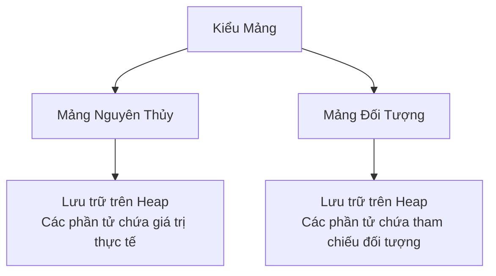

# 07 - Mảng (Arrays)

## Những Điều Bạn Cần Học

- Cách khai báo và khởi tạo mảng một chiều, hai chiều và đa chiều.
- Cách truy cập các phần tử của mảng và sử dụng thuộc tính `length`.
- Cách bộ nhớ được cấp phát cho mảng và mảng đối tượng.
- Cách duyệt, sao chép, sắp xếp, tìm kiếm và so sánh các mảng sử dụng các vòng lặp và lớp tiện ích `java.util.Arrays`.

## Thứ Tự Học Tập

1. [Cơ Bản Về Mảng](theory/01-array-basics.md)
2. [Các Phép Toán Trên Mảng](theory/02-array-operations.md)

## Thuật Ngữ Ghi Chú

- [Thuật Ngữ Mảng](terms/01-array-terms.md)

## Biểu Đồ Mermaid Tổng Quan

## Tự Kiểm Tra (Self-Check)

- Tại sao JVM cấp phát mảng dưới dạng các khối bộ nhớ liên tục trên Heap, và làm thế nào điều này cho phép truy cập trực tiếp với thời gian hằng số O(1)?
- Tại sao các phần tử mảng được tự động khởi tạo giá trị không (zero-initialized) khi được cấp phát, không giống như biến cục bộ sẽ gây ra lỗi biên dịch nếu đọc trước khi khởi tạo?
- Tại sao mảng đa chiều trong Java hoạt động như một "mảng của các mảng" chứ không phải một khối liên tục duy nhất, và bố cục bộ nhớ vật lý của nó là gì?
- Tại sao `System.arraycopy()` lại nhanh hơn một vòng lặp thủ công, và tại sao nó thực hiện sao chép nông (shallow copy) thay vì sao chép sâu (deep copy) đối với mảng chứa các tham chiếu đối tượng?
- Tại sao `Arrays.equals()` không so sánh chính xác nội dung của các mảng đa chiều, và tại sao lại cần sử dụng `Arrays.deepEquals()`?
- Tại sao một mảng phải được sắp xếp theo thứ tự tăng dần trước khi gọi `Arrays.binarySearch()`, và giá trị âm được trả về đại diện cho điều gì về mặt toán học nếu không tìm thấy phần tử đó?

## Các Thẻ Anki

- [Cơ Bản](anki/basic.tsv)
- [Cơ Bản Mở Rộng](anki/basic-extra.tsv)
- [Điền Khuyết](anki/cloze.tsv)
- [Câu Hỏi Code](anki/code-question.tsv)

## Liên Kết Tham Chiếu

- https://docs.oracle.com/javase/tutorial/java/nutsandbolts/arrays.html
