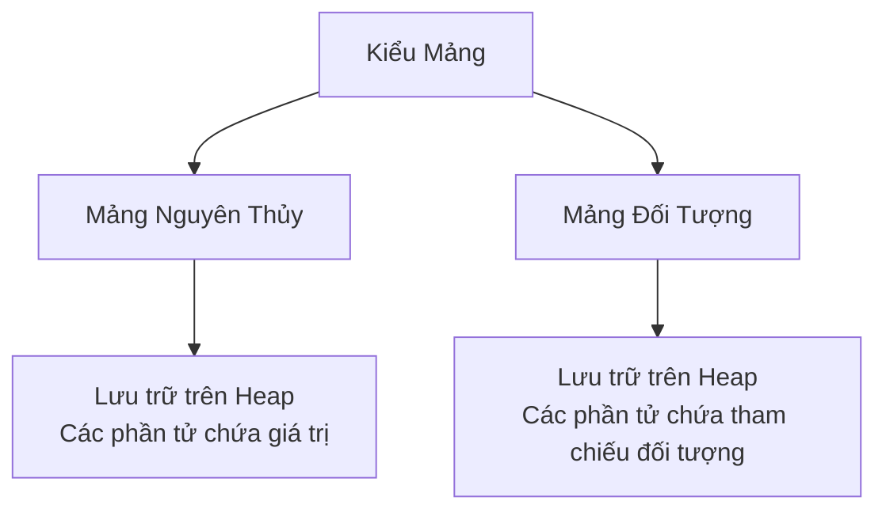

# 07 - Mảng (Arrays)

## Những Điều Bạn Cần Học (What You Should Learn)

- Cách khai báo và khởi tạo mảng một chiều, hai chiều và đa chiều.
- Cách truy cập các phần tử mảng và sử dụng thuộc tính `length`.
- Cách cấp phát bộ nhớ cho mảng và các mảng đối tượng.
- Cách duyệt, sao chép, sắp xếp, tìm kiếm và so sánh các mảng sử dụng vòng lặp và lớp tiện ích `java.util.Arrays`.

## Trình Tự Học Tập (Study Order)

1. [Cơ bản về Mảng (Array Basics)](theory/01-array-basics.md)
2. [Các thao tác trên Mảng (Array Operations)](theory/02-array-operations.md)

## Ghi Chú Thuật Ngữ (Term Notes)

- [Thuật ngữ về Mảng (Array Terms)](terms/01-array-terms.md)

## Sơ Đồ Tổng Quan (Mermaid Overview)

## Tự Kiểm Tra (Self-Check)

- Tại sao JVM cấp phát mảng dưới dạng các khối bộ nhớ liên tục trên Heap, và điều này giúp đạt tốc độ truy cập trực tiếp hằng số O(1) như thế nào?
- Tại sao các phần tử mảng tự động được khởi tạo bằng không khi cấp phát, không giống như biến cục bộ sẽ báo lỗi biên dịch nếu đọc trước khi khởi tạo?
- Tại sao mảng đa chiều trong Java hoạt động như một "mảng của các mảng" thay vì một khối liên tục duy nhất, và bố cục bộ nhớ vật lý của nó là gì?
- Tại sao `System.arraycopy()` nhanh hơn vòng lặp thủ công, và tại sao nó thực hiện sao chép nông (shallow copy) thay vì sao chép sâu (deep copy) đối với mảng chứa tham chiếu đối tượng?
- Tại sao `Arrays.equals()` thất bại trong việc so sánh chính xác nội dung của mảng đa chiều, và tại sao bắt buộc phải dùng `Arrays.deepEquals()`?
- Tại sao mảng bắt buộc phải được sắp xếp theo thứ tự tăng dần trước khi gọi `Arrays.binarySearch()`, và giá trị âm trả về đại diện cho điều gì về mặt toán học nếu không tìm thấy key?

## Các Thẻ Anki (Anki Cards)

- [Basic](anki/basic.tsv)
- [Basic Extra](anki/basic-extra.tsv)
- [Cloze](anki/cloze.tsv)
- [Code Question](anki/code-question.tsv)

## Liên Kết Tham Khảo (Reference Links)

- https://docs.oracle.com/javase/tutorial/java/nutsandbolts/arrays.html
