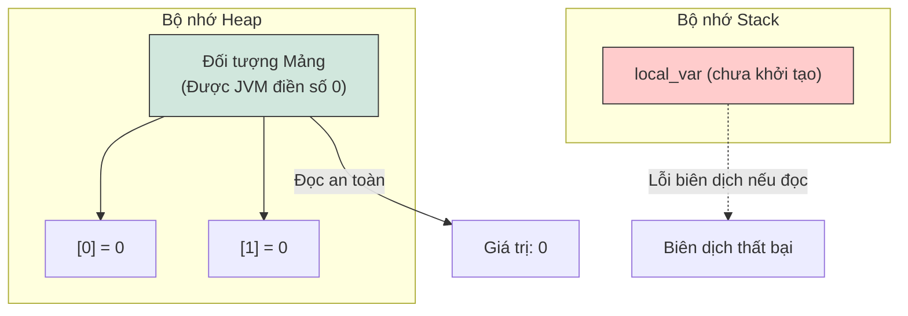
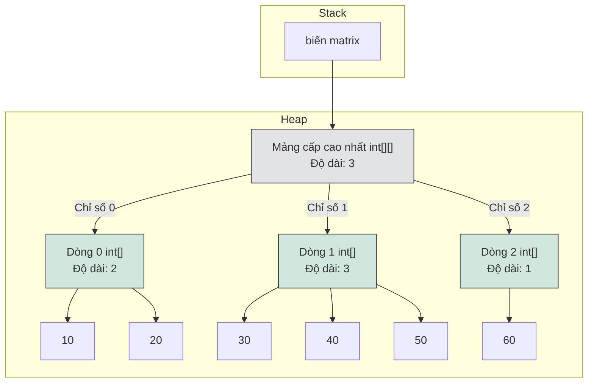
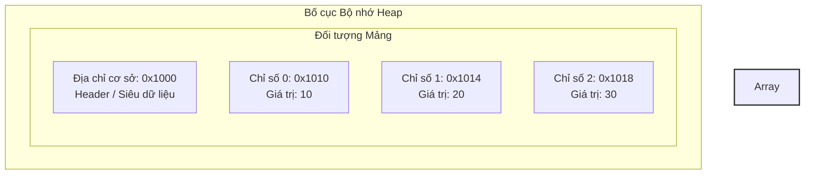

# Cơ Bản Về Mảng (Array Basics)

Một mảng (array) trong Java là một đối tượng chứa (container object) lưu giữ một số lượng giá trị cố định thuộc cùng một kiểu dữ liệu duy nhất. Độ dài của mảng được xác định khi mảng được tạo ra, và sau khi được tạo, độ dài của nó là cố định không đổi.

---

## Khai Báo và Khởi Tạo (Declaration and Initialization)

Một mảng bắt buộc phải được khai báo, cấp phát và khởi tạo giá trị (tùy chọn) trước khi có thể sử dụng.

### Cú Pháp Khai Báo
Có hai cách cú pháp để khai báo một biến mảng:
1. **Kiểu dữ liệu đi trước (Ưu tiên):** Đặt dấu ngoặc vuông ngay sau kiểu dữ liệu.
   ```java
   int[] numbers;
   ```
2. **Tên biến đi trước (Kiểu C/C++):** Đặt dấu ngoặc vuông ngay sau tên biến.
   ```java
   int scores[];
   ```
   *Lưu ý:* Cú pháp kiểu dữ liệu đi trước rất được ưu tiên sử dụng vì nó tách biệt rõ ràng thông tin kiểu dữ liệu (`int[]` nghĩa là "mảng số nguyên") ra khỏi tên biến.

### Cấp Phát và Giá Trị Mặc Định
Mảng là các đối tượng, nghĩa là chúng được tạo ra trên bộ nhớ **Heap** bằng cách sử dụng từ khóa `new`. Bạn bắt buộc phải chỉ định kích thước (độ dài) của mảng khi thực hiện cấp phát:

```java
numbers = new int[5]; // Cấp phát vùng nhớ cho 5 số nguyên
```

Khi một mảng được cấp phát, JVM tự động khởi tạo tất cả các phần tử của nó về các giá trị mặc định tương ứng:

| Kiểu dữ liệu (Type) | Giá trị mặc định (Default Value) |
| :--- | :--- |
| `byte`, `short`, `int`, `long` | `0` |
| `float`, `double` | `0.0` |
| `char` | `\u0000` (ký tự null/rỗng) |
| `boolean` | `false` |
| Kiểu tham chiếu (Objects, Strings) | `null` |

### Tại Sao Các Phần Tử Mảng Tự Động Khởi Tạo Bằng Không (Why Array Elements are Automatically Zero-Initialized)

Khác với các biến cục bộ nằm trên stack bắt buộc phải được lập trình viên khởi tạo rõ ràng, các phần tử mảng được cấp phát trên heap được JVM tự động khởi tạo bằng không khi tạo ra. Khi JVM cấp phát bộ nhớ trên heap cho một mảng mới, nó sẽ lấp đầy bằng số 0 (zero-fills) cho khối bộ nhớ được cấp phát trước khi trả về tham chiếu mảng cho chương trình. Việc tự động khởi tạo này là một tính năng an toàn nền tảng của ngôn ngữ Java để đảm bảo an toàn kiểu dữ liệu (type safety) và ngăn chặn các lỗ hổng bảo mật. Nếu Java cho phép truy cập vào bộ nhớ heap chưa được khởi tạo, một chương trình có khả năng đọc phải dữ liệu nhị phân cũ còn sót lại từ các đối tượng đã được giải phóng trước đó, dẫn đến các hành vi không xác định hoặc rò rỉ bảo mật. Bằng cách đảm bảo rằng mỗi ô nhớ trong mảng chứa một giá trị mặc định có thể dự đoán được, Java ngăn chặn việc đọc dữ liệu rác và duy trì các hợp đồng an toàn bộ nhớ nghiêm ngặt của nó.



**Ví dụ Code có thể chạy được:**
```java
public class ArrayZeroInitDemo {
    public static void main(String[] args) {
        int[] rawArray = new int[3];
        System.out.println(rawArray[0]); // Kết quả: 0
        System.out.println(rawArray[1]); // Kết quả: 0
    }
}
```

**Chuỗi Nguyên Nhân - Kết Quả:**
`Cấp phát mảng trên heap` &rarr; `JVM lấp đầy số 0 vào khối bộ nhớ liên tục` &rarr; `Các phần tử nhận giá trị mặc định theo kiểu dữ liệu` &rarr; `Thao tác đọc trả về giá trị mặc định có thể dự đoán thay vì dữ liệu rác` &rarr; `Đảm bảo an toàn bộ nhớ nghiêm ngặt và tính bảo mật`

### Ví dụ Code chạy được: Khai báo, Cấp phát và Các giá trị mặc định
```java
public class ArrayInitExample {
    public static void main(String[] args) {
        // Khai báo và cấp phát
        int[] intArray = new int[3];
        boolean[] boolArray = new boolean[2];
        String[] strArray = new String[2];

        // In các giá trị mặc định
        System.out.println("int default: " + intArray[0]); // Kết quả: 0
        System.out.println("boolean default: " + boolArray[0]); // Kết quả: false
        System.out.println("String default: " + strArray[0]); // Kết quả: null

        // Khởi tạo giá trị tường minh
        intArray[0] = 42;
        intArray[1] = 84;
        intArray[2] = 126;
        
        System.out.println("Mảng int sau khi sửa: " + java.util.Arrays.toString(intArray)); // Kết quả: [42, 84, 126]
    }
}
```

---

## Các Lựa Chọn Khởi Tạo (Initialization Options)

Bạn có thể khởi tạo mảng thông qua ba mẫu thiết kế chính:

### 1. Cấp Phát với Các Giá Trị Mặc Định
```java
int[] arr = new int[3]; // Các phần tử mặc định là {0, 0, 0}
arr[0] = 10;
arr[1] = 20;
```

### 2. Khởi Tạo Mảng Trực Tiếp (Cú Pháp Viết Tắt)
Được sử dụng khi các giá trị đã được biết trước tại thời điểm khai báo:
```java
int[] arr = {10, 20, 30}; // Kích thước mảng tự động được suy luận là 3
```
> [!WARNING]
> Cú pháp viết tắt này chỉ hợp lệ trong câu lệnh khai báo biến. Bạn không thể sử dụng nó để gán lại giá trị sau đó:
> ```java
> int[] arr;
> // arr = {10, 20, 30}; // Lỗi biên dịch!
> arr = new int[]{10, 20, 30}; // Gán lại giá trị hợp lệ
> ```

### 3. Cú Pháp Mảng Ẩn Danh (Anonymous Array Syntax)
Được sử dụng để khai báo, cấp phát và khởi tạo một mảng trực tiếp ngay lập tức (thường dùng khi truyền một mảng làm tham số cho phương thức):
```java
printScores(new int[]{90, 85, 95});
```

---

## Mảng Một Chiều Và Duyệt Mảng (One-Dimensional Arrays and Traversing)

Các phần tử của một mảng 1D được truy cập bằng các vị trí chỉ số từ `0` đến `length - 1`. Kích thước của mảng là chỉ đọc và được truy cập qua thuộc tính `length`:

```java
int size = arr.length; // Thuộc tính (không có dấu ngoặc tròn)
```

### Các Phương Pháp Duyệt Mảng

#### 1. Vòng Lặp `for` Truyền Thống
Cho phép sửa đổi giá trị phần tử, duyệt ngược hoặc nhảy bước chỉ số.
```java
for (int i = 0; i < arr.length; i++) {
    arr[i] = arr[i] * 2; // Có thể sửa đổi phần tử
}
```

#### 2. Vòng Lặp `for` Cải Tiến (foreach)
Chỉ đọc, truy cập tuần tự từ đầu đến cuối. Bạn **không thể** sử dụng nó để sửa đổi giá trị phần tử của các mảng nguyên thủy, cũng như không thể truy cập chỉ số (index) của phần tử.
```java
for (int val : arr) {
    System.out.println(val); // Không thể sửa đổi phần tử hoặc lấy chỉ số hiện tại
}
```

##### Ví dụ Code chạy được: Bản chất chỉ đọc của Vòng lặp For cải tiến
```java
public class EnhancedForExample {
    public static void main(String[] args) {
        int[] numbers = {1, 2, 3, 4, 5};

        // 1. Cố gắng sửa đổi phần tử kiểu nguyên thủy trong vòng lặp for cải tiến
        for (int num : numbers) {
            num = num * 10; // Chỉ sửa đổi biến cục bộ num, KHÔNG sửa đổi ô nhớ của mảng!
        }
        System.out.println("Sau vòng lặp for cải tiến: " + java.util.Arrays.toString(numbers));
        // Kết quả: [1, 2, 3, 4, 5] (Không bị thay đổi!)

        // 2. Sửa đổi chính xác bằng vòng lặp for truyền thống
        for (int i = 0; i < numbers.length; i++) {
            numbers[i] = numbers[i] * 10;
        }
        System.out.println("Sau vòng lặp for truyền thống: " + java.util.Arrays.toString(numbers));
        // Kết quả: [10, 20, 30, 40, 50]
    }
}
```

### Lỗi Vượt Quá Chỉ Số Mảng (ArrayIndexOutOfBoundsException - AIOOBE)
`ArrayIndexOutOfBoundsException` là một ngoại lệ runtime được ném ra để chỉ ra rằng mảng đã bị truy cập với một chỉ số không hợp lệ. Chỉ số đó có thể bị âm hoặc lớn hơn hoặc bằng kích thước của mảng.

##### Ví dụ Code chạy được: Kích hoạt ngoại lệ AIOOBE
```java
public class AioobeExample {
    public static void main(String[] args) {
        int[] numbers = {10, 20, 30};

        // Chỉ số hợp lệ: 0, 1, 2
        System.out.println("Truy cập hợp lệ tại chỉ số 1: " + numbers[1]); // In ra 20

        try {
            // Truy cập không hợp lệ (chỉ số >= length)
            int val = numbers[3];
        } catch (ArrayIndexOutOfBoundsException e) {
            System.out.println("Bắt ngoại lệ: " + e.toString());
            // Kết quả mong đợi: Bắt ngoại lệ: java.lang.ArrayIndexOutOfBoundsException: Index 3 out of bounds for length 3
        }

        try {
            // Truy cập không hợp lệ (chỉ số bị âm)
            int val = numbers[-1];
        } catch (ArrayIndexOutOfBoundsException e) {
            System.out.println("Bắt ngoại lệ: " + e.toString());
            // Kết quả mong đợi: Bắt ngoại lệ: java.lang.ArrayIndexOutOfBoundsException: Index -1 out of bounds for length 3
        }
    }
}
```
> [!IMPORTANT]
> Vì chỉ số mảng trong Java được tính toán bằng các số nguyên có dấu 32-bit, chỉ số tối đa là `Integer.MAX_VALUE - 8` (giá trị chính xác phụ thuộc vào các ràng buộc của JVM/heap). Việc cố gắng sử dụng một giá trị kiểu `long` trực tiếp làm chỉ số sẽ dẫn đến lỗi biên dịch.

---

## Mảng Đa Chiều (Mảng Của Các Mảng) (Multidimensional Arrays (Arrays of Arrays))

Java không hỗ trợ các mảng đa chiều liên tục thực tế trong bộ nhớ. Thay vào đó, một mảng đa chiều được hiện thực hóa dưới dạng **mảng của các mảng**.

### Mảng Hai Chiều
Một mảng 2D có thể được trực quan hóa giống như một lưới gồm các hàng và cột.

```java
int[][] matrix = new int[3][4]; // 3 hàng, 4 cột
```

Bạn có thể khởi tạo trực tiếp một mảng 2D:
```java
int[][] matrix = {
    {1, 2, 3},
    {4, 5, 6},
    {7, 8, 9}
};
```

### Mảng Răng Cưa (Ragged/Jagged Arrays)
Vì mảng đa chiều bản chất là mảng của các mảng, mỗi hàng có thể trỏ tới một mảng có độ dài khác nhau.

```java
int[][] ragged = new int[3][]; // Cấp phát 3 hàng, các cột để tạm chưa cấp phát (null)
ragged[0] = new int[2];        // Hàng 0 có 2 cột
ragged[1] = new int[3];        // Hàng 1 có 3 cột
ragged[2] = new int[1];        // Hàng 2 có 1 cột
```

### Tại Sao Mảng Đa Chiều Là Mảng Của Các Mảng

Java không hỗ trợ các mảng đa chiều liên tục thực tế trong bộ nhớ; thay vào đó, nó triển khai chúng dưới dạng các mảng một chiều lồng nhau, thường được gọi là "mảng của các mảng". Trong mô hình này, mảng cấp cao nhất không trực tiếp chứa các giá trị nguyên thủy hay các đối tượng thực tế, mà nó lưu trữ các địa chỉ tham chiếu trỏ đến các đối tượng mảng độc lập khác. Kiến trúc này mang lại sự linh hoạt rất lớn, cho phép tạo ra các mảng răng cưa nơi mỗi mảng con có thể có một độ dài khác nhau. Mỗi mảng con được đối xử như một đối tượng hoàn toàn độc lập trên heap, nghĩa là chúng không cần phải được cấp phát liền kề nhau về mặt vật lý. Bằng cách áp dụng thiết kế thống nhất này, JVM đơn giản hóa biểu diễn bộ nhớ nội bộ của nó vì nó chỉ cần hỗ trợ các mảng một chiều chứa kiểu nguyên thủy và các mảng một chiều chứa tham chiếu đối tượng.



**Ví dụ Code chạy được:**
```java
public class JaggedArrayMemoryDemo {
    public static void main(String[] args) {
        int[][] matrix = new int[3][];
        matrix[0] = new int[]{10, 20};
        matrix[1] = new int[]{30, 40, 50};
        matrix[2] = new int[]{60};
        
        System.out.println("Kích thước mảng ngoài: " + matrix.length); // Kết quả: 3
        System.out.println("Kích thước hàng 0: " + matrix[0].length);   // Kết quả: 2
        System.out.println("Kích thước hàng 1: " + matrix[1].length);   // Kết quả: 3
    }
}
```

**Chuỗi Nguyên Nhân - Kết Quả:**
`Khai báo mảng đa chiều` &rarr; `Mảng tham chiếu cấp cao nhất được cấp phát trên heap` &rarr; `Các kích thước bên trong được cấp phát thành các đối tượng mảng riêng biệt` &rarr; `Các tham chiếu đến các mảng con được lưu trong mảng cấp cao nhất` &rarr; `Đạt được cấu trúc mảng răng cưa với các độ dài hàng độc lập`

### Duyệt một Mảng 2D
```java
for (int i = 0; i < matrix.length; i++) { // matrix.length trả về số hàng
    for (int j = 0; j < matrix[i].length; j++) { // matrix[i].length trả về số cột của hàng i
        System.out.print(matrix[i][j] + " ");
    }
}
```

### Ví dụ Code chạy được: Truy cập và Sửa đổi một Mảng Răng Cưa
```java
public class JaggedArrayExample {
    public static void main(String[] args) {
        // Cấp phát một mảng răng cưa (3 hàng, số cột khác nhau)
        int[][] jagged = new int[3][];
        jagged[0] = new int[] {1, 2};
        jagged[1] = new int[] {3, 4, 5};
        jagged[2] = new int[] {6};

        // Duyệt và in cấu trúc mảng răng cưa
        for (int i = 0; i < jagged.length; i++) {
            System.out.print("Hàng " + i + " (độ dài " + jagged[i].length + "): ");
            for (int j = 0; j < jagged[i].length; j++) {
                System.out.print(jagged[i][j] + " ");
            }
            System.out.println();
        }
        // Kết quả in ra:
        // Hàng 0 (độ dài 2): 1 2 
        // Hàng 1 (độ dài 3): 3 4 5 
        // Hàng 2 (độ dài 1): 6 
    }
}
```

---

## Mảng Đối Tượng (Array of Objects)

Một mảng đối tượng lưu trữ các **tham chiếu** đến các đối tượng, chứ không lưu trữ trực tiếp bản thân các đối tượng đó.

```java
String[] names = new String[3]; // Cấp phát 3 tham chiếu trên heap, tất cả mặc định là null
// names[0].toLowerCase();      // Ném ra lỗi NullPointerException!

names[0] = new String("Alice");
names[1] = "Bob";
names[2] = "Charlie";
```

### So Sánh Bố Cục Bộ Nhớ
*   **Mảng Nguyên Thủy (`int[]`):** Đối tượng mảng trên heap chứa trực tiếp các giá trị thô (`10`, `20`, v.v.) bên trong khối bộ nhớ liên tục.
*   **Mảng Đối Tượng (`String[]`):** Đối tượng mảng trên heap chứa các địa chỉ bộ nhớ (con trỏ) trỏ tới các đối tượng thực tế được lưu trữ ở các vị trí khác trên heap.

---

## Các Thao Tác Tiện Ích: In và Sao Chép (Utility Operations: Printing and Cloning)

### In Mảng
Việc gọi trực tiếp `System.out.println(arr)` trên một mảng sẽ chỉ in ra mã băm biểu diễn tên lớp của nó (ví dụ: `[I@1a2b3c4d`). Để in nội dung có thể đọc được:
*   **Mảng 1D:** Sử dụng `Arrays.toString(arr)`
*   **Mảng 2D:** Sử dụng `Arrays.deepToString(matrix)`

```java
int[] arr = {1, 2, 3};
System.out.println(Arrays.toString(arr)); // Kết quả: [1, 2, 3]

int[][] matrix = {{1, 2}, {3, 4}};
System.out.println(Arrays.deepToString(matrix)); // Kết quả: [[1, 2], [3, 4]]
```

### Sao Chép (Cloning) Mảng
Việc gọi phương thức `clone()` trên một mảng 1D tạo ra một bản sao của mảng đó:
```java
int[] copy = arr.clone();
```
*   **Đối với Mảng Nguyên Thủy:** Thực hiện sao chép sâu (deep copy) các phần tử (các mảng hoàn toàn độc lập).
*   **Đối với Mảng Đối Tượng / Mảng Đa Chiều:** Thực hiện **sao chép nông (shallow copy)**. Nó chỉ sao chép các tham chiếu đối tượng, nghĩa là những thay đổi trên đối tượng bên trong mảng được clone vẫn sẽ hiển thị ở mảng gốc.

---

## Truyền Mảng Vào Phương Thức (Passing Arrays to Methods)

Trong Java, các đối số luôn được truyền theo giá trị (pass-by-value). Khi truyền một mảng vào phương thức, bạn thực chất đang truyền **giá trị của biến tham chiếu** (địa chỉ bộ nhớ trỏ đến mảng):
*   Việc gán lại biến mảng (trỏ sang mảng mới) bên trong phương thức sẽ **không** ảnh hưởng đến biến tham chiếu của bên gọi.
*   Việc sửa đổi các phần tử bên trong mảng **có** ảnh hưởng đến mảng của bên gọi vì cả hai biến tham chiếu đều trỏ đến cùng một đối tượng mảng trên heap.

```java
void modifyArray(int[] arr) {
    arr[0] = 99; // Bên gọi sẽ nhìn thấy sự thay đổi này!
    arr = new int[]{5, 6, 7}; // Bên gọi sẽ KHÔNG nhìn thấy sự gán lại này!
}
```

### Ví dụ Code chạy được: Truyền tham chiếu mảng vào phương thức
```java
public class PassArrayExample {
    public static void main(String[] args) {
        int[] original = {1, 2, 3};

        // 1. Sửa đổi các phần tử bên trong phương thức
        modifyElements(original);
        System.out.println("Sau modifyElements: " + java.util.Arrays.toString(original));
        // Kết quả: [99, 2, 3] (Mảng gốc đã bị sửa đổi!)

        // 2. Thử gán lại tham chiếu mảng bên trong phương thức
        tryReassignment(original);
        System.out.println("Sau tryReassignment: " + java.util.Arrays.toString(original));
        // Kết quả: [99, 2, 3] (Tham chiếu của mảng gốc không hề thay đổi!)
    }

    static void modifyElements(int[] arr) {
        arr[0] = 99; // Sửa đổi đối tượng được lưu trên heap
    }

    static void tryReassignment(int[] arr) {
        arr = new int[]{100, 200, 300}; // Gán lại bản sao cục bộ của tham chiếu
    }
}
```

---

## Các Lỗi Thường Gặp (Common Mistakes)

### 1. Nhầm lẫn thuộc tính `length` của Mảng với phương thức `length()` của String
Mảng cung cấp kích thước thông qua trường chỉ đọc `length`, trong khi `String` cung cấp thông qua lời gọi phương thức `length()`.
```java
int[] arr = new int[5];
int size = arr.length; // Đúng!
// int size = arr.length(); // Lỗi biên dịch!

String str = "Hello";
int len = str.length(); // Đúng!
// int len = str.length; // Lỗi biên dịch!
```

### 2. Lỗi lệch một đơn vị (Off-by-One) trong chỉ số mảng
Vì mảng sử dụng chỉ số bắt đầu từ 0, phần tử cuối cùng nằm ở chỉ số `arr.length - 1`. Một lỗi phổ biến là sử dụng toán tử `<=` thay vì `<` trong điều kiện vòng lặp:
```java
int[] arr = {10, 20, 30};
for (int i = 0; i <= arr.length; i++) { // Ném ra ngoại lệ AIOOBE tại i = 3
    System.out.println(arr[i]);
}
```

### 3. Cố gắng sửa đổi các phần tử nguyên thủy qua Vòng lặp For cải tiến
Việc gán một giá trị mới cho biến vòng lặp trong vòng lặp `for` cải tiến chỉ làm thay đổi một bản sao tạm thời trên stack, hoàn toàn không làm thay đổi phần tử thực tế trong mảng.

### 4. In mảng trực tiếp
Truyền trực tiếp mảng vào lệnh `System.out.println(arr)` sẽ in ra chuỗi đại diện dạng `[I@hashcode` (đối với `int[]`), chứ không in ra các phần tử. Hãy luôn sử dụng `Arrays.toString()` hoặc `Arrays.deepToString()`.

---

### Tại Sao Mảng Có Kích Thước Cố Định Và Bố Cục Bộ Nhớ Liên Tục (Why Arrays Have Fixed Size and Contiguous Memory Layout)

Trong Java, một mảng được cấp phát dưới dạng một khối bộ nhớ liên tục trên heap, nghĩa là tất cả các phần tử của nó được lưu trữ sát cạnh nhau về mặt vật lý. Khi một mảng được khởi tạo, JVM bắt buộc phải yêu cầu hệ điều hành hoặc trình cấp phát heap một khối bộ nhớ có kích thước cụ thể và không thay đổi. Bởi vì JVM biết chính xác khoảng lệch bộ nhớ (memory offset) cho mỗi phần tử dựa trên chỉ số và kiểu dữ liệu của nó, nó có thể truy cập bất kỳ phần tử nào trong thời gian hằng số $O(1)$ mà không cần phải duyệt qua các phần tử phía trước. Việc cho phép một mảng thay đổi kích thước động sẽ yêu cầu khối bộ nhớ phải mở rộng ra, điều này là bất khả thi nếu các địa chỉ bộ nhớ liền kề đã bị chiếm dụng bởi các đối tượng khác trên heap. Do đó, để đảm bảo an toàn bộ nhớ, hiệu năng nhanh và khả năng thực thi có thể dự đoán trước, mảng được thiết kế có kích thước cố định nghiêm ngặt tại thời điểm cấp phát.



**Ví dụ Code chạy được:**
```java
public class ArrayMemoryLayoutDemo {
    public static void main(String[] args) {
        int[] numbers = new int[3];
        numbers[0] = 10;
        numbers[1] = 20;
        numbers[2] = 30;
        System.out.println("Giá trị tại chỉ số 1: " + numbers[1]); // Kết quả: 20
    }
}
```

**Chuỗi Nguyên Nhân - Kết Quả:**
`Yêu cầu cấp phát Heap` &rarr; `Khối bộ nhớ liên tục được đặt trước` &rarr; `Công thức tính chỉ số (Cơ sở + Chỉ số * Kích thước) được áp dụng` &rarr; `Địa chỉ vật lý trực tiếp được tính toán` &rarr; `Đạt được tốc độ truy cập hằng số O(1)`

### Khi Nào Nên Dùng Mảng so với ArrayList (When to Use Arrays vs. ArrayList)
Mặc dù mảng có hiệu năng rất cao, `ArrayList` là một lớp bao bọc động được xây dựng dựa trên một mảng cơ sở ở bên dưới.

| Đặc tính (Feature) | Mảng (`T[]`) | `ArrayList<T>` |
| :--- | :--- | :--- |
| **Khả năng co giãn** | Kích thước cố định khi cấp phát | Có thể co giãn động (tự động tăng thêm 50% khi đầy) |
| **Kiểu hỗ trợ** | Cả kiểu nguyên thủy và đối tượng | Chỉ hỗ trợ kiểu tham chiếu đối tượng (kiểu nguyên thủy phải tự động đóng hộp thành wrapper) |
| **Hiệu năng** | Truy cập nhanh hơn, không tốn chi phí wrapper, chiếm ít bộ nhớ hơn | Chậm hơn một chút do đóng gói đối tượng và chi phí thay đổi kích thước động |
| **Generics** | Đồng biến (Covariant - không an toàn kiểu với generics) | Bất biến (Invariant - tích hợp hoàn toàn với hệ thống kiểu generic của Java) |

#### Cơ Chế Thay Đổi Kích Thước Động Của `ArrayList`
Khi một `ArrayList` vượt quá dung lượng hiện tại của nó, ở bên dưới nó tự động:
1. Cấp phát một mảng mới có kích thước gấp $1.5 \times$ kích thước cũ.
2. Sao chép tất cả các phần tử từ mảng cũ sang mảng mới bằng `System.arraycopy()`.
3. Giải phóng mảng cũ.

```java
import java.util.ArrayList;

public class ArrayVsArrayListExample {
    public static void main(String[] args) {
        // Sử dụng mảng khi kích thước cố định và được biết trước (ví dụ: tọa độ, mã màu RGB)
        int[] rgb = {255, 128, 0};

        // Sử dụng ArrayList khi kích thước thay đổi linh hoạt và các phần tử được thêm/xóa liên tục
        ArrayList<String> namesList = new ArrayList<>();
        namesList.add("Alice");
        namesList.add("Bob");
        namesList.add("Charlie"); // Tự động co giãn kích thước
        
        System.out.println("Nội dung ArrayList: " + namesList);
    }
}
```

---

## Liên Kết Tham Khảo (Reference Links)

- https://docs.oracle.com/javase/specs/jls/se21/html/jls-10.html (Mảng trong Đặc tả Ngôn ngữ Java)
- https://docs.oracle.com/javase/tutorial/java/nutsandbolts/arrays.html (Tài liệu hướng dẫn mảng chính thức của Java)
