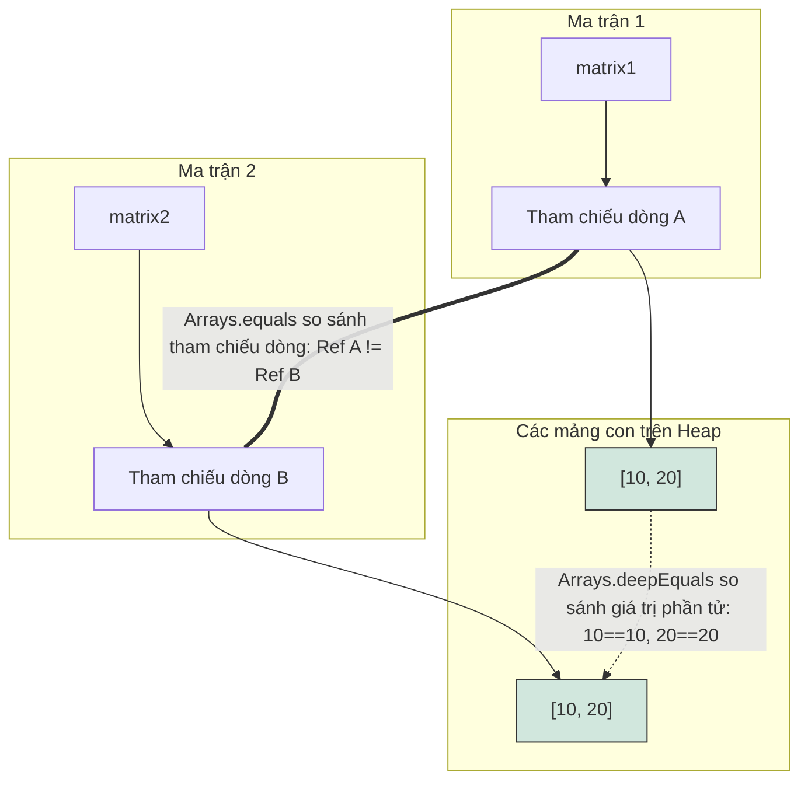

# Các Thao Tác Trên Mảng (Array Operations)

Lớp `java.util.Arrays` và các phương thức hệ thống gốc (system native methods) cung cấp các thao tác hiệu năng cao để sao chép, sắp xếp, tìm kiếm và so sánh các mảng.

---

## Cơ Chế Chi Tiết Của Việc Sao Chép Mảng (Detailed Mechanics of Copying Arrays)

Java cung cấp nhiều cách khác nhau để sao chép mảng, mỗi cách có các đặc tính hiệu năng và cú pháp khác nhau.

### 1. `System.arraycopy()`
Đây là một phương thức gốc tĩnh (native static method) cấp thấp của lớp `System`. Nó được tối ưu hóa cao độ vì sao chép trực tiếp các khối bộ nhớ ở cấp độ hệ điều hành/phần cứng.

**Cú pháp:**
```java
System.arraycopy(Object src, int srcPos, Object dest, int destPos, int length);
```
- `src`: Mảng nguồn.
- `srcPos`: Chỉ mục vị trí bắt đầu trong mảng nguồn.
- `dest`: Mảng đích.
- `destPos`: Chỉ mục vị trí bắt đầu trong mảng đích.
- `length`: Số lượng phần tử cần sao chép.

**Các đặc tính chính:**
- Bạn phải tự cấp phát trước mảng đích với kích thước đủ lớn.
- Ném ra ngoại lệ `NullPointerException` nếu mảng nguồn hoặc mảng đích là `null`.
- Ném ra ngoại lệ `IndexOutOfBoundsException` nếu các chỉ mục vượt quá kích thước mảng.
- Ném ra ngoại lệ `ArrayStoreException` nếu kiểu dữ liệu tại thời điểm chạy (runtime types) của mảng nguồn và mảng đích không tương thích.

### Tại Sao System.arraycopy Đạt Hiệu Năng Cao và Chỉ Sao Chép Nông (Shallow Copy)

Phương thức `System.arraycopy()` đạt hiệu năng cực cao vì nó bỏ qua chi phí lặp qua từng phần tử của máy ảo Java (JVM loop overhead) và thực hiện truyền trực tiếp khối bộ nhớ (tương đương với hàm `memmove` trong ngôn ngữ C) ở cấp độ hệ điều hành hoặc phần cứng. Khi sao chép các mảng lớn, một vòng lặp Java tiêu chuẩn đòi hỏi phải lấy phần tử, kiểm tra kiểu dữ liệu và ghi từng phần tử riêng lẻ, điều này gây ra chi phí chỉ thị CPU rất lớn. Ngược lại, `System.arraycopy()` sử dụng các chỉ thị CPU gốc để sao chép toàn bộ khối bộ nhớ thô trong một hoạt động thống nhất duy nhất, tối đa hóa việc sử dụng băng thông dữ liệu (bus utilization). Tuy nhiên, vì nó sao chép trực tiếp các bit thô của các phần tử mảng, nó chỉ thực hiện sao chép nông (shallow copy) khi áp dụng cho mảng các tham chiếu đối tượng. Nó chỉ sao chép địa chỉ tham chiếu (con trỏ) được lưu trữ trong mảng thay vì nhân bản chính các đối tượng bên dưới, nghĩa là cả hai mảng sẽ cùng tham chiếu đến các thực thể giống nhau trên heap.

```mermaid
flowchart TD
    subgraph Source Array ["Mảng Nguồn: String[]"]
        S0["Chỉ mục 0: Tham chiếu A"]
        S1["Chỉ mục 1: Tham chiếu B"]
    end
    subgraph Dest Array ["Mảng Đích: String[]"]
        D0["Chỉ mục 0: Tham chiếu A"]
        D1["Chỉ mục 1: Tham chiếu B"]
    end
    subgraph Heap Objects ["Các đối tượng trên Heap"]
        ObjA["String Object A: 'Hello'"]
        ObjB["String Object B: 'World'"]
    end
    S0 --> ObjA
    D0 --> ObjA
    S1 --> ObjB
    D1 --> ObjB
    Source Array -.->|Sao chép trực tiếp địa chỉ tham chiếu| Dest Array
    style Source Array fill:#fff3cd,stroke:#333
    style Dest Array fill:#d1e7dd,stroke:#333
```

**Ví Dụ Mã Nguồn Có Thể Chạy Được:**
```java
public class ArrayCopyPerformanceDemo {
    public static void main(String[] args) {
        String[] src = {new String("Hello"), new String("World")};
        String[] dest = new String[2];
        System.arraycopy(src, 0, dest, 0, 2);
        System.out.println("Same object reference: " + (src[0] == dest[0])); // Kết quả: true
    }
}
```

**Chuỗi Nguyên Nhân - Kết Quả (Cause-Effect Chain):**
`Gọi System.arraycopy` &rarr; `Lời gọi hệ thống gốc bỏ qua vòng lặp JVM` &rarr; `Khối bộ nhớ liên tục được sao chép trực tiếp ở cấp độ hệ điều hành/phần cứng` &rarr; `Địa chỉ tham chiếu thô được sao chép nguyên văn` &rarr; `Sao chép nông dẫn đến cả hai mảng cùng trỏ vào các đối tượng giống nhau trên heap`

### 2. `Arrays.copyOf()`
Tạo ra một bản sao mảng mới từ chỉ mục `0` cho đến chỉ mục `newLength`.

```java
int[] copy = Arrays.copyOf(original, newLength);
```
- Nếu `newLength` lớn hơn `original.length`, các vị trí còn lại sẽ được điền các giá trị mặc định (`0`, `false`, hoặc `null`).
- Nếu `newLength` nhỏ hơn, mảng sẽ bị cắt ngắn đi.
- Bên dưới lớp vỏ, phương thức này gọi `System.arraycopy` sau khi tự cấp phát mảng mới.

##### Ví Dụ Có Thể Chạy Được: Sử dụng `Arrays.copyOf()` và `copyOfRange()`
```java
import java.util.Arrays;
 
public class ArrayCopyExample {
    public static void main(String[] args) {
        int[] original = {10, 20, 30, 40, 50};
 
        // 1. Sao chép cắt ngắn (độ dài = 3)
        int[] truncated = Arrays.copyOf(original, 3);
        System.out.println("Truncated (length 3): " + Arrays.toString(truncated));
        // Kết quả: [10, 20, 30]
 
        // 2. Sao chép đệm thêm (độ dài = 7)
        int[] padded = Arrays.copyOf(original, 7);
        System.out.println("Padded (length 7): " + Arrays.toString(padded));
        // Kết quả: [10, 20, 30, 40, 50, 0, 0]
 
        // 3. Sao chép một khoảng (chỉ mục từ 1 đến 4 loại trừ, tức là 20, 30, 40)
        int[] range = Arrays.copyOfRange(original, 1, 4);
        System.out.println("Range (indices 1 to 4): " + Arrays.toString(range));
        // Kết quả: [20, 30, 40]
    }
}
```

### 3. `Arrays.copyOfRange()`
Sao chép một khoảng cụ thể của mảng.

```java
int[] rangeCopy = Arrays.copyOfRange(original, fromIndex, toIndex);
```
- `fromIndex`: Chỉ mục bắt đầu (bao gồm).
- `toIndex`: Chỉ mục kết thúc (không bao gồm).
- Nếu `toIndex` lớn hơn độ dài mảng, mảng mới sẽ được đệm thêm các giá trị mặc định.
- Ném ra ngoại lệ `IllegalArgumentException` nếu `fromIndex > toIndex`.
- Ném ra ngoại lệ `ArrayIndexOutOfBoundsException` nếu `fromIndex < 0` hoặc `fromIndex > original.length`.

---

## Sắp Xếp Mảng: Thuật Toán và Tính Ổn Định (Sorting Arrays: Algorithms and Stability)

Phương thức `Arrays.sort()` được nạp chồng (overloaded) để sắp xếp các kiểu dữ liệu nguyên thủy và các kiểu đối tượng.

### 1. Sắp Xếp Mảng Nguyên Thủy (Dual-Pivot Quicksort)
Đối với các mảng kiểu nguyên thủy (`int[]`, `double[]`, v.v.), `Arrays.sort()` sử dụng thuật toán **Dual-Pivot Quicksort** (Quicksort xoay kép).
- **Độ phức tạp thời gian:** Trung bình là $O(n \log n)$, trường hợp xấu nhất là $O(n^2)$ (mặc dù được tối ưu hóa cao độ để tránh các kịch bản xấu nhất).
- **Tính ổn định (Stability):** **Không ổn định (Unstable)** (có thể thay đổi thứ tự tương đối của các phần tử bằng nhau). Vì kiểu nguyên thủy không có định danh tham chiếu, tính ổn định không gây ảnh hưởng đến kết quả.

### 2. Sắp Xếp Mảng Đối Tượng (Timsort)
Đối với các mảng đối tượng (`String[]`, các lớp tự định nghĩa), `Arrays.sort()` sử dụng thuật toán **Timsort** (thuật toán lai giữa Sắp xếp trộn - Merge Sort và Sắp xếp chèn - Insertion Sort).
- **Độ phức tạp thời gian:** Trung bình và trường hợp xấu nhất là $O(n \log n)$, trường hợp tốt nhất là $O(n)$ khi mảng đã được sắp xếp sẵn.
- **Tính ổn định (Stability):** **Ổn định (Stable)** (giữ nguyên thứ tự tương đối của các phần tử bằng nhau).
- **Điều kiện tiên quyết:** Các đối tượng bên trong mảng phải triển khai giao diện `Comparable`, hoặc bạn phải truyền vào một `Comparator` tùy chỉnh để chỉ định logic sắp xếp.

### 3. Sắp Xếp Trong Một Khoảng (Sorting Ranges)
Bạn có thể sắp xếp một mảng con cụ thể bằng cách sử dụng:
```java
Arrays.sort(arr, fromIndex, toIndex); // toIndex là chỉ mục loại trừ
```

##### Ví Dụ Có Thể Chạy Được: Sắp xếp kiểu nguyên thủy vs. đối tượng
```java
import java.util.Arrays;
import java.util.Comparator;
 
public class ArraySortExample {
    static class Person implements Comparable<Person> {
        String name;
        int age;
 
        Person(String name, int age) {
            this.name = name;
            this.age = age;
        }
 
        @Override
        public int compareTo(Person other) {
            return Integer.compare(this.age, other.age); // Sắp xếp tăng dần theo tuổi
        }
 
        @Override
        public String toString() {
            return name + " (" + age + ")";
        }
    }
 
    public static void main(String[] args) {
        // 1. Sắp xếp kiểu nguyên thủy (Dual-Pivot Quicksort)
        int[] numbers = {5, 2, 8, 1, 9};
        Arrays.sort(numbers);
        System.out.println("Sorted primitives: " + Arrays.toString(numbers));
        // Kết quả: [1, 2, 5, 8, 9]
 
        // 2. Sắp xếp đối tượng sử dụng Comparable (Timsort)
        Person[] people = {
            new Person("Alice", 30),
            new Person("Bob", 25),
            new Person("Charlie", 35)
        };
        Arrays.sort(people);
        System.out.println("Sorted by Comparable (age): " + Arrays.toString(people));
        // Kết quả: [Bob (25), Alice (30), Charlie (35)]
 
        // 3. Sắp xếp đối tượng sử dụng một Comparator tùy chỉnh (theo tên giảm dần)
        Arrays.sort(people, new Comparator<Person>() {
            @Override
            public int compare(Person p1, Person p2) {
                return p2.name.compareTo(p1.name);
            }
        });
        System.out.println("Sorted by custom Comparator (name desc): " + Arrays.toString(people));
        // Kết quả: [Charlie (35), Bob (25), Alice (30)]
    }
}
```

---

## Tại Sao Tìm Kiếm Nhị Phân Yêu Cầu Mảng Đã Sắp Xếp và Cách Hoạt Động Toán Học Của Mã Trả Về (Why Binary Search Requires Sorted Arrays)

Phương thức `Arrays.binarySearch()` hoạt động dựa trên thuật toán tìm kiếm nhị phân, thuật toán này liên tục chia đôi không gian tìm kiếm bằng cách so sánh khóa mục tiêu với phần tử ở giữa của phạm vi hiện tại. Cơ chế chia đôi này giả định một ràng buộc sắp xếp nghiêm ngặt: nếu khóa mục tiêu nhỏ hơn phần tử ở giữa, nó phải nằm ở nửa bên trái, và nếu lớn hơn, nó phải nằm ở nửa bên phải. Nếu mảng chưa được sắp xếp, giả định định hướng này bị phá vỡ, khiến thuật toán loại bỏ nhầm đường dẫn đúng và trả về kết quả sai hoặc không thể dự đoán được. Khi không tìm thấy khóa, `binarySearch()` trả về một giá trị âm được tính theo công thức `-(insertionPoint) - 1` để thông báo cả việc thiếu phần tử và vị trí chèn được sắp xếp đúng của nó. Bằng cách dịch chuyển điểm chèn âm đi 1 đơn vị, thuật toán tránh được xung đột tại chỉ mục `0`, đảm bảo rằng giá trị trả về âm luôn biểu thị rõ ràng là 'không tìm thấy' trong khi vẫn giữ nguyên thông tin chỉ mục chèn.

```mermaid
flowchart TD
    subgraph Sorted Array ["Mảng đã sắp xếp: [10, 20, 30, 40, 50]"]
        A["[0]=10"]
        B["[1]=20"]
        C["[2]=30"]
        D["[3]=40"]
        E["[4]=50"]
    end
    Target["Tìm kiếm giá trị 25"]
    Target -->|So sánh với phần tử ở giữa [2]=30| C
    C -->|25 < 30: Đi sang trái| B
    B -->|25 > 20: Đi sang phải| NotFound["Không tìm thấy. Điểm chèn là chỉ mục 2"]
    NotFound -->|Công thức: -insertionPoint - 1| Return["Trả về: -2 - 1 = -3"]
    style Sorted Array fill:#f8f9fa,stroke:#333
    style Return fill:#f8d7da,stroke:#333
```

**Ví Dụ Mã Nguồn Có Thể Chạy Được:**
```java
import java.util.Arrays;
 
public class BinarySearchDemo {
    public static void main(String[] args) {
        int[] sorted = {10, 20, 30, 40, 50};
        
        // Tìm thấy phần tử
        int indexFound = Arrays.binarySearch(sorted, 30);
        System.out.println("Index of 30: " + indexFound); // Kết quả: 2
        
        // Không tìm thấy phần tử (phần tử đáng lẽ phải ở chỉ mục 2)
        int indexNotFound = Arrays.binarySearch(sorted, 25);
        System.out.println("Index of 25: " + indexNotFound); // Kết quả: -3
    }
}
```

**Chuỗi Nguyên Nhân - Kết Quả (Cause-Effect Chain):**
`Tìm kiếm nhị phân giả định mảng đã sắp xếp` &rarr; `Phần tử ở giữa được so sánh với khóa` &rarr; `Phạm vi tìm kiếm giảm một nửa dựa trên giả định sắp xếp` &rarr; `Không tìm thấy khóa` &rarr; `Xác định điểm chèn` &rarr; `Giá trị trả về tính theo công thức -(insertionPoint) - 1 để tránh xung đột chỉ mục 0`

---

## So Sánh Mảng (Sao Chép Nông vs. Sao Chép Sâu)

Sử dụng toán tử `==` trên các biến mảng chỉ so sánh các tham chiếu (địa chỉ trên ngăn xếp stack).

### 1. `Arrays.equals()`
So sánh hai mảng 1 chiều xem nội dung của chúng có bằng nhau hay không:
- Trả về `true` nếu cả hai mảng chứa cùng số lượng phần tử và tất cả các cặp phần tử tương ứng bằng nhau (sử dụng `==` cho các kiểu nguyên thủy và `.equals()` cho các đối tượng).
- An toàn với giá trị null (xử lý được trường hợp so sánh khi một hoặc cả hai mảng là `null`).

### 2. `Arrays.deepEquals()`
So sánh hai mảng đa chiều.
- Gọi `Arrays.equals()` trên mảng 2 chiều thực chất là so sánh địa chỉ tham chiếu của các mảng dòng bên trong. Nếu các dòng nằm ở các địa chỉ heap khác nhau, nó sẽ trả về `false` ngay cả khi các giá trị bên trong hoàn toàn giống nhau.
- `Arrays.deepEquals()` duyệt đệ quy qua các mảng lồng nhau, so sánh giá trị ở cấp thấp nhất.

```java
int[][] matrix1 = {{1, 2}};
int[][] matrix2 = {{1, 2}};
 
System.out.println(Arrays.equals(matrix1, matrix2));     // false (địa chỉ dòng bên trong khác nhau)
System.out.println(Arrays.deepEquals(matrix1, matrix2)); // true (các nội dung được so sánh đệ quy)
```

### Tại Sao Arrays.equals Thất Bại Trên Mảng Đa Chiều (Why Arrays.equals Fails on Multidimensional Arrays)

Phương thức `Arrays.equals()` được thiết kế để thực hiện kiểm tra bằng nhau ở cấp độ đơn lẻ (single-level), nghĩa là nó lặp qua các phần tử của mảng và so sánh chúng bằng toán tử `==` cho kiểu nguyên thủy hoặc phương thức `.equals()` cho các đối tượng. Khi `Arrays.equals()` được gọi trên mảng đa chiều (vốn là các mảng chứa các tham chiếu đến các mảng con), nó so sánh địa chỉ tham chiếu của các dòng bên trong chứ không so sánh các giá trị thực tế bên trong các mảng con đó. Vì các mảng con là các đối tượng độc lập trên heap, hai mảng đa chiều có cấu trúc giống hệt nhau vẫn có các tham chiếu dòng khác nhau và do đó thất bại khi kiểm tra bằng nhau ở cấp độ tham chiếu đơn lẻ. Để giải quyết điều này, bắt buộc phải sử dụng `Arrays.deepEquals()` vì nó phát hiện được khi nào các phần tử là mảng lồng nhau và duyệt đệ quy xuống các mảng con đó để so sánh các giá trị cấp thấp nhất của chúng. Sự đệ quy này đảm bảo rằng các cấu trúc đa chiều được đánh giá theo giá trị thực tế thay vì theo địa chỉ bộ nhớ của các dòng thành phần.



**Ví Dụ Mã Nguồn Có Thể Chạy Được:**
```java
import java.util.Arrays;
 
public class ArrayEqualityDemo {
    public static void main(String[] args) {
        int[][] m1 = {{10, 20}};
        int[][] m2 = {{10, 20}};
        System.out.println("Arrays.equals: " + Arrays.equals(m1, m2));         // Kết quả: false
        System.out.println("Arrays.deepEquals: " + Arrays.deepEquals(m1, m2)); // Kết quả: true
    }
}
```

**Chuỗi Nguyên Nhân - Kết Quả (Cause-Effect Chain):**
`Gọi Arrays.equals trên mảng 2D` &rarr; `Mảng con lồng nhau được coi như các phần tử Object` &rarr; `Phương thức .equals() cấp đơn lẻ so sánh tham chiếu mảng con bằng kiểm tra định danh` &rarr; `Tham chiếu khác nhau` &rarr; `Trả về false bất chấp giá trị số học giống hệt nhau`

---

## Các Sai Lầm Thường Gặp (Common Mistakes)

### 1. Tìm kiếm trên mảng chưa sắp xếp với `Arrays.binarySearch()`
`Arrays.binarySearch()` yêu cầu mảng phải được sắp xếp theo thứ tự tăng dần. Nếu mảng chưa được sắp xếp, kết quả trả về sẽ không xác định.
```java
int[] unsorted = {3, 1, 4, 1, 5};
int index = Arrays.binarySearch(unsorted, 4); // Kết quả không xác định! Có thể là số âm hoặc sai vị trí.
```

### 2. Sử dụng toán tử `==` hoặc `.equals()` để so sánh nội dung mảng
Các mảng không ghi đè phương thức `.equals()` từ lớp `Object`. Do đó, `arr1.equals(arr2)` hoàn toàn tương đương với `arr1 == arr2` (so sánh tham chiếu trên ngăn xếp stack, không so sánh nội dung mảng trên heap). Hãy sử dụng `Arrays.equals()` hoặc `Arrays.deepEquals()` để thay thế.
```java
int[] a = {1, 2};
int[] b = {1, 2};
System.out.println(a == b);       // false
System.out.println(a.equals(b));  // false
System.out.println(Arrays.equals(a, b)); // true
```

### 3. Sử dụng `Arrays.equals()` cho mảng đa chiều
`Arrays.equals()` chỉ so sánh các tham chiếu ở cấp cao nhất khi chạy trên các mảng đa chiều. Nếu các tham chiếu đó khác nhau, nó sẽ trả về `false` ngay cả khi các giá trị bên dưới giống hệt nhau. Hãy sử dụng `Arrays.deepEquals()` để thay thế.
```java
int[][] m1 = {{1, 2}};
int[][] m2 = {{1, 2}};
System.out.println(Arrays.equals(m1, m2));     // false
System.out.println(Arrays.deepEquals(m1, m2)); // true
```

### 4. Ép kiểu trực tiếp trong `System.arraycopy()` với các kiểu không tương thích
`System.arraycopy()` ném ra ngoại lệ `ArrayStoreException` tại thời điểm chạy nếu kiểu của các phần tử không tương thích, mặc dù mã nguồn vẫn biên dịch bình thường (vì cả hai đối số đều có kiểu là `Object`).
```java
Object[] src = { "Hello", "World" };
Integer[] dest = new Integer[2];
// System.arraycopy(src, 0, dest, 0, 2); // Ném ra ArrayStoreException tại thời điểm chạy!
```

---

## Liên Kết Tham Khảo (Reference Links)

- https://docs.oracle.com/javase/specs/jls/se21/html/jls-10.html (Các mảng trong Đặc tả Ngôn ngữ Java)
- https://docs.oracle.com/javase/8/docs/api/java/lang/System.html#arraycopy-java.lang.Object-int-java.lang.Object-int-int- (Tài liệu Javadoc cho System.arraycopy trong Java SE 8)
- https://docs.oracle.com/javase/8/docs/api/java/util/Arrays.html (Tài liệu Javadoc cho java.util.Arrays trong Java SE 8)
