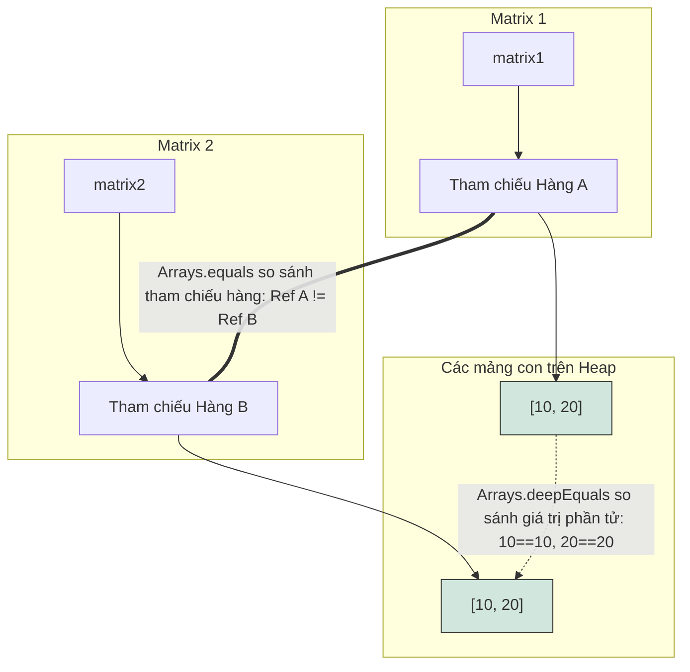

# Các Thao Tác Trên Mảng (Array Operations)

Lớp `java.util.Arrays` và các phương thức native của hệ thống cung cấp các thao tác hiệu năng cao để sao chép, sắp xếp, tìm kiếm và so sánh các mảng.

---

## Cơ Chế Chi Tiết Khi Sao Chép Mảng (Detailed Mechanics of Copying Arrays)

Java cung cấp nhiều cách để sao chép mảng, mỗi cách có các đặc tính hiệu năng và cú pháp khác nhau.

### 1. `System.arraycopy()`
Đây là một phương thức static native cấp thấp của lớp `System`. Nó được tối ưu hóa cực cao vì thực hiện sao chép các khối bộ nhớ trực tiếp ở cấp độ hệ điều hành/phần cứng.

**Cú Pháp:**
```java
System.arraycopy(Object src, int srcPos, Object dest, int destPos, int length);
```
- `src`: Mảng nguồn.
- `srcPos`: Chỉ số vị trí bắt đầu sao chép trong mảng nguồn.
- `dest`: Mảng đích.
- `destPos`: Chỉ số vị trí bắt đầu ghi trong mảng đích.
- `length`: Số lượng phần tử cần sao chép.

**Các đặc tính chính:**
- Bạn bắt buộc phải tự cấp phát mảng đích với kích thước đủ lớn trước khi gọi phương thức.
- Ném ra ngoại lệ `NullPointerException` nếu mảng nguồn hoặc mảng đích bị `null`.
- Ném ra ngoại lệ `IndexOutOfBoundsException` nếu các chỉ số vượt quá kích thước mảng.
- Ném ra ngoại lệ `ArrayStoreException` nếu kiểu dữ liệu lúc runtime của mảng nguồn và mảng đích không tương thích.

### Tại Sao System.arraycopy Có Hiệu Năng Cao Và Là Sao Chép Nông (Why System.arraycopy is Performant and Shallow)

Phương thức `System.arraycopy()` có hiệu năng cực cao vì nó bỏ qua hoàn toàn chi phí vòng lặp duyệt từng phần tử của máy ảo Java (JVM) và thực thi một lệnh truyền khối bộ nhớ trực tiếp (tương đương với hàm `memmove` trong C) ở cấp độ hệ điều hành hoặc phần cứng. Khi sao chép các mảng lớn, một vòng lặp Java tiêu chuẩn đòi hỏi phải lấy ra, kiểm tra kiểu dữ liệu và ghi từng phần tử riêng lẻ, điều này tiêu tốn rất nhiều chỉ lệnh CPU. Ngược lại, `System.arraycopy()` tận dụng các chỉ lệnh native của CPU để sao chép toàn bộ khối bộ nhớ thô trong một thao tác duy nhất, tối đa hóa băng thông bus. Tuy nhiên, bởi vì nó sao chép trực tiếp các bit thô của phần tử mảng, nó chỉ thực hiện sao chép nông (shallow copy) khi áp dụng cho mảng chứa tham chiếu đối tượng. Nó chỉ sao chép địa chỉ tham chiếu (con trỏ) được lưu trữ trong mảng thay vì nhân bản bản thân các đối tượng nằm dưới, nghĩa là cả hai mảng sẽ cùng trỏ tới các thực thể đối tượng giống hệt nhau trên heap.

```mermaid
flowchart TD
    subgraph Source Array [Mảng Nguồn String[]]
        S0["Chỉ số 0: Tham chiếu A"]
        S1["Chỉ số 1: Tham chiếu B"]
    end
    subgraph Dest Array [Mảng Đích String[]]
        D0["Chỉ số 0: Tham chiếu A"]
        D1["Chỉ số 1: Tham chiếu B"]
    end
    subgraph Heap Objects [Các đối tượng trên Heap]
        ObjA["Đối tượng String A: 'Hello'"]
        ObjB["Đối tượng String B: 'World'"]
    end
    S0 --> ObjA
    D0 --> ObjA
    S1 --> ObjB
    D1 --> ObjB
    Source Array -.->|Sao chép bộ nhớ trực tiếp các tham chiếu| Dest Array
    style Source Array fill:#fff3cd,stroke:#333
    style Dest Array fill:#d1e7dd,stroke:#333
```

**Ví dụ Code chạy được:**
```java
public class ArrayCopyPerformanceDemo {
    public static void main(String[] args) {
        String[] src = {new String("Hello"), new String("World")};
        String[] dest = new String[2];
        System.arraycopy(src, 0, dest, 0, 2);
        System.out.println("Cùng tham chiếu đối tượng: " + (src[0] == dest[0])); // Kết quả: true
    }
}
```

**Chuỗi Nguyên Nhân - Kết Quả:**
`System.arraycopy được gọi` &rarr; `Lời gọi native hệ thống bỏ qua vòng lặp JVM` &rarr; `Khối bộ nhớ liên tục được sao chép trực tiếp ở cấp OS/phần cứng` &rarr; `Các địa chỉ tham chiếu thô được sao chép nguyên văn` &rarr; `Đạt sao chép nông nơi cả hai mảng cùng trỏ tới chung các đối tượng heap`

### 2. `Arrays.copyOf()`
Tạo ra một bản sao mảng mới từ chỉ số `0` cho đến chỉ số `newLength`.

```java
int[] copy = Arrays.copyOf(original, newLength);
```
- Nếu `newLength` lớn hơn `original.length`, các ô trống còn lại sẽ tự động được điền các giá trị mặc định (`0`, `false`, hoặc `null`).
- Nếu `newLength` nhỏ hơn, mảng mới sẽ bị cắt ngắn.
- Ở bên dưới, phương thức này thực chất sẽ tự động cấp phát mảng mới rồi gọi `System.arraycopy()`.

##### Ví dụ Code chạy được: Sử dụng `Arrays.copyOf()` và `copyOfRange()`
```java
import java.util.Arrays;

public class ArrayCopyExample {
    public static void main(String[] args) {
        int[] original = {10, 20, 30, 40, 50};

        // 1. Sao chép cắt ngắn (length = 3)
        int[] truncated = Arrays.copyOf(original, 3);
        System.out.println("Cắt ngắn (length 3): " + Arrays.toString(truncated));
        // Kết quả: [10, 20, 30]

        // 2. Sao chép đệm thêm (length = 7)
        int[] padded = Arrays.copyOf(original, 7);
        System.out.println("Đệm thêm (length 7): " + Arrays.toString(padded));
        // Kết quả: [10, 20, 30, 40, 50, 0, 0]

        // 3. Sao chép một phân đoạn (từ chỉ số 1 đến 4 loại trừ, tức là lấy 20, 30, 40)
        int[] range = Arrays.copyOfRange(original, 1, 4);
        System.out.println("Phân đoạn (chỉ số 1 đến 4): " + Arrays.toString(range));
        // Kết quả: [20, 30, 40]
    }
}
```

### 3. `Arrays.copyOfRange()`
Sao chép một phân đoạn cụ thể của mảng.

```java
int[] rangeCopy = Arrays.copyOfRange(original, fromIndex, toIndex);
```
- `fromIndex`: Chỉ số bắt đầu (bao gồm).
- `toIndex`: Chỉ số kết thúc (loại trừ).
- Nếu `toIndex` lớn hơn độ dài mảng ban đầu, mảng mới sẽ được đệm thêm các giá trị mặc định ở cuối.
- Ném ra ngoại lệ `IllegalArgumentException` nếu `fromIndex > toIndex`.
- Ném ra ngoại lệ `ArrayIndexOutOfBoundsException` nếu `fromIndex < 0` hoặc `fromIndex > original.length`.

---

## Sắp Xếp Mảng: Thuật Toán Và Tính Ổn Định (Sorting Arrays: Algorithms and Stability)

Phương thức `Arrays.sort()` được nạp chồng (overloaded) để sắp xếp cả các mảng kiểu nguyên thủy và các mảng kiểu đối tượng.

### 1. Sắp Xếp Mảng Nguyên Thủy (Dual-Pivot Quicksort)
Đối với các mảng kiểu nguyên thủy (`int[]`, `double[]`, v.v.), `Arrays.sort()` sử dụng thuật toán **Dual-Pivot Quicksort** (sắp xếp nhanh hai chốt).
- **Độ phức tạp thời gian:** Trung bình là $O(n \log n)$, Trường hợp xấu nhất là $O(n^2)$ (tuy nhiên thuật toán đã được tối ưu hóa cực tốt để tránh các kịch bản xấu nhất này).
- **Tính ổn định (Stability):** **Không ổn định (Unstable)** (có thể thay đổi thứ tự tương đối của các phần tử có giá trị bằng nhau). Vì các kiểu nguyên thủy không có định danh đối tượng riêng biệt, tính ổn định không gây ảnh hưởng gì.

### 2. Sắp Xếp Mảng Đối Tượng (Timsort)
Đối với các mảng chứa đối tượng (`String[]`, các lớp tự định nghĩa), `Arrays.sort()` sử dụng thuật toán **Timsort** (thuật toán lai giữa sắp xếp trộn Merge Sort và sắp xếp chèn Insertion Sort).
- **Độ phức tạp thời gian:** Trung bình và Tệ nhất là $O(n \log n)$, Tốt nhất là $O(n)$ khi mảng đã được sắp xếp sẵn.
- **Tính ổn định (Stability):** **Ổn định (Stable)** (giữ nguyên thứ tự tương đối ban đầu của các phần tử bằng nhau).
- **Yêu cầu bắt buộc:** Các đối tượng bên trong mảng phải implement interface `Comparable`, hoặc bạn phải truyền vào một `Comparator` tùy biến để định nghĩa logic sắp xếp.

### 3. Sắp Xếp Một Phân Đoạn
Bạn có thể sắp xếp một phần cụ thể của mảng bằng cách:
```java
Arrays.sort(arr, fromIndex, toIndex); // toIndex là loại trừ
```

##### Ví dụ Code chạy được: Sắp xếp kiểu nguyên thủy so với đối tượng
```java
import java.util.Arrays;
import java.util.Comparator;

public class ArraySortExample {
    static class Person implements Comparable<Person> {
        String name;
        int age;

        Person(String name, int age) {
            this.name = name;
            this.age = age;
        }

        @Override
        public int compareTo(Person other) {
            return Integer.compare(this.age, other.age); // Sắp xếp theo tuổi tăng dần
        }

        @Override
        public String toString() {
            return name + " (" + age + ")";
        }
    }

    public static void main(String[] args) {
        // 1. Sắp xếp kiểu nguyên thủy (Dual-Pivot Quicksort)
        int[] numbers = {5, 2, 8, 1, 9};
        Arrays.sort(numbers);
        System.out.println("Mảng nguyên thủy sau sắp xếp: " + Arrays.toString(numbers));
        // Kết quả: [1, 2, 5, 8, 9]

        // 2. Sắp xếp đối tượng sử dụng Comparable (Timsort)
        Person[] people = {
            new Person("Alice", 30),
            new Person("Bob", 25),
            new Person("Charlie", 35)
        };
        Arrays.sort(people);
        System.out.println("Sắp xếp bằng Comparable (tuổi): " + Arrays.toString(people));
        // Kết quả: [Bob (25), Alice (30), Charlie (35)]

        // 3. Sắp xếp đối tượng bằng một Comparator tùy biến (theo tên giảm dần)
        Arrays.sort(people, new Comparator<Person>() {
            @Override
            public int compare(Person p1, Person p2) {
                return p2.name.compareTo(p1.name);
            }
        });
        System.out.println("Sắp xếp bằng Comparator (tên giảm dần): " + Arrays.toString(people));
        // Kết quả: [Charlie (35), Bob (25), Alice (30)]
    }
}
```

---

## Tại Sao Tìm Kiếm Nhị Phân Yêu Cầu Mảng Đã Sắp Xếp Và Cơ Chế Toán Học Của Mã Trả Về (Why Binary Search Requires Sorted Arrays and How Its Return Code Math Works)

Phương thức `Arrays.binarySearch()` hoạt động dựa trên thuật toán tìm kiếm nhị phân, liên tục chia đôi không gian tìm kiếm bằng cách so sánh key cần tìm với phần tử nằm ở chính giữa phân đoạn hiện tại. Cơ chế chia đôi này giả định một quy tắc sắp xếp nghiêm ngặt: nếu key nhỏ hơn phần tử ở giữa, nó bắt buộc phải nằm ở nửa bên trái, và ngược lại nếu lớn hơn, nó bắt buộc phải nằm ở nửa bên phải. Nếu mảng chưa được sắp xếp, giả định hướng đi này sẽ bị phá vỡ hoàn toàn, khiến thuật toán bỏ qua đường đi đúng và trả về một kết quả không chính xác hoặc không thể dự đoán được. Khi không tìm thấy key, `binarySearch()` trả về một giá trị âm được tính toán bằng công thức `-(điểmChèn) - 1` để vừa thông báo việc không tìm thấy key, vừa cho biết vị trí chèn sắp xếp chính xác của nó. Bằng cách dịch chuyển điểm chèn âm đi 1 đơn vị, thuật toán tránh được sự trùng lặp giá trị tại chỉ số `0`, đảm bảo rằng một giá trị âm trả về luôn biểu thị duy nhất trạng thái 'không tìm thấy' trong khi vẫn giữ lại thông tin về vị trí chỉ số cần chèn.

```mermaid
flowchart TD
    subgraph Sorted Array [Mảng đã Sắp xếp]: [10, 20, 30, 40, 50]
        A["[0]=10"]
        B["[1]=20"]
        C["[2]=30"]
        D["[3]=40"]
        E["[4]=50"]
    end
    Target["Tìm kiếm 25"]
    Target -->|So sánh với Phần tử giữa [2]=30| C
    C -->|25 < 30: Đi sang Trái| B
    B -->|25 > 20: Đi sang Phải| NotFound["Không tìm thấy. Điểm chèn là chỉ số 2"]
    NotFound -->|Công thức: -điểmChèn - 1| Return["Trả về: -2 - 1 = -3"]
    style Sorted Array fill:#f8f9fa,stroke:#333
    style Return fill:#f8d7da,stroke:#333
```

**Ví dụ Code chạy được:**
```java
import java.util.Arrays;

public class BinarySearchDemo {
    public static void main(String[] args) {
        int[] sorted = {10, 20, 30, 40, 50};
        
        // Tìm thấy phần tử
        int indexFound = Arrays.binarySearch(sorted, 30);
        System.out.println("Chỉ số của 30: " + indexFound); // Kết quả: 2
        
        // Không tìm thấy phần tử (đáng lẽ phải chèn tại chỉ số 2)
        int indexNotFound = Arrays.binarySearch(sorted, 25);
        System.out.println("Chỉ số của 25: " + indexNotFound); // Kết quả: -3
    }
}
```

**Chuỗi Nguyên Nhân - Kết Quả:**
`Tìm kiếm nhị phân giả định mảng đã sắp xếp` &rarr; `Phần tử ở giữa được so sánh với key` &rarr; `Không gian tìm kiếm bị chia đôi dựa trên hướng sắp xếp` &rarr; `Không tìm thấy key` &rarr; `Xác định được vị trí chèn phù hợp` &rarr; `Mã trả về được tính là -(điểmChèn) - 1 để tránh xung đột với chỉ số 0`

---

## So Sánh Mảng (Nông so với Sâu) (Comparing Arrays (Shallow vs. Deep))

Sử dụng toán tử `==` trên các biến mảng chỉ thực hiện so sánh các tham chiếu của chúng (địa chỉ của biến mảng trên stack).

### 1. `Arrays.equals()`
Thực hiện so sánh nội dung của hai mảng 1D xem có bằng nhau không:
- Trả về `true` nếu cả hai mảng có cùng số lượng phần tử và tất cả các cặp phần tử tương ứng bằng nhau (sử dụng `==` cho các kiểu nguyên thủy và `.equals()` cho các kiểu đối tượng).
- Phương thức này an toàn với null (xử lý tốt các so sánh khi một hoặc cả hai mảng bị `null`).

### 2. `Arrays.deepEquals()`
Thực hiện so sánh nội dung của các mảng đa chiều.
- Gọi `Arrays.equals()` trên mảng 2D thực chất sẽ so sánh các tham chiếu của các mảng hàng con bên trong. Nếu các hàng này nằm ở các địa chỉ heap khác nhau, phương thức sẽ trả về `false` ngay cả khi giá trị của chúng giống hệt nhau.
- `Arrays.deepEquals()` thực hiện duyệt đệ quy sâu xuống các mảng lồng nhau để so sánh các giá trị ở cấp thấp nhất.

```java
int[][] matrix1 = {{1, 2}};
int[][] matrix2 = {{1, 2}};

System.out.println(Arrays.equals(matrix1, matrix2));     // false (địa chỉ của hàng con khác nhau)
System.out.println(Arrays.deepEquals(matrix1, matrix2)); // true (nội dung được so sánh đệ quy)
```

### Tại Sao Arrays.equals Thất Bại Trên Mảng Đa Chiều (Why Arrays.equals Fails on Multidimensional Arrays)

Phương thức `Arrays.equals()` được thiết kế để chỉ thực hiện một bước kiểm tra bằng nhau ở cấp đơn lẻ (single-level), nghĩa là nó lặp qua các phần tử của mảng và so sánh chúng bằng toán tử `==` cho kiểu nguyên thủy hoặc phương thức `.equals()` cho đối tượng. Khi `Arrays.equals()` được gọi trên mảng đa chiều (bản chất là mảng chứa các tham chiếu mảng con), nó so sánh các địa chỉ tham chiếu của các hàng bên trong chứ không so sánh giá trị thực tế nằm trong các mảng con đó. Bởi vì các mảng con là các đối tượng độc lập trên heap, hai mảng đa chiều có cấu trúc giống hệt nhau vẫn sẽ có các tham chiếu hàng con khác nhau và do đó thất bại ở bước so sánh tham chiếu cấp đơn lẻ này. Để giải quyết vấn đề, bạn bắt buộc phải dùng `Arrays.deepEquals()` vì nó tự động phát hiện khi nào phần tử là một mảng lồng nhau và thực hiện đệ quy sâu xuống dưới để so sánh các giá trị cấp thấp nhất của chúng. Sự đệ quy này đảm bảo các cấu trúc đa chiều được đánh giá theo mặt giá trị nội dung chứ không theo địa chỉ bộ nhớ của các hàng con cấu thành.



**Ví dụ Code chạy được:**
```java
import java.util.Arrays;

public class ArrayEqualityDemo {
    public static void main(String[] args) {
        int[][] m1 = {{10, 20}};
        int[][] m2 = {{10, 20}};
        System.out.println("Arrays.equals: " + Arrays.equals(m1, m2));         // Kết quả: false
        System.out.println("Arrays.deepEquals: " + Arrays.deepEquals(m1, m2)); // Kết quả: true
    }
}
```

**Chuỗi Nguyên Nhân - Kết Quả:**
`Arrays.equals được gọi trên mảng 2D` &rarr; `Các mảng lồng bên trong được đối xử như phần tử Object` &rarr; `Phương thức .equals() cấp đơn lẻ so sánh tham chiếu mảng con bằng kiểm tra định danh` &rarr; `Các địa chỉ tham chiếu khác nhau` &rarr; `Trả về false bất chấp giá trị số bên trong giống hệt nhau`

---

## Các Lỗi Thường Gặp (Common Mistakes)

### 1. Tìm kiếm nhị phân trên một mảng chưa sắp xếp
Phương thức `Arrays.binarySearch()` yêu cầu bắt buộc mảng phải được sắp xếp theo thứ tự tăng dần. Nếu mảng chưa sắp xếp, kết quả trả về là không xác định.
```java
int[] unsorted = {3, 1, 4, 1, 5};
int index = Arrays.binarySearch(unsorted, 4); // Kết quả không xác định! Có thể bị âm hoặc sai lệch chỉ số.
```

### 2. Sử dụng toán tử `==` hoặc phương thức `.equals()` để so sánh nội dung mảng
Mảng không ghi đè (override) phương thức `.equals()` kế thừa từ lớp `Object`. Do đó, gọi `arr1.equals(arr2)` hoàn toàn tương đương với phép so sánh `arr1 == arr2` (so sánh địa chỉ tham chiếu trên stack chứ không so sánh nội dung mảng trên heap). Hãy luôn sử dụng `Arrays.equals()` hoặc `Arrays.deepEquals()`.
```java
int[] a = {1, 2};
int[] b = {1, 2};
System.out.println(a == b);       // false
System.out.println(a.equals(b));  // false
System.out.println(Arrays.equals(a, b)); // true
```

### 3. Sử dụng `Arrays.equals()` trên mảng đa chiều
`Arrays.equals()` chỉ so sánh các tham chiếu cấp cao nhất khi chạy trên các mảng đa chiều. Nếu các tham chiếu này khác nhau, nó trả về `false` ngay cả khi các giá trị bên dưới giống hệt nhau. Hãy chuyển sang sử dụng `Arrays.deepEquals()`.
```java
int[][] m1 = {{1, 2}};
int[][] m2 = {{1, 2}};
System.out.println(Arrays.equals(m1, m2));     // false
System.out.println(Arrays.deepEquals(m1, m2)); // true
```

### 4. Ép kiểu không tương thích trong `System.arraycopy()`
Phương thức `System.arraycopy()` ném ra lỗi ngoại lệ `ArrayStoreException` lúc runtime nếu kiểu dữ liệu các phần tử mảng nguồn và mảng đích không tương thích với nhau, ngay cả khi mã nguồn được biên dịch thành công (vì cả hai tham số mảng đều được khai báo kiểu chung là `Object`).
```java
Object[] src = { "Hello", "World" };
Integer[] dest = new Integer[2];
// System.arraycopy(src, 0, dest, 0, 2); // Ném ra ngoại lệ ArrayStoreException lúc runtime!
```

---

## Liên Kết Tham Khảo (Reference Links)

- https://docs.oracle.com/javase/specs/jls/se21/html/jls-10.html (Mảng trong Đặc tả Ngôn ngữ Java)
- https://docs.oracle.com/javase/8/docs/api/java/lang/System.html#arraycopy-java.lang.Object-int-java.lang.Object-int-int- (Tài liệu Javadoc của System.arraycopy trong Java SE 8)
- https://docs.oracle.com/javase/8/docs/api/java/util/Arrays.html (Tài liệu Javadoc của java.util.Arrays trong Java SE 8)
