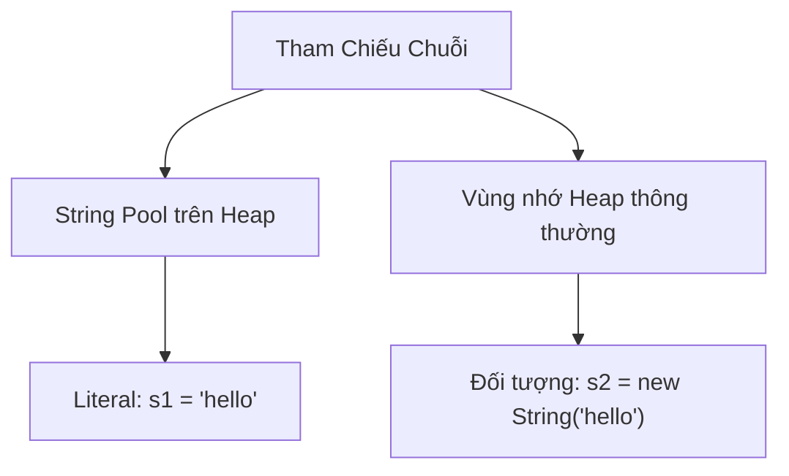

# 08 - Chuỗi (String)

## Những Điều Bạn Cần Học

- Bản chất của lớp `java.lang.String` và cách hoạt động của tính bất biến (immutability).
- Khái niệm về Literal chuỗi (String Literal) và vùng nhớ đệm chuỗi (String Pool) của JVM.
- Sự khác biệt giữa so sánh chuỗi bằng `==` và `.equals()`.
- Các phương thức `String` phổ biến để thao tác, tìm kiếm, cắt tách, định dạng chuỗi và Khối văn bản (Text Blocks).
- Sự khác biệt giữa `String`, `StringBuilder` và `StringBuffer` (bao gồm cả hiệu năng và an toàn đa luồng).

## Thứ Tự Học Tập

1. [Cơ Bản Về Chuỗi](theory/01-string-basics.md)
2. [Các Phương Thức Chuỗi Và Định Dạng](theory/02-string-methods.md)
3. [StringBuilder Và StringBuffer](theory/03-stringbuilder-stringbuffer.md)

## Thuật Ngữ Ghi Chú

- [Thuật Ngữ Chuỗi](terms/01-string-terms.md)

## Biểu Đồ Mermaid Tổng Quan

## Tự Kiểm Tra (Self-Check)

- Tại sao `String` lại là bất biến (immutable) trong Java, và quyết định thiết kế này ảnh hưởng như thế nào đến bảo mật, an toàn đa luồng (thread-safety) và cơ chế bộ đệm (String Pool)?
- Vùng nhớ đệm chuỗi (String Pool) của JVM tối ưu hóa việc sử dụng bộ nhớ như thế nào, và cơ chế bộ nhớ heap chính xác của `s1 = "hello"` so với `s2 = new String("hello")` là gì?
- Tại sao so sánh tham chiếu (`==`) tạo ra các kết quả khác nhau đối với các chuỗi được cấp phát trên String Pool so với trên Heap thông thường, và tại sao lại cần sử dụng `.equals()` để so sánh nội dung?
- Sự khác biệt về mặt cơ chế giữa `trim()` và `strip()` liên quan đến khoảng trắng Unicode và xử lý điểm mã (codepoint) là gì?
- Tại sao `StringBuilder` lại có hiệu năng tốt hơn `StringBuffer`, và cơ chế đồng bộ hóa (synchronization) ảnh hưởng thế nào đến hiệu năng và an toàn đa luồng của chúng?

## Các Thẻ Anki

- [Cơ Bản](anki/basic.tsv)
- [Cơ Bản Mở Rộng](anki/basic-extra.tsv)
- [Điền Khuyết](anki/cloze.tsv)
- [Câu Hỏi Code](anki/code-question.tsv)

## Liên Kết Tham Chiếu

- https://docs.oracle.com/en/java/javase/21/docs/api/java.base/java/lang/String.html
- https://docs.oracle.com/en/java/javase/21/docs/api/java.base/java/lang/StringBuilder.html
