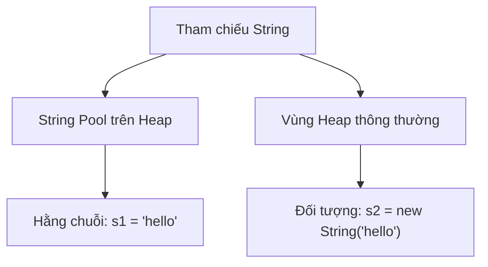

# 08 - Chuỗi (String)

## Những Điều Bạn Cần Học (What You Should Learn)

- Bản chất của lớp `java.lang.String` và cách hoạt động của tính bất biến (immutability).
- Khái niệm về Hằng chuỗi (String Literal) và bộ nhớ đệm chuỗi JVM String Pool.
- Sự khác biệt giữa so sánh chuỗi bằng toán tử `==` và phương thức `.equals()`.
- Các phương thức `String` phổ biến để thao tác, tìm kiếm, cắt tách, định dạng chuỗi và các Khối văn bản (Text Blocks).
- Sự khác biệt giữa `String`, `StringBuilder`, và `StringBuffer` (bao gồm khía cạnh hiệu năng và an toàn luồng).

## Trình Tự Học Tập (Study Order)

1. [Cơ bản về Chuỗi (String Basics)](theory/01-string-basics.md)
2. [Các phương thức Chuỗi và Định dạng (String Methods and Formatting)](theory/02-string-methods.md)
3. [StringBuilder và StringBuffer (StringBuilder and StringBuffer)](theory/03-stringbuilder-stringbuffer.md)

## Ghi Chú Thuật Ngữ (Term Notes)

- [Thuật ngữ về Chuỗi (String Terms)](terms/01-string-terms.md)

## Sơ Đồ Tổng Quan (Mermaid Overview)

## Tự Kiểm Tra (Self-Check)

- Tại sao `String` là bất biến (immutable) trong Java, và quyết định thiết kế này ảnh hưởng thế nào đến tính bảo mật, an toàn luồng (thread-safety) và cơ chế lưu đệm (String Pool)?
- JVM String Pool tối ưu hóa việc sử dụng bộ nhớ như thế nào, và cơ chế bộ nhớ heap chính xác khi khai báo `s1 = "hello"` so với `s2 = new String("hello")` là gì?
- Tại sao việc so sánh tham chiếu (`==`) tạo ra các kết quả khác nhau đối với chuỗi được cấp phát trong String Pool so với chuỗi cấp phát trên Heap, và tại sao bắt buộc phải dùng `.equals()` để so sánh nội dung?
- Sự khác biệt về mặt cơ chế giữa `trim()` và `strip()` liên quan đến các khoảng trắng Unicode và xử lý codepoint là gì?
- Tại sao `StringBuilder` có hiệu năng vượt trội so với `StringBuffer`, và cơ chế đồng bộ hóa (synchronization) tác động thế nào đến hiệu năng và tính an toàn luồng của chúng?

## Các Thẻ Anki (Anki Cards)

- [Basic](anki/basic.tsv)
- [Basic Extra](anki/basic-extra.tsv)
- [Cloze](anki/cloze.tsv)
- [Code Question](anki/code-question.tsv)

## Liên Kết Tham Khảo (Reference Links)

- https://docs.oracle.com/en/java/javase/21/docs/api/java.base/java/lang/String.html
- https://docs.oracle.com/en/java/javase/21/docs/api/java.base/java/lang/StringBuilder.html
