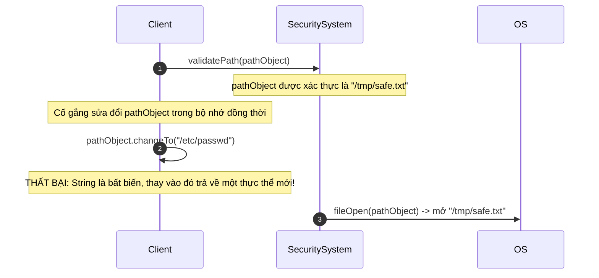
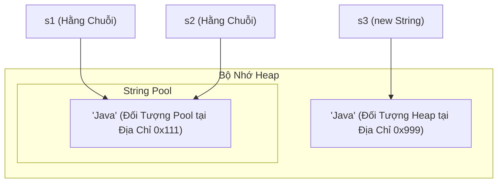
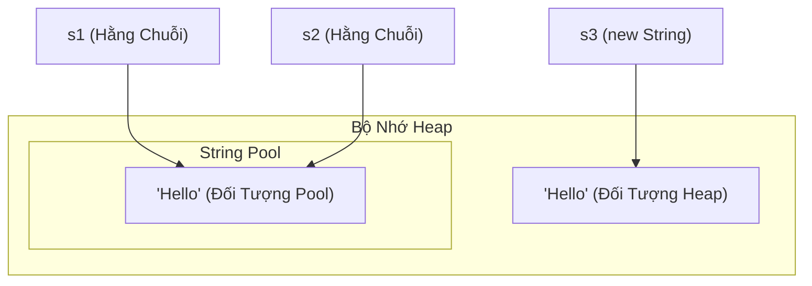
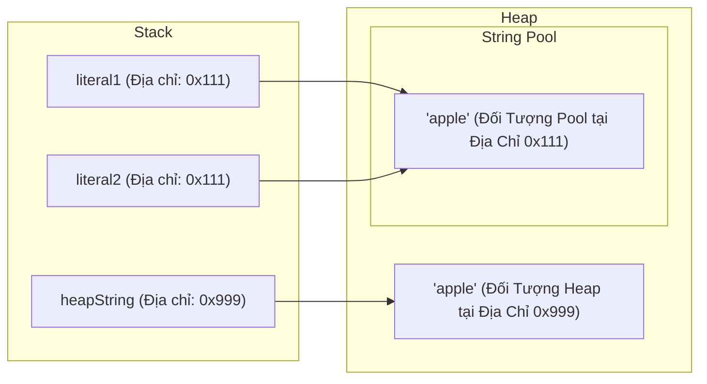

# Kiến Thức Cơ Bản Về Chuỗi (String Basics)

Lớp `java.lang.String` đại diện cho các chuỗi ký tự. Trong Java, chuỗi được xử lý như các đối tượng tham chiếu (reference object), nhưng chúng được trình biên dịch hỗ trợ đặc biệt và tối ưu hóa bộ nhớ.

---

## Biểu Diễn Nội Bộ (Compact Strings)

Trước đây, trong Java 8 trở về trước, chuỗi được lưu trữ nội bộ dưới dạng một mảng ký tự (`char[]`), cấp phát 2 byte bộ nhớ cho mỗi ký tự bằng cách sử dụng bảng mã UTF-16.

Bắt đầu từ Java 9, JVM triển khai tính năng **Chuỗi Tối Giản (Compact Strings)**:
- Chuỗi được lưu trữ nội bộ dưới dạng một mảng byte (`byte[]`).
- Một trường `coder` có kích thước 1 byte được thêm vào để theo dõi bảng mã được sử dụng:
  - `LATIN1` (giá trị coder là `0`): Được sử dụng cho các ký tự có thể biểu diễn trong 1 byte (ISO-8859-1). Tiết kiệm tới 50% bộ nhớ.
  - `UTF16` (giá trị coder là `1`): Được sử dụng cho các ký tự yêu cầu 2 byte (như tiếng Trung, tiếng Nhật, tiếng Hàn hoặc biểu tượng cảm xúc - emoji).
- Sự chuyển đổi này hoàn toàn tự động và không ảnh hưởng đến hành vi của các API công khai (public API).

---

## Tính Bất Biến Của Chuỗi (Immutability of String)

Trong Java, các đối tượng `String` là **bất biến (immutable)**. Một khi đối tượng chuỗi được khởi tạo trên heap, chuỗi byte ký tự nội bộ của nó không thể bị sửa đổi. Bất kỳ thao tác nào có vẻ như thay đổi một chuỗi thực chất là khởi tạo một chuỗi mới.

### Ví Dụ Code Về Tính Bất Biến

Dưới đây là một ví dụ cụ thể chứng minh rằng các thao tác trên một `String` không sửa đổi đối tượng ban đầu:

```java
String original = "Java";
String result = original.concat(" Core");

System.out.println("Original String: " + original); // Output: Java (vẫn giữ nguyên không đổi)
System.out.println("Result String:   " + result);   // Output: Java Core (đối tượng String mới)

// Việc sửa đổi bản thân tham chiếu chỉ là thay đổi nơi con trỏ trỏ tới,
// chứ không phải thay đổi đối tượng bên dưới trong bộ nhớ.
String s = "Hello";
s = s + " World"; // hiện tại s trỏ đến một đối tượng String mới là "Hello World"
```

### Tại Sao Chuỗi Lại Bất Biến?

1. **Bảo mật & Tải Lớp (Class Loading):**
   - Chuỗi được sử dụng để lưu trữ tên lớp được tải bởi trình tải lớp (ClassLoader), thông tin xác thực cơ sở dữ liệu, địa chỉ socket và đường dẫn tệp. Nếu chuỗi có thể thay đổi, một tin tặc có thể vượt qua bước kiểm tra xác thực đường dẫn (ví dụ: `"/tmp/file.txt"`) rồi sau đó sửa đổi nội dung chuỗi thành `"/etc/passwd"` trong quá trình thực thi.
   - Tính bảo mật của việc tải lớp (Class Loading) dựa trên việc các chuỗi được giữ nguyên không đổi để đảm bảo các lớp chính xác được tải.
2. **Bộ Lưu Trữ Hằng Số Chuỗi (String Constant Pool):**
   - Vì chuỗi là bất biến, JVM có thể lưu vào bộ nhớ đệm (cache) nhiều biến cùng trỏ đến một hằng chuỗi (string literal) giống nhau, tiết kiệm một lượng bộ nhớ đáng kể.
3. **An Toàn Đa Luồng (Thread Safety):**
   - Các đối tượng bất biến mặc định là an toàn đa luồng. Chúng có thể được chia sẻ giữa các luồng mà không cần đồng bộ hóa (synchronization), ngăn chặn việc hỏng dữ liệu hoặc tình trạng tranh chấp (race condition).
4. **Lưu Bộ Nhớ Đệm Mã Băm (Hashcode):**
   - Giá trị băm (hash value) của một String được tính toán một lần và được lưu vào bộ nhớ đệm bên trong trường private `hash` của nó. Điều này giúp việc sử dụng chuỗi làm khóa (key) trong các tập hợp dựa trên bảng băm (hash-based collection) như `HashMap` và `HashSet` trở nên cực kỳ nhanh chóng.

### Chuyên Sâu: Cơ Chế Và Tính Bảo Mật Của Tính Bất Biến

Tính bất biến của chuỗi không chỉ là một tính năng ngôn ngữ mà còn là một đảm bảo cốt lõi về bảo mật và hiệu năng trong Java. Các hoạt động nhạy cảm về bảo mật, chẳng hạn như kết nối cơ sở dữ liệu, cấu hình socket mạng và các thao tác trên hệ thống tệp, phụ thuộc rất nhiều vào việc tham chiếu `String` không thay đổi sau khi đã vượt qua các bước kiểm tra xác thực. Nếu chuỗi có thể thay đổi, một luồng chạy ngầm độc hại có thể sửa đổi chuỗi đường dẫn đã được xác thực trong khoảng thời gian giữa lúc kiểm tra và lúc truy cập tệp thực tế (lỗ hổng Time-of-Check to Time-of-Use). Hơn nữa, vì chuỗi là bất biến nên chúng vốn dĩ đã an toàn đa luồng và có thể được chia sẻ tự do giữa nhiều luồng mà không cần đồng bộ hóa truy cập, loại bỏ chi phí quản lý khóa (lock overhead). Cuối cùng, tính bất biến cho phép JVM triển khai String Pool một cách an toàn, lưu trữ các hằng chuỗi để ngăn chặn việc cấp phát dư thừa trên heap và lưu trữ mã băm (hash code) của chúng để giúp các thao tác trên hash-map diễn ra nhanh chóng.

#### Mô Hình Bảo Mật Tính Bất Biến



#### Ví Dụ Code Về Tính Bất Biến Và Lưu Trữ HashCode

```java
// Ví dụ lưu bộ nhớ đệm Hashcode
String s1 = "HelloJava";
int initialHash = s1.hashCode(); // Được tính toán một lần và lưu vào bộ nhớ đệm trong trường private 'hash'
System.out.println(initialHash); // Output: 1411516244

// Việc sửa đổi chuỗi trả về một đối tượng mới có mã băm khác
String s2 = s1.concat("!"); 
System.out.println(s2);          // Output: HelloJava!
System.out.println(s2.hashCode()); // Output: 887467645 (tính toán mới cho đối tượng mới)
```

#### Chuỗi Nguyên Nhân - Kết Quả Của Việc Lưu Trữ HashCode
String được khai báo bất biến $\rightarrow$ Dữ liệu `byte[]` bên trong được đánh dấu `final` và không thể bị sửa đổi $\rightarrow$ JVM tính toán và lưu trữ giá trị băm trong lần đầu tiên gọi phương thức `hashCode()` $\rightarrow$ Các lần tìm kiếm khóa tiếp theo trong các tập hợp như `HashMap` sẽ truy xuất mã băm đã lưu trữ ngay lập tức $\rightarrow$ Tránh việc so sánh ký tự $O(n)$, mang lại hiệu năng $O(1)$.

> Xem thêm: Chi tiết về nguyên lý hoạt động của HashMap và hợp đồng khóa (Key Contract), được trình bày chi tiết trong [Ch.19 - Collections Framework](../../19-collections-framework/theory/04-linkedlist-as-queue-concepts.md).

---

## Bộ Lưu Trữ Hằng Số Chuỗi (String Constant Pool)

Bộ lưu trữ hằng số chuỗi (**String Constant Pool** - hay còn gọi là **String Pool**) là một vùng bộ nhớ đặc biệt bên trong Java Heap. Nó được triển khai như một bảng băm nội bộ (internal hashtable) có kích thước cố định (với các thùng chứa tham chiếu đến các đối tượng String).

### Chuyên Sâu: Tối Ưu Hóa Bộ Nhớ Và Cơ Chế Hoạt Động Trên Heap Của String Pool

JVM String Pool là một cấu trúc bộ nhớ chuyên dụng trong Heap hoạt động như một bộ nhớ đệm cho các hằng chuỗi. Khi một hằng chuỗi được định nghĩa trong mã nguồn, JVM sẽ thực hiện tìm kiếm trong String Pool để kiểm tra xem một chuỗi ký tự giống hệt đã tồn tại hay chưa. Nếu tìm thấy, JVM sẽ trả về tham chiếu hiện có, trỏ cả hai biến tới cùng một vị trí bộ nhớ để tránh cấp phát trùng lặp. Tuy nhiên, việc sử dụng hàm khởi dựng `new String("hello")` một cách rõ ràng sẽ bỏ qua tối ưu hóa này, bắt buộc JVM phải cấp phát một đối tượng `String` mới trong không gian heap chung, ngay cả khi hằng chuỗi đó đã tồn tại trong pool. Điều này dẫn đến việc có hai đối tượng riêng biệt đại diện cho cùng một giá trị, gây lãng phí bộ nhớ và tăng chi phí cho quá trình thu gom rác.

#### Mô Hình Chia Sẻ Tham Chiếu String Pool



#### Chuỗi Nguyên Nhân - Kết Quả Của Việc Cấp Phát Hằng Chuỗi
JVM gặp hằng chuỗi `"Java"` $\rightarrow$ Tìm kiếm trong String Pool $\rightarrow$ Hằng chuỗi chưa tồn tại $\rightarrow$ Cấp phát đối tượng `String` mới trong String Pool $\rightarrow$ Trả về tham chiếu pool $\rightarrow$ Các phép gán tiếp theo cho cùng hằng chuỗi này sẽ tái sử dụng trực tiếp tham chiếu đó $\rightarrow$ Ngăn chặn việc cấp phát dư thừa trên heap.

#### Chuỗi Nguyên Nhân - Kết Quả Của Việc Cấp Phát `new String("Java")`
JVM gặp hàm khởi dựng `new String("Java")` $\rightarrow$ Cấp phát một khối bộ nhớ riêng biệt trong vùng Heap chung $\rightarrow$ Tạo một đối tượng `String` mới trỏ đến mảng char/byte bên dưới $\rightarrow$ Trả về địa chỉ trên heap (khác với địa chỉ trong Pool) $\rightarrow$ Bỏ qua việc tối ưu hóa giảm trùng lặp của pool $\rightarrow$ Tăng áp lực cho bộ thu gom rác (Garbage Collector - GC).

### Ví Dụ Code Về String Pool

Đoạn code này minh họa cách các hằng chuỗi chia sẻ tham chiếu trong pool trong khi từ khóa `new` sẽ bỏ qua cơ chế này:

```java
// Hằng chuỗi được tra cứu trong pool. "Java" được tạo ra trong pool.
String s1 = "Java"; 
// "Java" đã tồn tại trong pool, vì vậy s2 trỏ đến cùng đối tượng đó.
String s2 = "Java"; 

// Sử dụng 'new' bắt buộc tạo ra một đối tượng mới trên heap.
String s3 = new String("Java"); 

System.out.println(s1 == s2); // true (cùng tham chiếu trong pool)
System.out.println(s1 == s3); // false (s3 trỏ đến đối tượng trên heap bên ngoài pool)

// Thực hiện intern() s3 sẽ trả về tham chiếu từ pool
String s4 = s3.intern();
System.out.println(s1 == s4); // true (cả hai cùng trỏ đến tham chiếu trong pool)
```

1. **Hằng Chuỗi (`String s = "Hello";`):**
   - Trình biên dịch tìm kiếm `"Hello"` trong String Pool.
   - Nếu tìm thấy, nó trả về tham chiếu đến đối tượng đã tồn tại trong pool.
   - Nếu không tìm thấy, một đối tượng String mới sẽ được tạo *bên trong* String Pool, và tham chiếu của nó được trả về.

2. **Tạo Thực Thể Tường Minh (`String s = new String("Hello");`):**
   - Biểu thức này sẽ tạo ra **hai** đối tượng nếu hằng chuỗi chưa tồn tại trong pool:
     1. Một hằng chuỗi `"Hello"` bên trong String Pool (nếu nó chưa tồn tại).
     2. Một đối tượng String bình thường trong vùng Heap chính.
   - Tham chiếu `s` trỏ đến đối tượng trong vùng Heap chính, chứ không phải String Pool.



### Thực Hiện Đưa Vào Pool Thủ Công Bằng `.intern()`
Gọi `.intern()` trên một chuỗi sẽ trả về biểu diễn chuẩn của nó từ String Pool:
- Nếu pool đã chứa một chuỗi bằng với đối tượng `String` này, tham chiếu từ pool sẽ được trả về.
- Nếu chưa, đối tượng chuỗi này sẽ được thêm vào pool, và tham chiếu của nó được trả về.

```java
String s1 = new String("Hello");
String s2 = s1.intern(); // s2 trỏ đến đối tượng trong pool
String s3 = "Hello";

System.out.println(s1 == s3); // false (Heap so với Pool)
System.out.println(s2 == s3); // true (Cả hai cùng trỏ đến Pool)
```
*Lưu ý:* Kích thước của bảng băm String Pool có thể được điều chỉnh bằng tham số JVM `-XX:StringTableSize=N`.

---

## So Sánh Chuỗi (String Comparisons)

Vì chuỗi có thể tồn tại trong pool hoặc vùng heap chung, bạn phải chọn đúng toán tử hoặc phương thức so sánh.

### Chuyên Sâu: So Sánh Tham Chiếu (==) So Với So Sánh Nội Dung (.equals())

Trong Java, toán tử `==` thực hiện so sánh tham chiếu, nghĩa là nó kiểm tra xem hai biến tham chiếu có trỏ đến cùng một địa chỉ bộ nhớ hay không. Do JVM tối ưu hóa việc cấp phát hằng chuỗi thông qua String Pool, hai hằng chuỗi giống hệt nhau sẽ chia sẻ cùng một địa chỉ bộ nhớ, khiến phép so sánh `==` cho kết quả `true` một cách tình cờ. Tuy nhiên, các chuỗi được xây dựng động (như thông qua dữ liệu nhập của người dùng, truy vấn cơ sở dữ liệu hoặc hàm khởi dựng `new String()`) lại được cấp phát tại các địa chỉ mới, riêng biệt trong vùng heap chung. Để so sánh chuỗi ký tự thực tế thay vì vị trí bộ nhớ, lớp `String` ghi đè phương thức `Object.equals(Object)` để kiểm tra từng ký tự trong mảng ký tự nội bộ. Do đó, việc so sánh nội dung chuỗi phải luôn luôn sử dụng phương thức `.equals()` để đảm bảo tính chính xác bất kể chuỗi đó nằm trong pool hay heap.

#### Mô Hình So Sánh Tham Chiếu Bộ Nhớ



#### Ví Dụ Code So Sánh Tham Chiếu So Với Nội Dung

```java
String literal1 = "apple";
String literal2 = "apple";
String heapString = new String("apple");

System.out.println(literal1 == literal2);      // Output: true (cùng địa chỉ pool 0x111)
System.out.println(literal1 == heapString);     // Output: false (địa chỉ pool 0x111 so với địa chỉ heap 0x999)
System.out.println(literal1.equals(heapString)); // Output: true (so sánh nội dung khớp nhau)
```

#### Chuỗi Nguyên Nhân - Kết Quả Của Các Toán Tử So Sánh
So sánh chuỗi được cấp phát trên heap bằng `==` $\rightarrow$ JVM so sánh các tham chiếu (0x111 so với 0x999) $\rightarrow$ Các địa chỉ tham chiếu khác nhau $\rightarrow$ Trả về kết quả `false` (đánh giá nội dung sai) $\rightarrow$ So sánh bằng `.equals()` $\rightarrow$ Kiểm tra sự bằng nhau của tham chiếu (thất bại) $\rightarrow$ Kiểm tra từng ký tự một trong chuỗi $\rightarrow$ Tìm thấy nội dung giống hệt nhau $\rightarrow$ Trả về kết quả `true`.

### 1. So Sánh Tham Chiếu (`==`)
So sánh địa chỉ bộ nhớ trên heap. Chỉ trả về `true` nếu cả hai biến trỏ đến cùng một vị trí bộ nhớ chính xác.
```java
String a = "test";
String b = new String("test");
System.out.println(a == b); // false (Địa chỉ Pool so với Địa chỉ Heap)
```

### 2. So Sánh Nội Dung (`.equals()`)
So sánh chuỗi ký tự thực tế. Được ghi đè trong lớp `String` để thực hiện việc kiểm tra từng ký tự một.
```java
System.out.println(a.equals(b)); // true
```

### 3. So Sánh Không Phân Biệt Chữ Hoa Chữ Thường (`.equalsIgnoreCase()`)
So sánh các chuỗi ký tự trong khi bỏ qua sự khác biệt về chữ hoa và chữ thường.
```java
System.out.println("TEST".equalsIgnoreCase("test")); // true
```

### 4. So Sánh Thứ Tự Từ Điển (`.compareTo()`)
So sánh chuỗi theo thứ tự bảng chữ cái dựa trên giá trị ký tự Unicode. Trả về:
- `0` nếu hai chuỗi bằng nhau.
- Một **số nguyên âm** nếu chuỗi hiện tại đứng trước chuỗi đối số trong bảng chữ cái.
- Một **số nguyên dương** nếu chuỗi hiện tại đứng sau chuỗi đối số trong bảng chữ cái.

```java
System.out.println("apple".compareTo("banana")); // Trả về số âm (apple < banana)
System.out.println("banana".compareTo("apple")); // Trả về số dương (banana > apple)
```
Sử dụng `.compareToIgnoreCase()` để thực hiện so sánh theo thứ tự từ điển mà không phân biệt chữ hoa chữ thường.

---

## Các Sai Lầm Thường Gặp (Common Mistakes)

### 1. So Sánh Nội Dung Chuỗi Bằng `==`
Sử dụng `==` để so sánh các tham chiếu đối tượng (địa chỉ bộ nhớ), chứ không phải nội dung. Điều này thường hoạt động một cách tình cờ khi so sánh các hằng chuỗi do cơ chế String Pool, nhưng sẽ thất bại đối với các chuỗi được tạo ra trong quá trình chạy (runtime) hoặc thông qua từ khóa `new`.

```java
String s1 = "hello";
String s2 = new String("hello");
System.out.println(s1 == s2);      // false (Cách so sánh nội dung sai)
System.out.println(s1.equals(s2)); // true  (Cách so sánh nội dung đúng)
```

### 2. Bỏ Qua Tính Bất Biến Của Chuỗi
Giả định rằng một phương thức sửa đổi chuỗi sẽ thay đổi trực tiếp chuỗi đó tại chỗ (in place).
```java
String s = "  Java  ";
s.trim(); // Kết quả sau khi trim bị loại bỏ!
System.out.println("[" + s + "]"); // Output: [  Java  ]

// Cách tiếp cận đúng:
s = s.trim();
System.out.println("[" + s + "]"); // Output: [Java]
```

### 3. Sử Dụng `new String()` Không Cần Thiết
Viết `String s = new String("abc");` thay vì `String s = "abc";`. Cách viết đầu tiên tạo ra một đối tượng dư thừa trên heap. Trừ khi có yêu cầu đặc biệt, hãy luôn luôn sử dụng các hằng chuỗi.

---

## Liên Kết Tham Khảo (Reference Links)

- https://docs.oracle.com/javase/specs/jls/se21/html/jls-3.html#jls-3.10.5 (Java Language Specification: String Literals)
- https://docs.oracle.com/en/java/javase/21/docs/api/java.base/java/lang/String.html#intern() (Oracle Java API: String.intern())
- https://docs.oracle.com/en/java/javase/21/docs/api/java.base/java/lang/String.html (Oracle Java API: String Class Reference)
