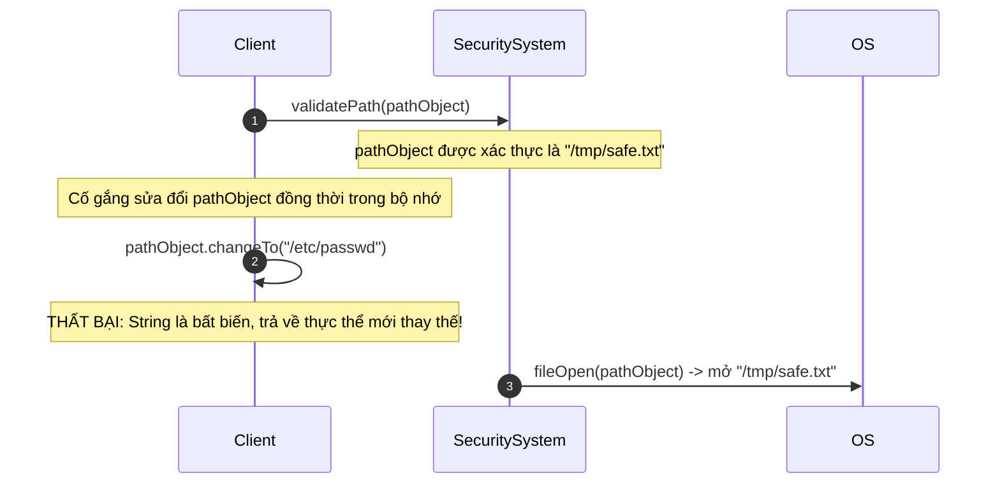
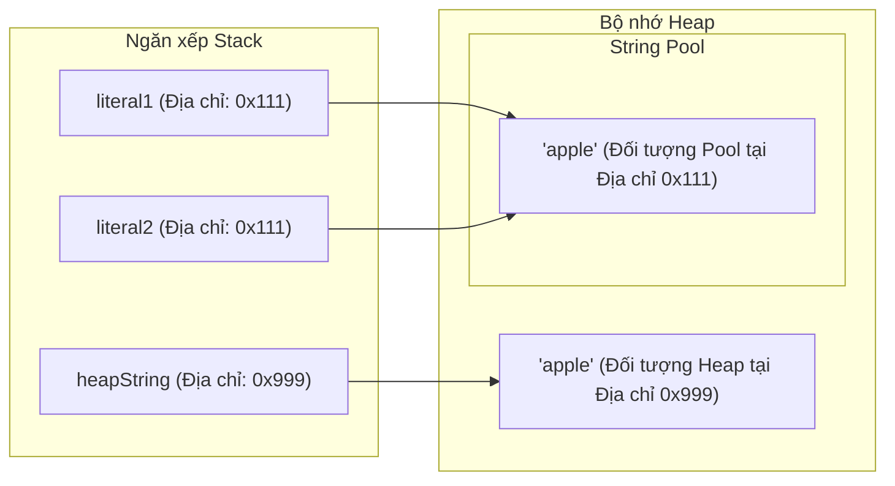

# Cơ Bản Về Chuỗi (String Basics)

Lớp `java.lang.String` đại diện cho các chuỗi ký tự. Trong Java, các chuỗi được đối xử như các đối tượng tham chiếu (reference objects), nhưng chúng nhận được sự hỗ trợ đặc biệt từ trình biên dịch và các cơ chế tối ưu hóa bộ nhớ.

---

## Biểu Diễn Nội Bộ (Chuỗi Nén - Compact Strings)

Lịch sử trước đây, trong phiên bản Java 8 trở về trước, các chuỗi được lưu trữ nội bộ dưới dạng một mảng ký tự (`char[]`), phân bổ 2 bytes bộ nhớ cho mỗi ký tự bằng cách sử dụng mã hóa UTF-16.

Bắt đầu từ phiên bản Java 9, JVM triển khai cơ chế **Chuỗi nén (Compact Strings)**:
- Các chuỗi được lưu trữ nội bộ dưới dạng một mảng byte (`byte[]`).
- Một trường `coder` chiếm 1 byte được thêm vào để theo dõi kiểu mã hóa được sử dụng:
  - `LATIN1` (giá trị coder là `0`): Dùng cho các ký tự có thể biểu diễn trong 1 byte (ISO-8859-1). Tiết kiệm đến 50% bộ nhớ.
  - `UTF16` (giá trị coder là `1`): Dùng cho các ký tự yêu cầu 2 bytes (chẳng hạn như tiếng Trung, tiếng Nhật, tiếng Hàn hoặc các emoji).
- Quá trình chuyển đổi này hoàn toàn tự động và không ảnh hưởng đến hành vi của các API công khai.

---

## Tính Bất Biến Của Chuỗi (Immutability of String)

Trong Java, các đối tượng `String` là **bất biến (immutable)**. Một khi một đối tượng chuỗi đã được khởi tạo trên heap, chuỗi byte ký tự nội bộ của nó không thể bị sửa đổi. Bất kỳ thao tác nào có vẻ như làm thay đổi chuỗi thực chất đều khởi tạo một đối tượng chuỗi mới hoàn toàn.

### Ví Dụ Code Về Tính Bất Biến (Immutability Code Example)

Dưới đây là một ví dụ cụ thể chứng minh rằng các thao tác trên một `String` không hề sửa đổi đối tượng ban đầu:

```java
String original = "Java";
String result = original.concat(" Core");

System.out.println("Original String: " + original); // Kết quả: Java (vẫn giữ nguyên)
System.out.println("Result String:   " + result);   // Kết quả: Java Core (đối tượng String mới)

// Việc gán lại chính biến tham chiếu chỉ làm thay đổi nơi con trỏ trỏ tới,
// hoàn toàn không thay đổi đối tượng nằm dưới trong bộ nhớ.
String s = "Hello";
s = s + " World"; // s bây giờ trỏ tới một đối tượng String mới "Hello World"
```

### Tại Sao Chuỗi Lại Bất Biến?

1. **Bảo Mật & Tải Lớp (Security & Class Loading):**
   - Các chuỗi được sử dụng để lưu trữ tên lớp được tải bởi các ClassLoader, thông tin đăng nhập cơ sở dữ liệu, địa chỉ socket và đường dẫn tệp tin. Nếu chuỗi có thể thay đổi, một hacker có thể vượt qua bước kiểm tra xác thực đường dẫn (ví dụ: `"/tmp/file.txt"`) rồi sửa đổi nội dung chuỗi thành `"/etc/passwd"` trong quá trình thực thi.
   - Tính bảo mật của cơ chế ClassLoading dựa vào việc các chuỗi được giữ nguyên không đổi để đảm bảo các lớp chính xác được tải lên.
2. **Bộ Nhớ Đệm Hằng Chuỗi (String Constant Pool):**
   - Vì chuỗi là bất biến, JVM có thể cho phép nhiều biến cùng trỏ tới chung một hằng chuỗi duy nhất, tiết kiệm một lượng lớn dung lượng bộ nhớ.
3. **An Toàn Đa Luồng (Thread Safety):**
   - Các đối tượng bất biến tự động an toàn luồng. Chúng có thể được chia sẻ giữa các luồng mà không cần các cơ chế đồng bộ hóa, ngăn ngừa lỗi sai lệch dữ liệu hoặc tranh chấp tài nguyên (race conditions).
4. **Lưu Trữ Đệm Mã Băm (Caching Hashcode):**
   - Giá trị băm (hash value) của một String được tính toán một lần duy nhất và lưu đệm (cache) bên trong trường private `hash` của nó. Điều này giúp thao tác tìm kiếm cực kỳ nhanh khi sử dụng chuỗi làm các key trong các bộ sưu tập dạng băm như `HashMap` và `HashSet`.

### Đi Sâu: Cơ Chế Và Tính Bảo Mật Của Tính Bất Biến (Deep-Dive: The Mechanics and Security of Immutability)

Tính bất biến của chuỗi không chỉ đơn thuần là một tính năng ngôn ngữ mà còn là một đảm bảo cốt lõi về bảo mật và hiệu năng trong Java. Các thao tác nhạy cảm về bảo mật, chẳng hạn như kết nối cơ sở dữ liệu, cấu hình socket mạng và các thao tác hệ thống tệp tin, phụ thuộc rất lớn vào việc các tham chiếu `String` không bị thay đổi sau các bước kiểm tra xác thực. Nếu chuỗi có thể thay đổi, một luồng chạy ngầm độc hại có thể sửa đổi một đường dẫn đã được xác thực giữa thời điểm kiểm tra và thời điểm truy cập tệp thực tế (lỗ hổng kiểm tra trước sử dụng sau - Time-of-Check to Time-of-Use). Hơn nữa, vì chuỗi bất biến nên chúng vốn dĩ an toàn luồng và có thể được chia sẻ tự do giữa nhiều luồng mà không cần đồng bộ hóa quyền truy cập, loại bỏ chi phí khóa (lock). Cuối cùng, tính bất biến cho phép JVM triển khai String Pool một cách an toàn, lưu trữ đệm các hằng chuỗi để ngăn chặn việc cấp phát heap dư thừa và lưu trữ đệm mã băm của chúng giúp các thao tác trên hash-map diễn ra nhanh chóng.

#### Mô Hình Chuỗi Bảo Mật Của Tính Bất Biến (Immutability Security Sequence Model)



#### Ví Dụ Code Về Tính Bất Biến Và Lưu Trữ Đệm Mã Băm (Immutability and HashCode Caching Code Example)

```java
// Ví dụ lưu trữ đệm mã băm (Caching Hashcode)
String s1 = "HelloJava";
int initialHash = s1.hashCode(); // Được tính toán một lần và lưu đệm trong trường private 'hash'
System.out.println(initialHash); // Kết quả: 1411516244

// Sửa đổi chuỗi trả về một đối tượng mới với mã băm khác
String s2 = s1.concat("!"); 
System.out.println(s2);          // Kết quả: HelloJava!
System.out.println(s2.hashCode()); // Kết quả: 887467645 (tính toán mới cho đối tượng mới)
```

#### Chuỗi Nguyên Nhân - Kết Quả Của Lưu Trữ Mã Băm

```text
Chuỗi được khai báo là bất biến
  → Dữ liệu nội bộ `byte[]` được đánh dấu `final` và không thể sửa đổi
  → JVM tính toán và lưu đệm giá trị băm ngay trong lần gọi đầu tiên đến `hashCode()`
  → Các bước tra cứu key tiếp theo trong các bộ sưu tập như `HashMap` lấy ra mã băm được lưu đệm ngay lập tức
  → Tránh phép so sánh ký tự độ phức tạp $O(n)$, mang lại hiệu năng truy cập $O(1)$.
```


---

## Vùng Chứa Hằng Chuỗi (String Constant Pool)

**Vùng chứa hằng chuỗi (String Constant Pool / String Pool)** là một vùng bộ nhớ đặc biệt nằm bên trong Java Heap. Nó được triển khai như một bảng băm (hashtable) nội bộ có kích thước cố định (với các xô chứa các tham chiếu đến các đối tượng String).

### Đi Sâu: Tối Ưu Hóa Bộ Nhớ Và Cơ Chế Heap Của String Pool (Deep-Dive: Memory Optimization and Heap Mechanics of the String Pool)

JVM String Pool là một cấu trúc bộ nhớ chuyên dụng bên trong Heap đóng vai trò như một bộ lưu trữ đệm cho các hằng chuỗi. Khi một hằng chuỗi được định nghĩa trong mã nguồn, JVM sẽ thực hiện một phép tra cứu trong String Pool để kiểm tra xem một chuỗi ký tự tương tự đã tồn tại hay chưa. Nếu tìm thấy, JVM trả về tham chiếu hiện có, trỏ cả hai biến tới cùng một vị trí bộ nhớ để tránh việc cấp phát trùng lặp. Tuy nhiên, việc sử dụng hàm khởi tạo `new String("hello")` một cách rõ ràng sẽ bỏ qua cơ chế tối ưu hóa này, bắt buộc JVM phải cấp phát một đối tượng `String` mới trong không gian heap thông thường, ngay cả khi hằng chuỗi đó đã tồn tại trong pool. Điều này dẫn đến việc tồn tại hai đối tượng riêng biệt đại diện cho cùng một giá trị, gây lãng phí bộ nhớ không đáng có và làm tăng gánh nặng dọn dẹp cho bộ thu gom rác (Garbage collection) (garbage collector).

#### Mô Hình Chia Sẻ Tham Chiếu String Pool (String Pool Reference Sharing Model)


#### Chuỗi Nguyên Nhân - Kết Quả Của Việc Cấp Phát Hằng Chuỗi

```text
JVM bắt gặp hằng chuỗi `"Java"`
  → Tìm kiếm trong String Pool
  → Không tìm thấy hằng chuỗi
  → Cấp phát đối tượng `String` mới trong String Pool
  → Trả về tham chiếu pool
  → Các phép gán tiếp theo cho cùng hằng chuỗi đó sẽ tái sử dụng trực tiếp tham chiếu này
  → Ngăn chặn việc cấp phát heap dư thừa.
```


#### Chuỗi Nguyên Nhân - Kết Quả Của Việc Cấp Phát `new String("Java")`

```text
JVM bắt gặp hàm khởi dựng `new String("Java")`
  → Cấp phát một khối bộ nhớ riêng biệt trên Heap thông thường
  → Tạo đối tượng `String` mới trỏ đến mảng char/byte nằm dưới
  → Trả về địa chỉ heap (khác địa chỉ Pool)
  → Bỏ qua cơ chế khử trùng lặp của pool
  → Làm tăng tần suất dọn rác của GC.
```


### Ví Dụ Code Về String Pool

Đoạn code sau chứng minh cách các hằng chuỗi chia sẻ các tham chiếu trong pool trong khi từ khóa `new` bỏ qua cơ chế này:

```java
// Khai báo hằng chuỗi được tra cứu trong pool. "Java" được tạo ra trong pool.
String s1 = "Java"; 
// "Java" đã tồn tại trong pool, vì vậy s2 trỏ đến cùng đối tượng đó.
String s2 = "Java"; 

// Sử dụng 'new' bắt buộc tạo ra một đối tượng mới trên heap.
String s3 = new String("Java"); 

System.out.println(s1 == s2); // true (cùng tham chiếu trong pool)
System.out.println(s1 == s3); // false (s3 trỏ đến đối tượng heap bên ngoài pool)

// Nội dịch (interning) s3 trả về tham chiếu từ pool
String s4 = s3.intern();
System.out.println(s1 == s4); // true (cả hai cùng trỏ đến tham chiếu trong pool)
```

1. **Hằng Chuỗi (`String s = "Hello";`):**
   - Trình biên dịch tìm kiếm chuỗi `"Hello"` trong String Pool.
   - Nếu tìm thấy, nó trả về tham chiếu đến đối tượng pool hiện tại.
   - Nếu không tìm thấy, một đối tượng String mới được tạo ra *bên trong* String Pool, và tham chiếu của nó được trả về.

2. **Khởi Tạo Tường Minh (`String s = new String("Hello");`):**
   - Biểu thức này sẽ tạo ra **hai** đối tượng nếu hằng chuỗi chưa tồn tại sẵn trong pool:
     1. Một hằng chuỗi `"Hello"` bên trong String Pool (nếu nó chưa tồn tại).
     2. Một đối tượng String thông thường trong vùng nhớ Heap chính.
   - Biến tham chiếu `s` trỏ đến đối tượng trong vùng Heap chính, không trỏ đến String Pool.


### Nội Dịch Thủ Công Bằng `.intern()` (Manual Interning with .intern())
Việc gọi phương thức `.intern()` trên một chuỗi sẽ trả về đại diện chuẩn tắc (canonical representation) của nó từ String Pool:
- Nếu pool đã chứa một chuỗi bằng với đối tượng `String` này, tham chiếu pool được trả về.
- Nếu chưa có, đối tượng chuỗi này sẽ được thêm vào pool, và tham chiếu của nó được trả về.

```java
String s1 = new String("Hello");
String s2 = s1.intern(); // s2 trỏ đến đối tượng pool
String s3 = "Hello";

System.out.println(s1 == s3); // false (Heap so với Pool)
System.out.println(s2 == s3); // true (Cả hai cùng trỏ đến Pool)
```
*Lưu ý:* Kích thước bảng băm của String Pool có thể được điều chỉnh bằng cách sử dụng tham số JVM `-XX:StringTableSize=N`.

---

## So Sánh Chuỗi (String Comparisons)

Bởi vì chuỗi có thể tồn tại trong pool hoặc vùng heap thông thường, bạn bắt buộc phải chọn chính xác toán tử hoặc phương thức so sánh.

### Đi Sâu: So Sánh Tham Chiếu (==) so với So Sánh Bằng Nội Dung (.equals()) (Reference Comparison (==) vs. Content Equality (.equals()))

Trong Java, toán tử `==` thực hiện so sánh tham chiếu, nghĩa là nó kiểm tra xem hai biến tham chiếu có trỏ đến chính xác cùng một địa chỉ bộ nhớ hay không. Do JVM tối ưu hóa việc cấp phát hằng chuỗi thông qua String Pool, hai hằng chuỗi giống hệt nhau sẽ chia sẻ chung một địa chỉ bộ nhớ đơn nhất, khiến cho phép toán `==` ngẫu nhiên trả về kết quả `true`. Tuy nhiên, các chuỗi được xây dựng động (chẳng hạn như từ dữ liệu nhập của người dùng, truy vấn cơ sở dữ liệu hoặc gọi hàm khởi tạo `new String()`) được cấp phát tại các địa chỉ mới, riêng biệt trong vùng heap thông thường. Để so sánh chuỗi ký tự thực tế thay vì so sánh địa chỉ bộ nhớ, lớp `String` ghi đè (override) phương thức `Object.equals(Object)` để kiểm tra các mảng ký tự nội bộ theo từng ký tự một. Do đó, việc so sánh nội dung chuỗi nên luôn luôn sử dụng phương thức `.equals()` để đảm bảo tính chính xác bất kể chuỗi đó nằm trong pool hay trên heap.

#### Mô Hình So Sánh Tham Chiếu Bộ Nhớ (Memory Reference Comparison Model)



#### Ví Dụ Code So Sánh Tham Chiếu so với Nội Dung
```java
String literal1 = "apple";
String literal2 = "apple";
String heapString = new String("apple");

System.out.println(literal1 == literal2);      // Kết quả: true (cùng địa chỉ pool 0x111)
System.out.println(literal1 == heapString);     // Kết quả: false (địa chỉ pool 0x111 so với địa chỉ heap 0x999)
System.out.println(literal1.equals(heapString)); // Kết quả: true (so sánh nội dung trùng khớp)
```

#### Chuỗi Nguyên Nhân - Kết Quả Của Các Toán Tử So Sánh

```text
So sánh chuỗi được cấp phát trên heap bằng `==`
  → JVM so sánh các tham chiếu (0x111 so với 0x999)
  → Các địa chỉ tham chiếu khác nhau
  → Trả về kết quả `false` (nhận định sai về mặt nội dung)
  → So sánh bằng `.equals()`
  → Kiểm tra bằng nhau về tham chiếu (thất bại)
  → Kiểm tra tuần tự từng ký tự
  → Phát hiện nội dung giống hệt nhau
  → Trả về kết quả `true`.
```


### 1. So Sánh Tham Chiếu (`==`)
So sánh các địa chỉ bộ nhớ heap. Chỉ trả về `true` nếu cả hai biến cùng trỏ đến chính xác một vị trí bộ nhớ duy nhất.
```java
String a = "test";
String b = new String("test");
System.out.println(a == b); // false (Địa chỉ Pool so với Địa chỉ Heap)
```

### 2. So Sánh Bằng Nội Dung (`.equals()`)
So sánh chuỗi ký tự thực tế. Được ghi đè trong lớp `String` để thực hiện kiểm tra từng phần tử ký tự.
```java
System.out.println(a.equals(b)); // true
```

### 3. So Sánh Không Phân Biệt Chữ Hoa Chữ Thường (`.equalsIgnoreCase()`)
So sánh các chuỗi ký tự đồng thời bỏ qua sự khác biệt giữa chữ hoa và chữ thường.
```java
System.out.println("TEST".equalsIgnoreCase("test")); // true
```

### 4. So Sánh Theo Thứ Tự Từ Điển (`.compareTo()`) (Lexicographical Comparison (.compareTo()))
So sánh các chuỗi theo thứ tự bảng chữ cái dựa trên các giá trị ký tự Unicode. Kết quả trả về là:
- `0` nếu hai chuỗi bằng nhau.
- Một **số nguyên âm** nếu chuỗi hiện tại đứng trước chuỗi đối số theo thứ tự bảng chữ cái.
- Một **số nguyên dương** nếu chuỗi hiện tại đứng sau chuỗi đối số theo thứ tự bảng chữ cái.

```java
System.out.println("apple".compareTo("banana")); // Trả về số âm (apple < banana)
System.out.println("banana".compareTo("apple")); // Trả về số dương (banana > apple)
```
Sử dụng phương thức `.compareToIgnoreCase()` để thực hiện so sánh theo thứ tự từ điển đồng thời bỏ qua sự khác biệt chữ hoa chữ thường.

---

## Các Lỗi Thường Gặp (Common Mistakes)

### 1. So sánh nội dung chuỗi bằng toán tử `==`
Sử dụng toán tử `==` so sánh các tham chiếu đối tượng (địa chỉ bộ nhớ), không so sánh nội dung. Điều này đôi khi hoạt động đúng một cách ngẫu nhiên khi so sánh các hằng chuỗi nhờ vào cơ chế String Pool, nhưng sẽ lỗi đối với các chuỗi được tạo dựng lúc runtime hoặc qua từ khóa `new`.

```java
String s1 = "hello";
String s2 = new String("hello");
System.out.println(s1 == s2);      // false (Cách so sánh nội dung SAI)
System.out.println(s1.equals(s2)); // true  (Cách so sánh nội dung ĐÚNG)
```

### 2. Bỏ qua tính bất biến của Chuỗi
Giả định một phương thức sửa đổi chuỗi sẽ thay đổi trực tiếp chuỗi đó tại chỗ.
```java
String s = "  Java  ";
s.trim(); // Kết quả sau khi trim bị vứt bỏ!
System.out.println("[" + s + "]"); // Kết quả in ra: [  Java  ]

// Cách làm đúng:
s = s.trim();
System.out.println("[" + s + "]"); // Kết quả in ra: [Java]
```

### 3. Sử dụng `new String()` không cần thiết
Viết code dạng `String s = new String("abc");` thay vì `String s = "abc";`. Cách viết trước tạo ra thêm một đối tượng dư thừa không đáng có trên heap. Trừ khi có yêu cầu đặc biệt, hãy luôn luôn sử dụng các hằng chuỗi trực tiếp.

---

## Liên Kết Tham Khảo (Reference Links)

- https://docs.oracle.com/javase/specs/jls/se21/html/jls-3.html#jls-3.10.5 (Đặc tả Ngôn ngữ Java: Hằng chuỗi)
- https://docs.oracle.com/en/java/javase/21/docs/api/java.base/java/lang/String.html#intern() (Tài liệu Oracle Java API: String.intern())
- https://docs.oracle.com/en/java/javase/21/docs/api/java.base/java/lang/String.html (Tài liệu Oracle Java API: Tham chiếu Lớp String)
