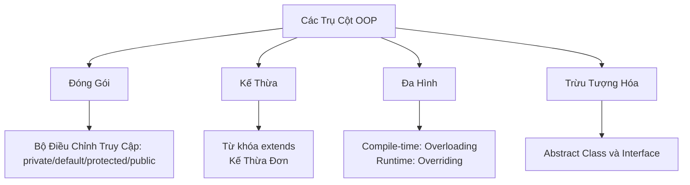

# 09 - Lập Trình Hướng Đối Tượng (Object-Oriented Programming - OOP)

## Những Gì Bạn Cần Học

- Định nghĩa và mối quan hệ giữa lớp (class), đối tượng (object), trường (field), phương thức (method) và hàm khởi tạo (constructor).
- Ý nghĩa và ứng dụng của tham chiếu `this` và đối tượng ẩn danh (anonymous object).
- Bốn trụ cột cốt lõi của Lập Trình Hướng Đối Tượng (OOP):
  1. **Đóng gói (Encapsulation):** Bộ điều chỉnh truy cập (access modifier), getter/setter, và ẩn dữ liệu (data hiding).
  2. **Kế thừa (Inheritance):** Lớp cha/lớp con (super/subclass), hệ thống phân cấp kiểu, hàm khởi tạo trong kế thừa, từ khóa `super`, và ghi đè phương thức (method overriding).
  3. **Đa hình (Polymorphism):** Nạp chồng phương thức (method overloading) và ghi đè phương thức (method overriding), ép kiểu lên/xuống (upcasting/downcasting), phân phối phương thức động (dynamic method dispatch), và toán tử `instanceof`.
  4. **Trừu tượng hóa (Abstraction):** Lớp trừu tượng (abstract class), phương thức trừu tượng (abstract method), và interface (bao gồm default, static và private interface method).

## Thứ Tự Học

1. [Lớp và Đối Tượng (Classes and Objects)](theory/01-classes-objects.md)
2. [Đóng Gói (Encapsulation)](theory/02-encapsulation.md)
3. [Kế Thừa (Inheritance)](theory/03-inheritance.md)
4. [Đa Hình (Polymorphism)](theory/04-polymorphism.md)
5. [Trừu Tượng Hóa (Abstraction)](theory/05-abstraction.md)

## Ghi Chú Thuật Ngữ

- [Thuật Ngữ OOP](terms/01-oop-terms.md)

## Tổng Quan Mermaid

## Tự Kiểm Tra

Trước khi chuyển sang chủ đề tiếp theo, hãy xác nhận rằng bạn có thể trả lời các câu hỏi sau:
1. Tại sao biến instance nên được khai báo `private`, và sự khác biệt giữa kiểm tra của trình biên dịch ngôn ngữ và kiểm tra của JVM đối với truy cập trường là gì?
   &rarr; Xem [Tại Sao Biến Instance Nên Là Private](theory/02-encapsulation.md#why-instance-variables-should-be-private)
2. Tại sao Java không hỗ trợ đa kế thừa lớp, và cơ chế interface giải quyết bài toán hình thoi (diamond problem) như thế nào?
   &rarr; Xem [Tại Sao Java Dùng Interface Thay Vì Đa Kế Thừa Lớp](theory/05-abstraction.md#why-java-uses-interfaces-instead-of-multiple-class-inheritance)
3. Tại sao ghi đè phương thức lại được giải quyết tại runtime (phân phối động) thay vì compile time?
   &rarr; Xem [Tại Sao Ghi Đè Phương Thức Dùng Phân Phối Động Runtime](theory/04-polymorphism.md#why-method-overriding-uses-runtime-dynamic-dispatch)
4. Tại sao `super()` phải là câu lệnh đầu tiên trong hàm khởi tạo của lớp con, và chuỗi hàm khởi tạo nào nó kích hoạt?
   &rarr; Xem [Tại Sao super() Phải Là Câu Lệnh Đầu Tiên](theory/03-inheritance.md#why-super-must-be-the-first-statement-in-a-subclass-constructor)
5. Khi nào nên chọn lớp trừu tượng thay vì interface, và quy tắc thiết kế là gì?
   &rarr; Xem [Tại Sao Lớp Trừu Tượng và Interface Phục Vụ Mục Đích Thiết Kế Khác Nhau](theory/05-abstraction.md#why-abstract-classes-and-interfaces-serve-different-design-purposes)

## Thẻ Anki

- [Basic](anki/basic.tsv)
- [Basic Extra](anki/basic-extra.tsv)
- [Cloze](anki/cloze.tsv)
- [Code Question](anki/code-question.tsv)

## Liên Kết Tham Khảo

- Oracle Java Tutorials - OOP concepts: https://docs.oracle.com/javase/tutorial/java/concepts/
- Oracle Java Tutorials - Classes and Objects: https://docs.oracle.com/javase/tutorial/java/javaOO/index.html
- Oracle Java Tutorials - Inheritance: https://docs.oracle.com/javase/tutorial/java/IandI/subclasses.html
- Oracle Java Tutorials - Polymorphism: https://docs.oracle.com/javase/tutorial/java/IandI/polymorphism.html
- Oracle Java Tutorials - Interfaces: https://docs.oracle.com/javase/tutorial/java/IandI/createinterface.html
- Oracle Java Tutorials - Abstract methods and classes: https://docs.oracle.com/javase/tutorial/java/IandI/abstract.html
- Dev.java - Objects, Classes, Interfaces, Packages, and Inheritance: https://dev.java/learn/oop/
