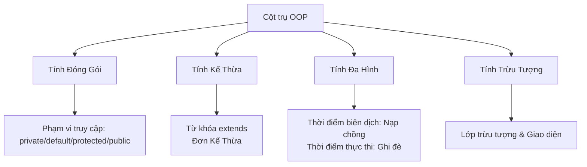

# 09 - Lập Trình Hướng Đối Tượng (OOP)

## Những Gì Bạn Cần Học (What You Should Learn)

- Các định nghĩa và mối quan hệ của lớp (class), đối tượng (object), trường dữ liệu (field), phương thức (method) và hàm khởi tạo (constructor).
- Ý nghĩa và ứng dụng của tham chiếu `this` và đối tượng vô danh (anonymous object).
- Bốn cột trụ cốt lõi của Lập trình hướng đối tượng (OOP - Object-Oriented Programming):
  1. **Tính Đóng Gói (Encapsulation):** Công cụ sửa đổi quyền truy cập (access modifier), các phương thức getter/setter và che giấu dữ liệu (data hiding).
  2. **Tính Kế Thừa (Inheritance):** Lớp cha/lớp con (superclass/subclass), hệ thống phân cấp kiểu lớp (class type hierarchy), hàm khởi tạo trong kế thừa, từ khóa `super` và ghi đè phương thức (method overriding).
  3. **Tính Đa Hình (Polymorphism):** So sánh nạp chồng phương thức (method overloading) và ghi đè phương thức (method overriding), ép kiểu lên/ép kiểu xuống (upcasting/downcasting), phân phát phương thức động (dynamic method dispatch) và toán tử `instanceof`.
  4. **Tính Trừu Tượng (Abstraction):** Lớp trừu tượng (abstract class), phương thức trừu tượng (abstract method) và giao diện (interface) (bao gồm các phương thức default, static và private trong giao diện).

## Lộ Trình Học Tập (Study Order)

1. [Lớp và Đối Tượng](theory/01-classes-objects.md)
2. [Tính Đóng Gói](theory/02-encapsulation.md)
3. [Tính Kế Thừa](theory/03-inheritance.md)
4. [Tính Đa Hình](theory/04-polymorphism.md)
5. [Tính Trừu Tượng](theory/05-abstraction.md)

## Thuật Ngữ Ghi Nhớ (Term Notes)

- [Thuật Ngữ OOP](terms/01-oop-terms.md)

## Sơ Đồ Tổng Quan Mermaid (Mermaid Overview)

## Tự Kiểm Tra (Self-Check)

Trước khi chuyển sang chủ đề tiếp theo, hãy đảm bảo bạn có thể trả lời các câu hỏi sau:
1. Tại sao các biến thực thể nên được khai báo là `private`, và sự khác biệt giữa việc thực thi giới hạn truy cập trường ở cấp độ ngôn ngữ so với cấp độ JVM là gì?
   &rarr; Xem [Tại Sao Biến Thực Thể Nên Khai Báo private](theory/02-encapsulation.md#why-instance-variables-should-be-private)
2. Tại sao Java không hỗ trợ đa kế thừa lớp, và cơ chế giao diện giải quyết bài toán kim cương (diamond problem) như thế nào?
   &rarr; Xem [Tại Sao Java Sử Dụng Giao Diện Thay Vì Đa Kế Thừa Lớp](theory/05-abstraction.md#why-java-uses-interfaces-instead-of-multiple-class-inheritance)
3. Tại sao việc ghi đè phương thức lại được phân giải tại thời điểm thực thi (phân phát động) thay vì thời điểm biên dịch?
   &rarr; Xem [Tại Sao Ghi Đè Phương Thức Sử Dụng Phân Phát Động Lúc Runtime](theory/04-polymorphism.md#why-method-overriding-uses-runtime-dynamic-dispatch)
4. Tại sao câu lệnh `super()` bắt buộc phải là câu lệnh đầu tiên trong hàm khởi tạo của lớp con, và nó kích hoạt chuỗi hàm khởi tạo nào?
   &rarr; Xem [Tại Sao super() Phải Là Câu Lệnh Đầu Tiên](theory/03-inheritance.md#why-super-must-be-the-first-statement-in-a-subclass-constructor)
5. Khi nào bạn nên chọn lớp trừu tượng thay vì giao diện, và quy tắc thiết kế ở đây là gì?
   &rarr; Xem [Tại Sao Lớp Trừu Tượng Và Giao Diện Phục Vụ Các Mục Đích Thiết Kế Khác Nhau](theory/05-abstraction.md#why-abstract-classes-and-interfaces-serve-different-design-purposes)

## Thẻ Anki (Anki Cards)

- [Cơ Bản](anki/basic.tsv)
- [Cơ Bản Bổ Sung](anki/basic-extra.tsv)
- [Điền Khuyết](anki/cloze.tsv)
- [Câu Hỏi Viết Code](anki/code-question.tsv)

## Liên Kết Tham Khảo (Reference Links)

- Hướng dẫn Java của Oracle - Các khái niệm OOP: https://docs.oracle.com/javase/tutorial/java/concepts/
- Hướng dẫn Java của Oracle - Lớp và Đối tượng: https://docs.oracle.com/javase/tutorial/java/javaOO/index.html
- Hướng dẫn Java của Oracle - Kế thừa: https://docs.oracle.com/javase/tutorial/java/IandI/subclasses.html
- Hướng dẫn Java của Oracle - Đa hình: https://docs.oracle.com/javase/tutorial/java/IandI/polymorphism.html
- Hướng dẫn Java của Oracle - Giao diện: https://docs.oracle.com/javase/tutorial/java/IandI/createinterface.html
- Hướng dẫn Java của Oracle - Các phương thức và lớp trừu tượng: https://docs.oracle.com/javase/tutorial/java/IandI/abstract.html
- Dev.java - Đối tượng, Lớp, Giao diện, Gói và Kế thừa: https://dev.java/learn/oop/
