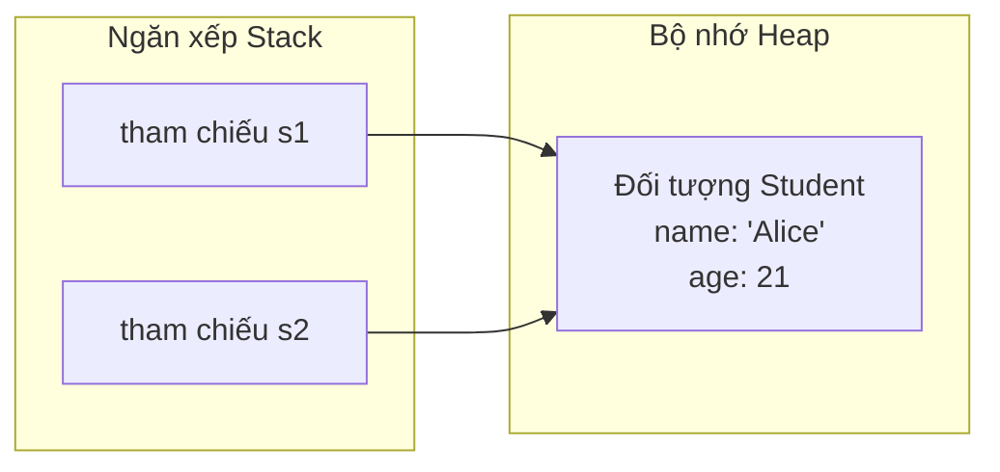

# Lớp Và Đối Tượng (Classes and Objects)

Lập trình hướng đối tượng (Object-Oriented Programming - OOP) là một mô hình lập trình tập trung xoay quanh các "đối tượng (objects)" — các cấu trúc dữ liệu chứa các trạng thái (các trường dữ liệu - fields) và các hành vi (các phương thức - methods) — thay vì tập trung vào các hành động và logic tuyến tính.

---

## Lớp so với Đối tượng (Class vs. Object)

- **Lớp (Class):** Một khuôn mẫu (blueprint) hoặc thiết kế định nghĩa cấu trúc và hành vi của một loại đối tượng. Đây là một thực thể logic ở thời điểm biên dịch (compile-time). Khi được biên dịch, định nghĩa lớp sẽ được tải vào vùng nhớ **Metaspace** (phần bộ nhớ JVM dành cho siêu dữ liệu của lớp).
- **Đối tượng (Object):** Một thực thể (instance) cụ thể của một lớp. Nó là một thực thể vật lý ở thời điểm chạy chương trình (runtime) chiếm giữ không gian bộ nhớ trên **Heap** và có trạng thái cũng như hành vi cụ thể.

---

## Trường Dữ Liệu Và Phương Thức (Fields and Methods)

- **Trường dữ liệu (Fields / Biến thực thể - Instance Variables / Thuộc tính - Attributes):** Các biến được khai báo bên trong một lớp nhưng nằm ngoài tất cả các phương thức. Chúng đại diện cho trạng thái của từng đối tượng riêng biệt. Mỗi đối tượng sẽ sở hữu một bản sao biến thực thể của riêng nó.
- **Phương thức (Methods):** Các khối mã nguồn thực hiện các thao tác. Chúng đại diện cho các hành động hoặc hành vi mà một đối tượng có thể thực thi.

---

## Constructor Và Phương Thức `<init>` (Constructors and the `<init>` Method)

Một **Constructor** (hàm khởi dựng) là một khối mã nguồn được gọi trong quá trình khởi tạo đối tượng bằng cách sử dụng từ khóa `new`. Vai trò chính của nó là khởi tạo giá trị cho các trường dữ liệu của đối tượng.

### Các Quy Tắc Của Constructor:
1. Tên của constructor bắt buộc phải trùng khớp hoàn toàn với tên lớp.
2. Constructor không được khai báo kiểu trả về (ngay cả kiểu `void`).
3. Constructor không thể đi kèm các bổ từ `static`, `final`, `abstract`, hoặc `synchronized`.

### Cơ Chế Của Trình Biên Dịch:
Ở cơ chế bên dưới, trình biên dịch Java biên dịch các constructor thành một phương thức bytecode đặc biệt có tên là **`<init>`** (phương thức khởi tạo thực thể).

### Các Loại Constructor:
1. **Constructor Mặc Định (Default Constructor):** Nếu bạn không định nghĩa bất kỳ constructor nào trong lớp, trình biên dịch sẽ tự động chèn vào một constructor công khai không có đối số (no-argument constructor):
   ```java
   public ClassName() {
       super(); // Gọi tới constructor mặc định của lớp cha
   }
   ```
   Nếu bạn định nghĩa *bất kỳ* constructor nào có tham số, trình biên dịch **sẽ không** tự động tạo ra constructor mặc định không đối số nữa.
2. **Constructor Có Tham Số (Parameterized Constructor):** Nhận các đối số truyền vào để khởi tạo các trường thực thể với các giá trị tùy biến.
3. **Nạp Chồng Constructor (Constructor Overloading):** Định nghĩa nhiều constructor với các chữ ký tham số khác nhau (khác nhau về số lượng, kiểu dữ liệu hoặc thứ tự tham số) bên trong cùng một lớp.
4. **Constructor Sao Chép (Copy Constructor):** Tạo ra một đối tượng mới sử dụng một thực thể đã tồn tại của cùng lớp đó. Nó thực hiện sao chép các trường của đối tượng nguồn vào thực thể mới, cho phép sao chép nông/sâu một cách an toàn.

```java
class Student {
    String name;
    int age;

    // Constructor không đối số
    Student() {
        this("Unknown", 18); // Chuỗi Constructor (Constructor Chaining)
    }

    // Constructor có tham số
    Student(String name, int age) {
        this.name = name;
        this.age = age;
    }

    // Constructor sao chép
    Student(Student other) {
        this.name = other.name;
        this.age = other.age;
    }
}
```

---

## Chuỗi Constructor Và Từ Khóa `this` (Constructor Chaining and the `this` Keyword)

**Chuỗi Constructor (Constructor Chaining)** là quá trình gọi một constructor này từ một constructor khác bên trong cùng một lớp hoặc từ một lớp cha.

### Các Quy Tắc Cho Lệnh Gọi `this()`:
- Để gọi một constructor khác trong cùng một lớp, hãy sử dụng cú pháp `this(các_đối_số)`.
- Lời gọi `this()` (hoặc `super()`) bắt buộc phải là **câu lệnh đầu tiên** trong thân của constructor.
- Bạn không được phép thực hiện các lời gọi constructor đệ quy (Constructor A gọi Constructor B, và B lại gọi ngược lại A); điều này sẽ dẫn đến lỗi biên dịch.

---

## Tham Chiếu Đối Tượng Trong Bộ Nhớ (Stack so với Heap) (Object References in Memory (Stack vs. Heap))

Khi bạn khởi tạo một đối tượng, bộ nhớ sẽ được phân chia giữa Stack và Heap:

```java
Student s1 = new Student("Alice", 20);
```

1. **Bộ nhớ Stack:** Cấp phát một biến tham chiếu `s1`. Giá trị được lưu trữ trong `s1` chính là **địa chỉ bộ nhớ (con trỏ)** của đối tượng thực tế nằm trên Heap.
2. **Bộ nhớ Heap:** Cấp phát không gian bộ nhớ liên tục để lưu trữ dữ liệu đối tượng `Student` thực tế (chuỗi `"Alice"`, số nguyên `20`, và các header siêu dữ liệu của lớp).
3. **Gán Lại Tham Chiếu:**
   ```java
   Student s2 = s1; // s2 sao chép giá trị tham chiếu. Cả hai cùng trỏ tới chung một Student trên Heap.
   s2.age = 21;     // Sửa đổi qua s2 sẽ làm thay đổi trạng thái của đối tượng mà s1 đang trỏ tới.
   ```



---

## Truyền Đối Tượng Vào Phương Thức (Passing Objects to Methods)

Java sử dụng cơ chế **truyền tham trị (pass-by-value)** cho mọi đối số. Khi bạn truyền một đối tượng vào phương thức, bạn thực chất đang truyền vào **bản sao của biến tham chiếu (địa chỉ bộ nhớ)** của đối tượng đó:
- Nếu phương thức thực hiện sửa đổi một trường dữ liệu của đối tượng, bên gọi **sẽ nhìn thấy** sự thay đổi đó vì cả hai biến tham chiếu đều đang trỏ tới cùng một đối tượng trên heap.
- Nếu phương thức thực hiện gán lại tham số tham chiếu sang một đối tượng mới, biến tham chiếu của bên gọi **sẽ không** bị thay đổi.

```java
void updateStudent(Student s) {
    s.age = 22; // Bên gọi nhìn thấy thay đổi này
    s = new Student("Bob", 25); // Gán lại tham chiếu. Bên gọi KHÔNG nhìn thấy thay đổi này
}
```

---

## Đối Tượng Ẩn Danh (Anonymous Objects)

Một đối tượng ẩn danh (anonymous object) là đối tượng được khởi tạo mà không được gán cho một biến tham chiếu nào.
- Được sử dụng cho các thao tác chỉ dùng một lần duy nhất.
- Ngay lập tức đủ điều kiện để bộ thu gom rác (Garbage collection) (garbage collector) dọn dẹp sau khi câu lệnh chứa nó kết thúc thực thi.
```java
new Student("Charlie", 19).printDetails();
```

---

## Các Lỗi Thường Gặp (Common Mistakes)

### 1. Khai báo Kiểu Trả Về cho Constructor
Việc thêm kiểu trả về (ngay cả kiểu `void`) sẽ biến khai báo constructor thành một phương thức thông thường. Mã nguồn vẫn biên dịch được, nhưng nó sẽ không được chạy trong quá trình khởi tạo đối tượng bằng từ khóa `new` và khiến cho các trường dữ liệu của đối tượng không được khởi tạo (mang giá trị mặc định).
```java
class User {
    String name;
    // Lỗi thường gặp: kiểu trả về void biến đây thành một phương thức, không phải constructor
    public void User(String name) { 
        this.name = name;
    }
}
// User u = new User("Alice"); // Lỗi biên dịch: không tìm thấy constructor phù hợp
```

### 2. Các Lời Gọi Constructor Đệ Quy
Việc liên kết các constructor qua lệnh gọi `this()` không được tạo thành một vòng lặp kín; làm như vậy sẽ kích hoạt một lỗi ở thời điểm biên dịch.
```java
class Demo {
    Demo() {
        this(10); // Lỗi biên dịch: gọi constructor đệ quy (recursive constructor invocation)
    }
    Demo(int x) {
        this();
    }
}
```

### 3. Trùng Tham Chiếu (Aliasing - Nhầm lẫn sao chép tham chiếu với sao chép đối tượng)
Việc gán một biến tham chiếu này cho một biến tham chiếu khác chỉ thực hiện sao chép con trỏ, không sao chép đối tượng trên heap.
```java
Student s1 = new Student("Alice", 20);
Student s2 = s1; // Cả s1 và s2 cùng tham chiếu tới chung một đối tượng
s2.age = 30;     // Sửa đổi đối tượng mà s1 cũng đang trỏ tới!
```
Để nhân bản đối tượng một cách độc lập, hãy sử dụng một copy constructor:
```java
Student s3 = new Student(s1); // Tạo ra một thực thể riêng biệt trên Heap
```

## Danh Sách Kiểm Tra Khi Thiết Kế Lớp (Class Design Checklist)

Khi bạn thiết kế một lớp, đừng dừng lại ở suy nghĩ "nó có các trường dữ liệu và các phương thức." Một lớp thực sự hữu ích thường phải có một trách nhiệm rõ ràng, một trạng thái được kiểm soát tốt và một API công khai nhỏ gọn.

Hãy tự đặt ra các câu hỏi sau:
- Lớp này mô phỏng khái niệm thực tế hay khái niệm chương trình nào?
- Những trường dữ liệu nào đại diện cho trạng thái của đối tượng?
- Những phương thức nào bảo vệ hoặc biến đổi trạng thái đó?
- Những constructor nào giúp tạo ra các đối tượng hợp lệ ngay từ đầu?
- Những bất biến (invariants) nào tuyệt đối không bao giờ được phép bị phá vỡ sau khi khởi tạo?
- Đối tượng này nên là khả biến (mutable), bất biến (immutable), hay chỉ khả biến thông qua các phương thức được kiểm soát?

### Các Bất Biến Của Constructor (Constructor Invariants)

Một constructor nên bàn giao lại một đối tượng sẵn sàng sử dụng được. Nếu một tài khoản `BankAccount` không được phép có số dư ban đầu bị âm, constructor bắt buộc phải từ chối giá trị đó ngay lập tức. Điều này giúp ngăn chặn trạng thái không hợp lệ lan rộng ra khắp chương trình.

```java
class BankAccount {
    private int balance;

    BankAccount(int openingBalance) {
        if (openingBalance < 0) {
            throw new IllegalArgumentException("số dư không được âm");
        }
        this.balance = openingBalance;
    }
}
```

### Định Danh Đối Tượng so với Trạng Thái Đối Tượng (Object Identity vs Object State)

Hai tham chiếu có thể trỏ tới cùng một đối tượng duy nhất. Hai đối tượng khác nhau cũng có thể có trạng thái giống hệt nhau nhưng mang hai định danh khác nhau.

```java
Student a = new Student("Alice");
Student b = new Student("Alice");
Student c = a;
```

- Phép so sánh `a == b` trả về false vì chúng là hai đối tượng khác nhau.
- Phép so sánh `a == c` trả về true vì cả hai tham chiếu cùng trỏ tới chung một đối tượng.
- Kết quả của `a.equals(b)` phụ thuộc vào việc lớp `Student` có ghi đè (override) phương thức `equals` hay không.

## Liên Kết Tham Khảo (Reference Links)

- Tài liệu hướng dẫn Oracle Java - Các khái niệm OOP: https://docs.oracle.com/javase/tutorial/java/concepts/
- Tài liệu hướng dẫn Oracle Java - Lớp và Đối tượng: https://docs.oracle.com/javase/tutorial/java/javaOO/index.html
- Tài liệu hướng dẫn Oracle Java - Các Constructor: https://docs.oracle.com/javase/tutorial/java/javaOO/constructors.html
- Tài liệu hướng dẫn Oracle Java - Từ khóa `this`: https://docs.oracle.com/javase/tutorial/java/javaOO/thiskey.html
- Tài liệu hướng dẫn Oracle Java - Khởi tạo Đối tượng: https://docs.oracle.com/javase/tutorial/java/javaOO/objectcreation.html
- Tài liệu hướng dẫn Oracle Java - Truyền đối số: https://docs.oracle.com/javase/tutorial/java/javaOO/arguments.html
- Tài liệu Dev.java - Tổng quan OOP: https://dev.java/learn/oop/
