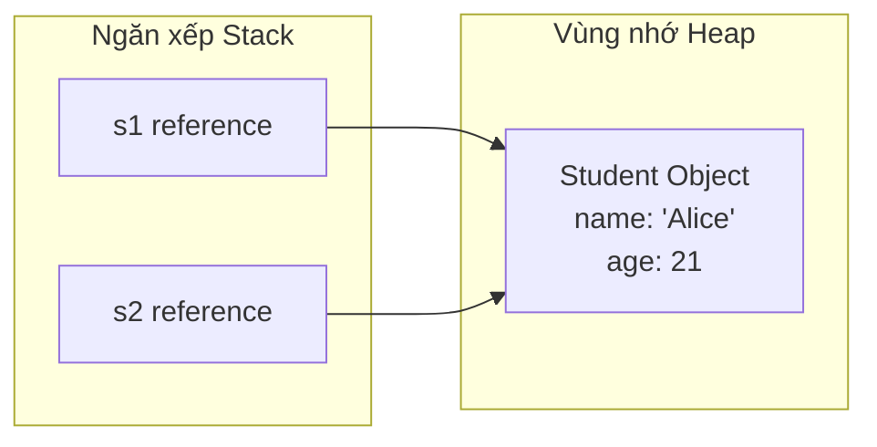

# Lớp và Đối Tượng (Classes and Objects)

Lập trình hướng đối tượng (Object-Oriented Programming - OOP) là một mô hình lập trình tập trung vào các "đối tượng" — các cấu trúc dữ liệu chứa các trạng thái (các trường - fields) và hành vi (các phương thức - methods) — thay vì tập trung vào các hành động và logic.

---

## Lớp vs. Đối Tượng (Class vs. Object)

- **Lớp (Class):** Là một khuôn mẫu hoặc bản thiết kế định nghĩa cấu trúc và hành vi của một loại đối tượng. Nó là một thực thể logic ở thời điểm biên dịch. Khi được biên dịch, định nghĩa lớp sẽ được nạp vào vùng nhớ **Metaspace** (phần bộ nhớ JVM dành cho siêu dữ liệu của lớp - class metadata).
- **Đối tượng (Object):** Là một thực thể (instance) cụ thể của một lớp. Nó là một thực thể vật lý trong thời gian chạy (runtime), chiếm dụng bộ nhớ trên **Heap** và có trạng thái cũng như hành vi cụ thể.

---

## Các Trường và Phương Thức (Fields and Methods)

- **Các trường (Fields - Biến thực thể / Thuộc tính):** Là các biến được khai báo bên trong một lớp nhưng nằm ngoài bất kỳ phương thức nào. Chúng đại diện cho trạng thái của từng đối tượng riêng lẻ. Mỗi đối tượng sẽ có bản sao biến thực thể của riêng mình.
- **Các phương thức (Methods):** Là các khối mã thực hiện các thao tác. Chúng đại diện cho các hành động hoặc hành vi mà một đối tượng có thể thực thi.

---

## Hàm Khởi Tạo và Phương Thức `<init>` (Constructors and the <init> Method)

Một **Hàm khởi tạo (Constructor)** là một khối mã được gọi trong quá trình khởi tạo đối tượng bằng từ khóa `new`. Vai trò chính của nó là khởi tạo giá trị cho các trường của đối tượng.

### Quy tắc của Hàm Khởi Tạo:
1. Tên của hàm khởi tạo phải trùng khớp hoàn toàn với tên lớp.
2. Hàm khởi tạo không được khai báo kiểu trả về (ngay cả `void`).
3. Hàm khởi tạo không thể được đánh dấu là `static`, `final`, `abstract`, hoặc `synchronized`.

### Cơ chế của Trình Biên Dịch:
Bên dưới lớp vỏ, trình biên dịch Java sẽ biên dịch các hàm khởi tạo thành một phương thức mã byte đặc biệt có tên là **`<init>`** (phương thức khởi tạo thực thể - instance initialization method).

### Các Loại Hàm Khởi Tạo:
1. **Hàm khởi tạo mặc định (Default Constructor):** Nếu bạn không viết bất kỳ hàm khởi tạo nào, trình biên dịch sẽ tự động chèn một hàm khởi tạo công khai (public) không có tham số:
   ```java
   public ClassName() {
       super(); // Gọi hàm khởi tạo mặc định của lớp cha
   }
   ```
   Nếu bạn định nghĩa *bất kỳ* hàm khởi tạo nào có tham số, trình biên dịch **sẽ không** tự động tạo ra hàm khởi tạo mặc định không tham số nữa.
2. **Hàm khởi tạo có tham số (Parameterized Constructor):** Nhận các tham số đầu vào để khởi tạo các trường thực thể với các giá trị tùy chỉnh.
3. **Nạp chồng hàm khởi tạo (Constructor Overloading):** Định nghĩa nhiều hàm khởi tạo với các chữ ký tham số khác nhau (khác nhau về số lượng, kiểu dữ liệu hoặc thứ tự tham số) trong cùng một lớp.
4. **Hàm khởi tạo sao chép (Copy Constructor):** Tạo ra một đối tượng mới bằng cách sử dụng một thực thể đã tồn tại của cùng một lớp. Nó sao chép các trường của đối tượng nguồn vào thực thể mới, cho phép sao chép nông/sâu an toàn.

```java
class Student {
    String name;
    int age;

    // Hàm khởi tạo không tham số (No-arg constructor)
    Student() {
        this("Unknown", 18); // Chuỗi hàm khởi tạo (Constructor Chaining)
    }

    // Hàm khởi tạo có tham số (Parameterized constructor)
    Student(String name, int age) {
        this.name = name;
        this.age = age;
    }

    // Hàm khởi tạo sao chép (Copy constructor)
    Student(Student other) {
        this.name = other.name;
        this.age = other.age;
    }
}
```

---

## Chuỗi Hàm Khởi Tạo và Từ Khóa `this` (Constructor Chaining and the this Keyword)

**Chuỗi hàm khởi tạo (Constructor Chaining)** là quá trình gọi một hàm khởi tạo từ một hàm khởi tạo khác trong cùng một lớp hoặc từ một lớp cha.

### Quy tắc sử dụng `this()`:
- Để gọi một hàm khởi tạo khác trong cùng một lớp, hãy sử dụng `this(các_tham_số)`.
- Lời gọi `this()` (hoặc `super()`) bắt buộc phải là **câu lệnh đầu tiên** trong thân hàm khởi tạo.
- Bạn không thể thực hiện các cuộc gọi hàm khởi tạo đệ quy (Hàm khởi tạo A gọi Hàm khởi tạo B, và Hàm khởi tạo B lại gọi ngược lại A); điều này sẽ gây ra lỗi biên dịch.

---

## Tham Chiếu Đối Tượng Trong Bộ Nhớ (Ngăn xếp Stack vs. Heap)

Khi bạn tạo một đối tượng, bộ nhớ sẽ được phân chia giữa Stack và Heap:

```java
Student s1 = new Student("Alice", 20);
```

1. **Bộ nhớ Stack:** Cấp phát một biến tham chiếu `s1`. Giá trị được lưu trữ trong `s1` là **địa chỉ bộ nhớ (con trỏ - pointer)** của đối tượng thực tế trên Heap.
2. **Bộ nhớ Heap:** Cấp phát một vùng nhớ liên tục để lưu trữ dữ liệu đối tượng `Student` thực tế (chuỗi `"Alice"`, số nguyên `20`, và các phần đầu siêu dữ liệu lớp - class metadata headers).
3. **Gán lại tham chiếu:**
   ```java
   Student s2 = s1; // s2 sao chép giá trị tham chiếu. Cả hai cùng trỏ đến cùng một Student trên Heap.
   s2.age = 21;     // Việc sửa đổi thông qua s2 sẽ thay đổi trạng thái của đối tượng mà s1 đang trỏ tới.
   ```



---

## Truyền Đối Tượng Vào Phương Thức (Passing Objects to Methods)

Java sử dụng cơ chế **truyền bằng giá trị (pass-by-value)** cho tất cả các đối số. Khi bạn truyền một đối tượng vào một phương thức, thực chất bạn đang truyền **bản sao tham chiếu (địa chỉ bộ nhớ)** của nó:
- Nếu phương thức sửa đổi một trường của đối tượng, bên gọi **sẽ nhìn thấy** sự thay đổi đó vì cả hai biến tham chiếu đều trỏ đến cùng một đối tượng trên heap.
- Nếu phương thức gán lại tham số tham chiếu đó cho một đối tượng mới, biến tham chiếu của bên gọi **sẽ không** bị thay đổi.

```java
void updateStudent(Student s) {
    s.age = 22; // Bên gọi sẽ nhìn thấy sự thay đổi này
    s = new Student("Bob", 25); // Gán lại. Bên gọi sẽ không thấy thay đổi này
}
```

---

## Đối Tượng Ẩn Danh (Anonymous Objects)

Một đối tượng ẩn danh là một đối tượng được khởi tạo mà không được gán cho một biến tham chiếu nào.
- Được sử dụng cho các thao tác chỉ dùng một lần.
- Ngay lập tức đủ điều kiện để bộ thu gom rác (garbage collection) thu hồi sau khi câu lệnh thực thi xong.
```java
new Student("Charlie", 19).printDetails();
```

---

## Các Sai Lầm Thường Gặp (Common Mistakes)

### 1. Khai Báo Kiểu Trả Về Cho Hàm Khởi Tạo
Việc thêm kiểu trả về (ngay cả `void`) sẽ biến khai báo hàm khởi tạo thành một phương thức thông thường. Chương trình vẫn biên dịch được, nhưng phương thức này sẽ không chạy khi khởi tạo đối tượng, khiến các trường của đối tượng không được khởi tạo hoặc nhận giá trị mặc định.
```java
class User {
    String name;
    // Sai lầm phổ biến: kiểu trả về void làm đây là một phương thức, không phải hàm khởi tạo
    public void User(String name) { 
        this.name = name;
    }
}
// User u = new User("Alice"); // Lỗi biên dịch: không tìm thấy hàm khởi tạo phù hợp
```

### 2. Gọi Hàm Khởi Tạo Đệ Quy
Việc liên kết các hàm khởi tạo thông qua `this()` không được tạo thành một vòng lặp kín; làm như vậy sẽ gây ra lỗi biên dịch.
```java
class Demo {
    Demo() {
        this(10); // Lỗi biên dịch: gọi hàm khởi tạo đệ quy (recursive constructor invocation)
    }
    Demo(int x) {
        this();
    }
}
```

### 3. Hiện Tượng Trùng Tên Tham Chiếu - Aliasing (Nhầm Lẫn Giữa Sao Chép Tham Chiếu Với Sao Chép Đối Tượng)
Việc gán một biến tham chiếu này cho một biến tham chiếu khác chỉ sao chép con trỏ, chứ không sao chép đối tượng trên heap.
```java
Student s1 = new Student("Alice", 20);
Student s2 = s1; // Cả s1 và s2 đều tham chiếu đến cùng một đối tượng
s2.age = 30;     // Thay đổi này sẽ ảnh hưởng đến đối tượng s1 đang trỏ tới!
```
Để nhân bản đối tượng, hãy sử dụng hàm khởi tạo sao chép (copy constructor):
```java
Student s3 = new Student(s1); // Tạo ra một thực thể độc lập trên Heap
```

## Đánh Giá Chuyên Sâu: Danh Sách Kiểm Tra Thiết Kế Lớp (Class Design Checklist)

Khi bạn thiết kế một lớp, đừng chỉ dừng lại ở việc nghĩ "nó có các trường và phương thức." Một lớp hữu ích thường có trách nhiệm rõ ràng, trạng thái được kiểm soát chặt chẽ và một API công khai nhỏ gọn.

Hãy tự đặt các câu hỏi sau:

- Lớp này mô hình hóa khái niệm thực tế hay khái niệm chương trình nào?
- Những trường nào đại diện cho trạng thái của đối tượng?
- Những phương thức nào bảo vệ hoặc biến đổi trạng thái đó?
- Những hàm khởi tạo nào giúp tạo ra các đối tượng hợp lệ ngay từ đầu?
- Những ràng buộc bất biến (invariants) nào không bao giờ được phép vi phạm sau khi khởi tạo?
- Đối tượng này nên là khả biến (mutable), bất biến (immutable), hay chỉ có thể thay đổi thông qua các phương thức được kiểm soát?

### Tính Bất Biến Của Hàm Khởi Tạo (Constructor Invariants)

Một hàm khởi tạo nên để lại đối tượng ở trạng thái có thể sử dụng được. Nếu một tài khoản ngân hàng `BankAccount` không thể có số dư ban đầu âm, hàm khởi tạo nên từ chối giá trị đó ngay lập tức. Điều này giúp ngăn chặn trạng thái không hợp lệ lan rộng ra khắp chương trình.

```java
class BankAccount {
    private int balance;

    BankAccount(int openingBalance) {
        if (openingBalance < 0) {
            throw new IllegalArgumentException("negative balance");
        }
        this.balance = openingBalance;
    }
}
```

### Định Danh Đối Tượng vs. Trạng Thái Đối Tượng (Object Identity vs Object State)

Hai tham chiếu có thể trỏ đến cùng một đối tượng. Hai đối tượng khác nhau cũng có thể có trạng thái bằng nhau nhưng có định danh (identity) khác nhau.

```java
Student a = new Student("Alice");
Student b = new Student("Alice");
Student c = a;
```

- `a == b` trả về false vì chúng là hai đối tượng khác nhau trên heap.
- `a == c` trả về true vì cả hai tham chiếu đều trỏ đến cùng một đối tượng.
- `a.equals(b)` phụ thuộc vào việc lớp `Student` có ghi đè phương thức `equals` hay không.

### Liên Kết Tham Khảo (Reference Links)

- Oracle Java Tutorials - Các khái niệm OOP: https://docs.oracle.com/javase/tutorial/java/concepts/
- Oracle Java Tutorials - Lớp và Đối tượng: https://docs.oracle.com/javase/tutorial/java/javaOO/index.html
- Oracle Java Tutorials - Hàm khởi tạo: https://docs.oracle.com/javase/tutorial/java/javaOO/constructors.html
- Oracle Java Tutorials - `this`: https://docs.oracle.com/javase/tutorial/java/javaOO/thiskey.html
- Oracle Java Tutorials - Tạo đối tượng: https://docs.oracle.com/javase/tutorial/java/javaOO/objectcreation.html
- Oracle Java Tutorials - Truyền tham số: https://docs.oracle.com/javase/tutorial/java/javaOO/arguments.html
- Tổng quan về OOP trên Dev.java: https://dev.java/learn/oop/
