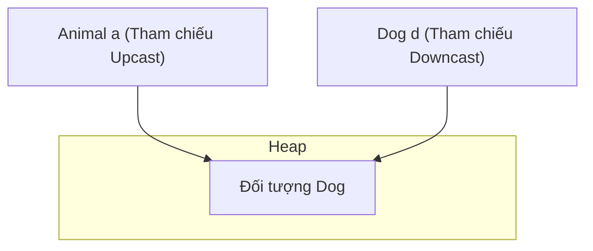

# Đa hình (Polymorphism)

Đa hình (Polymorphism), bắt nguồn từ tiếng Hy Lạp có nghĩa là "nhiều dạng", là khả năng một đối tượng hành xử khác nhau tùy thuộc vào ngữ cảnh mà nó được sử dụng. Trong Java, điều này được thể hiện thông qua nạp chồng (overloading - lúc biên dịch) và ghi đè (overriding - lúc chạy).

---

## Nạp chồng Phương thức (Đa hình lúc biên dịch) (Method Overloading (Compile-Time Polymorphism))

Nạp chồng phương thức (Method Overloading) xảy ra khi một lớp chứa nhiều phương thức có cùng tên nhưng khác nhau về chữ ký phương thức (method signature). Điều này được trình biên dịch giải quyết tại thời điểm biên dịch (**liên kết sớm - early binding**).

### Các quy tắc khi Nạp chồng (Rules for Overloading)
- Các phương thức phải khác nhau về các tham số của chúng: **số lượng**, **kiểu dữ liệu**, hoặc **thứ tự**.
- Chỉ riêng kiểu trả về, phạm vi truy cập, hoặc mệnh đề ném ngoại lệ (throws clause) **không** thuộc chữ ký phương thức và không thể được dùng để nạp chồng phương thức.

### Ví dụ Code: Nạp chồng (Code Example: Overloading)
```java
class Calculator {
    // Overload 1: two int parameters
    int add(int a, int b) {
        return a + b;
    }

    // Overload 2: three int parameters
    int add(int a, int b, int c) {
        return a + b + c;
    }

    // Overload 3: double parameters
    double add(double a, double b) {
        return a + b;
    }
}
```

### Tự động nâng kiểu dữ liệu (Automatic Type Promotion)
Khi nạp chồng các phương thức, nếu các kiểu tham số truyền vào không khớp chính xác, Java sẽ khớp phương thức bằng cách **tự động nâng kiểu dữ liệu (automatic type promotion)**:
- `byte` $\rightarrow$ `short` $\rightarrow$ `int` $\rightarrow$ `long` $\rightarrow$ `float` $\rightarrow$ `double`
- `char` $\rightarrow$ `int`

```java
class Demo {
    void show(int x) { System.out.println("int: " + x); }
    void show(double x) { System.out.println("double: " + x); }
}
// Calling new Demo().show('A') prints "int: 65" due to char -> int promotion.
```

---

## Ghi đè Phương thức và Điều phối Phương thức Động (Đa hình lúc chạy) (Method Overriding and Dynamic Method Dispatch (Runtime Polymorphism))

Đa hình lúc chạy (Runtime Polymorphism) là quá trình mà lời gọi tới một phương thức bị ghi đè được giải quyết tại thời điểm chạy (**liên kết muộn - late binding**).

### Đa hình thông qua Kiểu tham chiếu (Polymorphism via Reference Type)
Đa hình cho phép khai báo một biến tham chiếu của lớp cha hoặc kiểu giao diện (interface), và trỏ nó tới thực thể của bất kỳ lớp con nào. Điều này giúp giảm sự phụ thuộc giữa chương trình và các triển khai cụ thể.

```java
class Printer {
    void printDocument() { System.out.println("Printing generic document..."); }
}

class LaserPrinter extends Printer {
    @Override
    void printDocument() { System.out.println("Printing high-quality laser document..."); }
}

class InkjetPrinter extends Printer {
    @Override
    void printDocument() { System.out.println("Printing standard inkjet document..."); }
}
```

Bằng cách tham chiếu chúng thông qua kiểu cha `Printer`, chúng ta có thể viết các phương thức mô-đun để xử lý bất kỳ loại máy in nào:

```java
public class Office {
    // This method accepts any subclass of Printer
    static void runJob(Printer p) {
        p.printDocument(); // Polymorphic call: behavior depends on actual object in heap
    }

    public static void main(String[] args) {
        Printer p1 = new LaserPrinter();  // Polymorphism via reference type
        Printer p2 = new InkjetPrinter(); // Polymorphism via reference type

        runJob(p1); // Prints "Printing high-quality laser document..."
        runJob(p2); // Prints "Printing standard inkjet document..."
    }
}
```

### Điều phối Phương thức Động (Dynamic Method Dispatch)
Khi một phương thức bị ghi đè được gọi thông qua một tham chiếu lớp cha, Java sẽ xác định phiên bản phương thức nào được thực thi dựa trên **kiểu đối tượng thực tế trong vùng nhớ Heap**, chứ không phải kiểu tham chiếu trong Stack.

### Cách JVM giải quyết Phương thức: Bảng phương thức ảo (Vtables) (How the JVM Resolves Methods: Virtual Method Tables (Vtables))
Đối với mỗi lớp, JVM duy trì một **Bảng phương thức ảo (Virtual Method Table - Vtable)** trong Vùng nhớ Phương thức (Method Area) / Metaspace:
- Vtable chứa các con trỏ tới mã thực thi của tất cả các phương thức của lớp đó.
- Nếu lớp con không ghi đè một phương thức của lớp cha, mục nhập Vtable tương ứng của nó sẽ trỏ tới triển khai của lớp cha.
- Nếu lớp con ghi đè phương thức đó, mục nhập Vtable của nó sẽ được cập nhật để trỏ tới đoạn mã đã ghi đè của lớp con.
- Tại thời điểm chạy, JVM chỉ cần tra cứu chữ ký phương thức trong vtable của đối tượng thực tế trên heap.

```java
class Vehicle { void start() {} }
class Car extends Vehicle { @Override void start() {} }

Vehicle v = new Car();
v.start(); // At compile time, compiler checks if start() exists in Vehicle class.
           // At runtime, JVM checks v's heap object (Car) and runs Car's start() via Car's Vtable.
```

---

## Ép kiểu Đối tượng và Vùng nhớ Heap (Object Casting and the Heap)

Ép kiểu đối tượng (Casting) chuyển đổi kiểu tham chiếu của đối tượng trong một hệ thống phân cấp kế thừa. Nó **không sửa đổi** đối tượng thực tế trong Heap; nó chỉ thay đổi kiểu tham chiếu được sử dụng để truy cập đối tượng đó.



### Upcasting (Ép kiểu lên lớp cha)
Ép kiểu từ một lớp con lên một lớp cha.
- **Tự động và An toàn (Implicit and Safe):** `Animal a = new Dog();`
- Bạn chỉ có thể gọi các phương thức được khai báo trong lớp cha `Animal`. Các phương thức riêng của lớp con sẽ không thể truy cập được.

### Downcasting (Ép kiểu xuống lớp con)
Ép kiểu từ một lớp cha ngược trở lại lớp con.
- **Tường minh và Rủi ro (Explicit and Risky):** `Dog d = (Dog) a;`
- Cho phép truy cập lại các phương thức riêng của lớp con.
- Ném ra một `ClassCastException` tại thời điểm chạy nếu đối tượng trong bộ nhớ không phải là một thực thể của lớp con đích.

---

## Toán tử instanceof và Khớp mẫu (The instanceof Operator and Pattern Matching)

Để ngăn chặn `ClassCastException`, hãy kiểm tra kiểu thời gian chạy của đối tượng bằng `instanceof` trước khi thực hiện ép kiểu.

### 1. Cú pháp truyền thống (Traditional Syntax)
Yêu cầu kiểm tra kiểu và sau đó thực hiện ép kiểu tường minh ở một dòng mới:
```java
if (obj instanceof String) {
    String s = (String) obj; // Redundant cast
    System.out.println(s.toLowerCase());
}
```

### 2. Khớp mẫu cho instanceof (Java 16+) (Pattern Matching for instanceof (Java 16+))
Kết hợp việc kiểm tra kiểu và ép kiểu trong một câu lệnh duy nhất. Nếu kiểm tra thành công, một **biến mẫu (pattern variable)** sẽ được tạo ra và tự động được ép kiểu:

```java
if (obj instanceof String s) {
    System.out.println(s.toLowerCase()); // 's' is already cast to String here
}
```

### Phạm vi của biến mẫu (Scope of the Pattern Variable)
Biến mẫu chỉ có giá trị sử dụng trong phạm vi mà trình biên dịch có thể đảm bảo rằng phép kiểm tra trả về `true`.
- **Phạm vi hợp lệ khi sử dụng phép toán logic `&&`:**
  ```java
  if (obj instanceof String s && s.length() > 5) { // Valid because s is guaranteed to be String
      System.out.println(s);
  }
  ```
- **Phạm vi không hợp lệ khi sử dụng phép toán logic `||`:**
  ```java
  // if (obj instanceof String s || s.length() > 5) // Compile error!
  ```

## Xem xét chuyên sâu: Cách đọc Mã nguồn Đa hình (Deep Review: How To Read Polymorphic Code)

Khi đọc mã nguồn đa hình, hãy tách biệt ba yếu tố:

1. **Kiểu tham chiếu (reference type)**: những gì trình biên dịch cho phép bạn gọi.
2. **Kiểu đối tượng (object type)**: những gì thực sự tồn tại trong heap.
3. **Loại phương thức (method kind)**: phương thức thể hiện (instance method), tĩnh (static), riêng tư (private), final, hoặc truy cập trường dữ liệu (field access).

```java
Animal animal = new Dog();
animal.speak();
```

- Trình biên dịch kiểm tra xem phương thức `speak()` có tồn tại trên `Animal` hay không.
- Tại thời điểm chạy, Java điều phối phương thức thể hiện đã bị ghi đè trên `Dog`.
- Nếu `speak()` là một phương thức tĩnh (static), nó sẽ được giải quyết từ kiểu tham chiếu thay thế.

### Trường hợp sử dụng tốt Đa hình (Good Uses Of Polymorphism)

- Xử lý nhiều triển khai khác nhau thông qua một giao diện (interface) duy nhất.
- Thay thế các chuỗi `if/else` bằng hành vi của kiểu con (subtype behavior).
- Kiểm thử mã nguồn với các triển khai giả (fake/mock implementations).
- Xây dựng các API có tính mở rộng cao nơi người gọi phụ thuộc vào các trừu tượng (abstractions).

### Trường hợp lạm dụng/sử dụng không tốt Đa hình (Bad Uses Of Polymorphism)

- Tạo ra một hệ thống phân cấp chỉ để chia sẻ hai phương thức trợ giúp (helper methods).
- Thường xuyên phải thực hiện downcasting vì kiểu cha thiếu hành vi bạn cần.
- Sử dụng kế thừa trong khi thành phần/kết hợp (composition) giúp cô lập thay đổi tốt hơn.

---

## Các lỗi thường gặp (Common Mistakes)

### 1. Gọi phương thức riêng của Lớp con trên Kiểu tham chiếu của Lớp cha (Calling Subclass-Specific Methods on Parent Reference Type)
Kiểu tham chiếu cha chỉ để lộ ra các phương thức được khai báo trong lớp cha hoặc interface đó. Ngay cả khi tham chiếu trỏ đến một thực thể lớp con chứa phương thức riêng của lớp con đó, việc gọi trực tiếp chúng vẫn sẽ gây lỗi biên dịch.
```java
class Animal {}
class Dog extends Animal {
    void bark() {}
}

Animal a = new Dog();
// a.bark(); // Compile Error: bark() is not defined in Animal class
((Dog) a).bark(); // Correct: Downcast required
```

### 2. ClassCastException với thực thể của các lớp không liên quan (ClassCastException with Unrelated Class Instances)
Việc ép kiểu một tham chiếu lớp cha đang trỏ tới một thực thể `Cat` thành kiểu `Dog` vẫn biên dịch thành công, nhưng sẽ ném ra lỗi `ClassCastException` tại thời điểm chạy vì đối tượng thực tế trên heap không phải là `Dog`.
```java
Animal a = new Cat();
Dog d = (Dog) a; // Runtime ClassCastException: Cat cannot be cast to Dog
```

### 3. Cố gắng ép kiểu giữa các kiểu không thể chuyển đổi (Attempting to Cast Inconvertible Types)
Trình biên dịch sẽ chặn các phép ép kiểu giữa các lớp không có mối quan hệ kế thừa, dẫn đến lỗi "inconvertible types" (các kiểu không thể chuyển đổi).
```java
Dog d = new Dog();
// String s = (String) d; // Compile Error: inconvertible types
```

### Liên kết tham khảo (Reference Links)

- Oracle Java Tutorials - Polymorphism: https://docs.oracle.com/javase/tutorial/java/IandI/polymorphism.html
- Oracle Java Tutorials - Overriding and hiding methods: https://docs.oracle.com/javase/tutorial/java/IandI/override.html
- Oracle Java Tutorials - Method overloading: https://docs.oracle.com/javase/tutorial/java/javaOO/methods.html

---

## Tại sao Ghi đè Phương thức sử dụng Điều phối Động lúc chạy (Why Method Overriding Uses Runtime Dynamic Dispatch)

Ghi đè phương thức được giải quyết lúc chạy thay vì lúc biên dịch bởi vì trình biên dịch Java không thể luôn biết trước lớp cụ thể nào của một đối tượng tại thời điểm thực hiện cuộc gọi đa hình. Một biến được khai báo là `Animal` có thể chứa một đối tượng `Dog`, `Cat`, hoặc bất kỳ lớp con nào trong tương lai thậm chí chưa tồn tại khi mã gọi được biên dịch; việc cố định mục tiêu phương thức tại thời điểm biên dịch sẽ khiến ta không thể mở rộng hành vi bằng cách thêm lớp con mới mà không phải biên dịch lại mọi nơi gọi. JVM giải quyết điều này bằng **điều phối phương thức ảo (virtual method dispatch)**: đối với mỗi lớp, nó duy trì một **bảng phương thức ảo (vtable)** trong Vùng nhớ Phương thức (Metaspace) chứa các con trỏ đến mã byte thực tế cho mỗi phương thức có thể ghi đè. Khi một lớp con ghi đè một phương thức, JVM cập nhật ô (slot) tương ứng trong vtable của lớp con để trỏ đến triển khai ghi đè thay vì của cha. Khi JVM thực thi lệnh mã byte `invokevirtual` (đây là mã byte mà tất cả các cuộc gọi phương thức thể hiện không tĩnh, không riêng tư, không final được biên dịch thành), nó không sử dụng kiểu đã khai báo của biến tham chiếu — nó giải tham chiếu đối tượng trong heap, tra cứu bộ mô tả lớp của đối tượng và đi theo con trỏ vtable cho ô phương thức phù hợp. Việc tra cứu này chỉ mất một bước gián tiếp duy nhất và nhanh đến mức trình biên dịch JIT thậm chí có thể nội tuyến (inline) các phương thức ảo được gọi thường xuyên thông qua tối ưu hóa suy đoán (speculative devirtualization). Các phương thức tĩnh biên dịch thành `invokestatic` và được giải quyết thuần túy từ kiểu tham chiếu lúc biên dịch, đó là lý do tại sao các phương thức tĩnh chỉ có thể bị ẩn chứ không bao giờ bị ghi đè một cách đa hình.

### Mô hình tư duy (Mental Model)

```
Thời điểm biên dịch (Compile time):
  Animal a = new Dog();
  a.speak();
  ↓
  Trình biên dịch tạo ra: invokevirtual #speak  (chỉ kiểm tra speak() có tồn tại trong Animal)
  Trình biên dịch KHÔNG biết kiểu lúc chạy thực tế là Dog

Thời điểm chạy (Runtime):
  Stack: [ a → tham chiếu tới đối tượng Dog trong Heap ]
                    |
                    v
  Heap: [ Đối tượng Dog ] → con trỏ bộ mô tả lớp → siêu dữ liệu Dog.class
                                                            |
                                                            v
                                                vtable của Dog:
                                                +------------------+----------+
                                                | Phương thức      | Con trỏ  |
                                                +------------------+----------+
                                                | speak()          | Dog.speak|  ← ô đã được cập nhật
                                                | eat()            | Animal.eat (kế thừa, không ghi đè)
                                                +------------------+----------+
                                                            |
                                                JVM đi theo con trỏ Dog.speak → thực thi Dog.speak()
```

### Ví dụ Code (Code Example)

```java
class Animal {
    void speak() {
        System.out.println("Animal speaks");
    }
}

class Dog extends Animal {
    @Override
    void speak() {
        System.out.println("Dog barks");
    }
}

class Cat extends Animal {
    @Override
    void speak() {
        System.out.println("Cat meows");
    }
}

public class Main {
    static void makeNoise(Animal a) {
        // Được biên dịch thành invokevirtual — phương thức thực tế được giải quyết lúc chạy
        a.speak();
    }

    public static void main(String[] args) {
        Animal[] animals = { new Dog(), new Cat(), new Animal() };
        for (Animal a : animals) {
            makeNoise(a);
        }
    }
}
// Output:
// Dog barks
// Cat meows
// Animal speaks
```

### Chuỗi Nguyên nhân - Kết quả (Cause-Effect Chain)

Lời gọi phương thức `a.speak()` được biên dịch thành lệnh mã byte `invokevirtual`
→ Tại thời điểm chạy, JVM giải tham chiếu đối tượng trên heap mà `a` trỏ tới
→ JVM đọc bộ mô tả lớp của đối tượng (luôn có sẵn trong tiêu đề đối tượng - object header)
→ JVM tra cứu ô `speak()` trong vtable của lớp đó
→ Nếu Dog ghi đè `speak()`, ô này trỏ đến triển khai của Dog; ngược lại, nó trỏ đến của Animal
→ JVM thực thi triển khai mà ô vtable trỏ tới
→ Việc thêm các lớp con mới không bao giờ yêu cầu biên dịch lại các vị trí gọi hiện tại — mỗi lớp mới tự cung cấp vtable của riêng nó với các ô đã được cập nhật tương ứng
