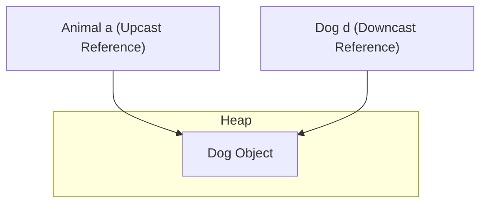

# Đa hình (Polymorphism)

Đa hình (Polymorphism), bắt nguồn từ tiếng Hy Lạp có nghĩa là "nhiều dạng", là khả năng một đối tượng cư xử khác nhau tùy thuộc vào ngữ cảnh mà nó được sử dụng. Trong Java, điều này được thể hiện qua nạp chồng phương thức (Method Overloading) ở thời điểm biên dịch (Compile-time) và ghi đè phương thức (Method Overriding) ở thời điểm chạy (Runtime).

---

## Nạp chồng Phương thức (Method Overloading - Đa hình tại thời điểm biên dịch)

Nạp chồng phương thức xảy ra khi một lớp chứa nhiều phương thức có cùng tên nhưng khác chữ ký phương thức (Method signature). Việc này được trình biên dịch giải quyết tại thời điểm biên dịch qua liên kết sớm (Early binding).

### Quy tắc nạp chồng:
- Các phương thức phải khác nhau về tham số: **số lượng**, **kiểu dữ liệu**, hoặc **thứ tự**.
- Kiểu trả về (Return type), phạm vi truy cập (Access modifier), hoặc mệnh đề throws (Throws clause) **nếu đứng riêng lẻ** thì không thuộc chữ ký phương thức và không thể dùng để nạp chồng phương thức.

### Ví dụ Code: Nạp chồng
```java
class Calculator {
    // Overload 1: two int parameters
    int add(int a, int b) {
        return a + b;
    }

    // Overload 2: three int parameters
    int add(int a, int b, int c) {
        return a + b + c;
    }

    // Overload 3: double parameters
    double add(double a, double b) {
        return a + b;
    }
}
```

### Tự động nâng kiểu (Automatic Type Promotion)
Khi nạp chồng phương thức, nếu các kiểu tham số truyền vào không khớp hoàn toàn, Java sẽ tìm phương thức phù hợp bằng cách tự động nâng kiểu:
- `byte` $\rightarrow$ `short` $\rightarrow$ `int` $\rightarrow$ `long` $\rightarrow$ `float` $\rightarrow$ `double`
- `char` $\rightarrow$ `int`

```java
class Demo {
    void show(int x) { System.out.println("int: " + x); }
    void show(double x) { System.out.println("double: " + x); }
}
// Calling new Demo().show('A') prints "int: 65" due to char -> int promotion.
```

---

## Ghi đè Phương thức và Điều phối Phương thức Động (Dynamic Method Dispatch - Đa hình tại thời điểm chạy)

Đa hình tại thời điểm chạy là quá trình cuộc gọi đến một phương thức bị ghi đè được giải quyết tại thời điểm chạy qua liên kết muộn (Late binding).

### Đa hình thông qua Kiểu tham chiếu (Reference Type)
Đa hình cho phép khai báo một biến tham chiếu có kiểu là lớp cha hoặc giao diện (Interface), và trỏ nó tới một thể hiện của bất kỳ lớp con (Subclass) nào. Điều này giúp giảm sự phụ thuộc giữa chương trình và các triển khai cụ thể (Concrete implementation).

```java
class Printer {
    void printDocument() { System.out.println("Printing generic document..."); }
}

class LaserPrinter extends Printer {
    @Override
    void printDocument() { System.out.println("Printing high-quality laser document..."); }
}

class InkjetPrinter extends Printer {
    @Override
    void printDocument() { System.out.println("Printing standard inkjet document..."); }
}
```

Bằng cách tham chiếu chúng qua kiểu cha `Printer`, chúng ta có thể viết các phương thức mang tính mô-đun để xử lý bất kỳ loại máy in nào:

```java
public class Office {
    // This method accepts any subclass of Printer
    static void runJob(Printer p) {
        p.printDocument(); // Polymorphic call: behavior depends on actual object in heap
    }

    public static void main(String[] args) {
        Printer p1 = new LaserPrinter();  // Polymorphism via reference type
        Printer p2 = new InkjetPrinter(); // Polymorphism via reference type

        runJob(p1); // Prints "Printing high-quality laser document..."
        runJob(p2); // Prints "Printing standard inkjet document..."
    }
}
```

### Điều phối Phương thức Động (Dynamic Method Dispatch)
Khi một phương thức ghi đè được gọi thông qua một tham chiếu lớp cha, Java sẽ xác định triển khai phương thức nào để thực thi dựa trên **kiểu đối tượng thực tế trong vùng nhớ Heap (Heap)**, chứ không phải kiểu tham chiếu trong vùng nhớ Stack (Stack).

### Cách JVM Giải quyết Phương thức: Bảng Phương thức Ảo (Virtual Method Table - Vtable)
Đối với mỗi lớp, JVM duy trì một bảng phương thức ảo (Virtual Method Table - Vtable) trong vùng nhớ phương thức (Method Area) / Metaspace:
- Vtable chứa các con trỏ tới mã thực thi của tất cả các phương thức của lớp đó.
- Nếu một lớp con không ghi đè phương thức của lớp cha, mục nhập Vtable của nó sẽ trỏ đến triển khai của lớp cha.
- Nếu lớp con ghi đè một phương thức, mục nhập Vtable của nó sẽ được cập nhật để trỏ đến đoạn mã ghi đè của lớp con.
- Tại thời điểm chạy, JVM chỉ cần tra cứu chữ ký phương thức trong vtable của đối tượng thực tế trên heap.

```java
class Vehicle { void start() {} }
class Car extends Vehicle { @Override void start() {} }

Vehicle v = new Car();
v.start(); // At compile time, compiler checks if start() exists in Vehicle class.
           // At runtime, JVM checks v's heap object (Car) and runs Car's start() via Car's Vtable.
```

---

## Ép kiểu Đối tượng (Object Casting) và Vùng nhớ Heap

Ép kiểu chuyển đổi kiểu tham chiếu của một đối tượng trong hệ thống phân cấp kế thừa. Hành động này **không thay đổi** đối tượng trong heap; nó chỉ thay đổi kiểu tham chiếu được sử dụng để truy cập đối tượng đó.



### Ép kiểu lên (Upcasting)
Ép kiểu từ một lớp con lên lớp cha.
- **Ngầm định và An toàn:** `Animal a = new Dog();`
- Bạn chỉ có thể gọi các phương thức được khai báo trong lớp cha `Animal`. Các phương thức riêng của lớp con sẽ không thể truy cập được.

### Ép kiểu xuống (Downcasting)
Ép kiểu từ lớp cha ngược về lớp con.
- **Tường minh và Rủi ro:** `Dog d = (Dog) a;`
- Cho phép truy cập lại các phương thức riêng của lớp con.
- Ném ra một ngoại lệ `ClassCastException` tại thời điểm chạy nếu đối tượng trong bộ nhớ không phải là một thể hiện của lớp con đích.

---

## Toán tử `instanceof` và Khớp mẫu (Pattern Matching)

Để ngăn chặn lỗi `ClassCastException`, hãy kiểm tra kiểu thời gian chạy của đối tượng bằng `instanceof` trước khi ép kiểu.

### 1. Cú pháp truyền thống
Yêu cầu kiểm tra kiểu và sau đó thực hiện ép kiểu tường minh trên một dòng mới:
```java
if (obj instanceof String) {
    String s = (String) obj; // Redundant cast
    System.out.println(s.toLowerCase());
}
```

### 2. Khớp mẫu cho `instanceof` (Java 16+)
Kết hợp kiểm tra kiểu và ép kiểu trong một câu lệnh duy nhất. Nếu kiểm tra thành công, một **biến mẫu (Pattern variable)** sẽ được tạo và tự động ép kiểu:

```java
if (obj instanceof String s) {
    System.out.println(s.toLowerCase()); // 's' is already cast to String here
}
```

### Phạm vi hoạt động của Biến mẫu:
Biến mẫu chỉ có hiệu lực trong phạm vi mà trình biên dịch đảm bảo phép kiểm tra trả về `true`.
- **Phạm vi hợp lệ khi dùng toán tử logic `&&`:**
  ```java
  if (obj instanceof String s && s.length() > 5) { // Valid because s is guaranteed to be String
      System.out.println(s);
  }
  ```
- **Phạm vi không hợp lệ khi dùng toán tử logic `||`:**
  ```java
  // if (obj instanceof String s || s.length() > 5) // Compile error!
  ```

## Đọc hiểu Mã nguồn Đa hình sâu sắc

Khi đọc mã nguồn đa hình, hãy tách biệt ba yếu tố sau:

1. **Kiểu tham chiếu**: những gì trình biên dịch cho phép bạn gọi.
2. **Kiểu đối tượng**: những gì thực sự tồn tại trong heap.
3. **Loại phương thức**: phương thức thể hiện (instance method), phương thức tĩnh (static method), phương thức riêng tư (private method), phương thức chung cuộc (final method), hoặc truy cập trường dữ liệu (field access).

```java
Animal animal = new Dog();
animal.speak();
```

- Trình biên dịch kiểm tra xem `speak()` có tồn tại trên `Animal` hay không.
- Tại thời điểm chạy, Java điều phối phương thức thể hiện bị ghi đè trên `Dog`.
- Nếu `speak()` là một phương thức tĩnh, nó sẽ được giải quyết từ kiểu tham chiếu.

### Cách sử dụng Đa hình Tốt
- Xử lý nhiều triển khai khác nhau thông qua một giao diện duy nhất.
- Thay thế các chuỗi `if/else` bằng hành vi của lớp con.
- Kiểm thử mã nguồn với các triển khai giả lập (mock/fake).
- Xây dựng các API có khả năng mở rộng, nơi người gọi phụ thuộc vào sự trừu tượng.

### Cách sử dụng Đa hình Chưa tốt
- Tạo một hệ thống phân cấp chỉ để chia sẻ hai phương thức tiện ích.
- Ép kiểu xuống quá thường xuyên vì kiểu cha thiếu hành vi bạn cần.
- Sử dụng kế thừa trong khi đóng gói/kết hợp (Composition) sẽ cô lập sự thay đổi tốt hơn.

---

## Các lỗi thường gặp

### 1. Gọi các phương thức riêng của lớp con trên kiểu tham chiếu cha
Một kiểu tham chiếu cha chỉ để lộ các phương thức được khai báo trong lớp cha hoặc giao diện đó. Ngay cả khi tham chiếu trỏ đến một thể hiện của lớp con chứa phương thức riêng đó, việc gọi trực tiếp phương thức đó sẽ gây ra lỗi biên dịch.
```java
class Animal {}
class Dog extends Animal {
    void bark() {}
}

Animal a = new Dog();
// a.bark(); // Compile Error: bark() is not defined in Animal class
((Dog) a).bark(); // Correct: Downcast required
```

### 2. Ngoại lệ ClassCastException với các thể hiện của lớp không liên quan
Ép kiểu một tham chiếu lớp cha đang trỏ đến một đối tượng `Cat` thành lớp `Dog` vẫn biên dịch được, nhưng sẽ ném ra ngoại lệ `ClassCastException` tại thời điểm chạy vì đối tượng thực tế trên heap không phải là `Dog`.
```java
Animal a = new Cat();
Dog d = (Dog) a; // Runtime ClassCastException: Cat cannot be cast to Dog
```

### 3. Cố gắng ép kiểu các kiểu dữ liệu không thể chuyển đổi
Trình biên dịch sẽ ngăn chặn việc ép kiểu giữa các lớp không có mối quan hệ kế thừa, dẫn đến lỗi "inconvertible types" (các kiểu dữ liệu không thể chuyển đổi).
```java
Dog d = new Dog();
// String s = (String) d; // Compile Error: inconvertible types
```

### Liên kết Tham khảo

- Oracle Java Tutorials - Đa hình (Polymorphism): https://docs.oracle.com/javase/tutorial/java/IandI/polymorphism.html
- Oracle Java Tutorials - Ghi đè và ẩn phương thức (Overriding and hiding methods): https://docs.oracle.com/javase/tutorial/java/IandI/override.html
- Oracle Java Tutorials - Nạp chồng phương thức (Method overloading): https://docs.oracle.com/javase/tutorial/java/javaOO/methods.html

---

## Tại sao việc Ghi đè Phương thức sử dụng Điều phối Động tại Thời điểm chạy

Ghi đè phương thức được giải quyết tại thời điểm chạy thay vì thời điểm biên dịch vì trình biên dịch Java không thể luôn biết một đối tượng thuộc lớp cụ thể nào tại thời điểm thực hiện cuộc gọi đa hình. Một biến được khai báo là `Animal` có thể chứa một đối tượng `Dog`, `Cat`, hoặc bất kỳ lớp con nào trong tương lai thậm chí chưa tồn tại khi mã gọi được biên dịch; việc cố định phương thức đích tại thời điểm biên dịch sẽ khiến ta không thể mở rộng hành vi bằng cách thêm lớp con mới mà không cần biên dịch lại mọi nơi gọi phương thức. JVM giải quyết vấn đề này bằng cơ chế điều phối phương thức ảo (Virtual method dispatch): đối với mỗi lớp, nó duy trì một bảng phương thức ảo (Vtable) trong vùng nhớ phương thức (Metaspace) chứa các con trỏ tới bytecode thực tế của từng phương thức có thể ghi đè. Khi một lớp con ghi đè một phương thức, JVM sẽ cập nhật ô tương ứng trong vtable của lớp con đó để trỏ tới triển khai ghi đè thay vì của lớp cha. Khi JVM thực thi lệnh bytecode `invokevirtual` (là lệnh mà mọi cuộc gọi phương thức thể hiện không tĩnh, không riêng tư, không chung cuộc được biên dịch thành), nó không sử dụng kiểu khai báo của biến tham chiếu — nó giải tham chiếu (Dereference) đối tượng trên heap, tra cứu bộ mô tả lớp (Class descriptor) của nó, và đi theo con trỏ vtable cho ô phương thức khớp. Việc tra cứu này chỉ mất một bước gián tiếp duy nhất và nhanh đến mức bộ biên dịch JIT có thể nội tuyến (Inline) các phương thức ảo được gọi thường xuyên thông qua cơ chế khử ảo hóa suy đoán (Speculative devirtualization). Các phương thức tĩnh biên dịch thành `invokestatic` và được giải quyết thuần túy dựa vào kiểu tham chiếu tại thời điểm biên dịch, đó là lý do tại sao các phương thức tĩnh chỉ có thể bị ẩn (Hide), không bao giờ có thể bị ghi đè một cách đa hình.

### Mô hình Tư duy

```
Thời điểm biên dịch:
  Animal a = new Dog();
  a.speak();
  ↓
  Trình biên dịch tạo ra: invokevirtual #speak  (chỉ kiểm tra xem speak() có tồn tại trong Animal hay không)
  Trình biên dịch KHÔNG biết kiểu tại thời điểm chạy là Dog

Thời điểm chạy:
  Stack: [ a → tham chiếu tới đối tượng Dog trong Heap ]
                    |
                    v
  Heap: [ Đối tượng Dog ] → con trỏ bộ mô tả lớp → Metadata của lớp Dog.class
                                                           |
                                                           v
                                               Vtable của lớp Dog:
                                               +------------------+----------+
                                               | Phương thức      | Con trỏ  |
                                               +------------------+----------+
                                               | speak()          | Dog.speak|  ← ô được cập nhật
                                               | eat()            | Animal.eat (kế thừa, không bị ghi đè)
                                               +------------------+----------+
                                                           |
                                               JVM đi theo con trỏ Dog.speak → thực thi speak() của Dog
```

### Ví dụ Code

```java
class Animal {
    void speak() {
        System.out.println("Animal speaks");
    }
}

class Dog extends Animal {
    @Override
    void speak() {
        System.out.println("Dog barks");
    }
}

class Cat extends Animal {
    @Override
    void speak() {
        System.out.println("Cat meows");
    }
}

public class Main {
    static void makeNoise(Animal a) {
        // Compiled as invokevirtual — the actual method is resolved at runtime
        a.speak();
    }

    public static void main(String[] args) {
        Animal[] animals = { new Dog(), new Cat(), new Animal() };
        for (Animal a : animals) {
            makeNoise(a);
        }
    }
}
// Output:
// Dog barks
// Cat meows
// Animal speaks
```

### Chuỗi Nguyên nhân - Kết quả

Cuộc gọi phương thức `a.speak()` được biên dịch thành lệnh bytecode `invokevirtual`
→ Tại thời điểm chạy, JVM giải tham chiếu đối tượng trên heap mà `a` trỏ tới
→ JVM đọc bộ mô tả lớp của đối tượng (luôn có sẵn trong tiêu đề đối tượng - Object header)
→ JVM tra cứu ô chứa phương thức `speak()` trong vtable của lớp đó
→ Nếu Dog ghi đè `speak()`, ô này trỏ đến triển khai của Dog; nếu không, nó trỏ đến của Animal
→ JVM thực thi triển khai mà ô vtable trỏ tới
→ Việc thêm các lớp con mới không bao giờ yêu cầu biên dịch lại các nơi gọi hiện có — mỗi lớp mới cung cấp vtable riêng với các ô được cập nhật thích hợp
