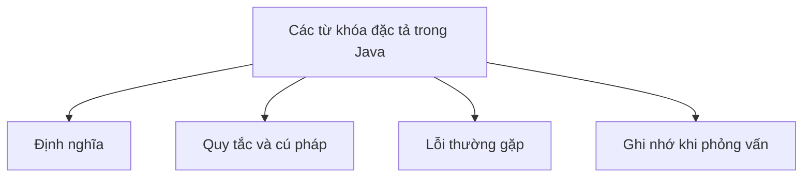

# 10 - Các Từ Khóa Đặc Tả Trong Java (Modifiers in Java)

Chủ đề này tiếp nối đề cương chuẩn trong file [outline.md](../outline.md). Mục tiêu là hiểu sâu sắc từng khái niệm để có thể giải thích, nhận biết trong mã nguồn và trả lời các câu hỏi phỏng vấn.

## Thứ Tự Học Tập

- [Các Khái Niệm Về Từ Khóa Đặc Tả Truy Cập](theory/01-access-modifier-concepts.md)
- [Các Khái Niệm Trừu Tượng](theory/02-abstract-concepts.md)
- [Các Khái Niệm Khối Tĩnh](theory/03-static-block-concepts.md)
- [Các Thuật Ngữ Chính](terms/01-key-terms.md)

## Danh Sách Đề Cương (Outline Checklist)

- Từ khóa đặc tả truy cập (Access modifier):
  - public
  - protected
  - default
  - private
- Từ khóa đặc tả không truy cập (Non-access modifier):
  - static
  - final
  - abstract → _Học sâu tại:_ [Ch.09 - OOP](../../09-oop/README.md)
  - synchronized → _Học sâu tại:_ [Ch.29 - Synchronization Concurrency](../../29-synchronization-concurrency/README.md)
  - volatile → _Học sâu tại:_ [Ch.29 - Synchronization Concurrency](../../29-synchronization-concurrency/README.md)
  - transient → _Học sâu tại:_ [Ch.26 - IO](../../26-io/README.md)
  - native
  - strictfp
- Biến tĩnh (Static variable)
- Phương thức tĩnh (Static method)
- Khối tĩnh (Static block)
- Lớp lồng tĩnh (Static nested class)
- Import tĩnh (Static import)
- Biến final (Final variable) → _Học sâu tại:_ [Ch.21 - Lambda Expression](../../21-lambda-expression/README.md)
- Phương thức final (Final method)
- Lớp final (Final class)
- Tham số final (Final parameter)
- Biến final trống (Blank final variable)

## Các Thẻ Anki

- [Cơ Bản](anki/basic.tsv)
- [Cơ Bản Mở Rộng](anki/basic-extra.tsv)
- [Điền Khuyết](anki/cloze.tsv)
- [Câu Hỏi Code](anki/code-question.tsv)

## Biểu Đồ Mermaid Tổng Quan

## Tự Kiểm Tra (Self-Check)

Trước khi chuyển sang phần tiếp theo, hãy đảm bảo rằng bạn có thể trả lời được các câu hỏi sâu về khái niệm "tại sao" sau đây:

1. [Tại sao từ khóa đặc tả `private` ngăn chặn việc kế thừa và truy cập từ bên ngoài, và nó hỗ trợ tính đóng gói như thế nào?](theory/01-access-modifier-concepts.md#why-private-restricts-access-and-supports-encapsulation)
2. [Tại sao các thành viên `static` được cấp phát cho từng lớp trong vùng nhớ Metaspace thay vì trên bộ nhớ Heap, và chúng được chia sẻ giữa tất cả các thể hiện như thế nào?](theory/02-abstract-concepts.md#why-static-members-are-allocated-in-metaspace-and-shared)
3. [Tại sao các biến `final` ngăn chặn việc gán lại giá trị, và điều này hỗ trợ các tối ưu hóa của trình biên dịch như nhúng mã (inlining) như thế nào?](theory/03-static-block-concepts.md#why-final-variables-prevent-re-assignment-and-enable-inlining)
4. [Tại sao các phương thức `synchronized` dựa vào các khóa giám sát (monitor lock), và tính tái nhập của khóa (lock reentrancy) giúp ngăn chặn một luồng tự rơi vào trạng thái bế tắc (deadlock) như thế nào?](theory/02-abstract-concepts.md#why-synchronized-methods-use-monitor-locks-and-reentrancy)
5. [Tại sao từ khóa `volatile` đảm bảo khả năng hiển thị bộ nhớ (memory visibility) và ngăn chặn việc tái sắp xếp lệnh (instruction reordering), nhưng lại không đảm bảo tính nguyên tử (atomicity) cho các phép toán phức hợp?](theory/02-abstract-concepts.md#why-volatile-guarantees-visibility-and-ordering-but-not-atomicity)

## Liên Kết Tham Chiếu

- https://docs.oracle.com/javase/tutorial/java/javaOO/accesscontrol.html
- https://docs.oracle.com/javase/tutorial/java/javaOO/classvars.html
