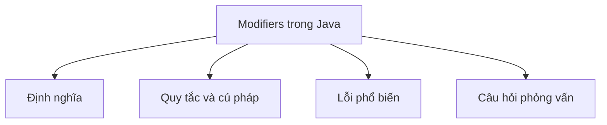

# 10 - Bộ Điều Chỉnh (Modifiers) trong Java

Chủ đề này theo dõi đề cương tổng thể trong [outline.md](../outline.md). Mục tiêu là hiểu sâu từng khái niệm đủ để giải thích, nhận ra trong mã nguồn và trả lời các câu hỏi phỏng vấn.

## Thứ Tự Học

- [Các Khái Niệm Về Bộ Điều Chỉnh Truy Cập (Access Modifier Concepts)](theory/01-access-modifier-concepts.md)
- [Các Khái Niệm Trừu Tượng (Abstract Concepts)](theory/02-abstract-concepts.md)
- [Các Khái Niệm Khối Static (Static Block Concepts)](theory/03-static-block-concepts.md)
- [Thuật Ngữ Chính (Key Terms)](terms/01-key-terms.md)

## Danh Sách Kiểm Tra Đề Cương

- Bộ điều chỉnh truy cập (Access modifier):
  - public
  - protected
  - default
  - private
- Bộ điều chỉnh phi truy cập (Non-access modifier):
  - static
  - final
  - abstract
  - synchronized
  - volatile
  - transient
  - native
  - strictfp
- Biến static (Static variable)
- Phương thức static (Static method)
- Khối static (Static block)
- Lớp lồng static (Static nested class)
- Import static (Static import)
- Biến final (Final variable)
- Phương thức final (Final method)
- Lớp final (Final class)
- Tham số final (Final parameter)
- Biến final trống (Blank final variable)

## Thẻ Anki

- [Basic](anki/basic.tsv)
- [Basic Extra](anki/basic-extra.tsv)
- [Cloze](anki/cloze.tsv)
- [Code Question](anki/code-question.tsv)

## Tổng Quan Mermaid

## Tự Kiểm Tra

Trước khi tiếp tục, hãy xác nhận rằng bạn có thể trả lời các câu hỏi "tại sao" mang tính khái niệm sâu sắc sau:

1. [Tại sao modifier `private` ngăn kế thừa (Inheritance) và truy cập từ bên ngoài, và nó hỗ trợ đóng gói như thế nào?](theory/01-access-modifier-concepts.md#why-private-restricts-access-and-supports-encapsulation)
2. [Tại sao các thành viên `static` được phân bổ theo lớp trong Metaspace thay vì trên Heap, và chúng được chia sẻ qua tất cả các instance như thế nào?](theory/02-abstract-concepts.md#why-static-members-are-allocated-in-metaspace-and-shared)
3. [Tại sao các biến `final` ngăn gán lại, và điều này cho phép tối ưu hóa trình biên dịch như inlining như thế nào?](theory/03-static-block-concepts.md#why-final-variables-prevent-re-assignment-and-enable-inlining)
4. [Tại sao các phương thức `synchronized` dựa vào monitor lock, và tính tái nhập (lock reentrancy) ngăn một luồng (Thread) tự deadlock như thế nào?](theory/02-abstract-concepts.md#why-synchronized-methods-use-monitor-locks-and-reentrancy)
5. [Tại sao từ khóa `volatile` đảm bảo hiển thị bộ nhớ và ngăn sắp xếp lại lệnh, nhưng lại không đảm bảo tính nguyên tử cho các thao tác kết hợp?](theory/02-abstract-concepts.md#why-volatile-guarantees-visibility-and-ordering-but-not-atomicity)

## Liên Kết Tham Khảo

- https://docs.oracle.com/javase/tutorial/java/javaOO/accesscontrol.html
- https://docs.oracle.com/javase/tutorial/java/javaOO/classvars.html
