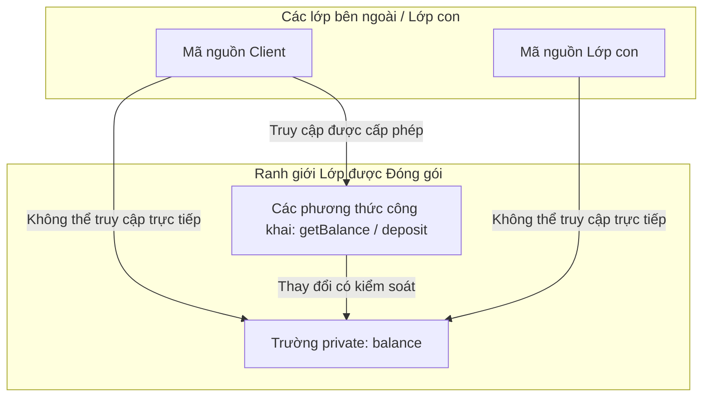

# Các bổ từ trong Java (Modifiers in Java) - Phần 1

## Mục Tiêu Học Tập

Tài liệu này trình bày một phần trọng tâm của **các bổ từ trong Java (Modifiers in Java)**. Hãy nghiên cứu từng khái niệm dưới dạng một quy tắc Java thực tế, thay vì chỉ học từ vựng riêng lẻ.

## Nội Dung Tổng Quan

| Khái niệm | Điều cần biết |
| --- | --- |
| `Access modifier:` | Bổ từ truy cập (Access modifier) là một nhóm các quy tắc liên quan đến các bổ từ trong Java dùng để gom nhóm một số chi tiết liên quan. |
| `public` | public cho phép truy cập từ bất kỳ gói (package) nào khi lớp hoặc thành viên đó có quyền hiển thị. |
| `protected` | protected cho phép truy cập từ cùng một gói và từ các lớp con (subclass), kèm theo các quy tắc truy cập lớp con giữa các gói khác nhau. |
| `default` | Quyền truy cập mặc định (Default access), hay còn gọi là package-private, chỉ cho phép truy cập bên trong cùng một gói. |
| `private` | private giới hạn quyền truy cập chỉ trong phạm vi lớp khai báo. |
| `Non-access modifier:` | Bổ từ phi truy cập (Non-access modifier) là một nhóm các quy tắc liên quan đến các bổ từ trong Java dùng để gom nhóm một số chi tiết liên quan. |
| `static` | static có nghĩa là thành viên thuộc về lớp chứ không phải một đối tượng cụ thể nào. |
| `final` | final có nghĩa là biến, phương thức, lớp hoặc tham số bị hạn chế thay đổi sau đó theo một cách cụ thể. |

## Ghi Chú Chi Tiết

### Bổ từ truy cập (Access modifier):

Bổ từ truy cập (Access modifier) là một nhóm các quy tắc liên quan đến các bổ từ trong Java dùng để gom nhóm một số chi tiết liên quan.


#### Bảng Phạm Vi Hiển Thị Của Bổ Từ Truy Cập
| Bổ từ | Cùng Lớp | Cùng Gói | Lớp con (Khác Gói) | Bên ngoài (Khác Gói) |
| --- | --- | --- | --- | --- |
| `public` | Có | Có | Có | Có |
| `protected` | Có | Có | Có (chỉ qua kế thừa (inheritance)) | Không |
| `default` (không từ khóa) | Có | Có | Không | Không |
| `private` | Có | Không | Không | Không |

#### Quy Tắc Cốt Lõi: Ghi Đè (Overriding) và Phạm Vi Truy Cập
Khi một lớp con ghi đè một phương thức của lớp cha, nó **không được phép thu hẹp** phạm vi truy cập của phương thức đó. Quy tắc này đảm bảo nguyên lý thay thế Liskov (Liskov Substitution Principle).
- Hợp lệ (Nới lỏng hoặc Giữ nguyên): Phương thức cha là `protected` ➔ Phương thức con là `protected` hoặc `public`.
- Lỗi biên dịch (Thu hẹp): Phương thức cha là `protected` ➔ Phương thức con là `default` hoặc `private`.

#### Ví Dụ Mã Nguồn Bổ Từ Truy Cập
```java
// File: access/AccessControlDemo.java
package access;

public class AccessControlDemo {
    public int publicVar = 1;
    protected int protectedVar = 2;
    int defaultVar = 3; // package-private
    private int privateVar = 4;

    public void showAccess() {
        System.out.println(publicVar);    // OK
        System.out.println(protectedVar); // OK
        System.out.println(defaultVar);   // OK
        System.out.println(privateVar);   // OK
    }
}
```

Kiểm tra thực tế:

- Định nghĩa `Access modifier:` trong một câu.
- Nhận biết `Access modifier:` trong mã nguồn, câu lệnh, tài liệu hoặc các câu hỏi phỏng vấn.
- Giải thích một lỗi, hạn chế hoặc đánh đổi liên quan đến `Access modifier:`.

Ví dụ nhỏ hoặc mô hình tư duy:

- Khi đọc mã nguồn, hãy hỏi: `Access modifier:` thay đổi, cho phép, từ chối hoặc làm rõ điều gì?

### public

public cho phép truy cập từ bất kỳ gói nào khi lớp hoặc thành viên đó có quyền hiển thị.


#### Ví Dụ Mã Nguồn public
```java
// File: packages/PublicClass.java
package packages;

public class PublicClass {
    public void execute() {
        System.out.println("Public method accessed successfully.");
    }
}
```

#### Sai Lầm Thường Gặp - Sự không khớp giữa độ hiển thị của Lớp và Thành viên
Khai báo một thành viên là `public` bên trong một lớp package-private (mặc định) làm cho nó trông như thể có thể truy cập được ở mọi nơi. Tuy nhiên, vì bản thân lớp đó không thể được import bên ngoài gói của nó, thành viên `public` đó vẫn không thể truy cập được.

Kiểm tra thực tế:

- Định nghĩa `public` trong một câu.
- Nhận biết `public` trong mã nguồn, câu lệnh, tài liệu hoặc các câu hỏi phỏng vấn.
- Giải thích một lỗi, hạn chế hoặc đánh đổi liên quan đến `public`.

Ví dụ nhỏ hoặc mô hình tư duy:

- Khi đọc mã nguồn, hãy hỏi: `public` thay đổi, cho phép, từ chối hoặc làm rõ điều gì?

### protected

protected cho phép truy cập từ cùng một gói và từ các lớp con, đi kèm với các quy tắc truy cập lớp con giữa các gói khác nhau.


#### Ví Dụ Mã Nguồn protected
```java
// File: p1/Parent.java
package p1;
public class Parent {
    protected String familySecret = "Secret Recipe";
}

// File: p2/Child.java
package p2;
import p1.Parent;

public class Child extends Parent {
    public void printSecret() {
        // Accessing familySecret via inheritance is OK
        System.out.println(this.familySecret); 
        
        // Accessing via Parent instance reference in a different package fails
        Parent p = new Parent();
        // System.out.println(p.familySecret); // COMPILE ERROR!
    }
}
```

#### Sai Lầm Thường Gặp - Truy cập các thành viên protected thông qua tham chiếu lớp Cha
Các lớp con ở gói khác chỉ có thể truy cập các thành viên `protected` của lớp cha thông qua kế thừa (`this.familySecret` hoặc `super.familySecret`). Chúng không thể truy cập các thành viên này bằng một biến tham chiếu của lớp cha.

Kiểm tra thực tế:

- Định nghĩa `protected` trong một câu.
- Nhận biết `protected` trong mã nguồn, câu lệnh, tài liệu hoặc các câu hỏi phỏng vấn.
- Giải thích một lỗi, hạn chế hoặc đánh đổi liên quan đến `protected`.

Ví dụ nhỏ hoặc mô hình tư duy:

- Khi đọc mã nguồn, hãy hỏi: `protected` thay đổi, cho phép, từ chối hoặc làm rõ điều gì?

### default

Quyền truy cập mặc định (Default access), hay còn gọi là package-private, chỉ cho phép truy cập bên trong cùng một gói.


#### Ví Dụ Mã Nguồn Phạm Vi default
```java
// File: p1/DefaultClass.java
package p1;

class DefaultClass { // package-private class
    void doPackageWork() { // package-private method
        System.out.println("Working within package p1.");
    }
}
```

#### Sai Lầm Thường Gặp - Sử dụng từ khóa 'default' làm bổ từ truy cập
Mức độ truy cập mặc định được thể hiện bằng việc lược bỏ hoàn toàn bổ từ truy cập. Việc viết `default class MyClass {}` hoặc `default int x;` bên trong một lớp là lỗi biên dịch. Từ khóa `default` chỉ hợp lệ bên trong các giao diện (interface) để khai báo các phương thức mặc định (default method), hoặc trong các khối lệnh switch.

Kiểm tra thực tế:

- Định nghĩa `default` trong một câu.
- Nhận biết `default` trong mã nguồn, câu lệnh, tài liệu hoặc các câu hỏi phỏng vấn.
- Giải thích một lỗi, hạn chế hoặc đánh đổi liên quan đến `default`.

Ví dụ nhỏ hoặc mô hình tư duy:

- Khi đọc mã nguồn, hãy hỏi: `default` thay đổi, cho phép, từ chối hoặc làm rõ điều gì?

### private

private giới hạn quyền truy cập chỉ trong lớp khai báo.


#### Ví Dụ Mã Nguồn private
```java
public class SecureVault {
    private String passcode = "1234";

    private void decrypt() {
        System.out.println("Decrypting vault...");
    }

    public class Nestmate {
        public void accessVault() {
            // Nested classes can access private members of the outer class
            System.out.println("Passcode: " + passcode); 
            decrypt();
        }
    }
}
```

#### Mẫu Thiết Kế: Hàm khởi tạo private (Private Constructor)
Một trong những ứng dụng phổ biến nhất của `private` là áp dụng lên hàm khởi tạo (constructor) để ngăn chặn việc tạo đối tượng (instantiation) từ bên ngoài.
- **Utility Classes**: Các lớp chứa toàn phương thức `static` (như `java.lang.Math` hoặc `java.util.Collections`) sử dụng hàm khởi tạo `private` để ngăn lập trình viên vô tình gọi `new Math()`.
- **Singleton Pattern**: Các lớp chỉ cho phép duy nhất một thể hiện (instance) tồn tại trong hệ thống sẽ đặt hàm khởi tạo là `private` và cung cấp một phương thức `public static getInstance()` để truy xuất.

#### Sai Lầm Thường Gặp - Các phương thức private không tham gia vào tính đa hình
Nếu một lớp con định nghĩa một phương thức có cùng chữ ký (signature) với một phương thức `private` trong lớp cha, nó sẽ không ghi đè (override) phương thức đó. Nó được coi là một phương thức hoàn toàn tách biệt, và liên kết động (dynamic binding) sẽ không chuyển hướng gọi phương thức đến phiên bản của lớp con.

Kiểm tra thực tế:

- Định nghĩa `private` trong một câu.
- Nhận biết `private` trong mã nguồn, câu lệnh, tài liệu hoặc các câu hỏi phỏng vấn.
- Giải thích một lỗi, hạn chế hoặc đánh đổi liên quan đến `private`.

Ví dụ nhỏ hoặc mô hình tư duy:

- Khi đọc mã nguồn, hãy hỏi: `private` thay đổi, cho phép, từ chối hoặc làm rõ điều gì?

## Tại Sao Private Giới Hạn Truy Cập Và Hỗ Trợ Đóng Gói (Encapsulation)

Bổ từ `private` là mức độ giới hạn truy cập mạnh nhất trong Java, giới hạn quyền truy cập duy nhất trong lớp khai báo (bao gồm cả các lớp lồng nhau của nó). Bằng cách hạn chế truy cập, `private` ngăn chặn các lớp bên ngoài và lớp con trực tiếp đọc hoặc thay đổi trạng thái nội bộ của một đối tượng. Điều này thiết lập một ranh giới nghiêm ngặt, nơi trạng thái của một đối tượng chỉ có thể bị thay đổi thông qua các phương thức công khai có kiểm tra tính hợp lệ của đầu vào, từ đó ngăn đối tượng rơi vào trạng thái không nhất quán hoặc không hợp lệ. Hơn nữa, vì các lớp con không thể truy cập trực tiếp vào các trường private của lớp cha, mã nguồn lớp con không thể phụ thuộc vào chi tiết triển khai nội bộ của lớp cha, giúp duy trì tính độc lập (decoupling) và ngăn các thay đổi ở lớp con làm phá vỡ các ràng buộc bất biến (invariant) của lớp cha.

### Mô Hình Ranh Giới Đóng Gói



### Ví Dụ Mã Nguồn: Ngăn Chặn Thay Đổi Không Hợp Lệ
```java
public class SecureBankAccount {
    private double balance = 100.0;

    public double getBalance() {
        return this.balance; // Controlled access
    }

    public void deposit(double amount) {
        if (amount > 0) {
            this.balance += amount; // Validated mutation
        }
    }
}

class Client {
    public static void main(String[] args) {
        SecureBankAccount account = new SecureBankAccount();
        // account.balance = -500.0; // COMPILE ERROR: balance has private access in SecureBankAccount
        account.deposit(50.0);
        System.out.println(account.getBalance()); // Output: 150.0
    }
}
```

### Chuỗi Nguyên Nhân - Kết Quả Của Tính Đóng Gói
- **Tác nhân kích hoạt (Trigger)**: Trường được đánh dấu bằng bổ từ `private`.
- **Ảnh hưởng tức thời (Immediate Effect)**: Trình biên dịch từ chối mọi hành vi đọc hoặc ghi trực tiếp từ bên ngoài vào trường đó.
- **Ảnh hưởng gián tiếp (Secondary Effect)**: Khả năng thay đổi giá trị được điều hướng duy nhất qua các API phương thức công khai để áp dụng các quy tắc kiểm tra logic nghiệp vụ.
- **Kết quả cuối cùng (Ultimate Outcome)**: Đối tượng tự đảm bảo các tính chất bất biến của trạng thái của nó, giữ độc lập với các lớp máy khách (client class).


### Bổ từ phi truy cập (Non-access modifier):

Bổ từ phi truy cập (Non-access modifier) là một nhóm các quy tắc liên quan đến các bổ từ trong Java dùng để gom nhóm một số chi tiết liên quan.


#### Ví Dụ Mã Nguồn Bổ Từ Phi Truy Cập
```java
public class NonAccessDemo {
    public static final double GRAVITY = 9.81;
    protected synchronized void threadSafeTask() {
        // synchronized method block
    }
}
```

Kiểm tra thực tế:

- Định nghĩa `Non-access modifier:` trong một câu.
- Nhận biết `Non-access modifier:` trong mã nguồn, câu lệnh, tài liệu hoặc các câu hỏi phỏng vấn.
- Giải thích một lỗi, hạn chế hoặc đánh đổi liên quan đến `Non-access modifier:`.

Ví dụ nhỏ hoặc mô hình tư duy:

- Khi đọc mã nguồn, hãy hỏi: `Non-access modifier:` thay đổi, cho phép, từ chối hoặc làm rõ điều gì?

### static

static có nghĩa là thành viên thuộc về lớp chứ không phải một đối tượng cụ thể nào.


#### Ví Dụ Mã Nguồn static
```java
public class Counter {
    public static int count = 0; // Class-level variable
    
    public static void increment() { // Class-level method
        count++;
    }
}
```

#### Sai Lầm Thường Gặp - Truy cập các thành viên static thông qua tham chiếu null
Java cho phép gọi các phương thức static hoặc truy cập các biến static thông qua một tham chiếu đối tượng, ngay cả khi tham chiếu đó là `null`. JVM sẽ không ném ra ngoại lệ chỉ mục null `NullPointerException` vì trình biên dịch giải quyết lượt gọi bằng cách sử dụng kiểu static của tham chiếu chứ không phải đối tượng tại thời điểm chạy (runtime object). Việc này cực kỳ không được khuyến khích vì nó gây hiểu lầm cho người đọc rằng đó là một lượt gọi phương thức thể hiện (instance method).
```java
Counter obj = null;
obj.increment(); // Compiles and runs fine! No NullPointerException.
```

Kiểm tra thực tế:

- Định nghĩa `static` trong một câu.
- Nhận biết `static` trong mã nguồn, câu lệnh, tài liệu hoặc các câu hỏi phỏng vấn.
- Giải thích một lỗi, hạn chế hoặc đánh đổi liên quan đến `static`.

Ví dụ nhỏ hoặc mô hình tư duy:

- `ClassName.member` truy cập một thành viên ở cấp độ lớp.

### final

final có nghĩa là biến, phương thức, lớp hoặc tham số bị hạn chế thay đổi sau đó theo một cách cụ thể.

Hãy sử dụng khái niệm này để dự đoán chính xác quy tắc Java, dạng được cho phép, và các trường hợp lỗi xảy ra. Hãy ôn tập bằng một ví dụ nhỏ thay vì chỉ học vẹt nhãn định nghĩa.

#### Ví Dụ Mã Nguồn final
```java
public final class ImmutableConfig {
    public final double limit = 100.0;
    
    public final void printLimit() {
        System.out.println(limit);
    }
}
```

#### Sai Lầm Thường Gặp - Tham chiếu final so với Đối tượng final
Việc khai báo một tham chiếu đối tượng là `final` ngăn bản thân tham chiếu đó bị gán lại cho một đối tượng khác, nhưng nó KHÔNG làm cho đối tượng được tham chiếu trở nên bất biến (immutable). Các trường nội bộ của đối tượng vẫn có thể bị thay đổi.
```java
final java.util.List<String> list = new java.util.ArrayList<>();
list.add("allowed"); // OK! The list object is modified
// list = new java.util.ArrayList<>(); // COMPILE ERROR! Cannot reassign a final reference
```

Kiểm tra thực tế:

- Định nghĩa `final` trong một câu.
- Nhận biết `final` trong mã nguồn, câu lệnh, tài liệu hoặc các câu hỏi phỏng vấn.
- Giải thích một lỗi, hạn chế hoặc đánh đổi liên quan đến `final`.

Ví dụ nhỏ hoặc mô hình tư duy:

- `final int limit = 10;` không thể bị gán lại giá trị.

## Ví Dụ Thực Tế: Tại sao việc công khai trường làm phá vỡ tính đóng gói — ví dụ tài khoản ngân hàng

### Vấn Đề: Các trường công khai
Hãy xem xét một lớp `BankAccount` đơn giản có trường số dư `balance` được khai báo là `public`:

```java
public class BankAccount {
    public double balance; // Public field - direct access allowed
}
```

Giờ đây, bất kỳ lớp bên ngoài nào cũng có thể trực tiếp đọc và ghi vào trường này mà lớp `BankAccount` không hề biết hoặc không thể kiểm tra tính hợp lệ của thay đổi đó:

```java
BankAccount account = new BankAccount();
account.balance = -1000.0; // Problem 1: Invalid state (negative balance)
account.balance = 9999999.0; // Problem 2: Unauthorized modifications
```

Bằng cách công khai `balance`, chúng ta đã phá vỡ **tính đóng gói (encapsulation)**. Lớp này không có quyền kiểm soát trạng thái nội bộ của chính nó, và chúng ta không thể đảm bảo các tính chất bất biến của nó (ví dụ: số dư không thể âm).

### Giải Pháp: Trường private với Phương thức Getter và Setter (Đóng gói)
Để khắc phục điều này, chúng ta giới hạn quyền truy cập vào `balance` bằng cách khai báo nó là `private` và cung cấp các điểm truy cập được kiểm soát thông qua các phương thức:

```java
public class SecureBankAccount {
    private double balance; // Encapsulated field

    public SecureBankAccount(double initialBalance) {
        if (initialBalance >= 0) {
            this.balance = initialBalance;
        } else {
            this.balance = 0;
        }
    }

    public double getBalance() {
        return balance;
    }

    public void deposit(double amount) {
        if (amount > 0) {
            balance += amount;
        }
    }

    public void withdraw(double amount) {
        if (amount > 0 && balance >= amount) {
            balance -= amount;
        } else {
            throw new IllegalArgumentException("Insufficient funds or invalid amount");
        }
    }
}
```

### Hệ Quả Của Tính Đóng Gói
1. **Kiểm tra tính hợp lệ và Kiểm soát**: Lớp `SecureBankAccount` giờ đây có thể thực thi các quy tắc. Mã nguồn bên ngoài không thể thiết lập số dư âm hoặc rút nhiều hơn số tiền họ có.
2. **Truy cập Chỉ đọc / Chỉ ghi (Read-Only / Write-Only)**: Chúng ta có thể đặt trường này ở chế độ chỉ đọc đối với bên ngoài bằng cách chỉ cung cấp getter mà không có setter trực tiếp (việc gửi và rút tiền được điều khiển bằng hành vi phương thức, không phải thay đổi trạng thái trực tiếp).
3. **Tính độc lập của cấu trúc lưu trữ nội bộ (Internal Representation Independence)**: Nếu chúng ta quyết định thay đổi kiểu dữ liệu nội bộ của `balance` từ `double` sang `java.math.BigDecimal` (để chính xác hơn về mặt tiền tệ), chúng ta có thể thực hiện việc này mà không làm hỏng bất kỳ mã nguồn client nào vì API công khai (các phương thức) vẫn giữ nguyên.

### Best Practice (Thực Hành Tốt Nhất)
Nguyên tắc ngón tay cái trong thiết kế Java là: **"Luôn bắt đầu với mức truy cập nghiêm ngặt nhất (private) và chỉ nới lỏng khi thực sự cần thiết."** 
Hạn chế tối đa việc sử dụng `public` cho các trường dữ liệu (fields), và chỉ nên dùng `public` cho các phương thức đóng vai trò là API giao tiếp chính thức của lớp.

## Các Câu Hỏi Ôn Tập Thường Gặp

- Những khái niệm nào ở đây là quy tắc trong thời gian biên dịch (compile-time)?
- Những khái niệm nào ở đây ảnh hưởng đến hành vi khi chạy ứng dụng (runtime)?
- Những khái niệm nào ở đây có khả năng là bẫy phỏng vấn?
