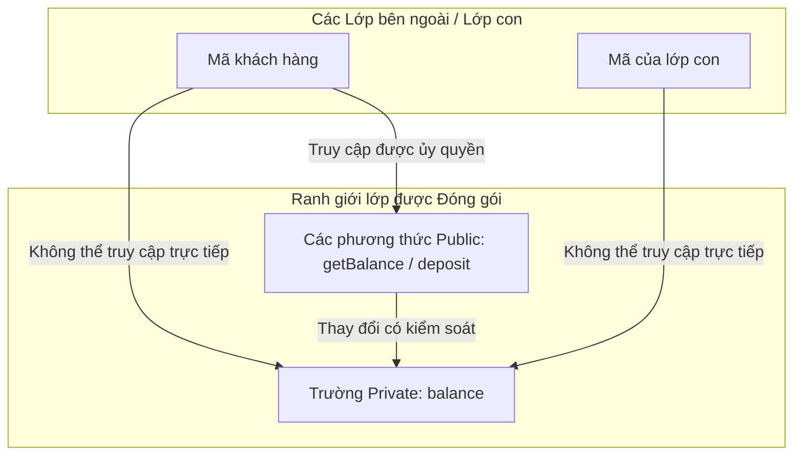

# Trình sửa đổi trong Java - Phần 1 (Modifiers in Java - Part 1)

## Mục tiêu học tập (Learning Goal)

Tài liệu này bao gồm một phần nội dung trọng tâm về **Trình sửa đổi trong Java (Modifiers in Java)**. Hãy nghiên cứu từng khái niệm dưới dạng quy tắc thực tế trong Java, chứ không chỉ là từ vựng rời rạc.

## Các khái niệm bao phủ (Outline Coverage)

| Khái niệm | Những điều cần biết |
| --- | --- |
| `Access modifier:` | Trình sửa đổi truy cập (phạm vi truy cập) là một nhóm quy tắc liên quan trong Trình sửa đổi trong Java để nhóm một số chi tiết cụ thể. |
| `public` | public cho phép truy cập từ bất kỳ package nào khi lớp hoặc thành viên đó có thể nhìn thấy. |
| `protected` | protected cho phép truy cập từ cùng một package và từ các lớp con, kèm theo quy tắc truy cập của lớp con giữa các package. |
| `default` | Quyền truy cập mặc định (default access), còn gọi là package-private, chỉ cho phép truy cập bên trong cùng một package. |
| `private` | private giới hạn quyền truy cập chỉ trong phạm vi lớp khai báo. |
| `Non-access modifier:` | Trình sửa đổi phi truy cập là một nhóm quy tắc liên quan trong Trình sửa đổi trong Java để nhóm một số chi tiết cụ thể. |
| `static` | Static có nghĩa là thành viên thuộc về lớp hơn là thuộc về một đối tượng cụ thể nào đó. |
| `final` | Final có nghĩa là biến, phương thức, lớp hoặc tham số bị hạn chế thay đổi sau này theo một cách cụ thể. |

---

## Ghi chú chi tiết (Detailed Notes)

### Trình sửa đổi truy cập (Access modifier)

Trình sửa đổi truy cập là một nhóm quy tắc liên quan trong Trình sửa đổi trong Java để nhóm một số chi tiết cụ thể.

Sử dụng nó để dự đoán quy tắc Java chính xác, dạng được cho phép và cơ chế phát hiện lỗi. Ôn tập bằng ví dụ nhỏ thay vì chỉ ghi nhớ nhãn định nghĩa.

#### Bảng mức độ hiển thị của Trình sửa đổi truy cập (Access Modifier Visibility Table)
| Trình sửa đổi | Cùng Lớp | Cùng Package | Lớp con (Khác Package) | Thế giới bên ngoài (Khác Package) |
| --- | --- | --- | --- | --- |
| `public` | Có | Có | Có | Có |
| `protected` | Có | Có | Có (chỉ qua kế thừa) | Không |
| `default` (không từ khóa) | Có | Có | Không | Không |
| `private` | Có | Không | Không | Không |

#### Ví dụ Code Trình sửa đổi truy cập (Access Modifier Code Example)
```java
// File: access/AccessControlDemo.java
package access;

public class AccessControlDemo {
    public int publicVar = 1;
    protected int protectedVar = 2;
    int defaultVar = 3; // package-private
    private int privateVar = 4;

    public void showAccess() {
        System.out.println(publicVar);    // OK
        System.out.println(protectedVar); // OK
        System.out.println(defaultVar);   // OK
        System.out.println(privateVar);   // OK
    }
}
```

Kiểm tra thực tế:

- Định nghĩa `Access modifier:` trong một câu.
- Nhận biết `Access modifier:` trong code, câu lệnh, tài liệu hoặc câu hỏi phỏng vấn.
- Giải thích một lỗi (bug), hạn chế hoặc sự đánh đổi liên quan đến `Access modifier:`.

Ví dụ nhỏ hoặc mô hình tư duy:

- Khi đọc code, hãy hỏi: `Access modifier:` thay đổi, cho phép, từ chối hay làm rõ điều gì?

### public

public cho phép truy cập từ bất kỳ package nào khi lớp hoặc thành viên đó có thể nhìn thấy.

Sử dụng nó để dự đoán quy tắc Java chính xác, dạng được cho phép và cơ chế phát hiện lỗi. Ôn tập bằng ví dụ nhỏ thay vì chỉ ghi nhớ nhãn định nghĩa.

#### Ví dụ Code public (public Code Example)
```java
// File: packages/PublicClass.java
package packages;

public class PublicClass {
    public void execute() {
        System.out.println("Public method accessed successfully.");
    }
}
```

#### Lỗi thường gặp - Không khớp mức độ hiển thị giữa Lớp và Thành viên (Common Mistake - Mismatched Class and Member Visibility)
Khai báo một thành viên `public` bên trong một lớp package-private (mặc định) làm cho nó trông như có thể truy cập ở mọi nơi. Tuy nhiên, vì chính lớp đó không thể được import bên ngoài package của nó, thành viên `public` đó vẫn không thể truy cập được.

Kiểm tra thực tế:

- Định nghĩa `public` trong một câu.
- Nhận biết `public` trong code, câu lệnh, tài liệu hoặc câu hỏi phỏng vấn.
- Giải thích một lỗi, hạn chế hoặc sự đánh đổi liên quan đến `public`.

Ví dụ nhỏ hoặc mô hình tư duy:

- Khi đọc code, hãy hỏi: `public` thay đổi, cho phép, từ chối hay làm rõ điều gì?

### protected

protected cho phép truy cập từ cùng một package và từ các lớp con, kèm theo quy tắc truy cập của lớp con giữa các package.

Sử dụng nó để dự đoán quy tắc Java chính xác, dạng được cho phép và cơ chế phát hiện lỗi. Ôn tập bằng ví dụ nhỏ thay vì chỉ ghi nhớ nhãn định nghĩa.

#### Ví dụ Code protected (protected Code Example)
```java
// File: p1/Parent.java
package p1;
public class Parent {
    protected String familySecret = "Secret Recipe";
}

// File: p2/Child.java
package p2;
import p1.Parent;

public class Child extends Parent {
    public void printSecret() {
        // Accessing familySecret via inheritance is OK
        System.out.println(this.familySecret); 
        
        // Accessing via Parent instance reference in a different package fails
        Parent p = new Parent();
        // System.out.println(p.familySecret); // COMPILE ERROR!
    }
}
```

#### Lỗi thường gặp - Truy cập thành viên protected qua tham chiếu của Lớp cha (Common Mistake - Accessing protected members via Parent reference)
Các lớp con ở package khác chỉ có thể truy cập các thành viên `protected` của lớp cha thông qua kế thừa (`this.familySecret` hoặc `super.familySecret`). Chúng không thể truy cập chúng bằng cách sử dụng một biến tham chiếu của lớp cha.

Kiểm tra thực tế:

- Định nghĩa `protected` trong một câu.
- Nhận biết `protected` trong code, câu lệnh, tài liệu hoặc câu hỏi phỏng vấn.
- Giải thích một lỗi, hạn chế hoặc sự đánh đổi liên quan đến `protected`.

Ví dụ nhỏ hoặc mô hình tư duy:

- Khi đọc code, hãy hỏi: `protected` thay đổi, cho phép, từ chối hay làm rõ điều gì?

### default

Quyền truy cập mặc định (default access), còn gọi là package-private, chỉ cho phép truy cập bên trong cùng một package.

Sử dụng nó để dự đoán quy tắc Java chính xác, dạng được cho phép và cơ chế phát hiện lỗi. Ôn tập bằng ví dụ nhỏ thay vì chỉ ghi nhớ nhãn định nghĩa.

#### Ví dụ Code Phạm vi mặc định (default Access Code Example)
```java
// File: p1/DefaultClass.java
package p1;

class DefaultClass { // package-private class
    void doPackageWork() { // package-private method
        System.out.println("Working within package p1.");
    }
}
```

#### Lỗi thường gặp - Sử dụng từ khóa 'default' làm trình sửa đổi truy cập (Common Mistake - Using 'default' keyword as an access modifier)
Mức độ truy cập mặc định được chỉ định bằng cách loại bỏ hoàn toàn trình sửa đổi. Việc viết `default class MyClass {}` hoặc `default int x;` bên trong một lớp là một lỗi biên dịch. Từ khóa `default` chỉ hợp lệ bên trong các giao diện (interface) để khai báo các phương thức mặc định, hoặc trong các khối lệnh switch.

Kiểm tra thực tế:

- Định nghĩa `default` trong một câu.
- Nhận biết `default` trong code, câu lệnh, tài liệu hoặc câu hỏi phỏng vấn.
- Giải thích một lỗi, hạn chế hoặc sự đánh đổi liên quan đến `default`.

Ví dụ nhỏ hoặc mô hình tư duy:

- Khi đọc code, hãy hỏi: `default` thay đổi, cho phép, từ chối hay làm rõ điều gì?

### private

private giới hạn quyền truy cập chỉ trong phạm vi lớp khai báo.

Sử dụng nó để dự đoán quy tắc Java chính xác, dạng được cho phép và cơ chế phát hiện lỗi. Ôn tập bằng ví dụ nhỏ thay vì chỉ ghi nhớ nhãn định nghĩa.

#### Ví dụ Code private (private Code Example)
```java
public class SecureVault {
    private String passcode = "1234";

    private void decrypt() {
        System.out.println("Decrypting vault...");
    }

    public class Nestmate {
        public void accessVault() {
            // Nested classes can access private members of the outer class
            System.out.println("Passcode: " + passcode); 
            decrypt();
        }
    }
}
```

#### Lỗi thường gặp - Các phương thức private không tham gia vào đa hình (Common Mistake - Private methods do not participate in polymorphism)
Nếu một lớp con định nghĩa một phương thức có cùng chữ ký với một phương thức `private` trong lớp cha, nó không ghi đè phương thức đó. Nó được coi là một phương thức hoàn toàn riêng biệt, và cơ chế liên kết động (dynamic binding) sẽ không điều phối cuộc gọi đến phiên bản của lớp con.

Kiểm tra thực tế:

- Định nghĩa `private` trong một câu.
- Nhận biết `private` trong code, câu lệnh, tài liệu hoặc câu hỏi phỏng vấn.
- Giải thích một lỗi, hạn chế hoặc sự đánh đổi liên quan đến `private`.

Ví dụ nhỏ hoặc mô hình tư duy:

- Khi đọc code, hãy hỏi: `private` thay đổi, cho phép, từ chối hay làm rõ điều gì?

---

## Tại sao Private hạn chế truy cập và hỗ trợ tính Đóng gói (Why Private Restricts Access and Supports Encapsulation)

Trình sửa đổi `private` là giới hạn truy cập mạnh nhất trong Java, chỉ cho phép truy cập duy nhất bên trong lớp khai báo (bao gồm cả các lớp lồng nhau của nó). Bằng cách hạn chế truy cập, `private` ngăn các lớp bên ngoài và các lớp con đọc hoặc sửa đổi trực tiếp trạng thái bên trong của đối tượng. Điều này thực thi một ranh giới nghiêm ngặt nơi trạng thái của một đối tượng chỉ có thể bị thay đổi thông qua các phương thức public thực hiện kiểm tra đầu vào, từ đó ngăn đối tượng rơi vào trạng thái không nhất quán hoặc không hợp lệ. Hơn nữa, vì các lớp con không thể truy cập trực tiếp các trường private của lớp cha, mã của lớp con không thể phụ thuộc vào chi tiết triển khai bên trong của lớp cha, giúp duy trì tính độc lập (decoupling) và ngăn các sửa đổi ở lớp con phá vỡ các bất biến (invariants) của lớp cha.

### Mô hình ranh giới đóng gói (Encapsulation Boundary Model)



### Ví dụ Code: Ngăn chặn các sửa đổi không hợp lệ (Code Example: Preventing Invalid Modifications)
```java
public class SecureBankAccount {
    private double balance = 100.0;

    public double getBalance() {
        return this.balance; // Controlled access
    }

    public void deposit(double amount) {
        if (amount > 0) {
            this.balance += amount; // Validated mutation
        }
    }
}

class Client {
    public static void main(String[] args) {
        SecureBankAccount account = new SecureBankAccount();
        // account.balance = -500.0; // COMPILE ERROR: balance has private access in SecureBankAccount
        account.deposit(50.0);
        System.out.println(account.getBalance()); // Output: 150.0
    }
}
```

### Chuỗi Nguyên nhân - Kết quả của tính Đóng gói (Cause-Effect Chain of Encapsulation)
- **Kích hoạt (Trigger)**: Trường dữ liệu được đánh dấu bằng trình sửa đổi `private`.
- **Hiệu ứng tức thời (Immediate Effect)**: Trình biên dịch từ chối mọi truy cập đọc hoặc ghi trực tiếp bên ngoài vào trường này.
- **Hiệu ứng gián tiếp (Secondary Effect)**: Khả năng thay đổi được chuyển hướng duy nhất thông qua các API phương thức public để thực thi các quy tắc kiểm tra logic nghiệp vụ.
- **Kết quả cuối cùng (Ultimate Outcome)**: Đối tượng tự đảm bảo các bất biến trạng thái của chính nó, tách biệt hoàn toàn khỏi các lớp khách hàng.

---

### Trình sửa đổi phi truy cập (Non-access modifier)

Trình sửa đổi phi truy cập là một nhóm quy tắc liên quan trong Trình sửa đổi trong Java để nhóm một số chi tiết cụ thể.

Sử dụng nó để dự đoán quy tắc Java chính xác, dạng được cho phép và cơ chế phát hiện lỗi. Ôn tập bằng ví dụ nhỏ thay vì chỉ ghi nhớ nhãn định nghĩa.

#### Ví dụ Code Trình sửa đổi phi truy cập (Non-access modifier Code Example)
```java
public class NonAccessDemo {
    public static final double GRAVITY = 9.81;
    protected synchronized void threadSafeTask() {
        // synchronized method block
    }
}
```

Kiểm tra thực tế:

- Định nghĩa `Non-access modifier:` trong một câu.
- Nhận biết `Non-access modifier:` trong code, câu lệnh, tài liệu hoặc câu hỏi phỏng vấn.
- Giải thích một lỗi, hạn chế hoặc sự đánh đổi liên quan đến `Non-access modifier:`.

Ví dụ nhỏ hoặc mô hình tư duy:

- Khi đọc code, hãy hỏi: `Non-access modifier:` thay đổi, cho phép, từ chối hay làm rõ điều gì?

### static

Static có nghĩa là thành viên thuộc về lớp hơn là thuộc về một đối tượng cụ thể nào đó.

Sử dụng nó để dự đoán quy tắc Java chính xác, dạng được cho phép và cơ chế phát hiện lỗi. Ôn tập bằng ví dụ nhỏ thay vì chỉ ghi nhớ nhãn định nghĩa.

#### Ví dụ Code static (static Code Example)
```java
public class Counter {
    public static int count = 0; // Class-level variable
    
    public static void increment() { // Class-level method
        count++;
    }
}
```

#### Lỗi thường gặp - Truy cập các thành viên static thông qua tham chiếu null (Common Mistake - Accessing static members on a null reference)
Java cho phép gọi các phương thức tĩnh hoặc truy cập các biến tĩnh trên một tham chiếu đối tượng, ngay cả khi tham chiếu đó là `null`. JVM không ném ra `NullPointerException` vì trình biên dịch giải quyết cuộc gọi dựa trên kiểu tĩnh của tham chiếu chứ không phải đối tượng lúc chạy. Điều này cực kỳ không khuyến khích vì nó gây hiểu lầm cho người đọc rằng đó là một lời gọi phương thức thể hiện.
```java
Counter obj = null;
obj.increment(); // Compiles and runs fine! No NullPointerException.
```

Kiểm tra thực tế:

- Định nghĩa `static` trong một câu.
- Nhận biết `static` trong code, câu lệnh, tài liệu hoặc câu hỏi phỏng vấn.
- Giải thích một lỗi, hạn chế hoặc sự đánh đổi liên quan đến `static`.

Ví dụ nhỏ hoặc mô hình tư duy:

- `ClassName.member` truy cập vào một thành viên cấp lớp.

### final

Final có nghĩa là biến, phương thức, lớp hoặc tham số bị hạn chế thay đổi sau này theo một cách cụ thể.

Sử dụng nó để dự đoán quy tắc Java chính xác, dạng được cho phép và cơ chế phát hiện lỗi. Ôn tập bằng ví dụ nhỏ thay vì chỉ ghi nhớ nhãn định nghĩa.

#### Ví dụ Code final (final Code Example)
```java
public final class ImmutableConfig {
    public final double limit = 100.0;
    
    public final void printLimit() {
        System.out.println(limit);
    }
}
```

#### Lỗi thường gặp - Tham chiếu final so với Đối tượng final (Common Mistake - Final reference vs Final object)
Việc khai báo một tham chiếu đối tượng là `final` ngăn bản thân tham chiếu đó bị gán lại cho một đối tượng khác, nhưng nó KHÔNG làm cho đối tượng được tham chiếu trở nên bất biến. Các trường nội bộ của đối tượng vẫn có thể sửa đổi được.
```java
final java.util.List<String> list = new java.util.ArrayList<>();
list.add("allowed"); // OK! The list object is modified
// list = new java.util.ArrayList<>(); // COMPILE ERROR! Cannot reassign a final reference
```

Kiểm tra thực tế:

- Định nghĩa `final` trong một câu.
- Nhận biết `final` trong code, câu lệnh, tài liệu hoặc câu hỏi phỏng vấn.
- Giải thích một lỗi, hạn chế hoặc sự đánh đổi liên quan đến `final`.

Ví dụ nhỏ hoặc mô hình tư duy:

- `final int limit = 10;` không thể gán lại giá trị.

---

## Case Study: Tại sao khai báo một trường dữ liệu public lại phá vỡ tính đóng gói — ví dụ tài khoản ngân hàng (Case Study: Why making a field public breaks encapsulation — bank account example)

### Vấn đề: Trường dữ liệu Public (The Problem: Public Fields)
Hãy xem xét một lớp `BankAccount` đơn giản có trường balance được khai báo là `public`:

```java
public class BankAccount {
    public double balance; // Public field - direct access allowed
}
```

Bây giờ, bất kỳ lớp bên ngoài nào cũng có thể đọc và ghi trực tiếp vào trường này mà lớp `BankAccount` không hề biết hoặc không thể kiểm tra tính hợp lệ của sự thay đổi đó:

```java
BankAccount account = new BankAccount();
account.balance = -1000.0; // Problem 1: Invalid state (negative balance)
account.balance = 9999999.0; // Problem 2: Unauthorized modifications
```

Bằng cách khai báo `balance` là public, chúng ta đã phá vỡ **tính đóng gói (encapsulation)**. Lớp này không có quyền kiểm soát trạng thái nội bộ của chính nó, và chúng ta không thể đảm bảo các bất biến của nó (ví dụ: số dư không thể âm).

### Giải pháp: Trường dữ liệu Private với các Phương thức Getter và Mutator (Tính đóng gói) (The Solution: Private Fields with Getter and Mutator Methods (Encapsulation))
Để khắc phục điều này, chúng ta hạn chế quyền truy cập vào `balance` bằng cách khai báo nó là `private` và cung cấp các điểm truy cập có kiểm soát thông qua các phương thức:

```java
public class SecureBankAccount {
    private double balance; // Encapsulated field

    public SecureBankAccount(double initialBalance) {
        if (initialBalance >= 0) {
            this.balance = initialBalance;
        } else {
            this.balance = 0;
        }
    }

    public double getBalance() {
        return balance;
    }

    public void deposit(double amount) {
        if (amount > 0) {
            balance += amount;
        }
    }

    public void withdraw(double amount) {
        if (amount > 0 && balance >= amount) {
            balance -= amount;
        } else {
            throw new IllegalArgumentException("Insufficient funds or invalid amount");
        }
    }
}
```

### Các hệ quả của tính Đóng gói (Consequences of Encapsulation)
1. **Kiểm tra tính hợp lệ và Kiểm soát (Validation and Control)**: Lớp `SecureBankAccount` giờ đây tự thực thi các quy tắc của nó. Phía gọi không thể đặt số dư âm hoặc rút nhiều hơn số tiền hiện có.
2. **Quyền truy cập Chỉ đọc / Chỉ ghi (Read-Only / Write-Only Access)**: Chúng ta có thể tạo trường chỉ đọc với thế giới bên ngoài bằng cách chỉ cung cấp getter mà không có setter trực tiếp (việc gửi và rút tiền được điều khiển bởi hành vi chứ không phải thay đổi trạng thái trực tiếp).
3. **Tính độc lập của biểu diễn nội bộ (Internal Representation Independence)**: Nếu chúng ta quyết định thay đổi kiểu dữ liệu nội bộ của `balance` từ `double` sang `java.math.BigDecimal` (để tính toán tiền tệ chính xác hơn), chúng ta có thể thực hiện mà không làm hỏng bất kỳ mã khách hàng nào vì API public (các phương thức) vẫn được giữ nguyên.

---

## Các câu hỏi ôn tập phổ biến (Common Review Prompts)

- Khái niệm nào ở đây là các quy tắc tại thời điểm biên dịch?
- Khái niệm nào ở đây ảnh hưởng đến hành vi tại thời điểm chạy?
- Khái niệm nào ở đây dễ là những bẫy câu hỏi phỏng vấn?
