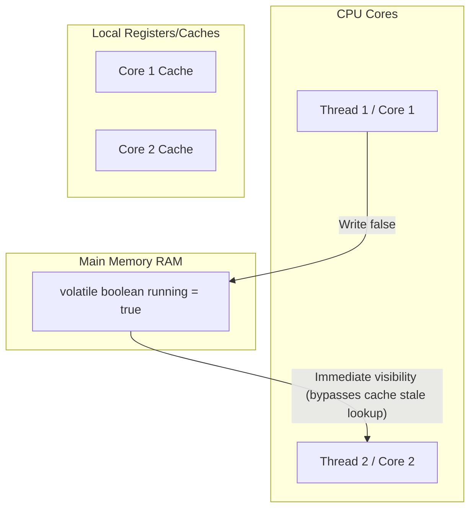

# Các bộ điều chỉnh trong Java (Modifiers in Java) - Phần 2

## Mục tiêu học tập (Learning Goal)

Tập tin này bao gồm một phần trọng tâm về **Các bộ điều chỉnh trong Java (Modifiers in Java)**. Hãy nghiên cứu từng khái niệm như một quy tắc Java thực tế, không phải là từ vựng riêng lẻ.

## Khái quát nội dung (Outline Coverage)

| Khái niệm (Concept) | Điều cần biết (What to know) |
| --- | --- |
| `abstract` | Abstract nghĩa là chưa hoàn thành theo thiết kế: các lớp con (subclass) hoặc các triển khai (implementation) phải cung cấp hành vi còn thiếu. |
| `synchronized` | Synchronized bảo vệ một phân đoạn găng (critical section) bằng cách sử dụng một khóa giám sát (monitor lock). |
| `volatile` | Volatile cung cấp các đảm bảo về khả năng hiển thị (visibility) cho một biến được chia sẻ giữa các luồng (thread), nhưng nó không làm cho các thao tác phức hợp (compound operation) trở nên nguyên tử (atomic). |
| `transient` | Transient đánh dấu một trường nên được bỏ qua trong quá trình tuần tự hóa (serialization) Java. |
| `native` | native là một khái niệm cụ thể trong các bộ điều chỉnh trong Java; tìm hiểu quy tắc Java của nó, các trường hợp sử dụng hợp lệ, và chế độ thất bại thay vì chỉ nhớ tên. |
| `strictfp` | strictfp là một khái niệm cụ thể trong các bộ điều chỉnh trong Java; tìm hiểu quy tắc Java của nó, các trường hợp sử dụng hợp lệ, và chế độ thất bại thay vì chỉ nhớ tên. |
| `Static variable` | Static nghĩa là thành viên thuộc về lớp (class) thay vì một đối tượng (object) cụ thể. |
| `Static method` | Static nghĩa là thành viên thuộc về lớp (class) thay vì một đối tượng (object) cụ thể. |

## Ghi chú chi tiết (Detailed Notes)

### abstract

Abstract nghĩa là chưa hoàn thành theo thiết kế: các lớp con hoặc các triển khai phải cung cấp hành vi còn thiếu.

Sử dụng nó để dự đoán quy tắc Java chính xác, dạng được cho phép, và chế độ thất bại. Hãy xem lại nó với một ví dụ nhỏ thay vì chỉ ghi nhớ nhãn.

#### Ví dụ mã nguồn lớp trừu tượng (abstract Class Code Example)
```java
// Abstract Class definition
public abstract class GraphicObject {
    int x, y;

    // Concrete method in abstract class
    void moveTo(int newX, int newY) {
        this.x = newX;
        this.y = newY;
    }

    // Abstract method (no body, ends with semicolon)
    abstract void draw();
}

// Subclass implementing abstract method
class Circle extends GraphicObject {
    void draw() {
        System.out.println("Drawing a circle at " + x + ", " + y);
    }
}
```

#### Lỗi thường gặp - Khai báo một phương thức trừu tượng có phần thân hoặc bên trong một lớp cụ thể (Common Mistake - Declaring an abstract method with a body or inside a concrete class)
Bất kỳ lớp nào khai báo một hoặc nhiều phương thức `abstract` cũng phải được khai báo là `abstract`. Hơn nữa, các phương thức `abstract` không được có phần thân (không có dấu ngoặc nhọn, chỉ có dấu chấm phẩy ở cuối). Việc viết `abstract void draw() {}` là một lỗi biên dịch vì cặp ngoặc nhọn trống `{}` cấu thành một phần thân phương thức.

Kiểm tra thực tế (Practical check):

- Định nghĩa `abstract` trong một câu.
- Nhận diện `abstract` trong mã nguồn, lệnh, tài liệu hoặc câu hỏi phỏng vấn.
- Giải thích một lỗi (bug), hạn chế hoặc sự đánh đổi liên quan đến `abstract`.

Ví dụ nhỏ hoặc mô hình tư duy (Tiny example or mental model):

- Khi đọc mã nguồn, hãy hỏi: `abstract` thay đổi, cho phép, từ chối hoặc làm rõ điều gì?

### synchronized

Synchronized bảo vệ một phân đoạn găng (critical section) bằng cách sử dụng một khóa giám sát (monitor lock).

Nó quan trọng vì mã nguồn đồng thời (concurrent code) có thể trông chính xác trong các bài kiểm tra đơn luồng (single-thread) nhưng thất bại dưới áp lực thời gian (timing pressure). Một sự nhầm lẫn phổ biến là giả định rằng khả năng hiển thị (visibility), thứ tự (ordering), và tính nguyên tử (atomicity) là cùng một đảm bảo.

#### Ví dụ mã nguồn synchronized (synchronized Code Example)
```java
public class ThreadSafeCounter {
    private int count = 0;

    // Instance synchronized method locks on the 'this' object
    public synchronized void increment() {
        count++;
    }

    // Static synchronized method locks on ThreadSafeCounter.class
    public static synchronized void printHeader() {
        System.out.println("--- Counters Report ---");
    }

    public int getCount() {
        return count;
    }
}
```

#### Lỗi thường gặp - Các phương thức synchronized tĩnh và thể hiện chặn lẫn nhau (Common Mistake - Static and instance synchronized methods blocking each other)
Các phương thức `synchronized` tĩnh (static synchronized method) và các phương thức `synchronized` thể hiện (instance synchronized method) thu được các khóa KHÁC NHAU. Một phương thức synchronized tĩnh khóa trên đối tượng `Class`, trong khi một phương thức synchronized thể hiện khóa trên thực thể đối tượng riêng lẻ (`this`). Do đó, chúng sẽ KHÔNG chặn lẫn nhau khi chạy đồng thời trên các luồng khác nhau.

Kiểm tra thực tế (Practical check):

- Định nghĩa `synchronized` trong một câu.
- Nhận diện `synchronized` trong mã nguồn, lệnh, tài liệu hoặc câu hỏi phỏng vấn.
- Giải thích một lỗi (bug), hạn chế hoặc sự đánh đổi liên quan đến `synchronized`.

Ví dụ nhỏ hoặc mô hình tư duy (Tiny example or mental model):

- Khi đọc mã nguồn, hãy hỏi: `synchronized` thay đổi, cho phép, từ chối hoặc làm rõ điều gì?

## Tại sao các phương thức Synchronized sử dụng khóa giám sát và khả năng tái nhập (Why Synchronized Methods Use Monitor Locks and Reentrancy)

Trong Java, mỗi đối tượng được liên kết ngầm định với một cấu trúc dữ liệu nội bộ được gọi là **khóa giám sát (monitor lock)** (hoặc khóa nội tại - intrinsic lock). Khi một luồng (thread) gọi một phương thức `synchronized` thể hiện, nó phải có được khóa giám sát của thực thể gọi (`this`) trước khi thực thi phần thân phương thức; nếu khóa đang được giữ bởi một luồng khác, luồng đang gọi sẽ bị chặn. Để ngăn một luồng tự rơi vào tình trạng bế tắc (deadlock) khi gọi một phương thức synchronized khác trên cùng một đối tượng, các khóa Java có tính **tái nhập (reentrant)**. Điều này có nghĩa là JVM sẽ theo dõi luồng sở hữu khóa và số lần thu được khóa (acquisition count); nếu luồng đã giữ khóa giám sát, nó được phép thu được khóa đó một lần nữa, tăng số đếm lên, và giảm số đếm khi thoát khỏi mỗi khối synchronized cho đến khi số đếm về 0 và khóa được giải phóng hoàn toàn.

### Mô hình thực thi khả năng tái nhập khóa (Lock Reentrancy Execution Model)

```text
Thread A tries to enter synchronized method1() -> Acquires Monitor Lock (Count = 1)
   |
   +---> Inside method1(), Thread A calls synchronized method2() on same object
            |
            +---> Lock is reentrant -> JVM sees Thread A already owns the lock
            |     Increments Lock Count (Count = 2)
            |     Thread A enters method2() without blocking!
            |
            +---> Thread A exits method2() -> Decrements Lock Count (Count = 1)
   |
Thread A exits method1() -> Decrements Lock Count (Count = 0) -> Lock Released
```

### Ví dụ mã nguồn: Minh họa khả năng tái nhập khóa (Code Example: Demonstrating Lock Reentrancy)
```java
public class ReentrantDemo {
    public synchronized void outerMethod() {
        System.out.println("Entering outerMethod");
        innerMethod(); // Reentrant call: succeeds without deadlocking on 'this'
        System.out.println("Exiting outerMethod");
    }

    public synchronized void innerMethod() {
        System.out.println("Executing innerMethod"); // Locked on same monitor
    }

    public static void main(String[] args) {
        ReentrantDemo demo = new ReentrantDemo();
        demo.outerMethod();
        // Output:
        // Entering outerMethod
        // Executing innerMethod
        // Exiting outerMethod
    }
}
```

### Chuỗi nguyên nhân - kết quả của đồng bộ hóa tái nhập (Cause-Effect Chain of Reentrant Synchronization)
- **Tác nhân kích hoạt (Trigger)**: Luồng yêu cầu truy cập vào một khối hoặc phương thức synchronized của một đối tượng.
- **Hiệu ứng tức thời (Immediate Effect)**: JVM kiểm tra chủ sở hữu khóa giám sát; nếu nó trùng khớp với luồng hiện tại, số đếm khóa được tăng lên, và quyền truy cập được cấp ngay lập tức mà không bị chặn.
- **Hiệu ứng thứ cấp (Secondary Effect)**: Các cuộc gọi synchronized lồng nhau trên cùng một đối tượng diễn ra an toàn mà không bị tự bế tắc (self-deadlock).
- **Kết quả cuối cùng (Ultimate Outcome)**: Đạt được thực thi an toàn luồng (thread-safe) trong khi tránh được các trạng thái chặn đệ quy.


### volatile

Volatile cung cấp các đảm bảo về khả năng hiển thị (visibility) cho một biến được chia sẻ giữa các luồng (thread), nhưng nó không làm cho các thao tác phức hợp (compound operation) trở nên nguyên tử (atomic).

Nó quan trọng vì mã nguồn đồng thời (concurrent code) có thể trông chính xác trong các bài kiểm tra đơn luồng (single-thread) nhưng thất bại dưới áp lực thời gian (timing pressure). Một sự nhầm lẫn phổ biến là giả định rằng khả năng hiển thị (visibility), thứ tự (ordering), và tính nguyên tử (atomicity) là cùng một đảm bảo.

#### Ví dụ mã nguồn volatile (volatile Code Example)
```java
public class SharedFlagDemo {
    // volatile ensures write by one thread is immediately visible to others
    private volatile boolean running = true;

    public void stop() {
        running = false;
    }

    public void work() {
        while (running) {
            // Do some background processing
        }
        System.out.println("Stopped gracefully.");
    }
}
```

#### Lỗi thường gặp - Giả định volatile đảm bảo tính nguyên tử cho các thao tác phức hợp (Common Mistake - Assuming volatile guarantees atomicity for compound operations)
Từ khóa `volatile` chỉ đảm bảo khả năng hiển thị và thứ tự (ngăn chặn sắp xếp lại hướng dẫn - instruction reordering). Nó KHÔNG đảm bảo tính nguyên tử cho các thao tác phức hợp như tăng một số (`count++`). Nếu nhiều luồng cùng thực thi `count++` trên một biến volatile, các cập nhật vẫn có thể bị mất. Đối với các thao tác nguyên tử, hãy sử dụng `synchronized` hoặc các lớp từ `java.util.concurrent.atomic`.

Kiểm tra thực tế (Practical check):

- Định nghĩa `volatile` trong một câu.
- Nhận diện `volatile` trong mã nguồn, lệnh, tài liệu hoặc câu hỏi phỏng vấn.
- Giải thích một lỗi (bug), hạn chế hoặc sự đánh đổi liên quan đến `volatile`.

Ví dụ nhỏ hoặc mô hình tư duy (Tiny example or mental model):

- Khi đọc mã nguồn, hãy hỏi: `volatile` thay đổi, cho phép, từ chối hoặc làm rõ điều gì?

## Tại sao Volatile đảm bảo khả năng hiển thị và thứ tự, nhưng không phải tính nguyên tử (Why Volatile Guarantees Visibility and Ordering, but Not Atomicity)

Để tối ưu hóa hiệu năng, các bộ vi xử lý hiện đại sử dụng các bộ đệm nhiều cấp (L1, L2, L3) và các kỹ thuật tối ưu hóa của trình biên dịch như sắp xếp lại hướng dẫn, điều này có thể khiến các luồng nhìn thấy các giá trị biến cũ (stale). Việc đánh dấu một trường là `volatile` buộc JVM phải đọc và ghi biến trực tiếp từ/vào bộ nhớ chính (RAM) thay vì bộ đệm CPU (CPU cache), đảm bảo rằng bất kỳ hoạt động ghi nào vào một biến volatile sẽ ngay lập tức hiển thị đối với tất cả các luồng khác. Ngoài ra, trình biên dịch và bộ vi xử lý bị ngăn chặn việc sắp xếp lại các thao tác đọc và ghi xung quanh biến volatile nhờ việc chèn các rào cản bộ nhớ (memory barrier). Tuy nhiên, `volatile` không đảm bảo tính nguyên tử vì nó không thu được khóa; các thao tác phức hợp như `count++` yêu cầu một chu kỳ đọc, sửa đổi và ghi, trong thời gian đó một luồng khác có thể sửa đổi giá trị, dẫn đến việc mất các bản cập nhật.

### Mô hình hiển thị bộ nhớ (Bộ đệm so với Bộ nhớ chính) (Memory Visibility Model - Cache vs Main Memory)



### Ví dụ mã nguồn: Tính phi nguyên tử của gia tăng Volatile (Code Example: Non-Atomicity of Volatile Increment)
```java
public class VolatileCounter implements Runnable {
    private volatile int count = 0;

    @Override
    public void run() {
        for (int i = 0; i < 1000; i++) {
            count++; // Non-atomic compound operation: read, modify, write
        }
    }

    public static void main(String[] args) throws InterruptedException {
        VolatileCounter vc = new VolatileCounter();
        Thread t1 = new Thread(vc);
        Thread t2 = new Thread(vc);
        t1.start(); t2.start();
        t1.join(); t2.join();
        System.out.println("Final count: " + vc.count); 
        // Output will frequently be less than 2000 due to lost updates (e.g., 1852)
    }
}
```

### Chuỗi nguyên nhân - kết quả của các biến Volatile (Cause-Effect Chain of Volatile Variables)
- **Tác nhân kích hoạt (Trigger)**: Trường được khai báo với bộ điều chỉnh `volatile`.
- **Hiệu ứng tức thời (Immediate Effect)**: Trình biên dịch chèn các rào cản bộ nhớ, ngăn chặn việc lưu bộ đệm cục bộ CPU và sắp xếp lại hướng dẫn qua ranh giới.
- **Hiệu ứng thứ cấp (Secondary Effect)**: Các thao tác đọc và ghi đồng bộ trực tiếp với bộ nhớ chính, đảm bảo khả năng hiển thị của các cập nhật.
- **Kết quả cuối cùng (Ultimate Outcome)**: Đạt được khả năng hiển thị giữa các luồng, nhưng các thao tác nhiều bước vẫn không có tính nguyên tử nếu không có đồng bộ hóa.


### transient

Transient đánh dấu một trường nên được bỏ qua trong quá trình tuần tự hóa (serialization) Java.

Sử dụng nó để dự đoán quy tắc Java chính xác, dạng được cho phép, và chế độ thất bại. Hãy xem lại nó với một ví dụ nhỏ thay vì chỉ ghi nhớ nhãn.

Kiểm tra thực tế (Practical check):

- Định nghĩa `transient` trong một câu.
- Nhận diện `transient` trong mã nguồn, lệnh, tài liệu hoặc câu hỏi phỏng vấn.
- Giải thích một lỗi (bug), hạn chế hoặc sự đánh đổi liên quan đến `transient`.

Ví dụ nhỏ hoặc mô hình tư duy (Tiny example or mental model):

- Khi đọc mã nguồn, hãy hỏi: `transient` thay đổi, cho phép, từ chối hoặc làm rõ điều gì?

### native

native là một khái niệm cụ thể trong các bộ điều chỉnh trong Java; tìm hiểu quy tắc Java của nó, các trường hợp sử dụng hợp lệ, và chế độ thất bại thay vì chỉ nhớ tên.

Sử dụng nó để dự đoán quy tắc Java chính xác, dạng được cho phép, và chế độ thất bại. Hãy xem lại nó với một ví dụ nhỏ thay vì chỉ ghi nhớ nhãn.

Kiểm tra thực tế (Practical check):

- Định nghĩa `native` trong một câu.
- Nhận diện `native` trong mã nguồn, lệnh, tài liệu hoặc câu hỏi phỏng vấn.
- Giải thích một lỗi (bug), hạn chế hoặc sự đánh đổi liên quan đến `native`.

Ví dụ nhỏ hoặc mô hình tư duy (Tiny example or mental model):

- Khi đọc mã nguồn, hãy hỏi: `native` thay đổi, cho phép, từ chối hoặc làm rõ điều gì?

### strictfp

strictfp là một khái niệm cụ thể trong các bộ điều chỉnh trong Java; tìm hiểu quy tắc Java của nó, các trường hợp sử dụng hợp lệ, và chế độ thất bại thay vì chỉ nhớ tên.

Sử dụng nó để dự đoán quy tắc Java chính xác, dạng được cho phép, và chế độ thất bại. Hãy xem lại nó với một ví dụ nhỏ thay vì chỉ ghi nhớ nhãn.

Kiểm tra thực tế (Practical check):

- Định nghĩa `strictfp` trong một câu.
- Nhận diện `strictfp` trong mã nguồn, lệnh, tài liệu hoặc câu hỏi phỏng vấn.
- Giải thích một lỗi (bug), hạn chế hoặc sự đánh đổi liên quan đến `strictfp`.

Ví dụ nhỏ hoặc mô hình tư duy (Tiny example or mental model):

- Khi đọc mã nguồn, hãy hỏi: `strictfp` thay đổi, cho phép, từ chối hoặc làm rõ điều gì?

### Static variable

Static nghĩa là thành viên thuộc về lớp thay vì một đối tượng cụ thể.

Sử dụng nó để dự đoán quy tắc Java chính xác, dạng được cho phép, và chế độ thất bại. Hãy xem lại nó với một ví dụ nhỏ thay vì chỉ ghi nhớ nhãn.

Kiểm tra thực tế (Practical check):

- Định nghĩa `Static variable` (biến tĩnh) trong một câu.
- Nhận diện `Static variable` trong mã nguồn, lệnh, tài liệu hoặc câu hỏi phỏng vấn.
- Giải thích một lỗi (bug), hạn chế hoặc sự đánh đổi liên quan đến `Static variable`.

Ví dụ nhỏ hoặc mô hình tư duy (Tiny example or mental model):

- `ClassName.member` truy cập vào một thành viên cấp lớp.

## Tại sao các thành viên tĩnh được phân bổ trong Metaspace và được chia sẻ (Why Static Members are Allocated in Metaspace and Shared)

Trong Java, các thành viên `static` (biến và phương thức) thuộc về bản thiết kế lớp (blueprint) thay vì bất kỳ thực thể đối tượng riêng lẻ nào. Khi JVM tải một lớp, siêu dữ liệu lớp (class metadata) — bao gồm các biến `static` và các tham chiếu đến các phương thức `static` — được phân bổ trong một vùng nhớ đặc biệt gọi là **Metaspace** (đã thay thế PermGen từ Java 8). Bởi vì Metaspace là vùng lưu trữ cấp lớp tách biệt với Heap được thu gom rác (Garbage-Collected Heap) nơi các thực thể đối tượng cư trú, các trường tĩnh tồn tại dưới dạng một bản sao duy nhất được chia sẻ bởi tất cả các thực thể của lớp đó. Việc sửa đổi một biến tĩnh thông qua một thực thể sẽ ngay lập tức ảnh hưởng đến những gì tất cả các thực thể khác nhìn thấy, vì tất cả chúng đều trỏ đến cùng một vị trí bộ nhớ trong Metaspace.

### Mô hình phân bổ bộ nhớ: Metaspace so với Heap (Memory Allocation Model - Metaspace vs Heap)

```text
+-------------------------------------------------------------+
|                        JVM Memory                           |
+-----------------------------+-------------------------------+
|   Metaspace (Class Metadata) |      Heap (Object Instances)   |
|                             |                               |
|  +-----------------------+  |    +-----------------------+  |
|  | Class: Counter        |  |    | Counter Instance 1    |  |
|  | - static count = 2    |<------| - (points to class)   |  |
|  +-----------------------+  |    +-----------------------+  |
|                             |    +-----------------------+  |
|                             |    | Counter Instance 2    |  |
|                             |----| - (points to class)   |  |
|                             |    +-----------------------+  |
+-----------------------------+-------------------------------+
```

### Ví dụ mã nguồn: Biến tĩnh được chia sẻ (Code Example: Shared Static Variable)
```java
public class Counter {
    public static int count = 0; // Allocated in Metaspace

    public Counter() {
        count++; // Increments the single class-level counter
    }

    public static void main(String[] args) {
        Counter c1 = new Counter();
        Counter c2 = new Counter();
        System.out.println(Counter.count); // Output: 2
        System.out.println(c1.count);      // Output: 2
        System.out.println(c2.count);      // Output: 2
    }
}
```

### Chuỗi nguyên nhân - kết quả của các thành viên tĩnh (Cause-Effect Chain of Static Members)
- **Tác nhân kích hoạt (Trigger)**: Trường hoặc phương thức được khai báo với từ khóa `static`.
- **Hiệu ứng tức thời (Immediate Effect)**: Bộ nhớ được phân bổ bên trong Metaspace trong quá trình tải lớp, trước khi khởi tạo đối tượng.
- **Hiệu ứng thứ cấp (Secondary Effect)**: Chỉ tồn tại duy nhất một bản sao của biến, có thể truy cập qua tên lớp hoặc bất kỳ tham chiếu thực thể nào.
- **Kết quả cuối cùng (Ultimate Outcome)**: Tất cả các thực thể chia sẻ quyền truy cập vào cùng một địa chỉ bộ nhớ, hỗ trợ chia sẻ trạng thái cấp lớp.


### Static method

Static nghĩa là thành viên thuộc về lớp thay vì một đối tượng cụ thể.

Sử dụng nó để dự đoán quy tắc Java chính xác, dạng được cho phép, và chế độ thất bại. Hãy xem lại nó với một ví dụ nhỏ thay vì chỉ ghi nhớ nhãn.

#### So sánh giữa phương thức tĩnh và phương thức thể hiện (Static Method vs Instance Method Comparison)
```java
public class MethodComparisonDemo {
    private int instanceValue = 42;
    private static int classValue = 100;

    // Instance method: requires an object instance, can access static & instance variables
    public void printInstance() {
        System.out.println("Instance value: " + this.instanceValue);
        System.out.println("Static value: " + classValue); // OK
    }

    // Static method: belongs to the class blueprint, can ONLY access static variables
    public static void printStatic() {
        System.out.println("Static value: " + classValue);
        // System.out.println(instanceValue); // COMPILE ERROR! Cannot access instance variable
    }
}
```

#### Lỗi thường gặp - Gọi các thành viên phi tĩnh từ ngữ cảnh tĩnh (Common Mistake - Calling non-static members from static context)
Các phương thức tĩnh thuộc về bản thiết kế lớp, không thuộc về bất kỳ thực thể riêng lẻ nào. Do đó, chúng không thể truy cập các trường thể hiện (instance field) hoặc gọi các phương thức phi tĩnh (non-static method) trực tiếp mà không có một tham chiếu thực thể rõ ràng. Chúng cũng không thể sử dụng các từ khóa `this` hoặc `super`.

Kiểm tra thực tế (Practical check):

- Định nghĩa `Static method` (phương thức tĩnh) trong một câu.
- Nhận diện `Static method` trong mã nguồn, lệnh, tài liệu hoặc câu hỏi phỏng vấn.
- Giải thích một lỗi (bug), hạn chế hoặc sự đánh đổi liên quan đến `Static method`.

Ví dụ nhỏ hoặc mô hình tư duy (Tiny example or mental model):

- `ClassName.member` truy cập vào một thành viên cấp lớp.

## Các câu hỏi ôn tập thường gặp (Common Review Prompts)

- Khái niệm nào ở đây là quy tắc thời gian biên dịch (compile-time rule)?
- Khái niệm nào ở đây ảnh hưởng đến hành vi thời gian chạy (runtime behavior)?
- Khái niệm nào ở đây dễ là bẫy phỏng vấn?
