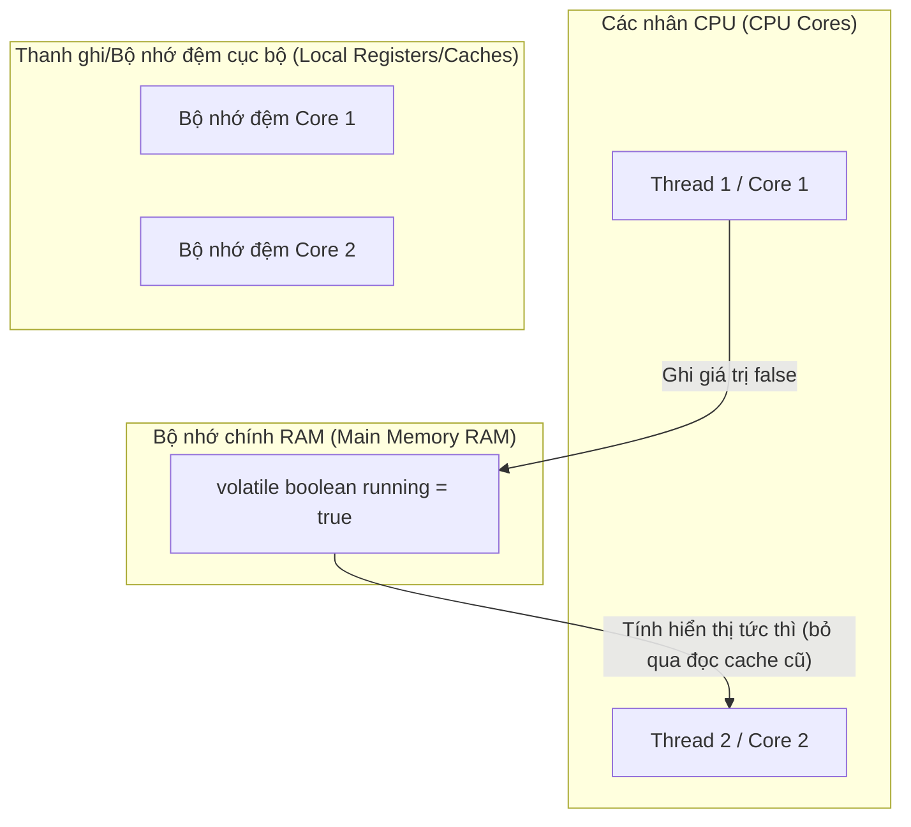

# Các Bổ Từ Trong Java - Phần 2 (Modifiers in Java - Part 2)

## Mục Tiêu Học Tập (Learning Goal)

Tài liệu này tập trung vào một phần trọng tâm về **Các Bổ Từ Trong Java (Modifiers in Java)**. Hãy học từng khái niệm như một quy tắc Java thực tế, tránh việc ghi nhớ từ vựng một cách máy móc.

## Khung Nội Dung (Outline Coverage)

| Bổ từ (Modifier) | Nội dung cần biết (What to know) |
| --- | --- |
| `abstract` | Abstract nghĩa là chưa hoàn thiện theo thiết kế: các lớp con hoặc lớp triển khai bắt buộc phải cung cấp các hành vi còn thiếu. |
| `synchronized` | Synchronized bảo vệ một phân đoạn quan trọng (critical section) bằng cách sử dụng khóa giám sát (monitor lock). |
| `volatile` | Volatile cung cấp sự đảm bảo hiển thị đối với biến được chia sẻ giữa các luồng, nhưng nó không làm cho các hoạt động phức hợp trở thành nguyên tố (atomic). |
| `transient` | Transient đánh dấu một trường cần được bỏ qua trong quá trình tuần tự hóa (serialization) đối tượng trong Java. |
| `native` | Native chỉ ra rằng phương thức đó được triển khai bằng ngôn ngữ lập trình khác (như C/C++) thông qua Giao diện gốc Java (Java Native Interface - JNI). |
| `strictfp` | strictfp đảm bảo rằng các tính toán số thực dấu phẩy động (floating-point) luôn tạo ra cùng một kết quả trên mọi nền tảng phần cứng. |
| `Static variable` | Biến tĩnh nghĩa là thành viên đó thuộc về bản thân lớp chứ không thuộc về bất kỳ một đối tượng cụ thể nào. |
| `Static method` | Phương thức tĩnh nghĩa là thành viên đó thuộc về bản thân lớp chứ không thuộc về bất kỳ một đối tượng cụ thể nào. |

---

## Ghi Chú Chi Tiết (Detailed Notes)

### abstract (Trừu tượng)

`abstract` nghĩa là chưa hoàn thiện theo thiết kế: các lớp con hoặc lớp triển khai bắt buộc phải cung cấp các hành vi còn thiếu.

#### Ví Dụ Mã Nguồn Lớp abstract
```java
// Định nghĩa lớp trừu tượng
public abstract class GraphicObject {
    int x, y;

    // Phương thức cụ thể trong lớp trừu tượng
    void moveTo(int newX, int newY) {
        this.x = newX;
        this.y = newY;
    }

    // Phương thức trừu tượng (không có thân phương thức, kết thúc bằng dấu chấm phẩy)
    abstract void draw();
}

// Lớp con triển khai phương thức trừu tượng
class Circle extends GraphicObject {
    void draw() {
        System.out.println("Drawing a circle at " + x + ", " + y);
    }
}
```

#### Sai lầm thường gặp — Khai báo phương thức abstract có thân phương thức hoặc khai báo bên trong lớp cụ thể
Bất kỳ lớp nào chứa từ một phương thức `abstract` trở lên bắt buộc phải được khai báo là lớp `abstract`. Hơn nữa, phương thức `abstract` không được phép có thân phương thức (không có dấu ngoặc nhọn, chỉ kết thúc bằng dấu chấm phẩy). Việc viết `abstract void draw() {}` sẽ gây ra lỗi biên dịch vì cặp dấu ngoặc nhọn rỗng `{}` được coi là thân phương thức.

---

### synchronized (Đồng bộ hóa)

`synchronized` bảo vệ một phân đoạn quan trọng (critical section) bằng cách sử dụng một khóa giám sát (monitor lock).
Điều này quan trọng vì mã nguồn đồng thời có thể chạy đúng trong kiểm thử đơn luồng nhưng sẽ thất bại khi chịu áp lực điều phối thời gian trong môi trường đa luồng. Một nhầm lẫn phổ biến là lầm tưởng tính hiển thị (visibility), tính thứ tự (ordering) và tính nguyên tố (atomicity) là cùng một sự đảm bảo.

#### Ví Dụ Mã Nguồn synchronized
```java
public class ThreadSafeCounter {
    private int count = 0;

    // Phương thức synchronized thực thể sẽ khóa trên đối tượng 'this'
    public synchronized void increment() {
        count++;
    }

    // Phương thức synchronized tĩnh sẽ khóa trên đối tượng Class (ThreadSafeCounter.class)
    public static synchronized void printHeader() {
        System.out.println("--- Counters Report ---");
    }

    public int getCount() {
        return count;
    }
}
```

#### Sai lầm thường gặp — Lầm tưởng phương thức synchronized tĩnh và thực thể tự chặn nhau
Phương thức synchronized tĩnh và phương thức synchronized thực thể chiếm giữ hai khóa **KHÁC NHAU**. Phương thức synchronized tĩnh khóa trên đối tượng lớp `Class`, trong khi phương thức synchronized thực thể khóa trên đối tượng cụ thể (`this`). Do đó, chúng sẽ **KHÔNG** chặn lẫn nhau khi chạy đồng thời trên các luồng khác nhau.

## Tại Sao Các Phương Thức Synchronized Sử Dụng Khóa Giám Sát và Tính Tái Vào (Reentrancy)

Trong Java, mọi đối tượng đều ngầm định được liên kết với một cấu trúc dữ liệu nội bộ gọi là **khóa giám sát - monitor lock** (hoặc khóa nội tại - intrinsic lock). Khi một luồng gọi một phương thức `synchronized` thực thể, nó bắt buộc phải chiếm giữ khóa giám sát của đối tượng gọi phương thức đó (`this`) trước khi thực thi thân phương thức; nếu khóa đang được giữ bởi một luồng khác, luồng đang gọi sẽ bị chặn. Để ngăn chặn tình trạng một luồng tự khóa chính mình (gây bế tắc - deadlock) khi gọi một phương thức synchronized khác trên cùng một đối tượng, các khóa trong Java hỗ trợ **tính tái vào (reentrant)**. Điều này nghĩa là JVM sẽ theo dõi luồng sở hữu khóa và số lần chiếm giữ; nếu luồng hiện tại đã sở hữu khóa giám sát, nó được phép chiếm giữ lại khóa đó mà không bị chặn, số lượt đếm khóa tăng lên, và số lượt đếm giảm đi khi thoát ra khỏi mỗi khối synchronized cho đến khi số lượt đếm trở về 0 thì khóa mới được giải phóng hoàn toàn.

### Mô Hình Thực Thi Tính Tái Vào Khóa (Lock Reentrancy)

```text
Luồng A cố gắng đi vào phương thức synchronized method1() -> Chiếm giữ khóa giám sát (Lượt đếm = 1)
   |
   +---> Bên trong method1(), Luồng A tiếp tục gọi synchronized method2() trên cùng đối tượng
            |
            +---> Khóa có tính tái vào -> JVM phát hiện Luồng A đã sở hữu khóa từ trước
            |     Tăng số lượt đếm khóa (Lượt đếm = 2)
            |     Luồng A đi vào method2() mà không bị chặn!
            |
            +---> Luồng A thoát khỏi method2() -> Giảm số lượt đếm khóa (Lượt đếm = 1)
   |
Luồng A thoát khỏi method1() -> Giảm số lượt đếm khóa (Lượt đếm = 0) -> Giải phóng khóa hoàn toàn
```

### Ví Dụ Mã Nguồn: Minh họa tính tái vào của khóa
```java
public class ReentrantDemo {
    public synchronized void outerMethod() {
        System.out.println("Entering outerMethod");
        innerMethod(); // Gọi tái vào: thành công mà không gây nghẽn tự bế tắc trên 'this'
        System.out.println("Exiting outerMethod");
    }

    public synchronized void innerMethod() {
        System.out.println("Executing innerMethod"); // Khóa trên cùng một monitor
    }

    public static void main(String[] args) {
        ReentrantDemo demo = new ReentrantDemo();
        demo.outerMethod();
        // Kết quả in ra:
        // Entering outerMethod
        // Executing innerMethod
        // Exiting outerMethod
    }
}
```

### Chuỗi Nguyên Nhân - Kết Quả của Đồng Bộ Hóa Tái Vào (Reentrant Synchronization)
- **Kích hoạt**: Luồng yêu cầu quyền truy cập vào một khối/phương thức synchronized của một đối tượng.
- **Tác động tức thì**: JVM kiểm tra chủ sở hữu khóa giám sát; nếu khớp với luồng hiện tại, lượt đếm khóa tăng lên, và quyền truy cập được cấp ngay lập tức mà không bị chặn.
- **Tác động gián tiếp**: Các lệnh gọi synchronized lồng nhau trên cùng một đối tượng diễn ra an toàn, tránh được tình trạng tự bế tắc.
- **Kết quả cuối cùng**: Đạt được tính an toàn luồng trong khi vẫn tránh được trạng thái tự chặn đệ quy.

---

### volatile (Biến hiển thị)

`volatile` cung cấp sự đảm bảo hiển thị (visibility) đối với biến được chia sẻ giữa các luồng, nhưng nó không làm cho các hoạt động phức hợp (compound operations) trở thành nguyên tố (atomic).

#### Ví Dụ Mã Nguồn volatile
```java
public class SharedFlagDemo {
    // volatile đảm bảo thao tác ghi bởi một luồng sẽ hiển thị tức thì với các luồng khác
    private volatile boolean running = true;

    public void stop() {
        running = false;
    }

    public void work() {
        while (running) {
            // Thực hiện xử lý nền
        }
        System.out.println("Stopped gracefully.");
    }
}
```

#### Sai lầm thường gặp — Lầm tưởng volatile đảm bảo tính nguyên tố cho các phép toán phức hợp
Từ khóa `volatile` chỉ đảm bảo tính hiển thị và thứ tự lệnh (ngăn chặn tái sắp xếp chỉ thị - instruction reordering). Nó **KHÔNG** đảm bảo tính nguyên tố cho các hoạt động phức hợp như phép toán tăng số (`count++`). Nếu nhiều luồng cùng thực thi `count++` trên một biến volatile, các bản cập nhật vẫn có thể bị ghi đè lẫn nhau. Đối với các hoạt động nguyên tố, hãy sử dụng `synchronized` hoặc các lớp trong gói `java.util.concurrent.atomic`.

## Tại Sao Volatile Đảm Bảo Tính Hiển Thị và Thứ Tự Lệnh, Nhưng Không Đảm Bảo Tính Nguyên Tố

Để tối ưu hóa hiệu năng, các bộ vi xử lý hiện đại sử dụng các bộ nhớ đệm đa cấp (L1, L2, L3) và các kỹ thuật tối ưu hóa của trình biên dịch như tái sắp xếp chỉ thị, điều này có thể khiến các luồng đọc phải giá trị cũ của biến. Khai báo một trường là `volatile` bắt buộc JVM phải thực hiện đọc và ghi biến trực tiếp từ/vào bộ nhớ chính (RAM) thay vì bộ nhớ đệm CPU, đảm bảo rằng mọi thay đổi trên biến volatile đều hiển thị ngay lập tức với toàn bộ các luồng khác. Thêm vào đó, trình biên dịch và bộ vi xử lý bị cấm tái sắp xếp các lệnh đọc và ghi xung quanh biến volatile nhờ việc chèn các rào cản bộ nhớ (memory barriers). Tuy nhiên, `volatile` không đảm bảo tính nguyên tố vì nó không chiếm giữ khóa; các phép toán phức hợp như `count++` yêu cầu một chu kỳ gồm ba bước đọc, sửa đổi và ghi, trong khoảng thời gian này một luồng khác có thể can thiệp và sửa đổi giá trị, dẫn đến việc mất mát dữ liệu cập nhật.

### Mô hình hiển thị bộ nhớ (Bộ đệm vs. Bộ nhớ chính)



### Ví Dụ Mã Nguồn: Tính không nguyên tố của phép tăng Volatile
```java
public class VolatileCounter implements Runnable {
    private volatile int count = 0;

    @Override
    public void run() {
        for (int i = 0; i < 1000; i++) {
            count++; // Hoạt động phức hợp không nguyên tố: đọc, sửa đổi, ghi
        }
    }

    public static void main(String[] args) throws InterruptedException {
        VolatileCounter vc = new VolatileCounter();
        Thread t1 = new Thread(vc);
        Thread t2 = new Thread(vc);
        t1.start(); t2.start();
        t1.join(); t2.join();
        System.out.println("Final count: " + vc.count); 
        // Kết quả thường sẽ nhỏ hơn 2000 do mất mát dữ liệu cập nhật (ví dụ: 1852)
    }
}
```

### Chuỗi Nguyên Nhân - Kết Quả của Biến Volatile
- **Kích hoạt**: Thuộc tính được khai báo với bổ từ `volatile`.
- **Tác động tức thì**: Trình biên dịch chèn các rào cản bộ nhớ, ngăn chặn bộ nhớ đệm cục bộ của CPU và ngăn chặn việc tái sắp xếp chỉ thị qua ranh giới.
- **Tác động gián tiếp**: Các thao tác đọc và ghi được đồng bộ trực tiếp với bộ nhớ chính, đảm bảo tính hiển thị của các bản cập nhật.
- **Kết quả cuối cùng**: Đạt được tính hiển thị giữa các luồng, nhưng các hoạt động đa bước vẫn không mang tính nguyên tố nếu thiếu đồng bộ hóa bằng khóa.

---

### transient (Tạm thời)

`transient` đánh dấu một trường cần được bỏ qua trong quá trình tuần tự hóa (serialization) đối tượng trong Java.

Nó được dùng để ẩn đi các thông tin nhạy cảm (như mật khẩu) hoặc bỏ qua các tham chiếu tạm thời không thể tuần tự hóa khi ghi đối tượng xuống ổ đĩa hoặc truyền qua mạng. Khi đối tượng được giải tuần tự hóa (deserialized) để khôi phục lại, các trường `transient` sẽ nhận giá trị mặc định của kiểu dữ liệu (`null` cho đối tượng, `0` cho số, `false` cho boolean).

---

### native (Gốc)

`native` chỉ ra rằng phương thức đó được triển khai bằng ngôn ngữ lập trình khác (như C hoặc C++) thông qua Giao diện gốc Java (Java Native Interface - JNI) thay vì viết bằng mã Java.

Phương thức native không có thân phương thức và kết thúc bằng dấu chấm phẩy, tương tự phương thức trừu tượng. Chúng được sử dụng để tương tác trực tiếp với phần cứng, hệ điều hành hoặc các thư viện C/C++ có sẵn để tối ưu hóa hiệu năng.

---

### strictfp (Số thực dấu phẩy động chuẩn xác)

`strictfp` đảm bảo rằng các tính toán số thực dấu phẩy động (floating-point) luôn tạo ra cùng một kết quả chính xác trên mọi nền tảng hệ điều hành và phần cứng CPU.

Từ Java 17 trở đi, tất cả các biểu thức số thực dấu phẩy động đều được thực thi theo chuẩn `strictfp` mặc định, do đó từ khóa này hiện tại không còn cần thiết phải viết thủ công nữa.

---

### Static variable (Biến tĩnh)

`static` nghĩa là thành viên đó thuộc về bản thân lớp chứ không thuộc về một đối tượng cụ thể nào của lớp đó.

## Tại Sao Các Thành Viên Tĩnh Được Cấp Phát Trong Metaspace và Được Chia Sẻ

Trong Java, các thành viên `static` (biến và phương thức) thuộc về bản thiết kế của chính lớp đó chứ không thuộc về bất kỳ đối tượng thực thể riêng lẻ nào. Khi JVM nạp một lớp, siêu dữ liệu của lớp — bao gồm các biến `static` và các tham chiếu đến phương thức `static` — sẽ được cấp phát trong một vùng nhớ đặc biệt gọi là **Metaspace** (vùng nhớ này đã thay thế cho PermGen kể từ Java 8). Vì Metaspace là vùng lưu trữ cấp lớp độc lập với vùng nhớ Heap (nơi các thực thể đối tượng được thu gom rác cư ngụ), các trường tĩnh chỉ tồn tại dưới dạng một bản sao duy nhất được chia sẻ bởi tất cả các thực thể của lớp đó. Việc sửa đổi một biến tĩnh thông qua một thực thể đối tượng sẽ ngay lập tức ảnh hưởng đến giá trị mà các thực thể khác nhìn thấy, vì tất cả chúng đều trỏ chung đến cùng một địa chỉ bộ nhớ trong Metaspace.

### Mô Hình Cấp Phát Bộ Nhớ: Metaspace vs Heap

```text
+-------------------------------------------------------------+
|                        Bộ Nhớ JVM                           |
+-----------------------------+-------------------------------+
|   Metaspace (Siêu Dữ Liệu)   |      Heap (Thực Thể Đối Tượng) |
|                             |                               |
|  +-----------------------+  |    +-----------------------+  |
|  | Class: Counter        |  |    | Counter Instance 1    |  |
|  | - static count = 2    |<------| - (trỏ về lớp)        |  |
|  +-----------------------+  |    +-----------------------+  |
|                             |    +-----------------------+  |
|                             |    | Counter Instance 2    |  |
|                             |----| - (trỏ về lớp)        |  |
|                             |    +-----------------------+  |
+-----------------------------+-------------------------------+
```

### Ví Dụ Mã Nguồn: Biến tĩnh được chia sẻ
```java
public class Counter {
    public static int count = 0; // Được cấp phát trong Metaspace

    public Counter() {
        count++; // Tăng biến đếm duy nhất ở cấp lớp
    }

    public static void main(String[] args) {
        Counter c1 = new Counter();
        Counter c2 = new Counter();
        System.out.println(Counter.count); // Kết quả: 2
        System.out.println(c1.count);      // Kết quả: 2
        System.out.println(c2.count);      // Kết quả: 2
    }
}
```

### Chuỗi Nguyên Nhân - Kết Quả của Thành Viên Tĩnh (Static Members)
- **Kích hoạt**: Trường hoặc phương thức được khai báo với từ khóa `static`.
- **Tác động tức thì**: Bộ nhớ được cấp phát bên trong Metaspace trong quá trình nạp lớp (class loading), trước khi bất kỳ đối tượng nào được khởi tạo.
- **Tác động gián tiếp**: Chỉ tồn tại duy nhất một bản sao của biến, có thể truy cập qua tên lớp hoặc qua bất kỳ tham chiếu thực thể nào.
- **Kết quả cuối cùng**: Tất cả các đối tượng chia sẻ quyền truy cập vào cùng một địa chỉ bộ nhớ, tạo điều kiện thuận lợi cho việc lưu trữ trạng thái chung ở cấp lớp.

---

### Static method (Phương thức tĩnh)

`static` nghĩa là thành viên đó thuộc về bản thân lớp chứ không thuộc về một đối tượng cụ thể nào của lớp đó.

#### So Sánh Phương Thức Tĩnh vs. Phương Thức Thực Thể
```java
public class MethodComparisonDemo {
    private int instanceValue = 42;
    private static int classValue = 100;

    // Phương thức thực thể: yêu cầu thực thể đối tượng để gọi, có thể truy cập cả biến tĩnh và biến thực thể
    public void printInstance() {
        System.out.println("Instance value: " + this.instanceValue);
        System.out.println("Static value: " + classValue); // Hợp lệ
    }

    // Phương thức tĩnh: thuộc về bản thiết kế lớp, CHỈ có thể truy cập trực tiếp các biến tĩnh
    public static void printStatic() {
        System.out.println("Static value: " + classValue);
        // System.out.println(instanceValue); // LỖI BIÊN DỊCH! Không thể truy cập biến thực thể trực tiếp
    }
}
```

#### Sai lầm thường gặp — Gọi các thành viên phi tĩnh từ ngữ cảnh tĩnh (non-static from static context)
Các phương thức tĩnh thuộc về bản thiết kế lớp chứ không thuộc về một thực thể đối tượng cụ thể nào. Do đó, chúng không thể truy cập các trường thực thể hoặc gọi trực tiếp các phương thức phi tĩnh nếu không có tham chiếu đối tượng rõ ràng. Chúng cũng không được phép sử dụng các từ khóa `this` hoặc `super`.

---

## Các Câu Hỏi Ôn Tập Thường Gặp (Common Review Prompts)

- **Những khái niệm nào ở đây là quy tắc tại thời điểm biên dịch?**
  Lớp `abstract` bắt buộc phải được khai báo nếu chứa phương thức trừu tượng; phương thức `static` không thể sử dụng `this` hoặc `super` hoặc truy cập trực tiếp các thành viên phi tĩnh.
- **Những khái niệm nào ở đây ảnh hưởng đến hành vi tại thời điểm chạy?**
  Tính tái vào của `synchronized` thông qua số lượt đếm khóa giám sát; rào cản bộ nhớ của `volatile` để đồng bộ hóa với bộ nhớ chính RAM; việc loại bỏ các trường `transient` trong quá trình tuần tự hóa.
- **Những khái niệm nào ở đây dễ là cạm bẫy phỏng vấn?**
  - Giả định `volatile` đảm bảo tính nguyên tố cho phép tăng `count++`.
  - Giả định phương thức `synchronized` tĩnh và thực thể chặn lẫn nhau.
  - Sử dụng từ khóa `this` hoặc gọi phương thức thực thể từ bên trong phương thức `static`.
