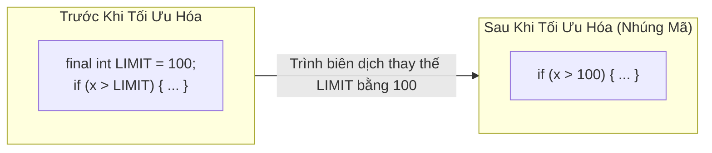

# Các Từ Khóa Đặc Tả Trong Java - Phần 3 (Modifiers in Java - Part 3)

## Mục Tiêu Học Tập (Learning Goal)

Tài liệu này bao quát một phần trọng tâm của **Các Từ Khóa Đặc Tả Trong Java**. Hãy nghiên cứu từng khái niệm dưới dạng quy tắc thực tế trong Java, chứ không phải các thuật ngữ lý thuyết đơn thuần.

## Đề Cương Bao Phủ (Outline Coverage)

| Khái niệm | Những điều cần biết |
| --- | --- |
| `Static block` | `static` nghĩa là thành viên đó thuộc về lớp chứ không thuộc về một đối tượng cụ thể nào. |
| `Static nested class` | `static` nghĩa là thành viên đó thuộc về lớp chứ không thuộc về một đối tượng cụ thể nào. |
| `Static import` | `static` nghĩa là thành viên đó thuộc về lớp chứ không thuộc về một đối tượng cụ thể nào. |
| `Final variable` | `final` nghĩa là biến, phương thức, lớp hoặc tham số đó bị giới hạn việc thay đổi sau này theo một cách cụ thể. |
| `Final method` | `final` nghĩa là biến, phương thức, lớp hoặc tham số đó bị giới hạn việc thay đổi sau này theo một cách cụ thể. |
| `Final class` | `final` nghĩa là biến, phương thức, lớp hoặc tham số đó bị giới hạn việc thay đổi sau này theo một cách cụ thể. |
| `Final parameter` | `final` nghĩa là biến, phương thức, lớp hoặc tham số đó bị giới hạn việc thay đổi sau này theo một cách cụ thể. |
| `Blank final variable` | `final` nghĩa là biến, phương thức, lớp hoặc tham số đó bị giới hạn việc thay đổi sau này theo một cách cụ thể. |

## Ghi Chú Chi Tiết

### Khối tĩnh (Static block)

`static` nghĩa là thành viên đó thuộc về lớp chứ không thuộc về một đối tượng cụ thể nào.

Khái niệm này rất quan trọng vì mã nguồn xử lý đồng thời có thể hoạt động chính xác trong các bài kiểm tra đơn luồng nhưng lại thất bại khi chịu áp lực về mặt thời gian thực thi. Một sự nhầm lẫn phổ biến là giả định rằng khả năng hiển thị (visibility), thứ tự thực thi (ordering) và tính nguyên tử (atomicity) đều là các cơ chế đảm bảo giống nhau.

#### Ví Dụ Mã Nguồn Khối Tĩnh
```java
public class DatabaseConnector {
    private static String connectionUrl;

    // Khối tĩnh chạy một lần duy nhất khi lớp được tải lần đầu bởi JVM
    static {
        try {
            // Khởi tạo phức tạp có thể ném ra ngoại lệ
            connectionUrl = "jdbc:mysql://localhost:3306/prod_db";
            System.out.println("Static block: Đã khởi tạo URL cơ sở dữ liệu.");
        } catch (Exception e) {
            System.err.println("Không thể khởi tạo URL kết nối cơ sở dữ liệu");
        }
    }
}
```

#### Lỗi Thường Gặp - Truy cập các trường thực thể hoặc ném ra các ngoại lệ checked trong khối tĩnh
Các khối tĩnh chạy trong quá trình tải lớp, trước khi bất kỳ thể hiện nào của lớp được tạo ra. Do đó, chúng không thể truy cập các trường hoặc phương thức thực thể (instance). Thêm vào đó, bạn không thể ném các ngoại lệ checked ra ngoài khối tĩnh; chúng bắt buộc phải được bắt bằng khối `try-catch` bên trong khối tĩnh, nếu không JVM sẽ ném ra lỗi `ExceptionInInitializerError`.

Kiểm tra thực tế:

- Định nghĩa `Static block` trong một câu.
- Nhận biết `Static block` trong mã nguồn, câu lệnh, tài liệu hoặc câu hỏi phỏng vấn.
- Giải thích một lỗi logic, giới hạn hoặc sự đánh đổi liên quan đến `Static block`.

Ví dụ nhỏ hoặc mô hình tư duy:

- `ClassName.member` truy cập một thành viên ở cấp độ lớp.

### Lớp lồng tĩnh (Static nested class)

`static` nghĩa là thành viên đó thuộc về lớp chứ không thuộc về một đối tượng cụ thể nào.

Sử dụng khái niệm này để dự đoán quy tắc chính xác của Java, các dạng được phép và các lỗi có thể xảy ra. Hãy ôn tập bằng một ví dụ nhỏ thay vì chỉ ghi nhớ tên gọi.

#### Ví Dụ Mã Nguồn Lớp Lồng Tĩnh
```java
public class Outer {
    private static int outerStatic = 10;
    private int outerInstance = 20;

    // Lớp lồng tĩnh
    public static class Nested {
        public void print() {
            System.out.println("Trường tĩnh của lớp ngoài: " + outerStatic); // Hợp lệ
            // System.out.println(outerInstance); // LỖI BIÊN DỊCH! Không có ngữ cảnh thể hiện của lớp ngoài
        }
    }
}
```

#### Lỗi Thường Gặp - Nhầm lẫn lớp lồng tĩnh với lớp nội bộ (inner class)
Một lớp lồng tĩnh không chứa một tham chiếu ngầm định đến một thể hiện của lớp bên ngoài. Để khởi tạo nó, bạn không cần một thể hiện của lớp ngoài: `Outer.Nested nested = new Outer.Nested();`. Ngược lại, các lớp nội bộ phi tĩnh yêu cầu một thể hiện của lớp ngoài: `outerInstance.new Inner()`.

Kiểm tra thực tế:

- Định nghĩa `Static nested class` trong một câu.
- Nhận biết `Static nested class` trong mã nguồn, câu lệnh, tài liệu hoặc câu hỏi phỏng vấn.
- Giải thích một lỗi logic, giới hạn hoặc sự đánh đổi liên quan đến `Static nested class`.

Ví dụ nhỏ hoặc mô hình tư duy:

- `ClassName.member` truy cập một thành viên ở cấp độ lớp.

### Import tĩnh (Static import)

`static` nghĩa là thành viên đó thuộc về lớp chứ không thuộc về một đối tượng cụ thể nào.

Sử dụng khái niệm này để dự đoán quy tắc chính xác của Java, các dạng được phép và các lỗi có thể xảy ra. Hãy ôn tập bằng một ví dụ nhỏ thay vì chỉ ghi nhớ tên gọi.

#### Ví Dụ Mã Nguồn Import Tĩnh
```java
// Import tĩnh Math.sqrt và Math.pow
import static java.lang.Math.sqrt;
import static java.lang.Math.pow;

public class Geometry {
    public double hypotenuse(double a, double b) {
        // Chúng ta có thể gọi các phương thức Math tĩnh trực tiếp mà không cần tiền tố Math.
        return sqrt(pow(a, 2) + pow(b, 2));
    }
}
```

#### Lỗi Thường Gặp - Viết sai thứ tự import static
Cú pháp bắt buộc phải là `import static package.Class.member;` hoặc `import static package.Class.*;`. Viết `static import` sẽ gây ra lỗi biên dịch. Thêm vào đó, bạn không thể import tĩnh toàn bộ một package (ví dụ: `import static java.lang.*;` là không hợp lệ; bạn chỉ có thể import các thành viên của lớp chứ không phải bản thân các lớp đó).

Kiểm tra thực tế:

- Định nghĩa `Static import` trong một câu.
- Nhận biết `Static import` trong mã nguồn, câu lệnh, tài liệu hoặc câu hỏi phỏng vấn.
- Giải thích một lỗi logic, giới hạn hoặc sự đánh đổi liên quan đến `Static import`.

Ví dụ nhỏ hoặc mô hình tư duy:

- `ClassName.member` truy cập một thành viên ở cấp độ lớp.

### Biến final (Final variable)

`final` nghĩa là biến, phương thức, lớp hoặc tham số đó bị giới hạn việc thay đổi sau này theo một cách cụ thể.

Sử dụng khái niệm này để dự đoán quy tắc chính xác của Java, các dạng được phép và các lỗi có thể xảy ra. Hãy ôn tập bằng một ví dụ nhỏ thay vì chỉ ghi nhớ tên gọi.

#### Ví Dụ Mã Nguồn Biến Final
```java
public class Calculation {
    public void run() {
        final int maxIterations = 50;
        // maxIterations = 60; // LỖI BIÊN DỊCH! Không thể gán lại giá trị cho một biến final
        System.out.println(maxIterations);
    }
}
```

#### Lỗi Thường Gặp - Giả định các trường final bắt buộc phải khởi tạo khi khai báo
Một biến thể hiện final không nhất thiết phải khởi tạo ngay khi khai báo; nó có thể được để trống lúc đầu và được khởi tạo bên trong hàm khởi dựng. Tuy nhiên, nó bắt buộc phải được gán giá trị trên mọi nhánh rẽ của tất cả các hàm khởi dựng trước khi trình biên dịch chấp nhận.

Kiểm tra thực tế:

- Định nghĩa `Final variable` trong một câu.
- Nhận biết `Final variable` trong mã nguồn, câu lệnh, tài liệu hoặc câu hỏi phỏng vấn.
- Giải thích một lỗi logic, giới hạn hoặc sự đánh đổi liên quan đến `Final variable`.

Ví dụ nhỏ hoặc mô hình tư duy:

- `final int limit = 10;` không thể gán lại giá trị.

## Tại Sao Các Biến Final Ngăn Chặn Việc Gán Lại Giá Trị và Cho Phép Nhúng Mã (Inlining)

Từ khóa `final` trên một biến đảm bảo rằng một khi đã được gán giá trị, tham chiếu hoặc giá trị của biến đó không thể bị thay đổi trong suốt vòng đời còn lại của nó. Đối với các biến kiểu nguyên thủy, điều này ngăn chặn giá trị số bị thay đổi, trong khi đối với các biến kiểu tham chiếu, nó ngăn chặn tham chiếu trỏ tới một đối tượng khác (mặc dù các trường nội bộ của đối tượng đó vẫn có thể thay đổi được). Do `final` đảm bảo các giá trị hằng số tại thời điểm biên dịch khi được khởi tạo bằng hằng số, trình biên dịch Java và trình biên dịch JIT (Just-In-Time) có thể thực hiện một tối ưu hóa gọi là **nhúng mã (inlining)**. Cơ chế nhúng mã thay thế trực tiếp tên biến hoặc lời gọi phương thức bằng giá trị hằng số hoặc nội dung phương thức tại thời điểm biên dịch, loại bỏ chi phí tìm kiếm biến hoặc điều phối phương thức và tăng cường hiệu năng lúc chạy chương trình.

### Mô Hình Tối Ưu Hóa Nhúng Mã Của Trình Biên Dịch



### Ví Dụ Mã Nguồn: Minh Họa Biến Final và Nhúng Mã (Inlining)
```java
public class OptimizationDemo {
    // Hằng số thời điểm biên dịch: final + kiểu nguyên thủy/String + biểu thức hằng số
    public static final int MAX_USERS = 500;

    public void displayLimit() {
        // Trình biên dịch thay thế MAX_USERS bằng giá trị trực tiếp 500 trong mã bytecode
        System.out.println("Giới hạn: " + MAX_USERS); 
    }

    public static void main(String[] args) {
        OptimizationDemo demo = new OptimizationDemo();
        demo.displayLimit(); // Đầu ra: Giới hạn: 500
    }
}
```

### Chuỗi Nguyên Nhân - Kết Quả của Biến Final (Cause-Effect Chain)
- **Tác nhân kích hoạt**: Biến được khai báo với từ khóa `final`.
- **Hiệu ứng tức thì**: Trình biên dịch ngăn chặn bất kỳ hành vi gán lại giá trị nào sau lần khởi tạo đầu tiên của biến.
- **Hiệu ứng thứ cấp**: Nếu giá trị là một hằng số tại thời điểm biên dịch, trình biên dịch có thể thay thế trực tiếp giá trị hằng số đó vào tất cả các vị trí biến được tham chiếu.
- **Kết quả cuối cùng**: Việc gán lại giá trị cho biến bị chặn từ thời điểm biên dịch, và hiệu năng runtime được nâng cao thông qua cơ chế nhúng mã của trình biên dịch/JIT.

> Xem thêm: Khái niệm Effectively Final khi sử dụng trong Lambda Expression, được trình bày chi tiết trong [Ch.21 - Lambda Expression](../../21-lambda-expression/README.md).

### Phương thức final (Final method)

`final` nghĩa là biến, phương thức, lớp hoặc tham số đó bị giới hạn việc thay đổi sau này theo một cách cụ thể.

Sử dụng khái niệm này để dự đoán quy tắc chính xác của Java, các dạng được phép và các lỗi có thể xảy ra. Hãy ôn tập bằng một ví dụ nhỏ thay vì chỉ ghi nhớ tên gọi.

#### Ví Dụ Mã Nguồn Phương Thức Final
```java
public class Parent {
    public final void showMessage() {
        System.out.println("Đây là một phương thức final.");
    }
}

class Child extends Parent {
    // Việc cố gắng ghi đè phương thức final sẽ gây ra lỗi biên dịch:
    // public void showMessage() { ... }
}
```

#### Lỗi Thường Gặp - Cố gắng ghi đè (override) một phương thức final trong lớp con
Nếu một lớp con cố gắng khai báo một phương thức có cùng chữ ký và kiểu trả về với một phương thức `final` trong lớp cha, trình biên dịch sẽ báo lỗi từ chối. Lưu ý rằng các phương thức `private` mặc nhiên là final một cách ngầm định, do đó việc khai báo chúng là final là hợp lệ nhưng dư thừa.

Kiểm tra thực tế:

- Định nghĩa `Final method` trong một câu.
- Nhận biết `Final method` trong mã nguồn, câu lệnh, tài liệu hoặc câu hỏi phỏng vấn.
- Giải thích một lỗi logic, giới hạn hoặc sự đánh đổi liên quan đến `Final method`.

Ví dụ nhỏ hoặc mô hình tư duy:

- `final int limit = 10;` không thể gán lại giá trị.

### Lớp final (Final class)

`final` nghĩa là biến, phương thức, lớp hoặc tham số đó bị giới hạn việc thay đổi sau này theo một cách cụ thể.

Sử dụng khái niệm này để dự đoán quy tắc chính xác của Java, các dạng được phép và các lỗi có thể xảy ra. Hãy ôn tập bằng một ví dụ nhỏ thay vì chỉ ghi nhớ tên gọi.

#### Ví Dụ Mã Nguồn Lớp Final
```java
public final class UtilityClass {
    public static void printLog(String message) {
        System.out.println("LOG: " + message);
    }
}

// Việc cố gắng kế thừa UtilityClass sẽ gây ra lỗi biên dịch:
// class SubUtility extends UtilityClass { }
```

#### Lỗi Thường Gặp - Giả định các trường trong một lớp final sẽ tự động là final
Khai báo một lớp là `final` chỉ giúp ngăn chặn việc lớp đó bị mở rộng (kế thừa). Nó KHÔNG tự động biến các trường của lớp đó thành `final` hoặc bất biến (immutable). Nếu bạn muốn các trường là bất biến, bạn vẫn phải khai báo chúng là `final` một cách tường minh.

Kiểm tra thực tế:

- Định nghĩa `Final class` trong một câu.
- Nhận biết `Final class` trong mã nguồn, câu lệnh, tài liệu hoặc câu hỏi phỏng vấn.
- Giải thích một lỗi logic, giới hạn hoặc sự đánh đổi liên quan đến `Final class`.

Ví dụ nhỏ hoặc mô hình tư duy:

- `final int limit = 10;` không thể gán lại giá trị.

### Tham số final (Final parameter)

`final` nghĩa là biến, phương thức, lớp hoặc tham số đó bị giới hạn việc thay đổi sau này theo một cách cụ thể.

Sử dụng khái niệm này để dự đoán quy tắc chính xác của Java, các dạng được phép và các lỗi có thể xảy ra. Hãy ôn tập bằng một ví dụ nhỏ thay vì chỉ ghi nhớ tên gọi.

#### Ví Dụ Mã Nguồn Tham Số Final
```java
public class Logger {
    public void log(final String message) {
        // message = "Thông điệp mới"; // LỖI BIÊN DỊCH! Không thể sửa đổi tham số final
        System.out.println(message);
    }
}
```

#### Lỗi Thường Gặp - Gán lại giá trị cho tham số của phương thức bên trong thân phương thức
Khai báo tham số phương thức là `final` là một thực hành lập trình tốt để ngăn chặn việc vô tình gán lại giá trị cho tham số đó bên trong thân phương thức. Việc cố gắng gán một giá trị mới cho một tham số final sẽ dẫn đến lỗi tại thời điểm biên dịch.

Kiểm tra thực tế:

- Định nghĩa `Final parameter` trong một câu.
- Nhận biết `Final parameter` trong mã nguồn, câu lệnh, tài liệu hoặc câu hỏi phỏng vấn.
- Giải thích một lỗi logic, giới hạn hoặc sự đánh đổi liên quan đến `Final parameter`.

Ví dụ nhỏ hoặc mô hình tư duy:

- `final int limit = 10;` không thể gán lại giá trị.

### Biến final trống (Blank final variable)

`final` nghĩa là biến, phương thức, lớp hoặc tham số đó bị giới hạn việc thay đổi sau này theo một cách cụ thể.

Sử dụng khái niệm này để dự đoán quy tắc chính xác của Java, các dạng được phép và các lỗi có thể xảy ra. Hãy ôn tập bằng một ví dụ nhỏ thay vì chỉ ghi nhớ tên gọi.

#### Ví Dụ Mã Nguồn Biến Final Trống
```java
public class Order {
    private final long orderId; // Biến final trống
    private static final String DEFAULT_STATUS; // Biến tĩnh final trống

    static {
        DEFAULT_STATUS = "PENDING"; // Khởi tạo trong khối tĩnh
    }

    public Order(long orderId) {
        this.orderId = orderId; // Khởi tạo trong hàm khởi dựng
    }
}
```

#### Lỗi Thường Gặp - Thất bại trong Phân Tích Gán Giá Trị Xác Định (Definite Assignment Analysis)
Một trường final trống phải được gán giá trị chính xác một lần duy nhất. Nếu một hàm khởi dựng chứa một nhánh rẽ điều kiện (ví dụ: câu lệnh `if-else`) mà trường final trống chỉ được gán giá trị trong một nhánh, trình biên dịch sẽ báo lỗi "biến orderId có thể chưa được khởi tạo".

Kiểm tra thực tế:

- Định nghĩa `Blank final variable` trong một câu.
- Nhận biết `Blank final variable` trong mã nguồn, câu lệnh, tài liệu hoặc câu hỏi phỏng vấn.
- Giải thích một lỗi logic, giới hạn hoặc sự đánh đổi liên quan đến `Blank final variable`.

Ví dụ nhỏ hoặc mô hình tư duy:

- `final int limit = 10;` không thể gán lại giá trị.

## Các Câu Hỏi Ôn Tập Phổ Biến

- Khái niệm nào ở đây là quy tắc tại thời điểm biên dịch (compile-time)?
- Khái niệm nào ở đây ảnh hưởng đến hành vi tại thời điểm chạy (runtime)?
- Khái niệm nào ở đây có khả năng là bẫy phỏng vấn?
