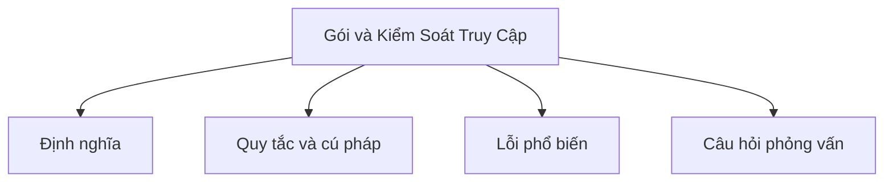

# 11 - Gói và Kiểm Soát Truy Cập (Package and Access Control)

Chủ đề này theo dõi đề cương tổng thể trong [outline.md](../outline.md). Mục tiêu là hiểu sâu từng khái niệm đủ để giải thích, nhận ra trong mã nguồn và trả lời các câu hỏi phỏng vấn.

## Thứ Tự Học

- [Gói Là Gì - Các Khái Niệm (What Is A Package Concepts)](theory/01-what-is-a-package-concepts.md)
- [Thuật Ngữ Chính (Key Terms)](terms/01-key-terms.md)

## Danh Sách Kiểm Tra Đề Cương

- Gói là gì? (What is a package?)
- Tạo gói (Create package)
- Import gói (Import package)
- import static
- Gói mặc định (Default package)
- Quy ước đặt tên gói (Package naming convention)
- Truy cập giữa các gói (Access between packages)
- Classpath
- Đường dẫn module cơ bản (Basic module path)

## Tự Kiểm Tra

- Tại sao Java dùng gói để cô lập không gian tên (namespace) và quy ước đặt tên DNS ngược?
- Tại sao gói mặc định (default package) nên được tránh trong môi trường sản xuất?
- Tại sao import static tăng khả năng đọc mã nhưng cũng tiềm ẩn nguy cơ xung đột tên?
- Tại sao Classpath khác với Module path về ràng buộc truy cập gói?
- Tại sao kiểm soát truy cập default (package-private) tồn tại, và nó ngăn các lớp bên ngoài truy cập chi tiết triển khai nội bộ của gói như thế nào?
- Tại sao trình biên dịch/runtime Java thực thi mối quan hệ nghiêm ngặt giữa khai báo gói của lớp và cấu trúc thư mục vật lý của nó?

## Thẻ Anki

- [Basic](anki/basic.tsv)
- [Basic Extra](anki/basic-extra.tsv)
- [Cloze](anki/cloze.tsv)
- [Code Question](anki/code-question.tsv)

## Tổng Quan Mermaid

## Liên Kết Tham Khảo

- https://docs.oracle.com/javase/tutorial/java/package/packages.html
- https://docs.oracle.com/javase/tutorial/java/package/usepkgs.html
