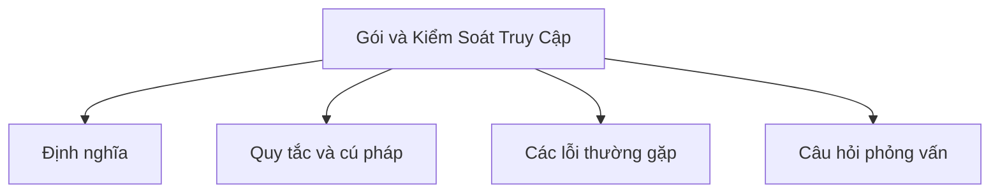

# 11 - Gói và Kiểm Soát Quyền Truy Cập (Package and Access Control)

Chủ đề này bám sát đề cương tổng thể trong [outline.md](../outline.md). Mục tiêu là hiểu sâu sắc từng khái niệm để có thể giải thích, nhận biết trong code và trả lời các câu hỏi phỏng vấn liên quan.

## Lộ Trình Học Tập (Study Order)

- [Khái Niệm Về Gói](theory/01-what-is-a-package-concepts.md)
- [Thuật Ngữ Chính](terms/01-key-terms.md)

## Danh Sách Nội Dung Học Tập (Outline Checklist)

- Gói là gì?
- Tạo gói
- Nhập gói (Import)
- Nhập tĩnh (import static)
- Gói mặc định (Default package)
- Quy tắc đặt tên gói
- Truy cập giữa các gói
- Classpath
- Đường dẫn mô-đun cơ bản (Module path)

## Tự Kiểm Tra (Self-Check)

- Tại sao Java sử dụng các gói để cách ly không gian tên (namespace isolation) và quy tắc đặt tên dựa trên tên miền DNS ngược (reverse DNS)?
- Tại sao nên tránh sử dụng gói mặc định (default package) trong các môi trường triển khai thực tế (production)?
- Tại sao việc nhập tĩnh (static import) giúp tăng độ đọc hiểu của code nhưng lại tiềm ẩn nguy cơ xung đột đặt tên (naming collision)?
- Tại sao Classpath lại khác biệt so với Module path về các ràng buộc truy cập gói?
- Tại sao kiểm soát truy cập mặc định (default - package-private) tồn tại, và nó ngăn chặn các lớp bên ngoài truy cập vào chi tiết triển khai nội bộ gói như thế nào?
- Tại sao trình biên dịch và môi trường chạy Java lại bắt buộc một mối quan hệ chặt chẽ giữa khai báo gói của một lớp và cấu trúc thư mục vật lý chứa nó?

## Thẻ Anki (Anki Cards)

- [Cơ Bản](anki/basic.tsv)
- [Cơ Bản Bổ Sung](anki/basic-extra.tsv)
- [Điền Khuyết](anki/cloze.tsv)
- [Câu Hỏi Viết Code](anki/code-question.tsv)

## Sơ Đồ Tổng Quan Mermaid (Mermaid Overview)

## Liên Kết Tham Khảo (Reference Links)

- https://docs.oracle.com/javase/tutorial/java/package/packages.html
- https://docs.oracle.com/javase/tutorial/java/package/usepkgs.html
