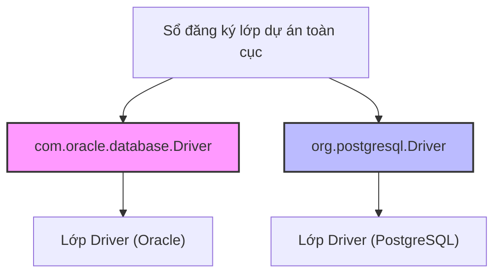
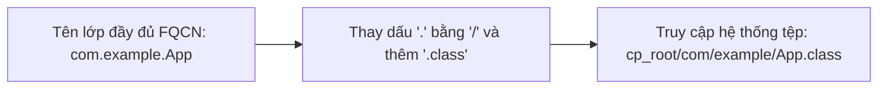
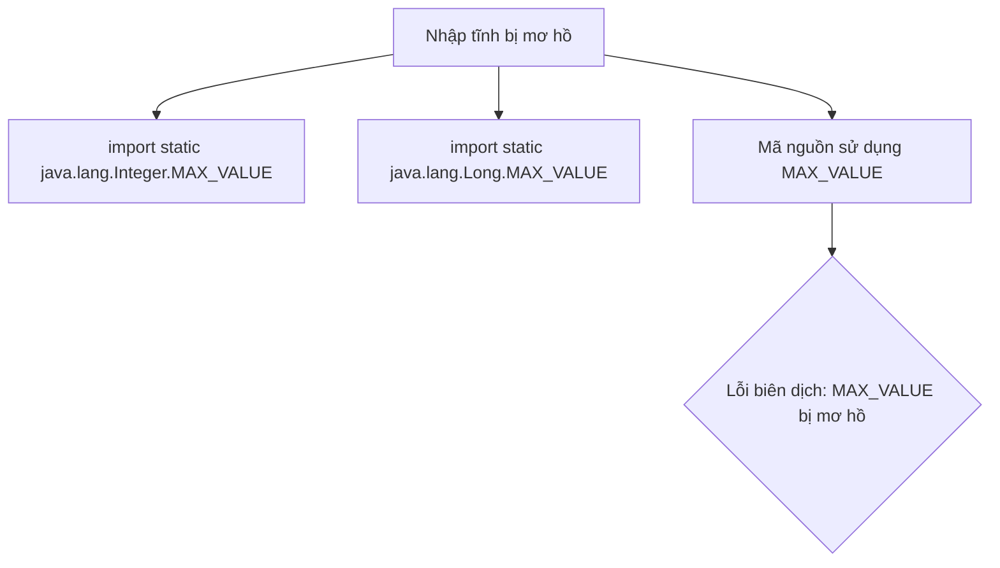
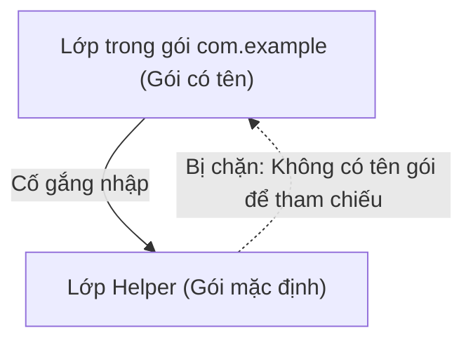
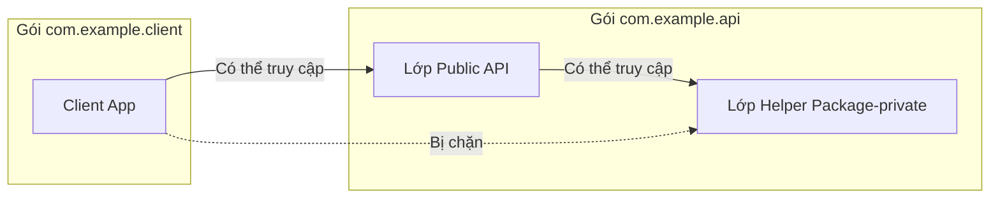
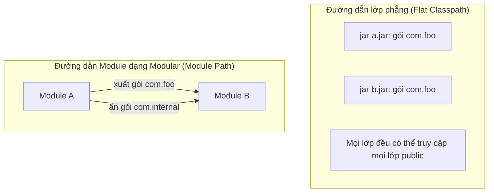

# Gói và Kiểm Soát Truy Cập - Phần 1 (Package and Access Control - Part 1)

## Mục Tiêu Học Tập (Learning Goal)

Tài liệu này tập trung vào một phần trọng tâm về **Gói và Kiểm Soát Truy Cập (Package and Access Control)**. Hãy học từng khái niệm như một quy tắc Java thực tế, tránh việc ghi nhớ từ vựng một cách máy móc.

## Khung Nội Dung (Outline Coverage)

| Khái niệm (Concept) | Nội dung cần biết (What to know) |
| --- | --- |
| `What is a package?` | Gói (package) gom nhóm các lớp liên quan lại với nhau và tạo ra một không gian tên (namespace) cho chúng. |
| `Create package` | Cách khai báo gói cho một lớp sử dụng từ khóa `package`. |
| `Import package` | Cách sử dụng câu lệnh `import` để truy cập các lớp từ các gói khác. |
| `import static` | Nhập tĩnh cho phép truy cập trực tiếp các thành viên tĩnh (trường, phương thức) của một lớp mà không cần tên lớp làm tiền tố. |
| `Default package` | Gói mặc định (default package - gói không tên) được JVM tự động gán cho các lớp không khai báo từ khóa `package`. |
| `Package naming convention` | Quy ước đặt tên gói sử dụng hoàn toàn chữ thường và cấu trúc tên miền ngược để tránh trùng lặp. |
| `Access between packages` | Các quy tắc kiểm soát quyền truy cập (`public`, `protected`, package-private, `private`) giữa các gói khác nhau. |
| `Classpath` | Đường dẫn lớp (Classpath) hướng dẫn cho trình biên dịch và JVM biết nơi tìm kiếm các lớp đã biên dịch và các tệp JAR. |
| `Basic module path` | Đường dẫn module (Module path) là cơ chế thay thế cho classpath, hoạt động dựa trên hệ thống module được giới thiệu từ Java 9. |

---

## Ghi Chú Chi Tiết (Detailed Notes)

### Gói (package) là gì?

Gói (package) gom nhóm các lớp liên quan lại với nhau và tạo ra một không gian tên (namespace) cho chúng.

#### Chi tiết bổ sung & Ví dụ mã nguồn
Gói là một tập hợp các kiểu dữ liệu liên quan (các lớp, giao diện, enum, chú thích) cung cấp khả năng bảo vệ quyền truy cập và quản lý không gian tên. Nó giải quyết triệt để các xung đột đặt tên bằng cách gắn thêm tiền tố tên gói vào trước tên lớp.

```java
package com.example.geometry;

public class Point {
    private int x, y;
    public Point(int x, int y) {
        this.x = x;
        this.y = y;
    }
}
```

#### Tại Sao Java Sử Dụng Gói Để Cô Lập Không Gian Tên và Quy Ước Đặt Tên Miền Ngược (Reverse DNS)

Trong phát triển phần mềm quy mô lớn, việc xung đột đặt tên là không thể tránh khỏi khi nhiều thư viện độc lập hoặc nhiều lập trình viên khác nhau cùng định nghĩa các lớp có tên ngắn gọn giống nhau (ví dụ: `Date`, `Parser`, `Buffer`). Java giải quyết vấn đề này bằng cách sử dụng các gói phân cấp để tạo ra các không gian tên riêng biệt, phân chia không gian tên lớp toàn cục thành các phạm vi cô lập. Để đảm bảo các tên gói này là duy nhất trên toàn thế giới mà không cần một tổ chức trung ương đứng ra xác minh đăng ký tên, Java áp dụng quy ước đặt tên dựa trên hệ thống tên miền ngược (reverse Domain Name System - DNS) của tổ chức (ví dụ: `com.company.project`). Quy ước này tận dụng quyền sở hữu tên miền Internet hợp pháp duy nhất sẵn có của mỗi tổ chức như một cơ quan đăng ký tự nhiên, đảm bảo không có hai tổ chức nào xuất bản các gói có cùng tên lớp đầy đủ (Fully Qualified Class Name - FQCN).



```java
// Minh họa việc giải quyết xung đột đặt tên sử dụng Tên Lớp Đầy Đủ (FQCN)
public class NamespaceDemo {
    public static void main(String[] args) {
        // java.util.Date và java.sql.Date cùng tồn tại song song vì nằm ở các không gian tên gói khác nhau
        java.util.Date utilDate = new java.util.Date();
        java.sql.Date sqlDate = new java.sql.Date(System.currentTimeMillis());
        
        System.out.println(utilDate.getClass().getName()); // java.util.Date
        System.out.println(sqlDate.getClass().getName());  // java.sql.Date
    }
}
```

* **Chuỗi Nguyên Nhân - Kết Quả (Cause-Effect Chain):**
  Nhiều tổ chức cùng viết mã nguồn $\rightarrow$ họ vô tình chọn các tên lớp giống nhau (ví dụ: `Driver`) $\rightarrow$ quá trình biên dịch thất bại do mập mờ tên lớp $\rightarrow$ áp dụng không gian tên miền ngược phân chia các lớp vào các thư mục độc lập $\rightarrow$ các tên lớp được giải quyết chính xác và duy nhất tại thời điểm biên dịch và thời điểm chạy.

---

### Tạo gói (Create package)

Khai báo gói giúp gom nhóm các lớp liên quan lại với nhau và cung cấp không gian tên cho chúng.

#### Chi tiết bổ sung & Ví dụ mã nguồn
Một gói được khai báo bằng câu lệnh `package`. Đây bắt buộc phải là câu lệnh thực thi đầu tiên (không tính khoảng trắng và chú thích) trong tệp mã nguồn Java. Đường dẫn thư mục vật lý của các tệp mã nguồn và các tệp biên dịch `.class` bắt buộc phải phản ánh đúng cấu trúc không gian tên của gói đó.

```java
// Bắt buộc phải là câu lệnh đầu tiên trong tệp (không tính khoảng trắng và chú thích)
package com.example.util;

public class MathUtils {
    public static int add(int a, int b) {
        return a + b;
    }
}
```
**Sai lầm thường gặp:** Đặt khai báo `package` sau các câu lệnh `import` hoặc sau định nghĩa lớp. Việc này sẽ gây ra lỗi biên dịch: `class, interface, enum, or record expected`.

#### Tại Sao Cấu Trúc Thư Mục Vật Lý Bắt Buộc Phải Phản Ánh Đúng Khai Báo Gói

Trình biên dịch Java (`javac`) và Máy ảo Java (`JVM`) không quét toàn bộ hệ thống tệp một cách động để tìm kiếm các tham chiếu lớp, vì việc đó sẽ khiến quá trình biên dịch và khởi động ứng dụng trở nên cực kỳ chậm chạp. Thay vào đó, chúng dựa trên một quy ước ánh xạ nghiêm ngặt, trong đó các thành phần tên gói phân tách bằng dấu chấm sẽ tương ứng trực tiếp với các đường dẫn thư mục lồng nhau. Ví dụ, một lớp được khai báo là `package com.example.util.MathUtils` bắt buộc phải nằm trong cấu trúc thư mục kết thúc bằng `com/example/util/MathUtils.class` tính từ gốc đường dẫn lớp (classpath root). Ánh xạ vật lý này cho phép bộ nạp lớp (classloader) chuyển đổi trực tiếp tên lớp đầy đủ sang đường dẫn tệp (bằng cách thay thế dấu `.` bằng `/` và thêm phần mở rộng `.class`), giúp việc tra cứu trên hệ thống tệp diễn ra ngay lập tức, dự đoán được và đạt hiệu năng cao.



```java
// Cấu trúc tệp vật lý: src/com/example/util/MathUtils.java
package com.example.util;

public class MathUtils {
    public static int add(int a, int b) {
        return a + b;
    }
}
// Nếu tệp này bị di chuyển sai vị trí sang thư mục src/com/MathUtils.java:
// Biên dịch bằng lệnh: javac -d bin src/com/MathUtils.java
// Và chạy lớp phụ thuộc sử dụng nó sẽ ném ra lỗi:
// NoClassDefFoundError: com/example/util/MathUtils (wrong name: MathUtils)
```

* **Chuỗi Nguyên Nhân - Kết Quả (Cause-Effect Chain):**
  Một lớp được khai báo với `package A.B` $\rightarrow$ trình biên dịch ánh xạ lớp `A.B.Class` thành tệp `A/B/Class.class` $\rightarrow$ ClassLoader thay thế dấu chấm bằng dấu gạch chéo khi tra cứu lúc chạy $\rightarrow$ nó kiểm tra trực tiếp thư mục `A/B` dưới các mục đường dẫn lớp $\rightarrow$ nạp lớp thành công mà không phải quét toàn bộ ổ đĩa.

---

### Nhập gói (Import package)

Để sử dụng một lớp từ một gói khác mà không cần phải viết tên lớp đầy đủ của nó, hãy sử dụng câu lệnh `import`.
- **Nhập cụ thể (Specific Import):** Nhập duy nhất một lớp được chỉ định.
- **Nhập đại diện (Wildcard Import):** Nhập toàn bộ các lớp trong một gói bằng ký tự đại diện `*`. Việc nhập này **không** có tính đệ quy (tức là không tự động nhập các gói con bên trong).
- **Tên lớp đầy đủ (FQCN):** Tham chiếu trực tiếp đến một lớp bằng đường dẫn gói tuyệt đối của nó (ví dụ: `java.util.List`) ngay trong mã nguồn.

```java
package com.example.app;

// Nhập cụ thể một lớp
import java.util.ArrayList;
// Nhập đại diện (nhập các lớp java.util.List, java.util.Map... nhưng KHÔNG nhập java.util.concurrent.*)
import java.util.*; 

public class ImportDemo {
    public static void main(String[] args) {
        // Sử dụng lớp từ nhập cụ thể
        ArrayList<String> list = new ArrayList<>();
        
        // Sử dụng tên lớp đầy đủ (FQCN) để bỏ qua câu lệnh import
        java.time.LocalDate today = java.time.LocalDate.now();
    }
}
```
**Sai lầm thường gặp:** Nghĩ rằng việc sử dụng ký tự đại diện như `import java.util.*;` sẽ tự động nhập cả các gói con (như `java.util.concurrent.*`). Thực tế không phải vậy; các gói con bắt buộc phải được viết câu lệnh nhập riêng biệt.

---

### import static (Nhập tĩnh)

Từ khóa `static` chỉ ra rằng thành viên thuộc về chính lớp chứ không thuộc về một thực thể đối tượng cụ thể nào.

#### Chi tiết bổ sung & Ví dụ mã nguồn
Câu lệnh `import static` cho phép truy cập trực tiếp vào các thành viên tĩnh (các trường thuộc tính và các phương thức) của một lớp mà không cần phải viết tiền tố tên lớp trước chúng.

```java
package com.example.math;

// Nhập một thành viên tĩnh cụ thể
import static java.lang.Math.PI;
// Nhập toàn bộ các thành viên tĩnh của lớp java.lang.Math
import static java.lang.Math.*;

public class StaticImportDemo {
    public double getArea(double radius) {
        // PI và pow được truy cập trực tiếp không cần Math.PI hay Math.pow
        return PI * pow(radius, 2);
    }
}
```
**Sai lầm thường gặp:** Viết ngược thứ tự thành `static import` thay vì viết đúng là `import static`. Điều này gây ra lỗi biên dịch: `syntax error on token "static", import expected`.

#### Tại Sao Nhập Tĩnh Cân Bằng Giữa Tính Dễ Đọc và Nguy Cơ Xung Đột Đặt Tên

Nhập tĩnh giúp lập trình viên truy cập các hằng số hoặc phương thức tĩnh của một lớp trực tiếp mà không cần chỉ định tên lớp, giúp giảm thiểu các mã rườm rà trong các biểu thức toán học, các bài kiểm thử unit test, hoặc mã nguồn đặc thù. Tuy nhiên, sự tiện lợi này mang lại nguy cơ xung đột đặt tên và làm giảm tính dễ đọc của mã nguồn khi nhiều lớp chứa các thành viên tĩnh trùng tên cùng được nhập. Khi một câu lệnh nhập tĩnh đưa vào hai trường hoặc phương thức tĩnh có cùng tên từ hai lớp khác nhau (như trường `MAX_VALUE` từ cả hai lớp `Integer` và `Long`), trình biên dịch sẽ không thể xác định được biến nào đang được sử dụng. Điều này dẫn đến lỗi biên dịch mập mờ, buộc nhà phát triển phải viết rõ tên lớp hoặc loại bỏ câu lệnh nhập tĩnh đại diện.



```java
// Tệp: StaticCollision.java
import static java.lang.Integer.MAX_VALUE;
import static java.lang.Long.MAX_VALUE; // Bản thân việc nhập song song chưa gây lỗi

public class StaticCollision {
    public static void main(String[] args) {
        // System.out.println(MAX_VALUE); // LỖI BIÊN DỊCH: tham chiếu đến MAX_VALUE bị mơ hồ
        
        // Phải giải quyết bằng cách viết rõ tên lớp hoặc đường dẫn đầy đủ:
        System.out.println(java.lang.Integer.MAX_VALUE); // In ra: 2147483647
        System.out.println(java.lang.Long.MAX_VALUE);    // In ra: 9223372036854775807
    }
}
```

* **Chuỗi Nguyên Nhân - Kết Quả (Cause-Effect Chain):**
  Sử dụng nhập tĩnh để loại bỏ tên lớp $\rightarrow$ trình biên dịch đưa trực tiếp các tên tĩnh vào không gian tên cục bộ $\rightarrow$ hai câu lệnh nhập tĩnh cùng đưa vào một tên đơn giản giống nhau $\rightarrow$ việc sử dụng tên đó cục bộ trở nên mập mờ $\rightarrow$ trình biên dịch báo lỗi biên dịch do không thể phân giải.

---

### Gói mặc định (Default package)

Nếu một tệp mã nguồn không khai báo câu lệnh `package`, nó sẽ tự động thuộc về một gói mặc định không tên (unnamed default package).

```java
// Không khai báo package nghĩa là lớp này nằm trong gói mặc định
public class Helper {
    public void printMessage() {
        System.out.println("Helper in default package");
    }
}
```
**Sai lầm thường gặp:** Cố gắng nhập một lớp thuộc gói mặc định vào bên trong một lớp thuộc gói có tên cụ thể. Java nghiêm cấm điều này. Các lớp nằm trong gói có tên không thể thực hiện nhập các lớp từ gói mặc định, làm như vậy sẽ báo lỗi biên dịch.

#### Tại Sao Nên Tránh Sử Dụng Gói Mặc Định Trong Các Dự Án Thực Tế

Gói mặc định (không tên) đóng vai trò như một phân vùng nháp nhanh cho người mới bắt đầu học hoặc cho các tệp kịch bản ngắn, nhưng nó bộc lộ các hạn chế nghiêm trọng trong các dự án thực tế. Cụ thể, Java cấm các lớp nằm trong một gói có tên thực hiện nhập các lớp từ gói mặc định, tạo ra một ranh giới kiến trúc cứng nhắc. Giới hạn này ngăn cản các thư viện hoặc các thành phần cốt lõi viết trong gói mặc định được tích hợp vào các ứng dụng có cấu trúc gói rõ ràng. Thêm vào đó, các lớp trong gói mặc định không thể được module hóa dưới Hệ thống Module Nền tảng Java (JPMS), vì các tệp mô tả module (`module-info.java`) yêu cầu các gói phải có tên rõ ràng thì mới có thể xuất (export) API cho các module khác sử dụng.



```java
// Tệp 1: Helper.java (gói mặc định, không khai báo package)
public class Helper {
    public void sayHello() { System.out.println("Hello"); }
}

// Tệp 2: com/example/App.java (gói có tên)
package com.example;
// import Helper; // LỖI BIÊN DỊCH: Không thể nhập lớp từ gói mặc định

public class App {
    public static void main(String[] args) {
        // Helper h = new Helper(); // LỖI BIÊN DỊCH: Không thể phân giải ký hiệu 'Helper'
    }
}
```

* **Chuỗi Nguyên Nhân - Kết Quả (Cause-Effect Chain):**
  Lớp không khai báo câu lệnh package $\rightarrow$ trình biên dịch xếp nó vào gói không tên $\rightarrow$ một lớp thuộc gói có tên cố gắng nhập nó $\rightarrow$ không có đường dẫn không gian tên nào để định vị lớp mục tiêu $\rightarrow$ biên dịch thất bại.

---

### Quy ước đặt tên gói (Package naming convention)

Tên gói luôn được viết bằng chữ thường (lowercase) để tránh xung đột tên với tên các lớp (thường viết hoa chữ cái đầu). Chúng sử dụng cấu trúc tên miền ngược làm tiền tố để đảm bảo tính duy nhất giữa các tổ chức khác nhau.

```java
package com.mycompany.projectname.modulename;

public class Controller {
    // Tên gói viết thường giúp dễ đọc và tránh xung đột với các tên lớp
}
```

---

### Truy cập giữa các gói (Access between packages)

Java cung cấp bốn cấp độ kiểm soát truy cập:
- `public`: Truy cập được từ bất kỳ đâu.
- `protected`: Truy cập được từ trong cùng gói, và từ các lớp con kế thừa nằm ở các gói khác.
- Quyền mặc định (package-private): Chỉ truy cập được từ bên trong cùng một gói.
- `private`: Chỉ truy cập được từ bên trong cùng một lớp.

```java
// Tệp: pack1/Parent.java
package pack1;

public class Parent {
    public int publicVar = 1;
    protected int protectedVar = 2;
    int defaultVar = 3; // package-private
    private int privateVar = 4;
}

// Tệp: pack2/Child.java
package pack2;

import pack1.Parent;

public class Child extends Parent {
    public void testAccess() {
        System.out.println(publicVar);      // HỢP LỆ: public
        System.out.println(protectedVar);   // HỢP LỆ: protected được truy cập qua kế thừa
        // System.out.println(defaultVar);  // LỖI BIÊN DỊCH: defaultVar là package-private
        // System.out.println(privateVar);  // LỖI BIÊN DỊCH: privateVar bị giới hạn trong Parent
    }
}
```
**Sai lầm thường gặp:** Lớp con ở gói khác chỉ có thể truy cập các thành viên protected thông qua các tham chiếu có kiểu của chính lớp con đó (hoặc các lớp con của nó). Chúng không được phép truy cập các thành viên protected thông qua một tham chiếu có kiểu của lớp cha trực tiếp.

#### Tại Sao Quyền Mặc Định (Package-Private) Dùng Để Kiểm Soát Truy Cập Nội Bộ Gói

Cấp độ truy cập mặc định (package-private) của Java không sử dụng bất kỳ từ khóa nào và được kích hoạt khi không có bổ từ truy cập nào được viết trên lớp, phương thức hoặc trường. Cấp độ kiểm soát này đóng vai trò như một ranh giới quan trọng để thực thi Nguyên Tắc Đặc Quyền Tối Thiểu (Principle of Least Privilege) bằng cách giới hạn tầm nhìn nghiêm ngặt trong nội bộ các lớp cùng gói. Nó cho phép một tập hợp các lớp hợp tác trong một gói có thể chia sẻ và trao đổi các chi tiết triển khai nội bộ (như các lớp trợ giúp, các hàm khởi tạo package-private, các phương thức quản lý trạng thái) mà không cần phải phơi bày các chi tiết này ra ngoài dưới dạng API công khai. Điều này giúp giữ cho bề mặt API công khai của một thư viện luôn nhỏ gọn, giúp thư viện dễ bảo trì và dễ thay đổi nâng cấp mà không làm hỏng mã nguồn của các ứng dụng tiêu thụ bên ngoài.



```java
// Tệp 1: com/example/api/Service.java
package com.example.api;
public class Service {
    // Phương thức trợ giúp package-private
    void internalExecute() {
        System.out.println("Executing internal task...");
    }
}

// Tệp 2: com/example/client/App.java
package com.example.client;
import com.example.api.Service;
public class App {
    public static void main(String[] args) {
        Service s = new Service();
        // s.internalExecute(); // LỖI BIÊN DỊCH: internalExecute() không phải public trong Service; không thể truy cập từ bên ngoài gói
    }
}
```

* **Chuỗi Nguyên Nhân - Kết Quả (Cause-Effect Chain):**
  Một thành viên được khai báo không kèm bổ từ truy cập nào $\rightarrow$ nó được gán quyền truy cập mặc định trong gói (package-private) $\rightarrow$ các lớp bên ngoài gói cố gắng truy cập nó $\rightarrow$ trình biên dịch kiểm tra ranh giới gói và chặn tham chiếu lại $\rightarrow$ các chi tiết triển khai nội bộ gói được đóng gói an toàn.

---

### Đường dẫn lớp (Classpath)

Đường dẫn lớp (Classpath) hướng dẫn cho trình biên dịch (`javac`) và JVM (`java`) biết nơi tìm kiếm các lớp tự định nghĩa và các gói của người dùng. Nó có thể được chỉ định qua biến môi trường `CLASSPATH` hoặc qua các cờ lệnh `-cp` / `-classpath` trên terminal.

```bash
# Biên dịch sử dụng classpath
javac -cp "lib/*:src" src/com/example/Main.java

# Chạy ứng dụng sử dụng classpath
java -cp "lib/*:bin" com.example.Main
```

---

### Đường dẫn module cơ bản (Basic module path)

Được giới thiệu từ Java 9, đường dẫn module (`--module-path` hoặc `-p`) là cơ chế thay thế dạng module cho classpath truyền thống. Nó chỉ định vị trí chứa các module của ứng dụng và của thư viện. Khác với classpath, nó bắt buộc thực thi đóng gói mạnh mẽ và kiểm tra tính phụ thuộc của các module ngay khi ứng dụng khởi động.

```bash
# Biên dịch một module
javac -d mods/com.example.app --module-source-path src src/com.example.app/module-info.java src/com.example.app/com/example/app/Main.java

# Chạy một ứng dụng modular sử dụng module-path
java --module-path mods --module com.example.app/com.example.app.Main
```

#### Tại Sao Classpath và Module Path Khác Nhau Trong Ràng Buộc Truy Cập Gói

Đường dẫn lớp (classpath) truyền thống phân giải các lớp bằng cách tìm kiếm tuần tự qua một danh sách phẳng các thư mục và tệp JAR, nạp lớp đầu tiên mà nó tìm thấy khớp tên. Cơ chế này hoàn toàn không có khái niệm về ranh giới module và không thể thực thi các ràng buộc truy cập gói tại thời điểm chạy: bất kỳ lớp nào trên classpath cũng có thể truy cập các thành viên public của bất kỳ lớp nào khác trên classpath, và các gói trùng tên trong các tệp JAR khác nhau có thể dẫn đến hiện tượng che bóng âm thầm (silent shadowing). Ngược lại, đường dẫn module (module path) giới thiệu từ Java 9 thực thi tính đóng gói mạnh mẽ và kiểm tra độ tin cậy của các phụ thuộc ngay khi khởi động. Các lớp nằm trên đường dẫn module bắt buộc phải là một phần của các module được đặt tên khai báo trong tệp `module-info.java`, tệp này chỉ định rõ ràng những gói nào được xuất ra cho các module khác sử dụng, đồng thời chặn hoàn toàn quyền truy cập vào các gói không được xuất kể cả khi chúng chứa các lớp public.



```java
// tệp module-info.java trong module com.example.provider
module com.example.provider {
    exports com.example.api;
    // gói com.example.internal KHÔNG được xuất, dù cho các lớp bên trong là public
}

// Một lớp ở module khác cố gắng truy cập com.example.internal.Helper:
// import com.example.internal.Helper; // LỖI BIÊN DỊCH: Gói com.example.internal không hiển thị
```

* **Chuỗi Nguyên Nhân - Kết Quả (Cause-Effect Chain):**
  Đường dẫn module Java 9+ kiểm tra các mô tả module lúc khởi động $\rightarrow$ nó xác định những gói nào được xuất khẩu $\rightarrow$ một đối tượng tiêu thụ cố gắng nhập một lớp public nằm trong gói không được xuất khẩu $\rightarrow$ hệ thống thực thi đóng gói mạnh mẽ chặn truy cập $\rightarrow$ việc truy cập bị chặn đứng, ngăn chặn sự phụ thuộc vào các chi tiết nội bộ.

---

## Ví Dụ Thực Tế: Xử lý Xung Đột Đặt Tên (Naming Collisions)

Khi hai gói khác nhau cùng định nghĩa các lớp có trùng tên, việc nhập cả hai gói sẽ dẫn đến lỗi biên dịch nếu lớp đó được gọi trực tiếp bằng tên ngắn gọn.

Giả sử chúng ta muốn sử dụng lớp `Date` từ cả hai gói `java.util` và `java.sql`.

```java
import java.util.Date;
import java.sql.Date; // LỖI BIÊN DỊCH: lớp Date đã được định nghĩa trong một câu lệnh nhập cụ thể trước đó

public class CollisionDemo {
    public static void main(String[] args) {
        Date date = new Date(); // Gây mơ hồ khi cố gắng nhập cả hai
    }
}
```

### Cách giải quyết 1: Sử dụng Tên Lớp Đầy Đủ (FQCN)
Thay vì nhập cả hai lớp, hãy viết đầy đủ đường dẫn gói của chúng trực tiếp trong mã nguồn:
```java
public class CollisionDemo {
    public static void main(String[] args) {
        java.util.Date utilDate = new java.util.Date();
        java.sql.Date sqlDate = new java.sql.Date(System.currentTimeMillis());
    }
}
```

### Cách giải quyết 2: Nhập cụ thể một lớp, viết đầy đủ tên lớp cho lớp còn lại
Nhập lớp được sử dụng thường xuyên nhất, và sử dụng FQCN cho lớp ít dùng hơn:
```java
import java.util.Date; // Nhập cụ thể lớp này

public class CollisionDemo {
    public static void main(String[] args) {
        Date utilDate = new Date(); // Sẽ hiểu là java.util.Date
        java.sql.Date sqlDate = new java.sql.Date(System.currentTimeMillis()); // Phải viết FQCN cho java.sql.Date
    }
}
```

---

## Tổng Hợp Các Sai Lầm Thường Gặp (Common Mistakes Summary)

1. **Hiểu lầm về việc nhập gói con:** Viết `import java.util.*;` không tự động nhập lớp `java.util.concurrent.ConcurrentHashMap`. Việc nhập gói chỉ áp dụng ở cấp độ phẳng của gói đó, không có tính đệ quy lồng nhau.
2. **Cấu trúc thư mục bị sai:** Đặt tệp chứa khai báo `package com.example;` bên trong thư mục `src/com/` thay vì đặt trong `src/com/example/`. Hệ thống thư mục bắt buộc phải khớp chính xác tuyệt đối với khai báo gói.
3. **Nhập lớp từ gói mặc định:** Cố gắng nhập hoặc sử dụng một lớp từ gói mặc định (không tên) vào bên trong một lớp thuộc gói có tên. Java hoàn toàn không hỗ trợ điều này.
4. **Sai thứ tự từ khóa import static:** Viết ngược thành `static import` thay vì viết đúng là `import static`.
5. **Truy cập thành viên protected của thực thể lớp cha ở gói khác:** Một lớp con trong gói `B` kế thừa từ một lớp trong gói `A` chỉ được phép truy cập trường protected của lớp cha thông qua các tham chiếu thuộc kiểu của chính lớp con đó. Nó không thể truy cập thông qua một tham chiếu kiểu lớp cha.

---

## Các Câu Hỏi Ôn Tập Thường Gặp (Common Review Prompts)

- Khái niệm nào ở đây là quy tắc tại thời điểm biên dịch? (Kiểm tra lỗi trùng tên khi nhập gói; kiểm tra cấu trúc thư mục khớp với khai báo package; kiểm tra bổ từ truy cập giữa các gói).
- Sự khác biệt lớn nhất giữa Classpath và Module path là gì? (Classpath tìm kiếm phẳng không quan tâm ranh giới module và không thể chặn truy cập các lớp public; Module path bắt buộc khai báo module-info, thực thi đóng gói mạnh mẽ và chặn truy cập các gói không được xuất kể cả khi lớp là public).

---

## Liên Kết Tham Khảo (Reference Links)

- [JLS Chương 7 - Các Gói (Packages)](https://docs.oracle.com/javase/specs/jls/se21/html/jls-7.html)
- [JLS Mục 6.6 - Kiểm Soát Truy Cập (Access Control)](https://docs.oracle.com/javase/specs/jls/se21/html/jls-6.html#jls-6.6)
- [JLS Mục 7.5 - Các Khai Báo Nhập (Import Declarations)](https://docs.oracle.com/javase/specs/jls/se21/html/jls-7.html#jls-7.5)
- [Hướng dẫn của Oracle - Tạo và Sử dụng các Gói](https://docs.oracle.com/javase/tutorial/java/package/packages.html)
- [Hướng dẫn của Oracle - Sử dụng các Thành viên của Gói](https://docs.oracle.com/javase/tutorial/java/package/usepkgs.html)
