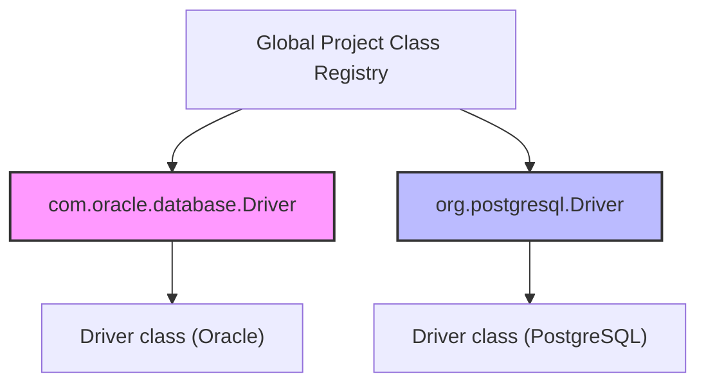
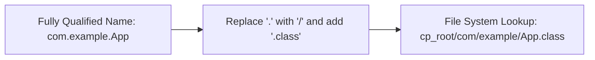
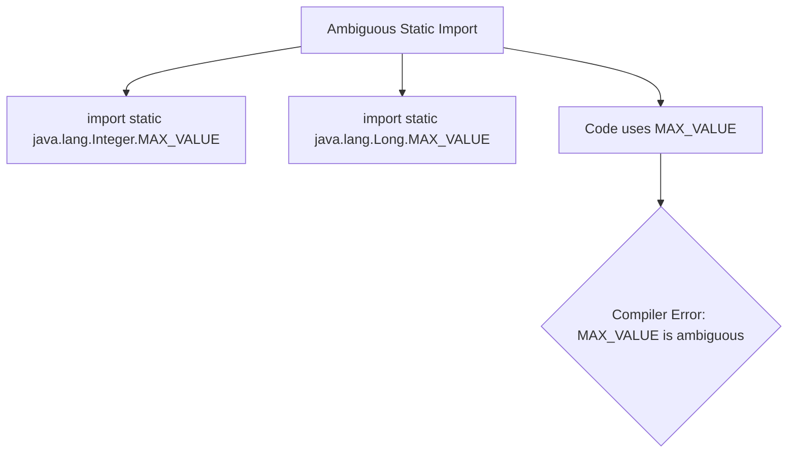
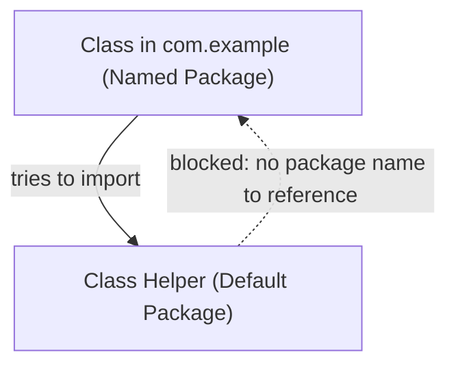
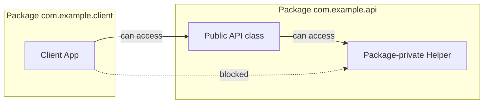
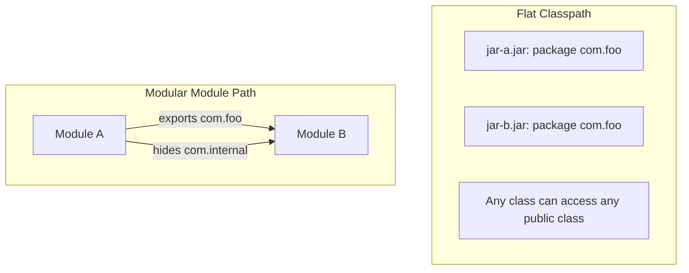

# Gói và Kiểm soát truy cập (Package and Access Control) - Phần 1

## Mục tiêu học tập (Learning Goal)

Tập tin này bao gồm một phần trọng tâm về **Gói và Kiểm soát truy cập (Package and Access Control)**. Hãy nghiên cứu từng khái niệm như một quy tắc Java thực tế, không phải là từ vựng riêng lẻ.

## Khái quát nội dung (Outline Coverage)

| Khái niệm (Concept) | Điều cần biết (What to know) |
| --- | --- |
| `What is a package?` | Một gói (package) nhóm các lớp liên quan lại với nhau và cung cấp cho chúng một không gian tên (namespace). |
| `Create package` | Một gói nhóm các lớp liên quan lại với nhau và cung cấp cho chúng một không gian tên. |
| `Import package` | Một gói nhóm các lớp liên quan lại với nhau và cung cấp cho chúng một không gian tên. |
| `import static` | Static nghĩa là thành viên thuộc về lớp thay vì một đối tượng cụ thể. |
| `Default package` | Một gói nhóm các lớp liên quan lại với nhau và cung cấp cho chúng một không gian tên. |
| `Package naming convention` | Một gói nhóm các lớp liên quan lại với nhau và cung cấp cho chúng một không gian tên. |
| `Access between packages` | Một gói nhóm các lớp liên quan lại với nhau và cung cấp cho chúng một không gian tên. |
| `Classpath` | Classpath cho JVM và trình biên dịch biết nơi để tìm các lớp và tệp JAR. |
| `Basic module path` | Module path là giải pháp thay thế nhận biết hệ thống mô-đun cho classpath đối với các mô-đun được đặt tên. |

## Ghi chú chi tiết (Detailed Notes)

### Gói là gì? (What is a package?)

Một gói (package) nhóm các lớp liên quan lại với nhau và cung cấp cho chúng một không gian tên (namespace).

Sử dụng nó để dự đoán quy tắc Java chính xác, dạng được cho phép, và chế độ thất bại. Hãy xem lại nó với một ví dụ nhỏ thay vì chỉ ghi nhớ nhãn.

Kiểm tra thực tế (Practical check):

- Định nghĩa `What is a package?` (Gói là gì?) trong một câu.
- Nhận diện `What is a package?` trong mã nguồn, lệnh, tài liệu hoặc câu hỏi phỏng vấn.
- Giải thích một lỗi (bug), hạn chế hoặc sự đánh đổi liên quan đến `What is a package?`.

Ví dụ nhỏ hoặc mô hình tư duy (Tiny example or mental model):

- Khi đọc mã nguồn, hãy hỏi: `What is a package?` thay đổi, cho phép, từ chối hoặc làm rõ điều gì?

#### Chi tiết bổ sung & Ví dụ mã nguồn
Một gói là sự nhóm lại của các kiểu dữ liệu liên quan (lớp - class, giao diện - interface, kiểu liệt kê - enum, chú thích - annotation) nhằm cung cấp khả năng bảo vệ truy cập và quản lý không gian tên. Nó giải quyết xung đột đặt tên bằng cách thêm tiền tố tên gói vào trước tên lớp.

```java
package com.example.geometry;

public class Point {
    private int x, y;
    public Point(int x, int y) {
        this.x = x;
        this.y = y;
    }
}
```

#### Tại sao Java sử dụng Gói để cô lập không gian tên và DNS ngược (Why Java Uses Packages for Namespace Isolation and Reverse DNS)

Trong phát triển phần mềm quy mô lớn, xung đột đặt tên là không thể tránh khỏi khi nhiều nhà phát triển hoặc thư viện độc lập định nghĩa các lớp có tên đơn giản giống hệt nhau (ví dụ: `Date`, `Parser`, `Buffer`). Java giải quyết vấn đề này bằng cách sử dụng các gói phân cấp để tạo ra các không gian tên riêng biệt, phân chia không gian tên lớp toàn cục thành các phạm vi cô lập. Để đảm bảo rằng các tên gói này là duy nhất trên toàn cầu giữa các tổ chức khác nhau mà không cần một cơ quan trung ương xác thực việc đăng ký tên, Java áp dụng quy ước đặt tên Hệ thống Tên miền ngược (DNS ngược - Reverse DNS) (ví dụ: `com.company.project`). Quy ước này tận dụng quyền sở hữu duy nhất đã tồn tại của các miền internet làm công cụ đăng ký tên tự nhiên, đảm bảo rằng không có hai tổ chức nào xuất bản các gói có cùng tên đầy đủ (fully qualified name).



```java
// Demonstrating resolution of a naming conflict using Fully Qualified Class Names (FQCN)
public class NamespaceDemo {
    public static void main(String[] args) {
        // java.util.Date and java.sql.Date coexist because they inhabit distinct package namespaces
        java.util.Date utilDate = new java.util.Date();
        java.sql.Date sqlDate = new java.sql.Date(System.currentTimeMillis());
        
        System.out.println(utilDate.getClass().getName()); // java.util.Date
        System.out.println(sqlDate.getClass().getName());  // java.sql.Date
    }
}
```

* **Chuỗi nguyên nhân - kết quả:**
  Nhiều tổ chức cùng viết mã $\rightarrow$ họ chọn các tên lớp giống nhau một cách độc lập (ví dụ: `Driver`) $\rightarrow$ quá trình biên dịch thất bại do tính mơ hồ của tên lớp $\rightarrow$ việc áp dụng các không gian tên DNS ngược giúp phân chia các lớp vào các thư mục/chỉ định duy nhất $\rightarrow$ các tên lớp được phân giải một cách duy nhất tại thời điểm biên dịch và thời điểm chạy.

### Tạo gói (Create package)

Một gói nhóm các lớp liên quan lại với nhau và cung cấp cho chúng một không gian tên.

Sử dụng nó để dự đoán quy tắc Java chính xác, dạng được cho phép, và chế độ thất bại. Hãy xem lại nó với một ví dụ nhỏ thay vì chỉ ghi nhớ nhãn.

Kiểm tra thực tế (Practical check):

- Định nghĩa `Create package` (Tạo gói) trong một câu.
- Nhận diện `Create package` trong mã nguồn, lệnh, tài liệu hoặc câu hỏi phỏng vấn.
- Giải thích một lỗi (bug), hạn chế hoặc sự đánh đổi liên quan đến `Create package`.

Ví dụ nhỏ hoặc mô hình tư duy (Tiny example or mental model):

- Khi đọc mã nguồn, hãy hỏi: `Create package` thay đổi, cho phép, từ chối hoặc làm rõ điều gì?

#### Chi tiết bổ sung & Ví dụ mã nguồn
Một gói được khai báo bằng cách sử dụng câu lệnh `package`. Nó phải là câu lệnh đầu tiên trong tệp mã nguồn Java (không tính khoảng trắng và chú thích). Đường dẫn thư mục vật lý của các tệp nguồn và tệp lớp (.class) phải phản chiếu chính xác cấu trúc không gian tên của gói.

```java
// Must be the first statement in the file (excluding comments/whitespace)
package com.example.util;

public class MathUtils {
    public static int add(int a, int b) {
        return a + b;
    }
}
```
**Lỗi thường gặp:** Đặt khai báo `package` sau các câu lệnh `import` hoặc khai báo lớp. Điều này gây ra lỗi thời gian biên dịch: `class, interface, enum, or record expected`.

#### Tại sao cấu trúc thư mục phải khớp với các khai báo gói (Why Directory Structures Must Mirror Package Declarations)

Trình biên dịch Java (`javac`) và Máy ảo Java (`JVM`) không tìm kiếm động trên toàn bộ hệ thống tệp để phân giải các tham chiếu lớp, vì làm như vậy sẽ dẫn đến tốc độ biên dịch và khởi động cực kỳ chậm. Thay vào đó, chúng dựa trên một ánh xạ nghiêm ngặt trong đó các thành phần tên gói cách nhau bằng dấu chấm tương ứng trực tiếp với các đường dẫn thư mục lồng nhau. Ví dụ: một lớp được khai báo là `package com.example.util.MathUtils` phải nằm trong một cấu trúc thư mục kết thúc bằng `com/example/util/MathUtils.class` tương đối so với gốc classpath. Ánh xạ vật lý này cho phép trình nạp lớp (classloader) chuyển đổi trực tiếp tên lớp đầy đủ thành một đường dẫn tệp (bằng cách thay thế `.` bằng `/` và thêm `.class`), cho phép tìm kiếm trên hệ thống tệp nhanh chóng, dễ đoán và hiệu năng cao.



```java
// File structure: src/com/example/util/MathUtils.java
package com.example.util;

public class MathUtils {
    public static int add(int a, int b) {
        return a + b;
    }
}
// If this file were moved to src/com/MathUtils.java, compiling it with:
// javac -d bin src/com/MathUtils.java
// and running a dependent class would fail with:
// NoClassDefFoundError: com/example/util/MathUtils (wrong name: MathUtils)
```

* **Chuỗi nguyên nhân - kết quả:**
  Một lớp được khai báo với `package A.B` $\rightarrow$ trình biên dịch ánh xạ `A.B.Class` thành `A/B/Class.class` $\rightarrow$ ClassLoader thay thế dấu chấm bằng dấu gạch chéo trong quá trình tìm kiếm thời gian chạy $\rightarrow$ nó kiểm tra thư mục `A/B` dưới các mục classpath $\rightarrow$ nó tải lớp mà không cần tìm kiếm trên toàn bộ đĩa.

### Nhập gói (Import package)

Một gói nhóm các lớp liên quan lại với nhau và cung cấp cho chúng một không gian tên.

Sử dụng nó để dự đoán quy tắc Java chính xác, dạng được cho phép, và chế độ thất bại. Hãy xem lại nó với một ví dụ nhỏ thay vì chỉ ghi nhớ nhãn.

Kiểm tra thực tế (Practical check):

- Định nghĩa `Import package` (Nhập gói) trong một câu.
- Nhận diện `Import package` trong mã nguồn, lệnh, tài liệu hoặc câu hỏi phỏng vấn.
- Giải thích một lỗi (bug), hạn chế hoặc sự đánh đổi liên quan đến `Import package`.

Ví dụ nhỏ hoặc mô hình tư duy (Tiny example or mental model):

- Khi đọc mã nguồn, hãy hỏi: `Import package` thay đổi, cho phép, từ chối hoặc làm rõ điều gì?

#### Chi tiết bổ sung & Ví dụ mã nguồn
Để sử dụng một lớp từ gói khác mà không cần viết tên đầy đủ của nó, hãy sử dụng câu lệnh `import`.
- **Import cụ thể (Specific Import):** Nhập một lớp duy nhất.
- **Import đại diện (Wildcard Import):** Nhập tất cả các lớp trong một gói bằng cách sử dụng ký tự `*`. Nó KHÔNG có tính đệ quy (không nhập các gói con).
- **Tên lớp đầy đủ (Fully Qualified Class Name - FQCN):** Tham chiếu trực tiếp một lớp bằng đường dẫn gói tuyệt đối của nó (ví dụ: `java.util.List`).

```java
package com.example.app;

// Specific Import
import java.util.ArrayList;
// Wildcard Import (imports java.util.List, java.util.Map, etc. but NOT java.util.concurrent.*)
import java.util.*; 

public class ImportDemo {
    public static void main(String[] args) {
        // Specific import used
        ArrayList<String> list = new ArrayList<>();
        
        // Fully Qualified Class Name (FQCN) used to bypass import
        java.time.LocalDate today = java.time.LocalDate.now();
    }
}
```
**Lỗi thường gặp:** Tin rằng import đại diện như `import java.util.*;` sẽ nhập luôn các gói con (như `java.util.concurrent.*`). Thực tế không phải vậy; các gói con phải được nhập riêng biệt.

### import static

Static nghĩa là thành viên thuộc về lớp thay vì một đối tượng cụ thể.

Sử dụng nó để dự đoán quy tắc Java chính xác, dạng được cho phép, và chế độ thất bại. Hãy xem lại nó với một ví dụ nhỏ thay vì chỉ ghi nhớ nhãn.

Kiểm tra thực tế (Practical check):

- Định nghĩa `import static` trong một câu.
- Nhận diện `import static` trong mã nguồn, lệnh, tài liệu hoặc câu hỏi phỏng vấn.
- Giải thích một lỗi (bug), hạn chế hoặc sự đánh đổi liên quan đến `import static`.

Ví dụ nhỏ hoặc mô hình tư duy (Tiny example or mental model):

- `ClassName.member` truy cập vào một thành viên cấp lớp.

#### Chi tiết bổ sung & Ví dụ mã nguồn
Câu lệnh `import static` cho phép truy cập trực tiếp vào các thành viên tĩnh (trường và phương thức) của một lớp mà không cần tiền tố tên lớp.

```java
package com.example.math;

// Import a specific static member
import static java.lang.Math.PI;
// Import all static members of java.lang.Math
import static java.lang.Math.*;

public class StaticImportDemo {
    public double getArea(double radius) {
        // PI and pow are accessed directly
        return PI * pow(radius, 2);
    }
}
```
**Lỗi thường gặp:** Viết `static import` thay vì `import static`. Đây là lỗi biên dịch: `syntax error on token "static", import expected`.

#### Tại sao Import static cân bằng giữa khả năng đọc và rủi ro xung đột đặt tên (Why Static Imports Balance Readability and Naming Collision Risks)

Import static cho phép các nhà phát triển truy cập trực tiếp vào các hằng số hoặc phương thức tĩnh của một lớp mà không cần tên lớp, giúp giảm nhiễu trực quan và mã mẫu (boilerplate) trong các mã toán học, kiểm thử (testing) hoặc mã ngôn ngữ đặc thù miền (domain-specific language). Tuy nhiên, sự tiện lợi này mang lại rủi ro lớn về xung đột đặt tên và làm giảm khả năng đọc khi nhiều lớp chứa các tên thành viên tĩnh giống hệt nhau được nhập vào. Khi một import static mang lại hai trường hoặc phương thức tĩnh có cùng tên từ các lớp khác nhau (chẳng hạn như `MAX_VALUE` từ cả `Integer` và `Long`), trình biên dịch không thể xác định cái nào đang được tham chiếu. Điều này dẫn đến lỗi mơ hồ ở thời gian biên dịch (compile-time ambiguity error), buộc các nhà phát triển phải chỉ định rõ ràng lớp chứa thành viên đó hoặc loại bỏ import static đại diện.



```java
// File: StaticCollision.java
import static java.lang.Integer.MAX_VALUE;
import static java.lang.Long.MAX_VALUE; // Importing both causes no error itself

public class StaticCollision {
    public static void main(String[] args) {
        // System.out.println(MAX_VALUE); // COMPILE ERROR: reference to MAX_VALUE is ambiguous
        
        // Must resolve by using fully qualified or class-qualified access:
        System.out.println(java.lang.Integer.MAX_VALUE); // 2147483647
        System.out.println(java.lang.Long.MAX_VALUE);    // 9223372036854775807
    }
}
```

* **Chuỗi nguyên nhân - kết quả:**
  Import static được sử dụng để loại bỏ tên lớp bổ nghĩa $\rightarrow$ trình biên dịch nhập trực tiếp các tên vào không gian tên cục bộ $\rightarrow$ hai lệnh import static chia sẻ cùng một tên đơn giản $\rightarrow$ việc sử dụng tên đơn giản cục bộ trở nên mơ hồ $\rightarrow$ trình biên dịch đưa ra lỗi tìm kiếm ở thời gian biên dịch.

### Gói mặc định (Default package)

Một gói nhóm các lớp liên quan lại với nhau và cung cấp cho chúng một không gian tên.

Sử dụng nó để dự đoán quy tắc Java chính xác, dạng được cho phép, và chế độ thất bại. Hãy xem lại nó với một ví dụ nhỏ thay vì chỉ ghi nhớ nhãn.

Kiểm tra thực tế (Practical check):

- Định nghĩa `Default package` (Gói mặc định) trong một câu.
- Nhận diện `Default package` trong mã nguồn, lệnh, tài liệu hoặc câu hỏi phỏng vấn.
- Giải thích một lỗi (bug), hạn chế hoặc sự đánh đổi liên quan đến `Default package`.

Ví dụ nhỏ hoặc mô hình tư duy (Tiny example or mental model):

- Khi đọc mã nguồn, hãy hỏi: `Default package` thay đổi, cho phép, từ chối hoặc làm rõ điều gì?

#### Chi tiết bổ sung & Ví dụ mã nguồn
Nếu một tệp nguồn không có câu lệnh `package`, nó sẽ thuộc về **gói mặc định** không tên (unnamed default package).

```java
// No package statement means this class is in the default package
public class Helper {
    public void printMessage() {
        System.out.println("Helper in default package");
    }
}
```
**Lỗi thường gặp:** Cố gắng nhập một lớp từ gói mặc định vào một gói được đặt tên. Các lớp trong các gói được đặt tên không thể nhập các lớp nằm trong gói mặc định. Làm như vậy sẽ dẫn đến lỗi biên dịch.

#### Tại sao nên tránh sử dụng Gói mặc định trong sản xuất (Why the Default Package Should Be Avoided in Production)

Gói mặc định đóng vai trò như một nháp nhanh cho người mới bắt đầu hoặc các tệp script ngắn, nhưng nó có những hạn chế nghiêm trọng đối với các dự án thực tế. Cụ thể, Java không cho phép các lớp nằm trong một gói được đặt tên nhập các lớp từ gói mặc định, tạo ra một rào cản kiến trúc nghiêm ngặt. Ràng buộc này ngăn cản các thư viện hoặc các thành phần cốt lõi viết trong gói mặc định được tích hợp vào các ứng dụng có cấu trúc và có gói rõ ràng. Ngoài ra, các lớp trong gói mặc định không thể được mô-đun hóa theo Hệ thống Mô-đun Nền tảng Java (JPMS), vì các mô tả mô-đun (`module-info.java`) yêu cầu các gói được đặt tên rõ ràng để xuất (export) API cho các mô-đun khác.



```java
// File 1: Helper.java (default package, no package statement)
public class Helper {
    public void sayHello() { System.out.println("Hello"); }
}

// File 2: com/example/App.java (named package)
package com.example;
// import Helper; // COMPILE ERROR: Cannot import class from default package

public class App {
    public static void main(String[] args) {
        // Helper h = new Helper(); // COMPILE ERROR: Cannot resolve symbol 'Helper'
    }
}
```

* **Chuỗi nguyên nhân - kết quả:**
  Không có câu lệnh package được định nghĩa trong một lớp $\rightarrow$ trình biên dịch gán nó vào gói không tên $\rightarrow$ một lớp trong gói được đặt tên cố gắng nhập nó $\rightarrow$ không có đường dẫn không gian tên để định vị lớp mục tiêu $\rightarrow$ quá trình biên dịch thất bại.

### Quy ước đặt tên gói (Package naming convention)

Một gói nhóm các lớp liên quan lại với nhau và cung cấp cho chúng một không gian tên.

Sử dụng nó để dự đoán quy tắc Java chính xác, dạng được cho phép, và chế độ thất bại. Hãy xem lại nó với một ví dụ nhỏ thay vì chỉ ghi nhớ nhãn.

Kiểm tra thực tế (Practical check):

- Định nghĩa `Package naming convention` (Quy ước đặt tên gói) trong một câu.
- Nhận diện `Package naming convention` trong mã nguồn, lệnh, tài liệu hoặc câu hỏi phỏng vấn.
- Giải thích một lỗi (bug), hạn chế hoặc sự đánh đổi liên quan đến `Package naming convention`.

Ví dụ nhỏ hoặc mô hình tư duy (Tiny example or mental model):

- Khi đọc mã nguồn, hãy hỏi: `Package naming convention` thay đổi, cho phép, từ chối hoặc làm rõ điều gì?

#### Chi tiết bổ sung & Ví dụ mã nguồn
Tên gói luôn được viết bằng chữ thường (lowercase) để tránh xung đột tên với các lớp. Chúng sử dụng các tên miền internet đảo ngược làm tiền tố để đảm bảo tính duy nhất giữa các tổ chức khác nhau.

```java
package com.mycompany.projectname.modulename;

public class Controller {
    // lowercase package names are readable and avoid class name collisions
}
```

### Truy cập giữa các gói (Access between packages)

Một gói nhóm các lớp liên quan lại với nhau và cung cấp cho chúng một không gian tên.

Sử dụng nó để dự đoán quy tắc Java chính xác, dạng được cho phép, và chế độ thất bại. Hãy xem lại nó với một ví dụ nhỏ thay vì chỉ ghi nhớ nhãn.

Kiểm tra thực tế (Practical check):

- Định nghĩa `Access between packages` (Truy cập giữa các gói) trong một câu.
- Nhận diện `Access between packages` trong mã nguồn, lệnh, tài liệu hoặc câu hỏi phỏng vấn.
- Giải thích một lỗi (bug), hạn chế hoặc sự đánh đổi liên quan đến `Access between packages`.

Ví dụ nhỏ hoặc mô hình tư duy (Tiny example or mental model):

- Khi đọc mã nguồn, hãy hỏi: `Access between packages` thay đổi, cho phép, từ chối hoặc làm rõ điều gì?

#### Chi tiết bổ sung & Ví dụ mã nguồn
Java có bốn cấp độ truy cập:
- `public`: Có thể truy cập ở bất kỳ đâu.
- `protected`: Có thể truy cập trong cùng một gói, và bởi các lớp con ở các gói khác.
- package-private (mặc định - default): Chỉ có thể truy cập trong cùng một gói.
- `private`: Chỉ có thể truy cập trong cùng một lớp.

```java
// File: pack1/Parent.java
package pack1;

public class Parent {
    public int publicVar = 1;
    protected int protectedVar = 2;
    int defaultVar = 3; // package-private
    private int privateVar = 4;
}

// File: pack2/Child.java
package pack2;

import pack1.Parent;

public class Child extends Parent {
    public void testAccess() {
        System.out.println(publicVar);      // OK: public
        System.out.println(protectedVar);   // OK: protected accessed via inheritance
        // System.out.println(defaultVar);  // COMPILE ERROR: default is package-private
        // System.out.println(privateVar);  // COMPILE ERROR: private is restricted
    }
}
```
**Lỗi thường gặp:** Các lớp con ở gói khác chỉ có thể truy cập các thành viên protected *trên* các thực thể của chính lớp con hoặc các kiểu con của nó. Chúng không thể truy cập chúng trên một thực thể của lớp cha (superclass).

#### Tại sao truy cập mặc định (Package-Private) kiểm soát truy cập nội bộ gói (Why Default (Package-Private) Access Controls Internal Package Access)

Cấp độ truy cập mặc định (package-private) của Java không có từ khóa và hoạt động khi không có bộ điều chỉnh nào được chỉ định trên một lớp, phương thức hoặc trường. Cấp độ kiểm soát truy cập này đóng vai trò như một ranh giới quan trọng để thực thi Nguyên tắc Quyền hạn Tối thiểu (Principle of Least Privilege) bằng cách giới hạn khả năng hiển thị nghiêm ngặt đối với các lớp được định nghĩa trong cùng một gói. Nó cho phép một nhóm các lớp hợp tác trong một gói chia sẻ các chi tiết triển khai nội bộ (chẳng hạn như các lớp trợ giúp, hàm dựng package-private hoặc các phương thức quản lý trạng thái) mà không để lộ các chi tiết này dưới dạng API công khai. Điều này giữ cho bề mặt API công khai của một thư viện nhỏ gọn, giúp thư viện dễ bảo trì và sửa đổi hơn mà không làm hỏng mã tiêu thụ của khách hàng bên ngoài.



```java
// File 1: com/example/api/Service.java
package com.example.api;
public class Service {
    // Package-private helper method
    void internalExecute() {
        System.out.println("Executing internal task...");
    }
}

// File 2: com/example/client/App.java
package com.example.client;
import com.example.api.Service;
public class App {
    public static void main(String[] args) {
        Service s = new Service();
        // s.internalExecute(); // COMPILE ERROR: internalExecute() is not public in Service; cannot be accessed from outside package
    }
}
```

* **Chuỗi nguyên nhân - kết quả:**
  Một thành viên được khai báo mà không có bất kỳ bộ điều chỉnh truy cập nào $\rightarrow$ nó được gán quyền truy cập package-private $\rightarrow$ các lớp bên ngoài gói cố gắng truy cập nó $\rightarrow$ trình biên dịch kiểm tra ranh giới gói và chặn tham chiếu $\rightarrow$ chi tiết triển khai nội bộ gói được đóng gói (Encapsulation) an toàn.

### Classpath

Classpath cho JVM và trình biên dịch biết nơi để tìm các lớp và tệp JAR.

Sử dụng nó để dự đoán quy tắc Java chính xác, dạng được cho phép, và chế độ thất bại. Hãy xem lại nó với một ví dụ nhỏ thay vì chỉ ghi nhớ nhãn.

Kiểm tra thực tế (Practical check):

- Định nghĩa `Classpath` trong một câu.
- Nhận diện `Classpath` trong mã nguồn, lệnh, tài liệu hoặc câu hỏi phỏng vấn.
- Giải thích một lỗi (bug), hạn chế hoặc sự đánh đổi liên quan đến `Classpath`.

Ví dụ nhỏ hoặc mô hình tư duy (Tiny example or mental model):

- Khi đọc mã nguồn, hãy hỏi: `Classpath` thay đổi, cho phép, từ chối hoặc làm rõ điều gì?

#### Chi tiết bổ sung & Ví dụ mã nguồn
Classpath cho trình biên dịch (`javac`) và JVM (`java`) biết nơi tìm các gói và lớp do người dùng định nghĩa. Nó có thể được chỉ định thông qua biến môi trường `CLASSPATH` hoặc các cờ dòng lệnh `-cp` / `-classpath`.

```bash
# Compilation using classpath
javac -cp "lib/*:src" src/com/example/Main.java

# Running the application using classpath
java -cp "lib/*:bin" com.example.Main
```

### Đường dẫn mô-đun cơ bản (Basic module path)

Module path là giải pháp thay thế nhận biết hệ thống mô-đun cho classpath đối với các mô-đun được đặt tên.

Sử dụng nó để dự đoán quy tắc Java chính xác, dạng được cho phép, và chế độ thất bại. Hãy xem lại nó với một ví dụ nhỏ thay vì chỉ ghi nhớ nhãn.

Kiểm tra thực tế (Practical check):

- Định nghĩa `Basic module path` (Đường dẫn mô-đun cơ bản) trong một câu.
- Nhận diện `Basic module path` trong mã nguồn, lệnh, tài liệu hoặc câu hỏi phỏng vấn.
- Giải thích một lỗi (bug), hạn chế hoặc sự đánh đổi liên quan đến `Basic module path`.

Ví dụ nhỏ hoặc mô hình tư duy (Tiny example or mental model):

- Khi đọc mã nguồn, hãy hỏi: `Basic module path` thay đổi, cho phép, từ chối hoặc làm rõ điều gì?

#### Chi tiết bổ sung & Ví dụ mã nguồn
Được giới thiệu từ Java 9, module path (`--module-path` hoặc `-p`) là giải pháp thay thế dạng mô-đun cho classpath. Nó chỉ ra vị trí của các mô-đun ứng dụng và thư viện. Khác với classpath, nó thực thi đóng gói mạnh mẽ và kiểm tra các phụ thuộc mô-đun tại thời điểm khởi động.

```bash
# Compiling a module
javac -d mods/com.example.app --module-source-path src src/com.example.app/module-info.java src/com.example.app/com/example/app/Main.java

# Running a modular application using module-path
java --module-path mods --module com.example.app/com.example.app.Main
```

#### Tại sao Classpath và Module Path khác nhau về các ràng buộc truy cập gói (Why Classpath and Module Path Differ in Package Access Constraints)

Classpath truyền thống phân giải các lớp bằng cách thực hiện tìm kiếm tuần tự qua một danh sách phẳng gồm các thư mục và tệp JAR, tải lớp khớp đầu tiên mà nó gặp. Cơ chế này không có khái niệm về ranh giới mô-đun và không thể thực thi các ràng buộc truy cập gói ở thời gian chạy: bất kỳ lớp nào trên classpath đều có thể truy cập các thành viên public của bất kỳ lớp nào khác trên classpath, và các gói trùng lặp trong các tệp JAR khác nhau có thể dẫn đến việc che bóng (shadowing) trong âm thầm. Ngược lại, module path được giới thiệu từ Java 9 thực thi đóng gói mạnh mẽ và các phụ thuộc đáng tin cậy ngay từ khi khởi động. Các lớp trên module path phải là một phần của các mô-đun được đặt tên được khai báo trong `module-info.java`, trong đó chỉ rõ những gói nào được xuất (export) sang các mô-đun khác, chặn quyền truy cập vào các gói không được xuất ngay cả khi chúng chứa các lớp public.



```java
// module-info.java in com.example.provider module
module com.example.provider {
    exports com.example.api;
    // com.example.internal package is NOT exported, even if its classes are public
}

// A class in another module trying to access com.example.internal.Helper:
// import com.example.internal.Helper; // COMPILE ERROR: Package com.example.internal is not visible
```

* **Chuỗi nguyên nhân - kết quả:**
  Module path của Java 9+ kiểm tra các mô tả mô-đun tại thời điểm khởi động $\rightarrow$ nó xác định các gói nào được xuất $\rightarrow$ một bên tiêu thụ cố gắng nhập một lớp public trong một gói không được xuất $\rightarrow$ runtime và trình biên dịch thực thi đóng gói mạnh mẽ $\rightarrow$ quyền truy cập bị chặn, ngăn chặn sự phụ thuộc vào các chi tiết nội bộ.

## Case Study: Xung đột đặt tên (Case Study: Naming Collisions)

Khi hai gói khác nhau cùng định nghĩa các lớp có cùng tên, việc nhập cả hai gói sẽ dẫn đến lỗi biên dịch nếu tên lớp được sử dụng mà không có định danh gói đầy đủ.

Giả sử chúng ta muốn sử dụng lớp `Date` từ cả `java.util` và `java.sql`.

```java
import java.util.Date;
import java.sql.Date; // COMPILE ERROR: Date is already defined in a single-type import

public class CollisionDemo {
    public static void main(String[] args) {
        Date date = new Date(); // Ambiguity if we try to import both
    }
}
```

### Giải pháp 1: Sử dụng tên lớp đầy đủ (Fully Qualified Class Names - FQCN) (Resolution 1: Use Fully Qualified Class Names (FQCN))
Thay vì nhập cả hai, hãy sử dụng tiền tố gói đầy đủ của chúng bên trong mã nguồn:
```java
public class CollisionDemo {
    public static void main(String[] args) {
        java.util.Date utilDate = new java.util.Date();
        java.sql.Date sqlDate = new java.sql.Date(System.currentTimeMillis());
    }
}
```

### Giải pháp 2: Nhập một lớp, viết đầy đủ lớp còn lại (Resolution 2: Import One, Qualify the Other)
Nhập lớp được sử dụng thường xuyên nhất, và sử dụng FQCN cho lớp còn lại:
```java
import java.util.Date; // Specific import

public class CollisionDemo {
    public static void main(String[] args) {
        Date utilDate = new Date(); // java.util.Date
        java.sql.Date sqlDate = new java.sql.Date(System.currentTimeMillis()); // java.sql.Date
    }
}
```

---

## Tóm tắt các lỗi thường gặp (Common Mistakes Summary)

1. **Hiểu lầm về nhập gói con (Sub-package Import Misconception)**: Viết `import java.util.*;` không nhập `java.util.concurrent.ConcurrentHashMap`. Các lệnh import là phẳng, không có tính đệ quy.
2. **Cấu trúc thư mục không chính xác (Incorrect Directory Structure)**: Đặt `package com.example;` bên trong một thư mục như `src/com/` thay vì `src/com/example/`. Cấu trúc phân cấp thư mục phải khớp chính xác với khai báo gói.
3. **Nhập từ gói mặc định (Importing from Default Package)**: Cố gắng nhập hoặc sử dụng một lớp từ gói mặc định (không tên) bên trong một lớp của gói được đặt tên. Java không cho phép điều này.
4. **Sai thứ tự import static (Incorrect Order of import static)**: Viết `static import` thay vì `import static`.
5. **Truy cập các thành viên Protected của thực thể lớp cha ở gói khác (Accessing Protected Members of Superclass Instance in Different Package)**: Một lớp con trong gói `B` kế thừa (Inheritance) từ một lớp trong gói `A` chỉ có thể truy cập trường protected của lớp cha thông qua các tham chiếu kiểu lớp con của chính nó. Nó không thể truy cập trường đó bằng cách sử dụng tham chiếu của lớp cha.

## Các câu hỏi ôn tập thường gặp (Common Review Prompts)

- Khái niệm nào ở đây là quy tắc thời gian biên dịch (compile-time rule)?
- Khái niệm nào ở đây ảnh hưởng đến hành vi thời gian chạy (runtime behavior)?
- Khái niệm nào ở đây dễ là bẫy phỏng vấn?

## Liên kết tham khảo (Reference Links)

- [JLS Chapter 7 - Packages](https://docs.oracle.com/javase/specs/jls/se21/html/jls-7.html)
- [JLS Section 6.6 - Access Control](https://docs.oracle.com/javase/specs/jls/se21/html/jls-6.html#jls-6.6)
- [JLS Section 7.5 - Import Declarations](https://docs.oracle.com/javase/specs/jls/se21/html/jls-7.html#jls-7.5)
- [Oracle Java Tutorial - Creating and Using Packages](https://docs.oracle.com/javase/tutorial/java/package/packages.html)
- [Oracle Java Tutorial - Using Package Members](https://docs.oracle.com/javase/tutorial/java/package/usepkgs.html)
