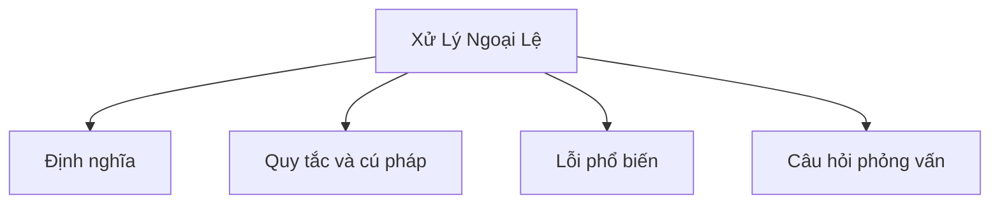

# 12 - Xử Lý Ngoại Lệ (Exception Handling)

Chủ đề này theo dõi đề cương tổng thể trong [outline.md](../outline.md). Mục tiêu là hiểu sâu từng khái niệm đủ để giải thích, nhận ra trong mã nguồn và trả lời các câu hỏi phỏng vấn.

## Thứ Tự Học

- [Ngoại Lệ Là Gì - Các Khái Niệm (What Is An Exception Concepts)](theory/01-what-is-an-exception-concepts.md)
- [Các Khái Niệm Finally (Finally Concepts)](theory/02-finally-concepts.md)
- [Các Khái Niệm ArrayIndexOutOfBoundsException](theory/03-arrayindexoutofboundsexception-concepts.md)
- [Các Khái Niệm FileNotFoundException](theory/04-filenotfoundexception-concepts.md)
- [Thuật Ngữ Chính (Key Terms)](terms/01-key-terms.md)

## Danh Sách Kiểm Tra Đề Cương

- Ngoại lệ là gì? (What is an exception?)
- Error và Exception
- Ngoại lệ đã kiểm tra (Checked exception)
- Ngoại lệ chưa kiểm tra (Unchecked exception)
- Ngoại lệ runtime (Runtime exception)
- try
- catch
- Multiple catch (nhiều khối catch)
- finally
- throw
- throws
- try-with-resources
- Ngoại lệ tùy chỉnh (Custom exception)
- Truyền ngoại lệ (Exception propagation)
- Các ngoại lệ phổ biến (Common exceptions):
  - `NullPointerException`
  - `ArrayIndexOutOfBoundsException`
  - `StringIndexOutOfBoundsException`
  - `ClassCastException`
  - `NumberFormatException`
  - `ArithmeticException`
  - `IllegalArgumentException`
  - `IllegalStateException`
  - `IOException`
  - `FileNotFoundException`
  - `SQLException`
- Các thực hành tốt khi xử lý ngoại lệ (Best practices when handling exceptions)

## Thẻ Anki

- [Basic](anki/basic.tsv)
- [Basic Extra](anki/basic-extra.tsv)
- [Cloze](anki/cloze.tsv)
- [Code Question](anki/code-question.tsv)

## Tự Kiểm Tra

Trước khi chuyển sang chủ đề tiếp theo, hãy xác nhận rằng bạn có thể trả lời các câu hỏi sau:
1. Tại sao Java có hai loại ngoại lệ riêng biệt (đã kiểm tra và chưa kiểm tra), và sự phân biệt về triết học nào khiến trình biên dịch bắt buộc xử lý cái này nhưng không bắt buộc cái kia?
   &rarr; Xem [Tại Sao Java Có Checked và Unchecked Exceptions](theory/01-what-is-an-exception-concepts.md#why-java-has-checked-and-unchecked-exceptions)
2. Tại sao khối `finally` chạy ngay cả khi câu lệnh `return` được thực thi trong `try`, và cơ chế JVM nào đảm bảo việc dọn dẹp không thể bị bỏ qua?
   &rarr; Xem [Tại Sao Finally Thực Thi Ngay Cả Khi Try Return Sớm](theory/02-finally-concepts.md#why-finally-executes-even-when-try-returns-early)
3. Tại sao `try-with-resources` thay thế `finally` thủ công để dọn dẹp tài nguyên, và `AutoCloseable` cho phép trình biên dịch đảm bảo thứ tự đóng như thế nào?
   &rarr; Xem [Tại Sao Try-With-Resources Thay Thế Finally Thủ Công](theory/02-finally-concepts.md#why-try-with-resources-replaces-manual-finally-for-resource-cleanup)
4. Tại sao chuỗi ngoại lệ (exception chaining — bọc ngoại lệ cấp thấp trong ngoại lệ cấp cao hơn) bảo toàn nguyên nhân gốc, và vấn đề debug nào mà việc mất ngoại lệ gốc gây ra?
   &rarr; Xem [Tại Sao Chuỗi Ngoại Lệ Bảo Toàn Bối Cảnh Debug](theory/02-finally-concepts.md#why-exception-chaining-preserves-debugging-context)
5. Tại sao việc bắt một kiểu ngoại lệ rộng như `Exception` hoặc `Throwable` lại nguy hiểm, và loại lỗi cụ thể nào mà việc bắt quá rộng gây ra?
   &rarr; Xem [Tại Sao Bắt Kiểu Ngoại Lệ Rộng Là Nguy Hiểm](theory/01-what-is-an-exception-concepts.md#why-catching-broad-exception-types-is-dangerous)

## Tổng Quan Mermaid

## Liên Kết Tham Khảo

- https://docs.oracle.com/javase/tutorial/essential/exceptions/
