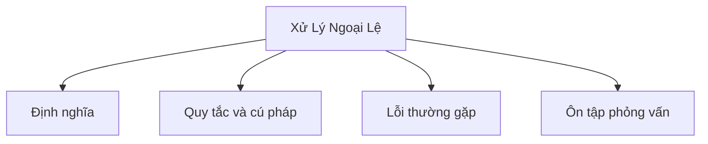

# 12 - Xử Lý Ngoại Lệ (Exception Handling)

Chủ đề này bám theo đề cương tổng thể trong [outline.md](../outline.md). Mục tiêu là hiểu sâu từng khái niệm đến mức có thể giải thích, nhận diện trong code và trả lời các câu hỏi phỏng vấn.

## Thứ Tự Học

- [Ngoại Lệ Là Gì?](theory/01-what-is-an-exception-concepts.md)
- [Khối Finally](theory/02-finally-concepts.md)
- [ArrayIndexOutOfBoundsException](theory/03-arrayindexoutofboundsexception-concepts.md)
- [FileNotFoundException](theory/04-filenotfoundexception-concepts.md)
- [Thuật Ngữ](terms/01-key-terms.md)

## Danh Sách Kiểm Tra Đề Cương

- Ngoại lệ là gì?
- Error vs Exception
- Ngoại lệ bắt buộc xử lý (Checked exception)
- Ngoại lệ không bắt buộc xử lý (Unchecked exception)
- Ngoại lệ runtime (Runtime exception)
- try
- catch
- Nhiều khối catch (multiple catch)
- finally
- throw
- throws
- try-with-resources
- Ngoại lệ tùy chỉnh (Custom exception)
- Lan truyền ngoại lệ (Exception propagation)
- Các ngoại lệ phổ biến:
  - NullPointerException
  - ArrayIndexOutOfBoundsException
  - StringIndexOutOfBoundsException
  - ClassCastException
  - NumberFormatException
  - ArithmeticException
  - IllegalArgumentException
  - IllegalStateException
  - IOException
  - FileNotFoundException
  - SQLException
- Các thực tiễn tốt nhất khi xử lý ngoại lệ

## Thẻ Anki

- [Basic](anki/basic.tsv)
- [Basic Extra](anki/basic-extra.tsv)
- [Cloze](anki/cloze.tsv)
- [Code Question](anki/code-question.tsv)

## Tự Kiểm Tra

Trước khi chuyển sang chủ đề tiếp theo, hãy xác nhận bạn có thể trả lời các câu hỏi sau:
1. Tại sao Java có hai loại ngoại lệ riêng biệt (checked và unchecked), và sự phân biệt triết học nào khiến trình biên dịch bắt buộc xử lý một loại mà không phải loại kia?
   &rarr; Xem [Tại Sao Java Có Checked và Unchecked Exceptions](theory/01-what-is-an-exception-concepts.md#why-java-has-checked-and-unchecked-exceptions)
2. Tại sao khối `finally` vẫn chạy kể cả khi câu lệnh `return` được thực thi bên trong `try`, và cơ chế JVM nào đảm bảo việc dọn dẹp không thể bị bỏ qua?
   &rarr; Xem [Tại Sao Finally Chạy Ngay Cả Khi Try Trả Về Sớm](theory/02-finally-concepts.md#why-finally-executes-even-when-try-returns-early)
3. Tại sao `try-with-resources` thay thế `finally` thủ công cho việc dọn dẹp tài nguyên, và `AutoCloseable` cho phép trình biên dịch đảm bảo thứ tự đóng như thế nào?
   &rarr; Xem [Tại Sao Try-With-Resources Thay Thế Finally Thủ Công](theory/02-finally-concepts.md#why-try-with-resources-replaces-manual-finally-for-resource-cleanup)
4. Tại sao chuỗi ngoại lệ (wrapping ngoại lệ cấp thấp trong ngoại lệ cấp cao hơn) bảo toàn nguyên nhân gốc, và việc mất ngoại lệ gốc tạo ra vấn đề gỡ lỗi gì?
   &rarr; Xem [Tại Sao Chuỗi Ngoại Lệ Bảo Toàn Ngữ Cảnh Gỡ Lỗi](theory/02-finally-concepts.md#why-exception-chaining-preserves-debugging-context)
5. Tại sao việc bắt kiểu ngoại lệ rộng như `Exception` hoặc `Throwable` lại nguy hiểm, và lớp bug cụ thể nào mà việc bắt quá rộng gây ra?
   &rarr; Xem [Tại Sao Bắt Kiểu Ngoại Lệ Rộng Là Nguy Hiểm](theory/01-what-is-an-exception-concepts.md#why-catching-broad-exception-types-is-dangerous)

## Sơ Đồ Tổng Quan (Mermaid)

## Liên Kết Tham Khảo

- https://docs.oracle.com/javase/tutorial/essential/exceptions/
