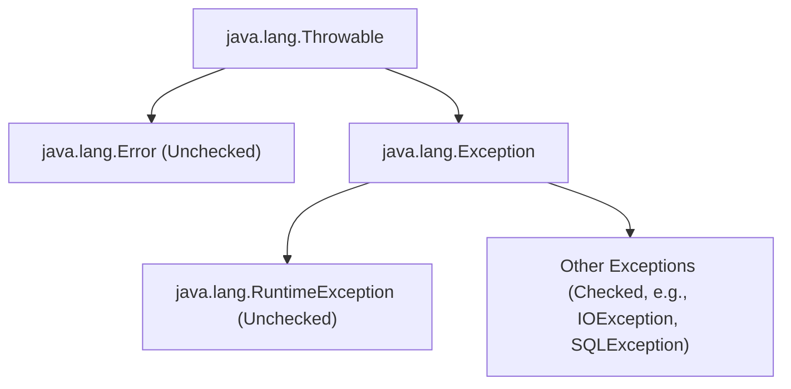

# Xử lý ngoại lệ (Exception Handling) - Phần 1

## Mục tiêu học tập (Learning Goal)

Tập tin này bao gồm một phần trọng tâm về **Xử lý ngoại lệ (Exception Handling)**. Hãy nghiên cứu từng khái niệm như một quy tắc Java thực tế, không phải là từ vựng riêng lẻ.

## Khái quát nội dung (Outline Coverage)

| Khái niệm (Concept) | Điều cần biết (What to know) |
| --- | --- |
| `What is an exception?` | Một ngoại lệ (exception) đại diện cho một điều kiện bất thường mà chương trình có thể bắt hoặc truyền đi tiếp. |
| `Error vs Exception` | Một ngoại lệ đại diện cho một điều kiện bất thường mà chương trình có thể bắt hoặc truyền đi tiếp. |
| `Checked exception` | Một ngoại lệ kiểm tra (checked exception) bắt buộc phải được xử lý hoặc khai báo theo các quy tắc của trình biên dịch. |
| `Unchecked exception` | Một ngoại lệ không kiểm tra (unchecked exception) không bắt buộc phải được bắt hoặc khai báo. |
| `Runtime exception` | Một ngoại lệ đại diện cho một điều kiện bất thường mà chương trình có thể bắt hoặc truyền đi tiếp. |
| `try` | try đánh dấu khối mã mà bạn muốn xử lý các ngoại lệ của nó, dọn dẹp sau đó, hoặc truyền đi tiếp. |
| `catch` | catch xử lý một kiểu ngoại lệ khớp được ném ra từ khối try. |
| `multiple catch` | Nhiều khối catch cho phép các kiểu ngoại lệ khác nhau được xử lý bởi các trình xử lý khác nhau, được sắp xếp thứ tự từ cụ thể đến khái quát. |

## Ghi chú chi tiết (Detailed Notes)

### Ngoại lệ là gì? (What is an exception?)

Một ngoại lệ (exception) đại diện cho một điều kiện bất thường mà chương trình có thể bắt hoặc truyền đi tiếp (propagate).

Điều này quan trọng vì hành vi của ngoại lệ quyết định xem các lỗi được xử lý cục bộ, truyền đi tiếp, hay cho phép dừng chương trình. Sự nhầm lẫn phổ biến là đối xử với mọi ngoại lệ như nhau thay vì tách biệt các điều kiện có thể phục hồi khỏi các lỗi lập trình.

Kiểm tra thực tế (Practical check):

- Định nghĩa `What is an exception?` trong một câu.
- Nhận diện `What is an exception?` trong mã nguồn, lệnh, tài liệu hoặc câu hỏi phỏng vấn.
- Giải thích một lỗi (bug), hạn chế hoặc sự đánh đổi liên quan đến `What is an exception?`.

Ví dụ nhỏ hoặc mô hình tư duy (Tiny example or mental model):

- Khi đọc mã nguồn, hãy hỏi: `What is an exception?` thay độ, cho phép, từ chối hoặc làm rõ điều gì?

#### Ví dụ mã nguồn chạy được: Ném và bắt một ngoại lệ (Runnable Code Example: Throwing and Catching an Exception)
Dưới đây là một ví dụ cơ bản về việc ném một `Exception` tiêu chuẩn và bắt nó cục bộ.

```java
public class ExceptionDemo {
    public static void main(String[] args) {
        try {
            System.out.println("Before exception throw");
            throw new Exception("Something went wrong");
            // System.out.println("Unreachable"); // Compile error: unreachable statement
        } catch (Exception e) {
            System.out.println("Caught exception: " + e.getMessage());
        }
        System.out.println("Execution continues normally.");
    }
}
```

### Lỗi so với Ngoại lệ (Error vs Exception)

Một ngoại lệ đại diện cho một điều kiện bất thường mà chương trình có thể bắt hoặc truyền đi tiếp.

Điều này quan trọng vì hành vi của ngoại lệ quyết định xem các lỗi được xử lý cục bộ, truyền đi tiếp, hay cho phép dừng chương trình. Sự nhầm lẫn phổ biến là đối xử với mọi ngoại lệ như nhau thay vì tách biệt các điều kiện có thể phục hồi khỏi các lỗi lập trình.

Kiểm tra thực tế (Practical check):

- Định nghĩa `Error vs Exception` trong một câu.
- Nhận diện `Error vs Exception` trong mã nguồn, lệnh, tài liệu hoặc câu hỏi phỏng vấn.
- Giải thích một lỗi (bug), hạn chế hoặc sự đánh đổi liên quan đến `Error vs Exception`.

Ví dụ nhỏ hoặc mô hình tư duy (Tiny example or mental model):

- Khi đọc mã nguồn, hãy hỏi: `Error vs Exception` thay đổi, cho phép, từ chối hoặc làm rõ điều gì?

#### Ví dụ mã nguồn chạy được: Phục hồi từ ngoại lệ so với crash chương trình do Lỗi (Runnable Code Example: Recovering from Exception vs Crashing on Error)
Các lỗi (như `StackOverflowError` hoặc `OutOfMemoryError`) chỉ ra các vấn đề nghiêm trọng mà một ứng dụng thông thường không nên cố gắng bắt. Các ngoại lệ (như `IOException` hoặc `NullPointerException`) là các điều kiện mà một ứng dụng thông thường có thể muốn bắt.

```java
public class ThrowableHierarchyDemo {
    // 1. Error: Stack Overflow do đệ quy vô hạn (thảm họa cấp độ JVM)
    public static void causeStackOverflow() {
        causeStackOverflow();
    }

    // 2. Exception: Chia cho 0 (vấn đề cấp độ chương trình có thể phục hồi)
    public static void causeException() {
        int result = 10 / 0;
    }

    public static void main(String[] args) {
        // Phục hồi từ ngoại lệ (Exception)
        try {
            causeException();
        } catch (ArithmeticException e) {
            System.out.println("Recovered from exception: " + e.getMessage());
        }

        // Gặp lỗi Error (Tránh bắt các lỗi Error trong mã nguồn sản xuất!)
        try {
            causeStackOverflow();
        } catch (StackOverflowError err) {
            System.err.println("Caught StackOverflowError (Highly discouraged to catch Errors): " + err);
        }
    }
}
```

#### Sơ đồ phân cấp lớp (Class Hierarchy Diagram)


### Ngoại lệ kiểm tra (Checked exception)

Một ngoại lệ kiểm tra (checked exception) bắt buộc phải được xử lý hoặc khai báo theo các quy tắc của trình biên dịch.

Điều này quan trọng vì hành vi của ngoại lệ quyết định xem các lỗi được xử lý cục bộ, truyền đi tiếp, hay cho phép dừng chương trình. Sự nhầm lẫn phổ biến là đối xử với mọi ngoại lệ như nhau thay vì tách biệt các điều kiện có thể phục hồi khỏi các lỗi lập trình.

Kiểm tra thực tế (Practical check):

- Định nghĩa `Checked exception` trong một câu.
- Nhận diện `Checked exception` trong mã nguồn, lệnh, tài liệu hoặc câu hỏi phỏng vấn.
- Giải thích một lỗi (bug), hạn chế hoặc sự đánh đổi liên quan đến `Checked exception`.

Ví dụ nhỏ hoặc mô hình tư duy (Tiny example or mental model):

- Khi đọc mã nguồn, hãy hỏi: `Checked exception` thay đổi, cho phép, từ chối hoặc làm rõ điều gì?

#### Ví dụ mã nguồn chạy được: Xử lý ngoại lệ kiểm tra (Runnable Code Example: Handling Checked Exceptions)
Các ngoại lệ kiểm tra đại diện cho các điều kiện bên ngoài sự kiểm soát trực tiếp của chương trình (ví dụ: các vấn đề về hệ thống tệp hoặc mạng). Trình biên dịch bắt buộc bạn phải bắt chúng bằng `try-catch` hoặc khai báo chúng trong chữ ký phương thức bằng cách sử dụng `throws`.

```java
import java.io.FileReader;
import java.io.FileNotFoundException;

public class CheckedExceptionDemo {
    // Cách 1: Khai báo ngoại lệ kiểm tra bằng cách sử dụng 'throws'
    public static void readFileWithThrows() throws FileNotFoundException {
        FileReader fr = new FileReader("non_existent_file.txt");
    }

    // Cách 2: Xử lý ngoại lệ kiểm tra bằng cách sử dụng 'try-catch'
    public static void readFileWithTryCatch() {
        try {
            FileReader fr = new FileReader("non_existent_file.txt");
        } catch (FileNotFoundException e) {
            System.out.println("Handled checked exception: File not found!");
        }
    }

    public static void main(String[] args) {
        readFileWithTryCatch();
    }
}
```

### Ngoại lệ không kiểm tra (Unchecked exception)

Một ngoại lệ không kiểm tra (unchecked exception) không bắt buộc phải được bắt hoặc khai báo.

Điều này quan trọng vì hành vi của ngoại lệ quyết định xem các lỗi được xử lý cục bộ, truyền đi tiếp, hay cho phép dừng chương trình. Sự nhầm lẫn phổ biến là đối xử với mọi ngoại lệ như nhau thay vì tách biệt các điều kiện có thể phục hồi khỏi các lỗi lập trình.

Kiểm tra thực tế (Practical check):

- Định nghĩa `Unchecked exception` trong một câu.
- Nhận diện `Unchecked exception` trong mã nguồn, lệnh, tài liệu hoặc câu hỏi phỏng vấn.
- Giải thích một lỗi (bug), hạn chế hoặc sự đánh đổi liên quan đến `Unchecked exception`.

Ví dụ nhỏ hoặc mô hình tư duy (Tiny example or mental model):

- Khi đọc mã nguồn, hãy hỏi: `Unchecked exception` thay đổi, cho phép, từ chối hoặc làm rõ điều gì?

#### Ví dụ mã nguồn chạy được: Ngoại lệ không kiểm tra (RuntimeException) (Runnable Code Example: Unchecked Exceptions (RuntimeExceptions))
Các ngoại lệ không kiểm tra đại diện cho các lỗi lập trình (ví dụ: lỗi logic, sử dụng API không đúng cách). Trình biên dịch không bắt buộc bạn phải xử lý hoặc khai báo chúng.

```java
public class UncheckedExceptionDemo {
    public static void main(String[] args) {
        String text = null;
        
        // This line throws NullPointerException at runtime.
        // It compiles successfully without any try-catch or throws declaration.
        try {
            int length = text.length();
        } catch (NullPointerException e) {
            System.out.println("Caught unchecked NullPointerException: " + e.getMessage());
        }
    }
}
```

### Ngoại lệ thời gian chạy (Runtime exception)

Một ngoại lệ đại diện cho một điều kiện bất thường mà chương trình có thể bắt hoặc truyền đi tiếp.

Điều này quan trọng vì hành vi của ngoại lệ quyết định xem các lỗi được xử lý cục bộ, truyền đi tiếp, hay cho phép dừng chương trình. Sự nhầm lẫn phổ biến là đối xử với mọi ngoại lệ như nhau thay vì tách biệt các điều kiện có thể phục hồi khỏi các lỗi lập trình.

Kiểm tra thực tế (Practical check):

- Định nghĩa `Runtime exception` trong một câu.
- Nhận diện `Runtime exception` trong mã nguồn, lệnh, tài liệu hoặc câu hỏi phỏng vấn.
- Giải thích một lỗi (bug), hạn chế hoặc sự đánh đổi liên quan đến `Runtime exception`.

Ví dụ nhỏ hoặc mô hình tư duy (Tiny example or mental model):

- Khi đọc mã nguồn, hãy hỏi: `Runtime exception` thay đổi, cho phép, từ chối hoặc làm rõ điều gì?

#### Ví dụ mã nguồn chạy được: Ngoại lệ thời gian chạy (các lớp con của RuntimeException) (Runnable Code Example: Runtime Exceptions (Subclasses of RuntimeException))
`RuntimeException` là lớp cha của các ngoại lệ có thể được ném ra trong quá trình hoạt động bình thường của Máy ảo Java.

```java
public class RuntimeExceptionDemo {
    public static void main(String[] args) {
        // ArithmeticException is a subclass of RuntimeException
        try {
            int result = 50 / 0;
        } catch (ArithmeticException e) {
            System.out.println("Caught RuntimeException subclass (ArithmeticException): " + e.getMessage());
        }
    }
}
```

### try

try đánh dấu khối mã mà bạn muốn xử lý các ngoại lệ của nó, dọn dẹp sau đó, hoặc truyền đi tiếp.

Sử dụng nó để dự đoán quy tắc Java chính xác, dạng được cho phép, và chế độ thất bại. Hãy xem lại nó với một ví dụ nhỏ thay vì chỉ ghi nhớ nhãn.

Kiểm tra thực tế (Practical check):

- Định nghĩa `try` trong một câu.
- Nhận diện `try` trong mã nguồn, lệnh, tài liệu hoặc câu hỏi phỏng vấn.
- Giải thích một lỗi (bug), hạn chế hoặc sự đánh đổi liên quan đến `try`.

Ví dụ nhỏ hoặc mô hình tư duy (Tiny example or mental model):

- `try { ... } catch (IOException ex) { ... }` xử lý một luồng lỗi cụ thể.

#### Ví dụ mã nguồn chạy được: Phạm vi của khối Try (Runnable Code Example: Try Block Scope)
Một khối `try` không thể tồn tại một mình. Nó phải được theo sau bởi ít nhất một khối `catch`, một khối `finally`, hoặc cả hai. Các biến được khai báo bên trong khối `try` là cục bộ đối với khối đó và không thể truy cập được từ bên ngoài.

```java
public class TryScopeDemo {
    public static void main(String[] args) {
        try {
            int x = 10;
            System.out.println("x in try: " + x);
        } catch (Exception e) {
            // System.out.println(x); // Compile error: x is out of scope here
        }
        // System.out.println(x); // Compile error: x is out of scope here
    }
}
```

### catch

catch xử lý một kiểu ngoại lệ khớp được ném ra từ khối try.

Sử dụng nó để dự đoán quy tắc Java chính xác, dạng được cho phép, và chế độ thất bại. Hãy xem lại nó với một ví dụ nhỏ thay vì chỉ ghi nhớ nhãn.

Kiểm tra thực tế (Practical check):

- Định nghĩa `catch` trong một câu.
- Nhận diện `catch` trong mã nguồn, lệnh, tài liệu hoặc câu hỏi phỏng vấn.
- Giải thích một lỗi (bug), hạn chế hoặc sự đánh đổi liên quan đến `catch`.

Ví dụ nhỏ hoặc mô hình tư duy (Tiny example or mental model):

- `try { ... } catch (IOException ex) { ... }` xử lý một luồng lỗi cụ thể.

#### Ví dụ mã nguồn chạy được: Bắt các ngoại lệ cụ thể (Runnable Code Example: Catching Specific Exception)
Khi một ngoại lệ được ném ra trong khối `try`, Java sẽ khớp kiểu ngoại lệ với kiểu tham số của khối `catch`.

```java
public class CatchDemo {
    public static void main(String[] args) {
        try {
            String str = "abc";
            int num = Integer.parseInt(str); // Throws NumberFormatException
        } catch (NumberFormatException e) {
            System.out.println("Caught NumberFormatException: " + e.getMessage());
        }
    }
}
```

### Nhiều khối catch (multiple catch)

Nhiều khối catch cho phép các kiểu ngoại lệ khác nhau được xử lý bởi các trình xử lý khác nhau, được sắp xếp thứ tự từ cụ thể đến khái quát.

Sử dụng nó để dự đoán quy tắc Java chính xác, dạng được cho phép, và chế độ thất bại. Hãy xem lại nó với một ví dụ nhỏ thay vì chỉ ghi nhớ nhãn.

Kiểm tra thực tế (Practical check):

- Định nghĩa `multiple catch` trong một câu.
- Nhận diện `multiple catch` trong mã nguồn, lệnh, tài liệu hoặc câu hỏi phỏng vấn.
- Giải thích một lỗi (bug), hạn chế hoặc sự đánh đổi liên quan đến `multiple catch`.

Ví dụ nhỏ hoặc mô hình tư duy (Tiny example or mental model):

- `try { ... } catch (IOException ex) { ... }` xử lý một luồng lỗi cụ thể.

#### Ví dụ mã nguồn chạy được: Nhiều khối Catch riêng lẻ so với khối Multi-Catch (Hợp nhất) (Runnable Code Example: Multiple Catch Blocks vs Multi-Catch (Union Catch))
Java cho phép bạn định nghĩa nhiều khối `catch` cho một khối `try` duy nhất, hoặc bắt nhiều kiểu ngoại lệ trong một khối `catch` duy nhất bằng cách sử dụng toán tử gạch đứng (`|`).

```java
public class MultipleCatchDemo {
    public static void main(String[] args) {
        // Kịch bản 1: Nhiều khối catch riêng lẻ (sắp xếp từ cụ thể đến tổng quát)
        try {
            int[] arr = new int[3];
            arr[5] = 10; // ArrayIndexOutOfBoundsException
        } catch (ArrayIndexOutOfBoundsException e) {
            System.out.println("Caught specific index out of bounds exception");
        } catch (RuntimeException e) {
            System.out.println("Caught general RuntimeException");
        }

        // Kịch bản 2: Multi-catch (Khối catch hợp nhất)
        try {
            String str = null;
            str.length(); // NullPointerException
        } catch (NullPointerException | ArithmeticException e) {
            // Note: 'e' is implicitly final in a multi-catch block
            // e = new NullPointerException(); // Compile error: cannot assign a value to final variable e
            System.out.println("Caught NullPointerException or ArithmeticException: " + e.getClass().getSimpleName());
        }
    }
}
```

## Các lỗi thường gặp (Common Mistakes)

### 1. Bắt ngoại lệ của lớp cha trước ngoại lệ của lớp con (Catching a Superclass Exception Before a Subclass Exception)
Vì việc so khớp ngoại lệ được giải quyết theo thứ tự từ trên xuống dưới, việc bắt một kiểu ngoại lệ rộng hơn (như `Exception`) trước một kiểu ngoại lệ cụ thể hơn (như `IOException`) sẽ dẫn đến lỗi thời gian biên dịch.
```java
// COMPILE ERROR: exception java.io.IOException has already been caught
try {
    throw new java.io.IOException("File missing");
} catch (Exception e) {
    System.out.println("Caught Exception");
} catch (java.io.IOException e) { // Compile Error!
    System.out.println("Caught IOException");
}
```

### 2. Bắt các ngoại lệ kiểm tra không thể ném ra trong khối Try (Catching Checked Exceptions That Cannot Be Thrown in Try Block)
Nếu bạn viết một khối catch cho một ngoại lệ **kiểm tra** (checked exception) cụ thể, nhưng mã nguồn trong khối `try` tương ứng không có khả năng ném ra ngoại lệ đó, trình biên dịch sẽ báo lỗi. (Lưu ý: Quy tắc này không áp dụng cho các ngoại lệ không kiểm tra hoặc các ngoại lệ rộng như `Exception` hoặc `Throwable`).
```java
// COMPILE ERROR: exception java.io.IOException is never thrown in body of corresponding try statement
try {
    int x = 10 / 2;
} catch (java.io.IOException e) { // Compile Error!
    System.out.println("Caught IOException");
}
```

### 3. Gán lại biến ngoại lệ trong các khối Multi-Catch (Reassigning the Exception Variable in Multi-Catch Blocks)
Biến ngoại lệ `e` trong một khối multi-catch (ví dụ: `catch (ArithmeticException | NullPointerException e)`) ngầm định là `final`. Mọi nỗ lực gán lại giá trị cho nó đều dẫn đến lỗi biên dịch.
```java
try {
    int x = 10 / 0;
} catch (ArithmeticException | NullPointerException e) {
    // e = new ArithmeticException("new message"); // Compile Error!
}
```

## Các câu hỏi ôn tập thường gặp (Common Review Prompts)

- Khái niệm nào ở đây là quy tắc thời gian biên dịch (compile-time rule)?
- Khái niệm nào ở đây ảnh hưởng đến hành vi thời gian chạy (runtime behavior)?
- Khái niệm nào ở đây dễ là bẫy phỏng vấn?

---

## Tại sao Java có Ngoại lệ kiểm tra và Ngoại lệ không kiểm tra (Why Java Has Checked and Unchecked Exceptions)

Các nhà thiết kế của Java đã đưa ra một sự phân biệt triết học có chủ ý khi phân loại các ngoại lệ. **Ngoại lệ kiểm tra (Checked exception)** đại diện cho các lỗi ở các tài nguyên bên ngoài hoặc các điều kiện hoàn toàn nằm ngoài sự kiểm soát của chương trình — I/O hệ thống tệp, kết nối mạng, truy cập cơ sở dữ liệu. Những lỗi này là dự kiến được, có thể xảy ra và có thể phục hồi: một tệp có thể không tồn tại, mạng có thể không khả dụng. Trình biên dịch bắt buộc phải xử lý vì nhà thiết kế tin rằng người gọi phải được thông báo rõ ràng về các chế độ lỗi này và phải đưa ra quyết định xử lý chúng.

**Ngoại lệ không kiểm tra (Unchecked exception)** (`RuntimeException` và các lớp con của nó) đại diện cho các lỗi lập trình — tham chiếu null (null dereference), lỗi chỉ số mảng, chia cho không, tham số không hợp lệ. Đây là những lỗi do chính mã nguồn gây ra, không phải do các điều kiện bên ngoài. Vì về mặt lý thuyết chúng có thể xảy ra ở bất kỳ đâu trong bất kỳ mã nguồn nào, việc bắt buộc trình biên dịch phải thực thi `try-catch` cho mọi ngoại lệ không kiểm tra sẽ làm cho mã nguồn Java trở nên dài dòng và khó đọc một cách khủng khiếp. Quyết định thiết kế là: các lập trình viên được kỳ vọng sẽ sửa lỗi (bug), chứ không phải bắt lỗi.

Sự phân biệt này ánh xạ tới câu hỏi: "Chế độ lỗi này có phải là thứ mà người gọi có thể được mong đợi xử lý một cách hợp lý tại nơi gọi hay không?" Đối với `FileNotFoundException` — có, người gọi có thể xử lý việc thiếu tệp. Đối với `NullPointerException` — không, phản hồi chính xác là sửa lỗi tham chiếu null trong mã, chứ không phải bắt ngoại lệ đó.

### Mô hình tư duy: Sự phân chia giữa Checked và Unchecked (Mental Model: Checked vs Unchecked split)
```
Các lỗi do môi trường bên ngoài (Checked - trình biên dịch bắt buộc xử lý):
  FileNotFoundException → mạng: IOException → cơ sở dữ liệu: SQLException
  Người gọi BẮT BUỘC phải quyết định: bắt nó tại đây, hoặc khai báo throws để truyền nó lên trên

Các lỗi lập trình (Unchecked - trình biên dịch KHÔNG bắt buộc xử lý):
  NullPointerException → ArrayIndexOutOfBoundsException → NumberFormatException
  Lập trình viên nên SỬA lỗi trong mã, chứ không phải bắt nó
  Về mặt lý thuyết có thể xảy ra ở bất kỳ phương thức nào → bắt buộc bắt mọi nơi = mã cực kỳ khó đọc
```

### Ví dụ mã nguồn: Checked so với Unchecked trong chữ ký phương thức (Code Example: Checked vs Unchecked in method signatures)
```java
import java.io.*;

// CHECKED — compiler enforces caller to handle or declare throws
public void readFile(String path) throws FileNotFoundException {
    FileReader fr = new FileReader(path);  // compiler mandates this is handled
}

// UNCHECKED — no compiler requirement to declare or handle
public int divide(int a, int b) {
    return a / b;  // ArithmeticException if b=0 — compiler doesn't care
}

// Caller of readFile MUST handle
try {
    readFile("config.txt");       // must catch FileNotFoundException
} catch (FileNotFoundException e) {
    System.out.println("Config missing: " + e.getMessage());
}

// Caller of divide has no compiler requirement
int result = divide(10, 0);  // throws ArithmeticException at runtime — fix the code
```

### Chuỗi nguyên nhân - kết quả (Cause-Effect Chain)

```text
I/O tệp gặp lỗi
  → `FileNotFoundException` được ném ra (checked)
  → Trình biên dịch phát hiện ngoại lệ kiểm tra chưa được bắt
  → Lỗi biên dịch xảy ra trừ khi thêm try-catch hoặc khai báo throws
  → Người gọi bị buộc phải đưa ra quyết định có ý thức về lỗi
  → Chương trình xử lý hoặc truyền đi — không bao giờ im lặng bỏ qua. Lỗi lập trình: tham chiếu null
  → `NullPointerException` được ném ra (unchecked)
  → Trình biên dịch không đưa ra yêu cầu bắt buộc
  → Ngoại lệ truyền ngược lên ngăn xếp cuộc gọi
  → Chương trình bị sập với dấu vết ngăn xếp (stack trace)
  → Nhà phát triển sửa lỗi kiểm tra null trong mã nguồn.
```


---

## Tại sao việc bắt các kiểu Ngoại lệ chung chung lại nguy hiểm (Why Catching Broad Exception Types Is Dangerous)

Khi bạn bắt `Exception` hoặc `Throwable` một cách chung chung, bạn không chỉ bắt các ngoại lệ bạn mong đợi, mà còn bắt mọi ngoại lệ khác có thể ném ra — bao gồm `InterruptedException`, `OutOfMemoryError`, `StackOverflowError`, `ThreadDeath`, và các ngoại lệ trong tương lai được thêm vào khi tái cấu trúc. Điều này dẫn đến ba vấn đề nghiêm trọng.

Thứ nhất, **che giấu ngoại lệ (exception masking)**: một ngoại lệ không lường trước được bị bắt và xử lý như thể nó là ngoại lệ dự kiến, che giấu lỗi thực sự. Mã nguồn bắt `Exception` và ghi log "file not found" có thể đang che giấu một lỗi hết thời gian chờ cơ sở dữ liệu, một lỗi con trỏ null, hoặc sự cố mạng — tất cả đều bị phân loại sai một cách âm thầm thành "file not found".

Thứ hai, **nuốt lỗi (swallowed errors)**: nếu các lớp con `Error` bị bắt thông qua `Throwable`, các thảm họa cấp độ JVM như `OutOfMemoryError` sẽ bị hấp thụ một cách âm thầm, khiến ứng dụng rơi vào trạng thái không xác định.

Thứ ba, **mất thông tin kiểu ngoại lệ**: các khối catch thường có phản ứng khác nhau tùy thuộc vào kiểu ngoại lệ. Một khối catch chung chung với một phản hồi duy nhất sẽ buộc tất cả các ngoại lệ phải có cùng một hành vi, ngăn cản phản hồi chính xác và đặc thù cho từng kiểu.

### Mô hình tư duy: Phạm vi bắt Hẹp so với Rộng (Mental Model: Narrow vs Broad catch scope)
```
[Bắt hẹp — Chính xác]
try { readFile("data.csv"); }
catch (FileNotFoundException e) {
    // Chỉ xử lý khi thiếu tệp
    // Tất cả các ngoại lệ khác sẽ truyền tới các trình xử lý thích hợp của chúng
}

[Bắt rộng — Nguy hiểm]
try { readFile("data.csv"); }
catch (Exception e) {
    // Bắt cả FileNotFoundException ← mong muốn
    // Bắt luôn cả NullPointerException ← che giấu lỗi lập trình!
    // Bắt luôn cả OutOfMemoryError (qua Throwable) ← cực kỳ nguy hiểm!
    // Bắt luôn cả SQLException ← không liên quan, cần hành vi xử lý khác
    log("Error: " + e.getMessage()); // một phản hồi cho tất cả — sai lầm!
}
```

### Ví dụ mã nguồn: Che giấu lỗi thông qua việc bắt ngoại lệ chung chung (Code Example: Bug masking via broad exception catch)
```java
public void processFile(String path) {
    try {
        FileReader fr = new FileReader(path);    // May throw FileNotFoundException
        String content = null;
        content.length();                         // NullPointerException bug in code!
    } catch (Exception e) {
        // BUG MASKED: Both exceptions caught here as if they were the same
        System.out.println("File error: " + e.getMessage());
        // Developer thinks file is missing — actually there's a NPE in the code
    }
}

// CHÍNH XÁC:
public void processFileCorrect(String path) throws FileNotFoundException {
    FileReader fr = new FileReader(path);    // Compiler enforces handling
    String content = null;
    content.length();                         // NullPointerException propagates — visible bug!
}
```

### Chuỗi nguyên nhân - kết quả (Cause-Effect Chain)

```text
Bắt `Exception` một cách chung chung
  → `NullPointerException` bị ném ra bên trong try
  → Bị bắt bởi khối `catch (Exception e)` rộng
  → Ứng dụng ghi log "file error"
  → Lỗi bị phân loại sai thành lỗi dự kiến
  → Nhà phát triển điều tra đường dẫn tệp chứ không phải lỗi tham chiếu null
  → Lỗi thực sự bị che giấu trong nhiều ngày hoặc nhiều tuần. Bắt hẹp (`FileNotFoundException`)
  → `NullPointerException` không bị bắt tại đây
  → Truyền ngược lên ngăn xếp cuộc gọi
  → Chương trình sập với stack trace rõ ràng
  → Nhà phát triển nhìn thấy lỗi tham chiếu null ngay lập tức.
```

