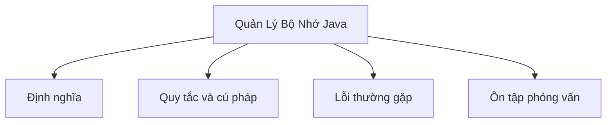

# 13 - Quản Lý Bộ Nhớ Java (Java Memory Management)

Chủ đề này tuân theo bản outline chính trong [outline.md](../outline.md). Mục tiêu là hiểu sâu từng khái niệm đủ để giải thích, nhận biết trong code, và trả lời câu hỏi phỏng vấn.

## Thứ Tự Học

- [Khái Niệm Stack](theory/01-stack-concepts.md)
- [Khái Niệm Tham Chiếu Yếu](theory/02-weak-reference-concepts.md)
- [Khái Niệm OutOfMemoryError](theory/03-outofmemoryerror-concepts.md)
- [Thuật Ngữ Chính](terms/01-key-terms.md)

## Danh Sách Kiểm Tra Outline

- Stack (Ngăn xếp)
- Heap (Vùng nhớ heap)
- Vùng Phương Thức (Method Area) / Metaspace
- PC Register (Thanh ghi bộ đếm chương trình)
- Native Method Stack (Ngăn xếp phương thức gốc)
- Vòng đời đối tượng (Object lifecycle)
- Biến tham chiếu (Reference variable)
- Tham chiếu mạnh (Strong reference)
- Tham chiếu yếu (Weak reference)
- Tham chiếu mềm (Soft reference)
- Tham chiếu ảo (Phantom reference)
- Thu gom rác (Garbage Collection)
- Điều kiện để đối tượng bị GC thu hồi
- System.gc()
- Finalization, finalize() đã bị deprecated (không dùng nữa)
- Rò rỉ bộ nhớ (Memory leak) trong Java
- OutOfMemoryError
- StackOverflowError

## Thẻ Anki

- [Basic](anki/basic.tsv)
- [Basic Extra](anki/basic-extra.tsv)
- [Cloze](anki/cloze.tsv)
- [Code Question](anki/code-question.tsv)

## Tự Kiểm Tra

Trước khi chuyển sang chủ đề tiếp theo, hãy xác nhận bạn có thể trả lời các câu hỏi sau:
1. Tại sao JVM phân bổ biến kiểu nguyên thủy (primitive) trên Stack trong một số tình huống nhưng lại trên Heap trong các tình huống khác, và phạm vi khai báo xác định vị trí bộ nhớ như thế nào?
   → Xem [Tại Sao Kiểu Nguyên Thủy Sống Trên Stack Hay Heap](theory/01-stack-concepts.md#why-primitives-live-on-the-stack-or-heap)
2. Tại sao Java hoàn toàn là truyền theo giá trị (pass-by-value), và điều gì xảy ra ở cấp độ biến tham chiếu khi tham chiếu đối tượng được truyền vào phương thức?
   → Xem [Tại Sao Java Hoàn Toàn Là Pass-by-Value](theory/01-stack-concepts.md#why-java-is-strictly-pass-by-value)
3. Tại sao Tham chiếu Yếu, Mềm và Ảo hoạt động khác nhau trong quá trình Thu Gom Rác, và yêu cầu về bộ nhớ hoặc dọn dẹp sau thu hồi nào quyết định việc lựa chọn từng loại?
   → Xem [Tại Sao Các Loại Tham Chiếu Khác Nhau Tồn Tại](theory/02-weak-reference-concepts.md#why-different-reference-types-exist)
4. Tại sao các tham chiếu vòng tròn (đảo cô lập — islands of isolation) có thể được thu gom rác trong Java, và tracing từ GC Roots giải quyết hạn chế của reference counting như thế nào?
   → Xem [Tại Sao Đảo Cô Lập Có Thể Được Thu Gom Rác](theory/02-weak-reference-concepts.md#why-islands-of-isolation-can-be-garbage-collected)
5. Tại sao OutOfMemoryError và StackOverflowError xảy ra ở các vùng bộ nhớ JVM khác nhau, và tại sao việc bắt các lỗi này trong code ứng dụng được xem là một phản mẫu nguy hiểm?
   → Xem [Tại Sao Lỗi Heap Và Stack Khác Nhau](theory/03-outofmemoryerror-concepts.md#why-heap-and-stack-errors-differ)

## Tổng Quan Mermaid

## Liên Kết Tham Khảo

- https://docs.oracle.com/en/java/javase/21/gctuning/introduction-garbage-collection-tuning.html
- https://docs.oracle.com/en/java/javase/21/docs/api/java.base/java/lang/ref/package-summary.html
