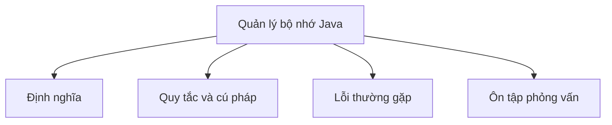

# 13 - Quản lý bộ nhớ Java (Java Memory Management)

Chủ đề này tuân theo đề cương chính tại [outline.md](../../outline.md). Mục tiêu là hiểu từng khái niệm đủ sâu để giải thích, nhận diện trong code và trả lời các câu hỏi phỏng vấn.

## Thứ tự học

- [Khái niệm Stack](theory/01-stack-concepts.md)
- [Khái niệm Weak Reference](theory/02-weak-reference-concepts.md)
- [Khái niệm OutOfMemoryError](theory/03-outofmemoryerror-concepts.md)
- [Thuật ngữ chính](terms/01-key-terms.md)

## Danh mục đề cương

- Stack
- Heap
- Method Area / Metaspace
- PC Register
- Native Method Stack
- Vòng đời đối tượng (Object lifecycle)
- Biến tham chiếu (Reference variable)
- Strong reference (tham chiếu mạnh)
- Weak reference (tham chiếu yếu)
- Soft reference (tham chiếu mềm)
- Phantom reference (tham chiếu ảo)
- Garbage Collection (thu gom rác)
- Điều kiện để đối tượng bị GC
- `System.gc()`
- Finalization, `finalize()` deprecated (đã bị loại bỏ)
- Memory leak (rò rỉ bộ nhớ) trong Java
- `OutOfMemoryError`
- `StackOverflowError`

## Thẻ Anki

- [Basic](anki/basic.tsv)
- [Basic Extra](anki/basic-extra.tsv)
- [Cloze](anki/cloze.tsv)
- [Code Question](anki/code-question.tsv)

## Tự kiểm tra (Self-Check)

Trước khi chuyển sang chủ đề tiếp theo, hãy xác minh rằng bạn có thể trả lời các câu hỏi sau:
1. Tại sao JVM cấp phát các biến nguyên thủy (primitive) lên Stack trong một số trường hợp nhưng lại lên Heap trong các trường hợp khác, và phạm vi khai báo xác định vị trí bộ nhớ của chúng như thế nào?
   → Xem [Why Primitives Live on the Stack or Heap](theory/01-stack-concepts.md#why-primitives-live-on-the-stack-or-heap)
2. Tại sao Java hoàn toàn là pass-by-value (truyền theo giá trị), và điều gì xảy ra ở cấp độ biến tham chiếu khi một tham chiếu đối tượng được truyền vào method?
   → Xem [Why Java Is Strictly Pass-by-Value](theory/01-stack-concepts.md#why-java-is-strictly-pass-by-value)
3. Tại sao Weak, Soft và Phantom reference lại có hành vi khác nhau trong quá trình Garbage Collection, và những ràng buộc bộ nhớ hay yêu cầu dọn dẹp nào chi phối việc lựa chọn mỗi loại?
   → Xem [Why Different Reference Types Exist](theory/02-weak-reference-concepts.md#why-different-reference-types-exist)
4. Tại sao các tham chiếu vòng tròn (đảo cô lập) có thể bị thu gom rác trong Java, và tracing từ GC Roots giải quyết các hạn chế của reference counting như thế nào?
   → Xem [Why Islands of Isolation Can Be Garbage Collected](theory/02-weak-reference-concepts.md#why-islands-of-isolation-can-be-garbage-collected)
5. Tại sao `OutOfMemoryError` và `StackOverflowError` xảy ra ở các vùng bộ nhớ khác nhau của JVM, và tại sao việc bắt các lỗi này bên trong code ứng dụng được coi là anti-pattern nguy hiểm?
   → Xem [Why Heap and Stack Errors Differ](theory/03-outofmemoryerror-concepts.md#why-heap-and-stack-errors-differ)

## Sơ đồ tổng quan (Mermaid Overview)

## Reference Links

- https://docs.oracle.com/en/java/javase/21/gctuning/introduction-garbage-collection-tuning.html
- https://docs.oracle.com/en/java/javase/21/docs/api/java.base/java/lang/ref/package-summary.html
