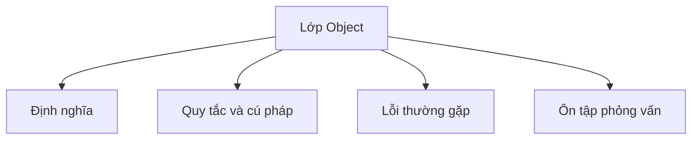

# 14 - Lớp Object (Object class)

Chủ đề này tuân theo đề cương chính tại [outline.md](../../outline.md). Mục tiêu là hiểu từng khái niệm đủ sâu để giải thích, nhận diện trong code và trả lời các câu hỏi phỏng vấn.

## Thứ tự học

- [Khái niệm toString](theory/01-tostring-concepts.md)
- [Khái niệm Contract của equals](theory/02-contract-of-equals-concepts.md)
- [Thuật ngữ chính](terms/01-key-terms.md)

## Danh mục đề cương

- `toString()`
- `equals()`
- `hashCode()`
- `getClass()`
- `clone()`
- `finalize()` deprecated (đã bị loại bỏ)
- `wait()`
- `notify()`
- `notifyAll()`
- Tại sao ghi đè `equals()` thì cũng phải ghi đè `hashCode()`
- Contract của `equals()` (hợp đồng bằng nhau)
- Contract của `hashCode()` (hợp đồng mã băm)
- So sánh đối tượng theo tham chiếu và theo giá trị

## Thẻ Anki

- [Basic](anki/basic.tsv)
- [Basic Extra](anki/basic-extra.tsv)
- [Cloze](anki/cloze.tsv)
- [Code Question](anki/code-question.tsv)

## Tự kiểm tra (Self-Check)

1. Tại sao việc không ghi đè `hashCode()` cùng với `equals()` lại làm hỏng tra cứu trong `HashMap`?
2. Tại sao việc thêm trường giá trị vào lớp con khiến không thể viết một phương thức `equals()` hoàn hảo trong khi vẫn bảo toàn tính bắc cầu (transitivity)?
3. Tại sao `identityHashCode` mặc định không đại diện cho địa chỉ vật lý trong bộ nhớ trên các JVM hiện đại?
4. Tại sao `toString()` được gọi ngầm định trong phép nối chuỗi và in ra màn hình, và điều này dẫn đến stack overflow trong tham chiếu vòng tròn như thế nào?
5. Tại sao nạp chồng (overloading) `equals(MyClass)` thay vì ghi đè (overriding) `equals(Object)` biên dịch tốt nhưng lại thất bại âm thầm trong các collection?

## Sơ đồ tổng quan (Mermaid Overview)

## Reference Links

- https://docs.oracle.com/en/java/javase/21/docs/api/java.base/java/lang/Object.html
