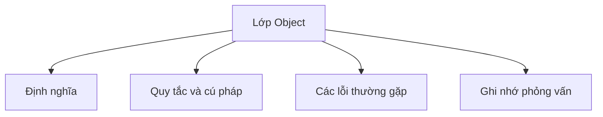

# 14 - Lớp Object (Object class)

Chủ đề này bám sát đề cương chính trong [outline.md](../outline.md). Mục tiêu là hiểu sâu từng khái niệm để có thể giải thích, nhận diện trong mã nguồn và trả lời các câu hỏi phỏng vấn.

## Thứ Tự Học Tập (Study Order)

- [Khái Niệm toString](theory/01-tostring-concepts.md)
- [Khái Niệm Hợp Đồng equals](theory/02-contract-of-equals-concepts.md)
- [Thuật Ngữ Chính](terms/01-key-terms.md)

## Checklist Đề Cương (Outline Checklist)

- toString()
- equals()
- hashCode()
- getClass()
- clone()
- finalize() (đã bị phản đối - deprecated)
- wait()
- notify()
- notifyAll()
- Tại sao khi ghi đè equals() bạn cũng nên ghi đè hashCode()
- Hợp đồng của equals()
- Hợp đồng của hashCode()
- So sánh đối tượng theo tham chiếu (reference) và theo giá trị (value)

## Thẻ Anki (Anki Cards)

- [Cơ Bản (Basic)](anki/basic.tsv)
- [Cơ Bản Mở Rộng (Basic Extra)](anki/basic-extra.tsv)
- [Điền Khuyết (Cloze)](anki/cloze.tsv)
- [Câu Hỏi Code (Code Question)](anki/code-question.tsv)

## Tự Kiểm Tra (Self-Check)

1. Tại sao việc không ghi đè `hashCode()` cùng với `equals()` lại làm hỏng việc tra cứu của `HashMap`?
2. Tại sao việc thêm một trường giá trị (value field) vào lớp con lại khiến cho việc viết một phương thức `equals()` hoàn hảo trở nên bất khả thi trong khi vẫn phải bảo toàn tính chất bắc cầu (transitivity)?
3. Tại sao `identityHashCode` mặc định không đại diện cho địa chỉ bộ nhớ vật lý trong các JVM hiện đại?
4. Tại sao `toString()` được tự động gọi trong phép nối chuỗi (string concatenation) và đầu ra hệ thống, và làm thế nào điều này dẫn đến tràn ngăn xếp (stack overflow) trong các tham chiếu vòng (circular reference)?
5. Tại sao việc nạp chồng `equals(MyClass)` thay vì ghi đè `equals(Object)` vẫn biên dịch bình thường nhưng lại âm thầm thất bại khi hoạt động với các cấu trúc tập hợp (collections)?

## Tổng Quan Mermaid (Mermaid Overview)

## Liên Kết Tham Khảo (Reference Links)

- https://docs.oracle.com/en/java/javase/21/docs/api/java.base/java/lang/Object.html
