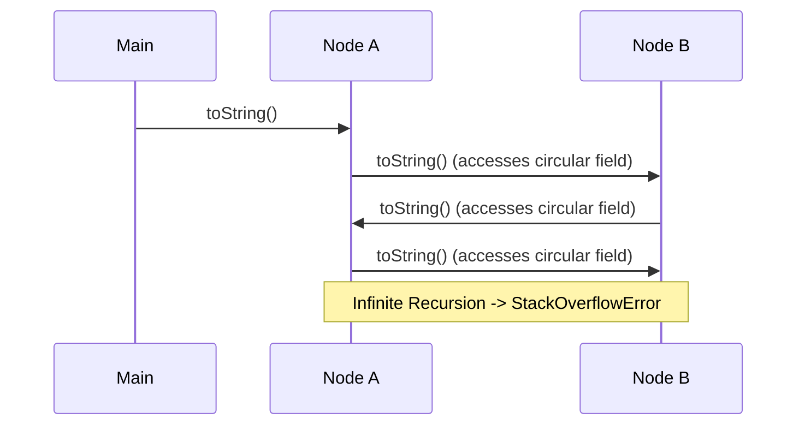
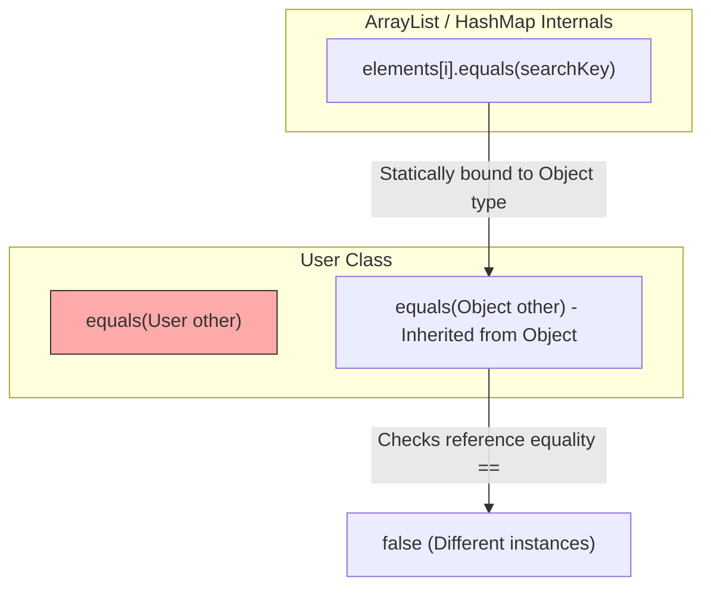

# Lớp Object (Object Class) - Phần 1

## Mục tiêu học tập (Learning Goal)

Tập tin này bao gồm một phần trọng tâm về **Lớp Object (Object Class)**. Hãy nghiên cứu từng khái niệm như một quy tắc Java thực tế, không phải là từ vựng riêng lẻ.

## Khái quát nội dung (Outline Coverage)

| Khái niệm (Concept) | Điều cần biết (What to know) |
| --- | --- |
| `toString()` | toString() trả về một biểu diễn văn bản dễ đọc đối với con người của một đối tượng. |
| `equals()` | equals() định nghĩa sự bằng nhau về mặt logic giữa các đối tượng. |
| `hashCode()` | hashCode() trả về một mã băm kiểu số nguyên được sử dụng bởi các bộ sưu tập dựa trên bảng băm. |
| `getClass()` | getClass() trả về đối tượng Class của một thực thể ở thời gian chạy. |
| `clone()` | clone() tạo ra một bản sao theo từng trường khi việc nhân bản được hỗ trợ, nhưng nó thường bị tránh trong thiết kế Java hiện đại. |
| `finalize() deprecated` | Hàm finalize() bị loại bỏ (Lưu ý: Mô tả gốc tiếng Anh mô tả sai từ khóa final, nghĩa là biến, phương thức, lớp hoặc tham số bị hạn chế thay đổi sau đó theo một cách cụ thể). |
| `wait()` | wait() giải phóng một khóa giám sát đối tượng và tạm dừng luồng (Thread) hiện tại cho đến khi nhận được thông báo hoặc hết thời gian chờ. |
| `notify()` | notify() đánh thức một luồng đang chờ trên cùng một khóa giám sát đối tượng. |
| `notifyAll()` | notifyAll() đánh thức tất cả các luồng đang chờ trên cùng một khóa giám sát đối tượng. |
| `Why overriding equals() means you should also override hashCode()` | equals() định nghĩa sự bằng nhau về mặt logic giữa các đối tượng. |

## Ghi chú chi tiết (Detailed Notes)

### toString()

`toString()` trả về một biểu diễn văn bản dễ đọc đối với con người của một đối tượng. Theo mặc định, `Object.toString()` trả về tên lớp, theo sau bởi ký tự `@` và biểu diễn thập lục phân (hexadecimal) không dấu của mã băm của đối tượng:
```java
public String toString() {
    return getClass().getName() + "@" + Integer.toHexString(hashCode());
}
```
Thực hành tốt nhất là ghi đè (override) `toString()` để trả về một biểu diễn ngắn gọn, nhiều thông tin về trạng thái của đối tượng, điều này cực kỳ hữu ích cho việc ghi log và gỡ lỗi.

#### Ví dụ: Ghi đè `toString()` (Example: Overriding toString())
```java
public class User {
    private final int id;
    private final String username;

    public User(int id, String username) {
        this.id = id;
        this.username = username;
    }

    @Override
    public String toString() {
        return "User{id=" + id + ", username='" + username + "'}";
    }
}
```

## Tại sao toString được gọi tự động và các Tham chiếu vòng gây lỗi tràn ngăn xếp như thế nào (Why toString is Auto-Invoked and How Circular References Cause Stack Overflow)

Trong Java, phương thức `toString()` được gọi ngầm định bởi trình biên dịch trong quá trình nối chuỗi (string concatenation) và bởi các luồng đầu ra tiêu chuẩn như `System.out.println()`. Khi biên dịch mã nguồn như `"User: " + user`, trình biên dịch sẽ tạo ra bytecode gọi `String.valueOf(user)`, phương thức này kiểm tra xem tham chiếu đối tượng có phải là `null` hay không, và nếu không, nó sẽ gọi `user.toString()`. Một lỗ hổng thời gian chạy nghiêm trọng xảy ra khi hai đối tượng chứa các tham chiếu vòng (circular reference) đến nhau và các triển khai `toString()` của chúng in trạng thái của nhau. Khi `toString()` được gọi trên đối tượng thứ nhất, nó sẽ gọi `toString()` trên đối tượng thứ hai, đối tượng thứ hai sau đó lại gọi `toString()` trên đối tượng thứ nhất, dẫn đến đệ quy vô hạn. Đệ quy này nhanh chóng tiêu thụ hết dung lượng khung ngăn xếp (stack frame) thực thi của luồng, cuối cùng ném ra một `StackOverflowError` và làm sập ứng dụng.



### Ví dụ mã nguồn: Tràn ngăn xếp do tham chiếu vòng (Circular Reference Stack Overflow)

```java
public class CircularNode {
    private final String name;
    private CircularNode next;

    public CircularNode(String name) {
        this.name = name;
    }

    public void setNext(CircularNode next) {
        this.next = next;
    }

    @Override
    public String toString() {
        // Accessing 'next' implicitly calls next.toString(), causing recursion
        return "CircularNode{name='" + name + "', next=" + next + "}";
    }

    public static void main(String[] args) {
        CircularNode nodeA = new CircularNode("Node-A");
        CircularNode nodeB = new CircularNode("Node-B");
        nodeA.setNext(nodeB);
        nodeB.setNext(nodeA); // Circular link

        // This will attempt to concatenate and print nodeA, triggering StackOverflowError
        System.out.println(nodeA); // Output: Exception in thread "main" java.lang.StackOverflowError
    }
}
```

### Chuỗi nguyên nhân - kết quả của việc gọi toString() vòng lặp (Cause-Effect Chain of Circular toString())

```text
Nối chuỗi / in dữ liệu kích hoạt việc gọi ngầm định String.valueOf() 
  ↳ valueOf() gọi phương thức toString() do người dùng định nghĩa 
  ↳ toString() gọi đệ quy toString() trên đối tượng liên kết vòng lặp 
  ↳ Dung lượng khung ngăn xếp thực thi bị vượt quá 
  ↳ JVM ném ra StackOverflowError và chấm dứt luồng thực thi
```

### equals()

`equals()` định nghĩa sự bằng nhau về mặt logic giữa các đối tượng. Theo mặc định, triển khai `Object.equals(Object obj)` kiểm tra sự bằng nhau về mặt tham chiếu (`this == obj`). Nếu bạn muốn so sánh các đối tượng dựa trên trạng thái của chúng (sự bằng nhau về mặt logic), bạn phải ghi đè `equals()`.

#### Ví dụ: Ghi đè `equals()` (Example: Overriding equals())
```java
@Override
public boolean equals(Object obj) {
    if (this == obj) return true;
    if (obj == null || getClass() != obj.getClass()) return false;
    User user = (User) obj;
    return id == user.id && Objects.equals(username, user.username);
}
```

## Tại sao việc Nạp chồng equals thay vì Ghi đè lại dẫn đến lỗi âm thầm (Why Overloading equals Instead of Overriding It Fails Silently)

Một sai lầm phổ biến và nguy hiểm trong Java là nạp chồng (overload) `equals()` bằng cách khai báo một phương thức như `public boolean equals(User other)` thay vì ghi đè (override) `public boolean equals(Object other)`. Trình biên dịch xem phương thức nạp chồng đó là một chữ ký phương thức hoàn toàn riêng biệt và biên dịch thành công mà không có bất kỳ cảnh báo nào. Tuy nhiên, việc phân giải phương thức của Java liên kết (bind) các tham số một cách tĩnh tại thời điểm biên dịch đối với các phương thức nạp chồng, trong khi nó liên kết động ở thời gian chạy đối với các phương thức ghi đè. Các bộ sưu tập Java tiêu chuẩn như `HashMap` và `ArrayList` là generic và hoạt động trên kiểu `Object`, nghĩa là chúng biên dịch các cuộc gọi đến `equals(Object)`. Do đó, khi các bộ sưu tập cố gắng kiểm tra sự bằng nhau, chúng sẽ bỏ qua phương thức nạp chồng `equals(User)` và chạy phương thức mặc định `Object.equals(Object)` thay thế, dẫn đến lỗi âm thầm nơi các khóa bằng nhau không được nhận diện.



### Ví dụ mã nguồn: Lỗi bộ sưu tập âm thầm (Silent Collection Failure)

```java
import java.util.ArrayList;
import java.util.List;

public class OverloadedUser {
    private final String name;

    public OverloadedUser(String name) {
        this.name = name;
    }

    // WRONG: Overloads equals(OverloadedUser) instead of overriding equals(Object)
    public boolean equals(OverloadedUser other) {
        if (other == null) return false;
        return this.name.equals(other.name);
    }

    public static void main(String[] args) {
        List<OverloadedUser> list = new ArrayList<>();
        list.add(new OverloadedUser("Alice"));

        // Searching with a logically identical instance
        boolean found = list.contains(new OverloadedUser("Alice"));
        System.out.println("User found: " + found); // Output: User found: false
    }
}
```

### Chuỗi nguyên nhân - kết quả của việc nạp chồng equals() (Cause-Effect Chain of Overloaded equals())

```text
Khai báo equals(User other) nạp chồng phương thức thay vì ghi đè equals(Object)
  ↳ Các lớp bộ sưu tập gọi equals(Object) trên phần tử
  ↳ Java khớp chữ ký phương thức với Object.equals(Object) một cách tĩnh
  ↳ Sự bằng nhau về tham chiếu mặc định (==) được thực thi thay vì so sánh giá trị tùy chỉnh
  ↳ Quá trình tìm kiếm của bộ sưu tập thất bại âm thầm (trả về false)
```

### hashCode()

`hashCode()` trả về một giá trị băm kiểu số nguyên cho đối tượng, được sử dụng bởi các bộ sưu tập dựa trên bảng băm như `HashMap`, `HashSet`, và `Hashtable` để xác định vị trí thùng (bucket location) để lưu trữ và truy xuất các khóa.

#### Ví dụ: Ghi đè `hashCode()` (Example: Overriding hashCode())
```java
@Override
public int hashCode() {
    return Objects.hash(id, username);
}
```

### getClass()

`getClass()` là một phương thức final trong lớp `Object` trả về đối tượng runtime `java.lang.Class` đại diện cho lớp của thực thể đối tượng.

#### `getClass()` so với `instanceof` (`getClass()` vs `instanceof`)
- `instanceof` đánh giá thành `true` nếu đối tượng thuộc kiểu được chỉ định hoặc bất kỳ kiểu con (subtype) nào của nó. Nó cho phép kiểm tra đa hình.
- `getClass()` cho phép khớp kiểu chính xác. Ví dụ: `obj.getClass() == User.class` kiểm tra xem đối tượng có chính xác là một `User` hay không (và không phải là một lớp con).

```java
class AdminUser extends User {
    public AdminUser(int id, String username) { super(id, username); }
}

User user = new AdminUser(1, "admin");
boolean isInstance = user instanceof User; // true (polymorphic)
boolean isExact = user.getClass() == User.class; // false (runtime class is AdminUser)
```

### clone()

`clone()` tạo ra và trả về một bản sao theo từng trường (field-by-field copy) của đối tượng. 
- Lớp đó phải triển khai interface đánh dấu (marker interface) `java.lang.Cloneable`, nếu không `super.clone()` sẽ ném ra `CloneNotSupportedException` ở thời gian chạy.
- Theo mặc định, `Object.clone()` thực hiện một **bản sao nông (shallow copy)**. Nó sao chép tất cả các trường nguyên thủy và các tham chiếu của các trường đối tượng. Nó không nhân bản các đối tượng được tham chiếu.
- Một **bản sao sâu (deep copy)** yêu cầu nhân bản thủ công các đối tượng có thể thay đổi (mutable object) được tham chiếu bởi các trường.

#### Ví dụ: Sao chép Nông so với Sao chép Sâu (Example: Shallow vs Deep Cloning)
```java
class Address implements Cloneable {
    String city;
    public Address(String city) { this.city = city; }
    
    @Override
    protected Object clone() throws CloneNotSupportedException {
        return super.clone();
    }
}

class Person implements Cloneable {
    String name;
    Address address;

    public Person(String name, Address address) {
        this.name = name;
        this.address = address;
    }

    // Shallow Copy: Shares the same Address object
    @Override
    protected Object clone() throws CloneNotSupportedException {
        return super.clone();
    }

    // Deep Copy: Clones the Address object as well
    public Person deepClone() throws CloneNotSupportedException {
        Person cloned = (Person) super.clone();
        cloned.address = (Address) this.address.clone();
        return cloned;
    }
}
```

### finalize() bị loại bỏ (finalize() deprecated)

Trong lịch sử, `finalize()` được gọi bởi bộ thu gom rác (Garbage collection) trên một đối tượng khi GC xác định rằng không còn tham chiếu nào đến đối tượng đó nữa. Nó được thiết kế để dọn dẹp các tài nguyên không phải Java (như trình xử lý tệp hoặc kết nối cơ sở dữ liệu) trước khi đối tượng bị thu hồi.

**Tại sao nó bị loại bỏ (kể từ Java 9):**
1. **Không có sự đảm bảo**: Không có gì đảm bảo khi nào (hoặc thậm chí liệu) `finalize()` sẽ chạy, điều này có thể dẫn đến rò rỉ tài nguyên.
2. **Ảnh hưởng hiệu năng**: Ghi đè `finalize()` làm chậm quá trình thu gom rác vì các đối tượng phải được xếp hàng và xử lý trong một hàng đợi finalization.
3. **Sự hồi sinh & Lỗi finalize attack**: Một đối tượng có thể "hồi sinh" chính nó bên trong `finalize()` bằng cách gán `this` cho một tham chiếu static. Ngoài ra, nếu một hàm dựng ném ra một ngoại lệ, đối tượng được khởi tạo một phần vẫn đủ điều kiện để chạy finalize, cho phép mã độc chạy `finalize()` và truy cập vào trạng thái chưa khởi tạo của nó.
4. **Các giải pháp thay thế hiện đại**: Sử dụng interface `AutoCloseable` với `try-with-resources`, hoặc sử dụng `java.lang.ref.Cleaner` / `PhantomReference` cho các hành động dọn dẹp.

### wait(), notify(), và notifyAll()

Các phương thức này là các phương thức final của lớp `Object` được sử dụng để đồng bộ hóa luồng. Chúng cho phép các luồng phối hợp các hoạt động trên một khóa giám sát tài nguyên dùng chung (monitor/lock).

- `wait()`: Giải phóng khóa trên monitor của đối tượng và làm cho luồng hiện tại chờ cho đến khi một luồng khác thông báo (notify) cho nó hoặc nó bị gián đoạn.
- `notify()`: Đánh thức một luồng duy nhất đang chờ trên monitor của đối tượng.
- `notifyAll()`: Đánh thức tất cả các luồng đang chờ trên monitor của đối tượng.

#### Quy tắc:
1. Phải được gọi từ một ngữ cảnh **synchronized** (sở hữu monitor của đối tượng), nếu không chúng sẽ ném ra `IllegalMonitorStateException`.
2. `wait()` nên luôn luôn được gọi trong một vòng lặp kiểm tra điều kiện đang được chờ đợi, để bảo vệ chống lại **các lần thức giấc giả (spurious wakeup)**.

```java
public class QueueMonitor {
    private final Queue<String> queue = new LinkedList<>();
    private final int MAX_SIZE = 10;

    public synchronized void enqueue(String item) throws InterruptedException {
        while (queue.size() == MAX_SIZE) { // Always wait in a loop
            wait();
        }
        queue.add(item);
        notifyAll(); // Wake up consumers
    }

    public synchronized String dequeue() throws InterruptedException {
        while (queue.isEmpty()) { // Always wait in a loop
            wait();
        }
        String item = queue.poll();
        notifyAll(); // Wake up producers
        return item;
    }
}
```

### Tại sao việc ghi đè equals() đồng nghĩa với việc bạn cũng nên ghi đè hashCode() (Why overriding equals() means you should also override hashCode())

Đây là một trong những hợp đồng (contract) quan trọng nhất trong Java. Nếu bạn ghi đè `equals(Object)`, bạn **bắt buộc** phải ghi đè `hashCode()`.
- Nếu hai đối tượng bằng nhau theo `equals(Object)`, chúng phải trả về cùng một số nguyên từ `hashCode()`.
- Nếu bạn ghi đè `equals()` nhưng không ghi đè `hashCode()`, hai đối tượng bằng nhau về mặt logic sẽ kế thừa phương thức `Object.hashCode()` mặc định, trả về các số nguyên khác nhau (dựa trên vị trí bộ nhớ).
- Khi các đối tượng này được sử dụng làm khóa trong một `HashMap` hoặc phần tử trong một `HashSet`, bộ sưu tập sẽ lưu trữ chúng ở các thùng (bucket) khác nhau. Do đó, việc truy xuất một đối tượng bằng cách sử dụng một khóa bằng nhau về mặt logic sẽ trả về `null` vì `HashMap` tìm kiếm ở sai thùng băm.

---

## Các lỗi thường gặp (Common Mistakes)

### 1. Nạp chồng thay vì Ghi đè equals() (Overloading instead of Overriding equals())
Một lỗi phổ biến là khai báo `equals(MyClass other)` thay vì `equals(Object other)`. Bởi vì Java khớp các chữ ký phương thức một cách tĩnh tại thời điểm biên dịch, các cuộc gọi từ mã framework hoặc API bộ sưu tập (vốn mong đợi `equals(Object)`) sẽ bỏ qua phương thức tùy chỉnh của bạn và chạy `Object.equals(Object)` mặc định.
```java
// WRONG: Overloads equals()
public boolean equals(User other) {
    return this.id == other.id;
}

// CORRECT: Overrides equals()
@Override
public boolean equals(Object obj) {
    if (this == obj) return true;
    if (obj instanceof User other) {
        return this.id == other.id;
    }
    return false;
}
```

### 2. Sửa đổi trạng thái bên trong equals(), hashCode(), hoặc toString() (Modifying state inside equals(), hashCode(), or toString())
Các phương thức này nên là các hàm thuần túy (pure function) không gây ra tác dụng phụ (side-effect-free). Việc sửa đổi các biến thực thể bên trong chúng sẽ dẫn đến các lỗi không thể đoán trước.

### 3. Gọi các phương thức monitor bên ngoài khối synchronized (Calling monitor methods outside synchronized blocks)
Việc gọi `wait()`, `notify()`, hoặc `notifyAll()` mà không giữ khóa giám sát của đối tượng (ví dụ: bên ngoài một khối/phương thức `synchronized` tương ứng với đối tượng đó) sẽ ném ra `IllegalMonitorStateException`.

### 4. Dựa vào finalize() để dọn dẹp tài nguyên (Relying on finalize() for resource cleanup)
Bởi vì việc thực thi GC là không xác định, việc sử dụng `finalize()` để đóng tệp hoặc socket sẽ dẫn đến cạn kiệt tài nguyên. Thay vào đó, hãy sử dụng `try-with-resources`.

## Liên kết tham khảo (Reference Links)

- https://docs.oracle.com/en/java/javase/21/docs/api/java.base/java/lang/Object.html#equals(java.lang.Object) (Java SE 21 Object.equals Contract)
- https://docs.oracle.com/en/java/javase/21/docs/api/java.base/java/lang/Object.html#toString() (Java SE 21 Object.toString Contract)
- https://docs.oracle.com/javase/specs/jls/se21/html/jls-15.html#jls-15.18.1 (JLS 21 String Concatenation Operator +)

## Các câu hỏi ôn tập thường gặp (Common Review Prompts)

- Khái niệm nào ở đây là quy tắc thời gian biên dịch (compile-time rule)?
- Khái niệm nào ở đây ảnh hưởng đến hành vi thời gian chạy (runtime behavior)?
- Khái niệm nào ở đây dễ là bẫy phỏng vấn?
