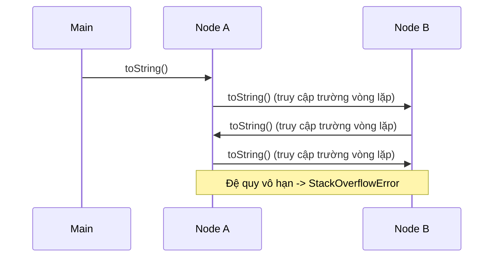
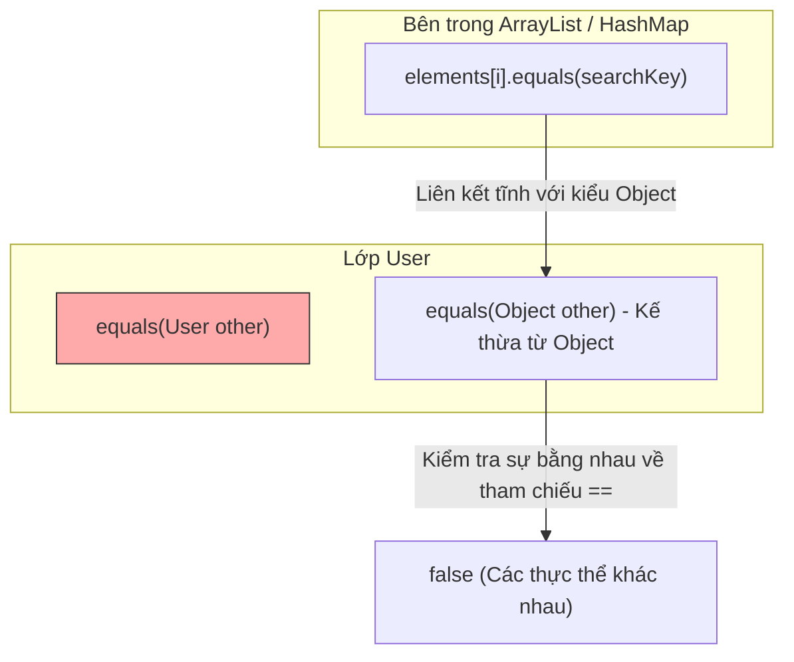

# Lớp Object - Phần 1

## Mục Tiêu Học Tập

Tài liệu này bao gồm một phần trọng tâm về **lớp Object (Object class)**. Hãy nghiên cứu từng khái niệm dưới dạng quy tắc thực tế trong Java, không chỉ đơn thuần là lý thuyết từ vựng.

## Tóm Tắt Nội Dung (Outline Coverage)

| Khái niệm (Concept) | Điều cần biết (What to know) |
| --- | --- |
| `toString()` | `toString()` trả về một chuỗi văn bản biểu diễn đối tượng dưới dạng con người có thể đọc được. |
| `equals()` | `equals()` định nghĩa sự bằng nhau mang tính logic (logical equality) giữa các đối tượng. |
| `hashCode()` | `hashCode()` trả về một số nguyên băm (hash value) được sử dụng bởi các tập hợp dựa trên mã băm (hash-based collection). |
| `getClass()` | `getClass()` trả về đối tượng `Class` tại thời điểm chạy (runtime) của một thể hiện. |
| `clone()` | `clone()` tạo ra một bản sao sao chép từng trường (field-by-field copy) khi việc sao chép được hỗ trợ, nhưng phương thức này thường bị tránh dùng trong thiết kế Java hiện đại. |
| `finalize() (đã bị loại bỏ)` | Từ khóa final có nghĩa là biến, phương thức, lớp, hoặc tham số bị hạn chế thay đổi sau đó theo một cách cụ thể. |
| `wait()` | `wait()` giải phóng bộ giám sát đối tượng (object monitor) và tạm dừng luồng (thread) hiện tại cho đến khi nhận được thông báo hoặc hết thời gian chờ. |
| `notify()` | `notify()` đánh thức một luồng đang chờ trên cùng bộ giám sát đối tượng đó. |
| `notifyAll()` | `notifyAll()` đánh thức tất cả các luồng đang chờ trên cùng bộ giám sát đối tượng đó. |
| `Tại sao ghi đè equals() đồng nghĩa với việc bạn cũng phải ghi đè hashCode()` | `equals()` định nghĩa sự bằng nhau mang tính logic giữa các đối tượng. |

## Ghi Chú Chi Tiết

### toString()

`toString()` trả về một chuỗi văn bản biểu diễn đối tượng dưới dạng con người có thể đọc được. Theo mặc định, `Object.toString()` trả về tên lớp, theo sau là ký tự `@`, và biểu diễn thập lục phân không dấu của mã băm (hash code) của đối tượng đó:
```java
public String toString() {
    return getClass().getName() + "@" + Integer.toHexString(hashCode());
}
```
Việc ghi đè `toString()` là một thói quen lập trình tốt để trả về một chuỗi mô tả ngắn gọn nhưng đầy đủ thông tin về trạng thái của đối tượng, điều này cực kỳ hữu ích cho việc ghi log và gỡ lỗi (debugging).

#### Ví dụ: Ghi đè `toString()`
```java
public class User {
    private final int id;
    private final String username;

    public User(int id, String username) {
        this.id = id;
        this.username = username;
    }

    @Override
    public String toString() {
        return "User{id=" + id + ", username='" + username + "'}";
    }
}
```

## Tại sao toString được Tự động Gọi và Cách Tham chiếu Vòng gây ra lỗi Tràn Ngăn Xếp

Trong Java, phương thức `toString()` được trình biên dịch gọi ngầm trong quá trình nối chuỗi (String concatenation) và bởi các luồng xuất chuẩn như `System.out.println()`. Khi biên dịch đoạn mã kiểu `"User: " + user`, trình biên dịch sẽ tạo ra mã byte gọi phương thức `String.valueOf(user)`, phương thức này kiểm tra xem tham chiếu đối tượng có `null` hay không, và nếu không, nó sẽ gọi `user.toString()`. Một lỗ hổng nghiêm trọng xảy ra tại thời điểm chạy khi hai đối tượng chứa tham chiếu vòng (Circular reference) lẫn nhau và các triển khai `toString()` của chúng in trạng thái của nhau. Khi `toString()` được gọi trên đối tượng thứ nhất, nó sẽ gọi `toString()` trên đối tượng thứ hai, và đối tượng thứ hai lại tiếp tục gọi `toString()` trên đối tượng thứ nhất, dẫn đến đệ quy vô hạn. Đệ quy này nhanh chóng làm cạn kiệt dung lượng khung ngăn xếp thực thi (execution stack frame) của luồng, cuối cùng ném ra lỗi `StackOverflowError` và làm sập ứng dụng.



### Ví dụ Thực Tế: Tràn Ngăn Xếp do Tham Chiếu Vòng

```java
public class CircularNode {
    private final String name;
    private CircularNode next;

    public CircularNode(String name) {
        this.name = name;
    }

    public void setNext(CircularNode next) {
        this.next = next;
    }

    @Override
    public String toString() {
        // Accessing 'next' implicitly calls next.toString(), causing recursion
        return "CircularNode{name='" + name + "', next=" + next + "}";
    }

    public static void main(String[] args) {
        CircularNode nodeA = new CircularNode("Node-A");
        CircularNode nodeB = new CircularNode("Node-B");
        nodeA.setNext(nodeB);
        nodeB.setNext(nodeA); // Circular link

        // This will attempt to concatenate and print nodeA, triggering StackOverflowError
        System.out.println(nodeA); // Output: Exception in thread "main" java.lang.StackOverflowError
    }
}
```

### Chuỗi Nguyên nhân - Kết quả của Circular toString()

```text
Phép nối chuỗi / in ra kích hoạt việc gọi ngầm String.valueOf() 
  ↳ valueOf() gọi phương thức toString() do người dùng định nghĩa 
  ↳ toString() gọi đệ quy toString() trên đối tượng có liên kết vòng 
  ↳ Khung ngăn xếp thực thi (Stack frame) vượt quá dung lượng cho phép 
  ↳ JVM ném ra StackOverflowError và chấm dứt luồng thực thi
```

> Xem thêm: Chi tiết về Stack Memory và nguyên nhân gây ra StackOverflowError, được trình bày chi tiết trong [Ch.13 - Memory Management](../../13-memory-management/theory/01-stack-concepts.md).

### equals()

`equals()` định nghĩa sự bằng nhau mang tính logic giữa các đối tượng. Theo mặc định, triển khai `Object.equals(Object obj)` kiểm tra sự bằng nhau về mặt tham chiếu (`this == obj`). Nếu bạn muốn so sánh các đối tượng dựa trên trạng thái của chúng (sự bằng nhau về logic), bạn phải ghi đè `equals()`.

#### Ví dụ: Ghi đè `equals()`
```java
@Override
public boolean equals(Object obj) {
    if (this == obj) return true;
    if (obj == null || getClass() != obj.getClass()) return false;
    User user = (User) obj;
    return id == user.id && Objects.equals(username, user.username);
}
```

## Tại sao Nạp chồng equals Thay vì Ghi đè lại Gây lỗi Ngầm mà không có Cảnh báo

Một lỗi phổ biến và nguy hiểm trong Java là nạp chồng `equals()` bằng cách khai báo một phương thức như `public boolean equals(User other)` thay vì ghi đè `public boolean equals(Object other)`. Trình biên dịch coi phương thức nạp chồng này là một chữ ký phương thức hoàn toàn riêng biệt và biên dịch thành công mà không đưa ra bất kỳ cảnh báo nào. Tuy nhiên, cơ chế giải quyết phương thức của Java liên kết các tham số một cách tĩnh (Statically) tại thời điểm biên dịch đối với các phương thức nạp chồng, trong khi nó liên kết động (Dynamically) tại thời điểm chạy đối với các phương thức ghi đè. Các tập hợp tiêu chuẩn trong Java như `HashMap` và `ArrayList` có tính tổng quát (Generic) và hoạt động trên kiểu dữ liệu `Object`, nghĩa là chúng biên dịch các lệnh gọi `equals(Object)`. Do đó, khi các tập hợp này cố gắng kiểm tra sự bằng nhau, chúng sẽ bỏ qua phương thức nạp chồng `equals(User)` của bạn và chạy phương thức mặc định `Object.equals(Object)` thay thế, dẫn đến việc kiểm tra thất bại ngầm khi các khóa bằng nhau không được nhận diện.



### Ví dụ Thực Tế: Thất bại Ngầm của Tập Hợp

```java
import java.util.ArrayList;
import java.util.List;

public class OverloadedUser {
    private final String name;

    public OverloadedUser(String name) {
        this.name = name;
    }

    // WRONG: Overloads equals(OverloadedUser) instead of overriding equals(Object)
    public boolean equals(OverloadedUser other) {
        if (other == null) return false;
        return this.name.equals(other.name);
    }

    public static void main(String[] args) {
        List<OverloadedUser> list = new ArrayList<>();
        list.add(new OverloadedUser("Alice"));

        // Searching with a logically identical instance
        boolean found = list.contains(new OverloadedUser("Alice"));
        System.out.println("User found: " + found); // Output: User found: false
    }
}
```

### Chuỗi Nguyên nhân - Kết quả của phương thức equals() bị nạp chồng

```text
Khai báo equals(User other) nạp chồng thay vì ghi đè equals(Object)
  ↳ Lớp tập hợp (Collection) gọi phương thức equals(Object) trên phần tử
  ↳ Java khớp chữ ký phương thức với Object.equals(Object) một cách tĩnh
  ↳ Sự bằng nhau về mặt tham chiếu mặc định (==) được thực thi thay vì so sánh giá trị tùy chỉnh
  ↳ Phép tìm kiếm trong tập hợp thất bại ngầm (trả về false)
```

### hashCode()

`hashCode()` trả về một giá trị băm kiểu số nguyên cho đối tượng, được sử dụng bởi các tập hợp dựa trên mã băm như `HashMap`, `HashSet`, và `Hashtable` để xác định vị trí ngăn chứa (Bucket location) nhằm lưu trữ và truy xuất các khóa.

#### Ví dụ: Ghi đè `hashCode()`
```java
@Override
public int hashCode() {
    return Objects.hash(id, username);
}
```

### getClass()

`getClass()` là một phương thức chung cuộc (Final method) trong lớp `Object` dùng để trả về đối tượng lớp `java.lang.Class` tại thời điểm chạy biểu diễn lớp của thể hiện đó.

#### `getClass()` so với `instanceof`
- Toán tử `instanceof` đánh giá là `true` nếu đối tượng thuộc kiểu được chỉ định hoặc bất kỳ kiểu con nào của nó. Nó cho phép thực hiện các kiểm tra đa hình.
- `getClass()` cho phép so sánh kiểu khớp chính xác. Ví dụ, `obj.getClass() == User.class` kiểm tra xem đối tượng có chính xác là một `User` hay không (và không phải là một lớp con nào khác).

```java
class AdminUser extends User {
    public AdminUser(int id, String username) { super(id, username); }
}

User user = new AdminUser(1, "admin");
boolean isInstance = user instanceof User; // true (polymorphic)
boolean isExact = user.getClass() == User.class; // false (runtime class is AdminUser)
```

### clone()

`clone()` tạo và trả về một bản sao sao chép từng trường của đối tượng. 
- Lớp muốn hỗ trợ sao chép phải triển khai giao diện đánh dấu (Marker interface) `java.lang.Cloneable`, nếu không `super.clone()` sẽ ném ra ngoại lệ `CloneNotSupportedException` tại thời điểm chạy.
- Theo mặc định, `Object.clone()` thực hiện một **bản sao nông (Shallow copy)**. Nó sao chép tất cả các trường kiểu nguyên thủy và tham chiếu của các trường đối tượng. Nó không sao chép các đối tượng được tham chiếu.
- Một **bản sao sâu (Deep copy)** yêu cầu sao chép thủ công các đối tượng có thể thay đổi (Mutable object) được tham chiếu bởi các trường.

#### Ví dụ: Bản sao Nông so với Bản sao Sâu
```java
class Address implements Cloneable {
    String city;
    public Address(String city) { this.city = city; }
    
    @Override
    protected Object clone() throws CloneNotSupportedException {
        return super.clone();
    }
}

class Person implements Cloneable {
    String name;
    Address address;

    public Person(String name, Address address) {
        this.name = name;
        this.address = address;
    }

    // Shallow Copy: Shares the same Address object
    @Override
    protected Object clone() throws CloneNotSupportedException {
        return super.clone();
    }

    // Deep Copy: Clones the Address object as well
    public Person deepClone() throws CloneNotSupportedException {
        Person cloned = (Person) super.clone();
        cloned.address = (Address) this.address.clone();
        return cloned;
    }
}
```

### finalize() (đã bị loại bỏ)

Trong lịch sử, `finalize()` được gọi bởi bộ thu gom rác (Garbage collector) trên một đối tượng khi GC xác định rằng không còn bất kỳ tham chiếu nào đến đối tượng đó nữa. Nó được thiết kế để dọn dẹp các tài nguyên không thuộc Java (như mô tả tệp - File handle hoặc kết nối cơ sở dữ liệu) trước khi đối tượng bị thu hồi.

**Tại sao nó bị loại bỏ (từ Java 9):**
1. **Không có Đảm bảo**: Không có gì đảm bảo thời điểm (hoặc thậm chí là liệu) `finalize()` có chạy hay không, điều này có thể dẫn đến rò rỉ tài nguyên.
2. **Ảnh hưởng Hiệu năng**: Việc ghi đè `finalize()` làm chậm bộ thu gom rác (GC) vì các đối tượng phải được xếp hàng và xử lý trong một hàng đợi hủy (Finalization queue).
3. **Sự Hồi sinh Đối tượng & Tấn công thông qua Phương thức Hủy**: Một đối tượng có thể tự "hồi sinh" bên trong `finalize()` bằng cách gán `this` cho một tham chiếu tĩnh. Ngoài ra, nếu hàm khởi tạo (Constructor) ném ra một ngoại lệ, đối tượng được khởi tạo một phần vẫn có đủ điều kiện để chạy phương thức hủy, cho phép mã độc hại chạy `finalize()` và truy cập vào trạng thái chưa được khởi tạo của nó.
4. **Các giải pháp thay thế Hiện modern**: Sử dụng giao diện `AutoCloseable` với khối lệnh `try-with-resources`, hoặc sử dụng `java.lang.ref.Cleaner` / `PhantomReference` cho các hoạt động dọn dẹp.

### wait(), notify(), và notifyAll()

Các phương thức này là các phương thức chung cuộc của lớp `Object` được sử dụng để đồng bộ hóa luồng (Thread synchronization). Chúng cho phép các luồng phối hợp hoạt động trên một bộ giám sát tài nguyên dùng chung (khóa - lock).

- `wait()`: Giải phóng khóa trên bộ giám sát đối tượng và khiến luồng hiện tại chờ cho đến khi một luồng khác thông báo cho nó hoặc bị ngắt quãng.
- `notify()`: Đánh thức một luồng đơn lẻ đang chờ trên bộ giám sát của đối tượng.
- `notifyAll()`: Đánh thức tất cả các luồng đang chờ trên bộ giám sát của đối tượng.

#### Quy tắc:
1. Phải được gọi từ một ngữ cảnh **đồng bộ hóa (Synchronized)** (sở hữu bộ giám sát của đối tượng), nếu không chúng sẽ ném ra ngoại lệ `IllegalMonitorStateException`.
2. Phương thức `wait()` phải luôn được gọi trong một vòng lặp kiểm tra điều kiện đang chờ, nhằm bảo vệ chống lại các lần **đánh thức giả (Spurious wakeup)**.

```java
public class QueueMonitor {
    private final Queue<String> queue = new LinkedList<>();
    private final int MAX_SIZE = 10;

    public synchronized void enqueue(String item) throws InterruptedException {
        while (queue.size() == MAX_SIZE) { // Always wait in a loop
            wait();
        }
        queue.add(item);
        notifyAll(); // Wake up consumers
    }

    public synchronized String dequeue() throws InterruptedException {
        while (queue.isEmpty()) { // Always wait in a loop
            wait();
        }
        String item = queue.poll();
        notifyAll(); // Wake up producers
        return item;
    }
}
```

### Tại sao ghi đè equals() đồng nghĩa với việc bạn cũng phải ghi đè hashCode()

Đây là một trong những ràng buộc (Contract) quan trọng nhất trong Java. Nếu bạn ghi đè `equals(Object)`, bạn **phải** ghi đè `hashCode()`.
- Nếu hai đối tượng bằng nhau theo phương thức `equals(Object)`, chúng phải trả về cùng một giá trị số nguyên từ phương thức `hashCode()`.
- Nếu bạn ghi đè `equals()` nhưng không ghi đè `hashCode()`, hai đối tượng bằng nhau về mặt logic sẽ kế thừa phương thức `Object.hashCode()` mặc định, phương thức này trả về các số nguyên khác nhau (dựa trên địa chỉ bộ nhớ).
- Khi các đối tượng này được sử dụng làm khóa trong một `HashMap` hoặc phần tử trong một `HashSet`, tập hợp sẽ lưu trữ chúng ở các ngăn chứa (Bucket) khác nhau. Do đó, việc truy xuất một đối tượng bằng cách sử dụng một khóa tương đương logic sẽ trả về `null` vì `HashMap` tìm kiếm ở sai ngăn chứa.

---

## Các lỗi thường gặp

### 1. Nạp chồng thay vì Ghi đè `equals()`
Một lỗi phổ biến là khai báo `equals(MyClass other)` thay vì `equals(Object other)`. Vì Java khớp các chữ ký phương thức một cách tĩnh tại thời điểm biên dịch, các cuộc gọi từ mã nguồn khung công tác hoặc API của tập hợp (vốn mong đợi nhận vào `equals(Object)`) sẽ bỏ qua phương thức tùy chỉnh của bạn và chạy phương thức mặc định `Object.equals(Object)`.
```java
// WRONG: Overloads equals()
public boolean equals(User other) {
    return this.id == other.id;
}

// CORRECT: Overrides equals()
@Override
public boolean equals(Object obj) {
    if (this == obj) return true;
    if (obj instanceof User other) {
        return this.id == other.id;
    }
    return false;
}
```

### 2. Thay đổi trạng thái bên trong `equals()`, `hashCode()`, hoặc `toString()`
Các phương thức này phải là các hàm thuần túy và không có tác dụng phụ (Side-effect-free). Việc sửa đổi các biến thể hiện bên trong chúng dẫn đến các lỗi không thể lường trước được.

### 3. Gọi các phương thức giám sát bên ngoài các khối đồng bộ hóa
Việc gọi `wait()`, `notify()`, hoặc `notifyAll()` mà không nắm giữ khóa giám sát đối tượng (ví dụ: bên ngoài một khối/phương thức `synchronized` tương ứng với đối tượng) sẽ ném ra ngoại lệ `IllegalMonitorStateException`.

### 4. Dựa vào `finalize()` để dọn dẹp tài nguyên
Vì hoạt động của bộ thu gom rác (GC) không mang tính xác định, việc sử dụng `finalize()` để đóng các tệp hoặc socket sẽ dẫn đến việc cạn kiệt tài nguyên. Thay vào đó, hãy sử dụng `try-with-resources`.

## Liên kết Tham khảo

- https://docs.oracle.com/en/java/javase/21/docs/api/java.base/java/lang/Object.html#equals(java.lang.Object) (Hợp đồng Java SE 21 Object.equals)
- https://docs.oracle.com/en/java/javase/21/docs/api/java.base/java/lang/Object.html#toString() (Hợp đồng Java SE 21 Object.toString)
- https://docs.oracle.com/javase/specs/jls/se21/html/jls-15.html#jls-15.18.1 (JLS 21 Toán tử nối chuỗi +)

## Các Câu Hỏi Ôn Tập Thường Gặp

- Những khái niệm nào ở đây là các quy tắc tại thời điểm biên dịch?
- Những khái niệm nào ở đây ảnh hưởng đến hành vi tại thời điểm chạy?
- Những khái niệm nào ở đây dễ trở thành bẫy khi phỏng vấn?
