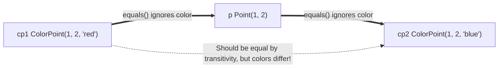
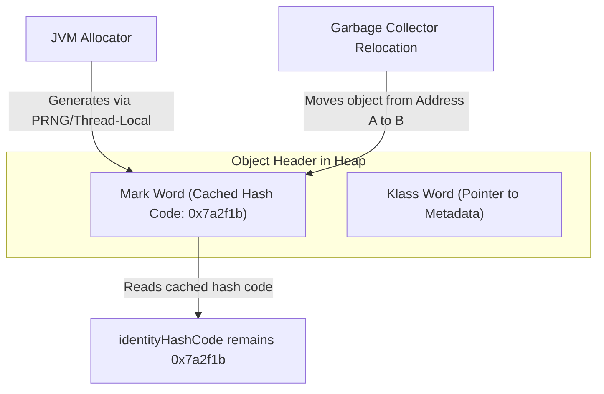
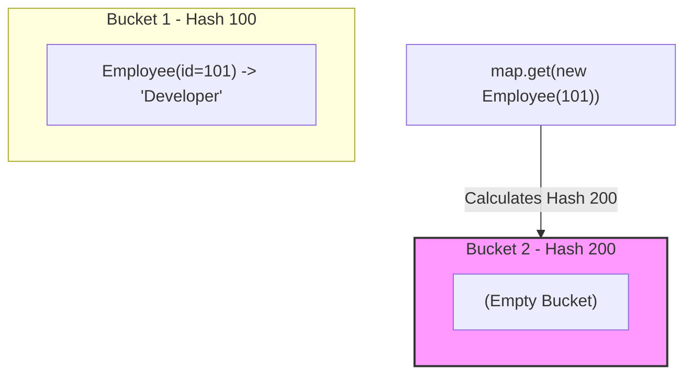

# Lớp Object (Object Class) - Phần 2

## Mục tiêu học tập (Learning Goal)

Tập tin này bao gồm một phần trọng tâm về **Lớp Object (Object Class)**. Hãy nghiên cứu từng khái niệm như một quy tắc Java thực tế, không phải là từ vựng riêng lẻ.

## Khái quát nội dung (Outline Coverage)

| Khái niệm (Concept) | Điều cần biết (What to know) |
| --- | --- |
| `Contract of equals()` | equals() định nghĩa sự bằng nhau về mặt logic giữa các đối tượng. |
| `Contract of hashCode()` | hashCode() trả về một mã băm kiểu số nguyên được sử dụng bởi các bộ sưu tập dựa trên bảng băm. |
| `Comparing objects by reference and by value` | So sánh các đối tượng bằng tham chiếu và bằng giá trị là một khái niệm cụ thể trong lớp Object; tìm hiểu quy tắc Java của nó, các trường hợp sử dụng hợp lệ, và chế độ thất bại thay vì chỉ nhớ tên. |

## Ghi chú chi tiết (Detailed Notes)

### Hợp đồng equals() (Contract of equals())

Phương thức `equals(Object)` định nghĩa sự bằng nhau về mặt logic. Theo đặc tả của Java SE, việc triển khai `equals()` phải xác định một quan hệ tương đương với các thuộc tính sau (đối với bất kỳ tham chiếu phi null `x`, `y`, và `z` nào):

1. **Phản xạ (Reflexive)**: `x.equals(x)` phải trả về `true`.
2. **Đối xứng (Symmetric)**: `x.equals(y)` phải trả về `true` khi và chỉ khi `y.equals(x)` trả về `true`.
3. **Bắc cầu (Transitive)**: Nếu `x.equals(y)` trả về `true` và `y.equals(z)` trả về `true`, thì `x.equals(z)` phải trả về `true`.
4. **Nhất quán (Consistent)**: Nhiều lần gọi `x.equals(y)` phải luôn trả về `true` hoặc luôn trả về `false`, với điều kiện không có thông tin nào được sử dụng trong các so sánh `equals` trên các đối tượng bị sửa đổi.
5. **Thân thiện với Null (Null-Hostile)**: `x.equals(null)` phải trả về `false`.

#### Vi phạm tính Đối xứng trong Kế thừa
Một vấn đề kinh điển phát sinh khi cố gắng mở rộng một lớp và thêm một trường giá trị mới.
```java
public class Point {
    protected final int x, y;
    public Point(int x, int y) { this.x = x; this.y = y; }
    
    @Override
    public boolean equals(Object o) {
        if (!(o instanceof Point)) return false;
        Point p = (Point) o;
        return p.x == x && p.y == y;
    }
}

public class ColorPoint extends Point {
    private final String color;
    public ColorPoint(int x, int y, String color) {
        super(x, y);
        this.color = color;
    }

    // WRONG: Violates Symmetry
    @Override
    public boolean equals(Object o) {
        if (!(o instanceof ColorPoint)) return false;
        return super.equals(o) && ((ColorPoint) o).color.equals(color);
    }
}
```
*Vấn đề:*
`Point p = new Point(1, 2);`
`ColorPoint cp = new ColorPoint(1, 2, "red");`
`p.equals(cp)` trả về `true` (vì `cp` là một thực thể của `Point`).
`cp.equals(p)` trả về `false` (vì `p` không phải là một thực thể của `ColorPoint`).
*Giải pháp:* Để hỗ trợ sự bằng nhau chính xác, hãy sử dụng so sánh `getClass()` thay vì `instanceof`, hoặc ưu tiên sử dụng cấu thành (composition) thay vì kế thừa (inheritance).

## Tại sao việc thêm các trường giá trị vào lớp con lại phá vỡ tính chất Bắc cầu (Why Adding Value Fields to Subclasses Breaks Transitivity)

Trong Java, việc cố gắng mở rộng một lớp có thể khởi tạo và thêm một trường giá trị mới trong khi vẫn giữ nguyên một phương thức `equals` hoàn hảo sẽ gặp phải một hạn chế toán học cơ bản. Nếu chúng ta cho phép một lớp cha và một lớp con bằng nhau bằng cách bỏ qua trường của lớp con trong `equals()`, chúng ta thỏa mãn tính đối xứng nhưng lại phá vỡ tính bắc cầu. Ngược lại, nếu chúng ta kiểm tra trường lớp con trong `equals()`, chúng ta phải từ chối sự bằng nhau khi so sánh một thực thể lớp cha với một thực thể lớp con, điều này vi phạm tính đối xứng vì phương thức `equals()` của lớp cha đánh giá thành `true`. Nếu chúng ta cố gắng khắc phục điều này bằng cách so sánh bất đối xứng, chúng ta sẽ trực tiếp vi phạm tính đối xứng. Do đó, không có cách nào để mở rộng một lớp có thể khởi tạo và thêm một trường giá trị trong khi bảo toàn hợp đồng `equals` trừ khi ưu tiên sử dụng cấu thành thay vì kế thừa.



### Ví dụ mã nguồn: Vi phạm tính chất Bắc cầu (Transitivity Violation)

```java
public class Point {
    protected final int x, y;
    public Point(int x, int y) { this.x = x; this.y = y; }
    
    @Override
    public boolean equals(Object o) {
        if (!(o instanceof Point)) return false;
        Point p = (Point) o;
        return p.x == x && p.y == y;
    }
}

public class ColorPoint extends Point {
    private final String color;
    public ColorPoint(int x, int y, String color) {
        super(x, y);
        this.color = color;
    }

    @Override
    public boolean equals(Object o) {
        if (!(o instanceof Point)) return false;
        // If o is a normal Point, do color-blind comparison (satisfies symmetry)
        if (!(o instanceof ColorPoint)) return o.equals(this);
        // If o is a ColorPoint, do full comparison
        return super.equals(o) && ((ColorPoint) o).color.equals(color);
    }

    public static void main(String[] args) {
        Point p = new Point(1, 2);
        ColorPoint cp1 = new ColorPoint(1, 2, "red");
        ColorPoint cp2 = new ColorPoint(1, 2, "blue");

        System.out.println("cp1.equals(p): " + cp1.equals(p));   // Output: true
        System.out.println("p.equals(cp2): " + p.equals(cp2));   // Output: true
        System.out.println("cp1.equals(cp2): " + cp1.equals(cp2)); // Output: false (Transitivity Broken!)
    }
}
```

### Chuỗi nguyên nhân - kết quả của việc thất bại tính Bắc cầu (Cause-Effect Chain of Transitivity Failure)

```text
ColorPoint so sánh bỏ qua màu sắc với một Point (cp1 == p)
  ↳ Point so sánh bỏ qua màu sắc với một ColorPoint khác (p == cp2)
  ↳ Tính chất bắc cầu yêu cầu cp1 == cp2
  ↳ So sánh trực tiếp cp1.equals(cp2) so sánh màu sắc và trả về false
  ↳ Quan hệ tương đương bị phá vỡ, khiến các bộ sưu tập như HashSet hoạt động sai
```

### Hợp đồng hashCode() (Contract of hashCode())

Phương thức `hashCode()` trả về một giá trị băm kiểu số nguyên. Hợp đồng quy định:

1. **Nhất quán (Consistency)**: Bất cứ khi nào nó được gọi trên cùng một đối tượng nhiều lần trong quá trình thực thi ứng dụng Java, `hashCode()` phải trả về cùng một số nguyên, với điều kiện không có thông tin nào được sử dụng trong các so sánh `equals` trên đối tượng bị sửa đổi.
2. **Các đối tượng bằng nhau &rarr; Mã băm bằng nhau (Equal Objects → Equal Hash Codes)**: Nếu hai đối tượng bằng nhau theo phương thức `equals(Object)`, thì việc gọi `hashCode()` trên mỗi đối tượng phải tạo ra cùng một kết quả số nguyên.
3. **Các đối tượng khác nhau &rarr; Cho phép đụng độ (Unequal Objects → Collisions Allowed)**: Nếu hai đối tượng khác nhau theo phương thức `equals(Object)`, chúng **không** bắt buộc phải tạo ra các kết quả số nguyên khác nhau. Tuy nhiên, việc tạo ra các kết quả số nguyên khác nhau cho các đối tượng khác nhau sẽ cải thiện hiệu năng của bảng băm.

## Tại sao identityHashCode không đại diện cho Địa chỉ bộ nhớ vật lý (Why identityHashCode Does Not Represent Physical Memory Addresses)

Một quan niệm sai lầm phổ biến là mã băm định danh mặc định (default identity hash code) trả về trực tiếp địa chỉ bộ nhớ vật lý của một đối tượng. Trong các JVM hiện đại (chẳng hạn như HotSpot), các địa chỉ bộ nhớ vật lý rất động vì Bộ thu gom rác (Garbage collection) sẽ dịch chuyển các đối tượng trong các chu kỳ nén bộ nhớ để ngăn chặn phân mảnh. Nếu mã băm định danh là địa chỉ bộ nhớ trực tiếp, mã băm của một đối tượng sẽ thay đổi sau khi GC dịch chuyển, vi phạm hợp đồng nhất quán của `hashCode`. Để tránh điều này, các JVM hiện đại tạo ra mã băm định danh bằng cách sử dụng các trình tạo số ngẫu nhiên giả (pseudorandom number generator) hoặc các trạng thái cục bộ của luồng (Thread), lưu trữ giá trị đã tạo trong phần đầu Mark Word của đối tượng. Điều này đảm bảo rằng mã băm vẫn ổn định và duy nhất trong suốt vòng đời của đối tượng, bất kể nó được di chuyển đến đâu trong bộ nhớ vật lý.



### Ví dụ mã nguồn: Sự ổn định của identityHashCode dưới tác động của GC (Code Example: Stable identityHashCode Under GC)

```java
public class IdentityHashStability {
    public static void main(String[] args) {
        Object obj = new Object();
        int initialHash = System.identityHashCode(obj);

        // Explicitly suggest garbage collection to relocate the object
        System.gc(); 

        int postGcHash = System.identityHashCode(obj);
        System.out.println("Hashes match: " + (initialHash == postGcHash)); 
        // Output: Hashes match: true
    }
}
```

### Chuỗi nguyên nhân - kết quả của sự ổn định mã băm (Cause-Effect Chain of Hash Stability)

```text
Bộ thu gom rác dịch chuyển các đối tượng trong bộ nhớ heap
  ↳ Địa chỉ bộ nhớ vật lý của đối tượng thay đổi một cách động
  ↳ JVM đọc mã băm đã lưu đệm từ tiêu đề Mark Word của đối tượng
  ↳ identityHashCode vẫn nhất quán và không thay đổi
  ↳ Hợp đồng nhất quán của hashCode được bảo toàn khi đối tượng di chuyển
```

### So sánh các đối tượng bằng tham chiếu và bằng giá trị (Comparing objects by reference and by value)

- **Bằng nhau về tham chiếu (`==`) (Reference Equality)**: Kiểm tra xem hai tham chiếu có trỏ đến cùng một địa chỉ bộ nhớ (định danh - identity) hay không.
- **Bằng nhau về mặt logic (`equals()`) (Logical Equality)**: Kiểm tra xem hai đối tượng có tương đương nhau về mặt trạng thái (giá trị - value) hay không.

```java
String s1 = new String("hello");
String s2 = new String("hello");

System.out.println(s1 == s2);      // false (different objects in memory)
System.out.println(s1.equals(s2)); // true (logical contents are identical)
```

---

### Case Study: Phá vỡ HashMap khi hashCode không nhất quán với equals (Case Study: Breaking HashMap when hashCode is inconsistent with equals)

Khi một lớp ghi đè `equals()` nhưng không ghi đè `hashCode()`, nó sẽ phá vỡ hợp đồng cơ bản của các bộ sưu tập dựa trên bảng băm (`HashMap`, `HashSet`, `LinkedHashMap`).

Hãy xem xét lớp bị lỗi sau:
```java
public class Employee {
    private final int id;
    private final String name;

    public Employee(int id, String name) {
        this.id = id;
        this.name = name;
    }

    @Override
    public boolean equals(Object o) {
        if (this == o) return true;
        if (o == null || getClass() != o.getClass()) return false;
        Employee employee = (Employee) o;
        return id == employee.id && Objects.equals(name, employee.name);
    }
    
    // hashCode() is NOT overridden! Inherited from Object.
}
```

Bây giờ hãy sử dụng nó trong một `HashMap`:
```java
import java.util.HashMap;

public class Main {
    public static void main(String[] args) {
        HashMap<Employee, String> map = new HashMap<>();
        Employee e1 = new Employee(101, "Alice");
        
        map.put(e1, "Developer");
        
        // e2 is logically equal to e1 according to equals()
        Employee e2 = new Employee(101, "Alice");
        
        System.out.println("e1.equals(e2): " + e1.equals(e2)); // true
        System.out.println("map.get(e2): " + map.get(e2));     // prints null!
    }
}
```

#### Tại sao điều này xảy ra? (Why does this happen?)
1. `map.put(e1, "Developer")` tính toán `e1.hashCode()`, được lấy từ mã băm định danh mặc định của `e1`. Nó đặt mục dữ liệu vào một thùng (bucket) cụ thể.
2. `map.get(e2)` tính toán `e2.hashCode()`. Vì `hashCode()` không được ghi đè, `e2.hashCode()` tạo ra một giá trị băm định danh hoàn toàn khác với `e1.hashCode()`.
3. `HashMap` tìm kiếm `e2` ở một thùng khác và không tìm thấy gì, trả về `null`.
4. Ngay cả khi cả hai khóa ngẫu nhiên rơi vào cùng một thùng, `HashMap` chỉ kiểm tra sự bằng nhau nếu các mã băm khớp trước. Nếu các giá trị `hashCode()` không giống nhau, nó mặc định coi các đối tượng là khác nhau mà không thèm gọi `equals()`.

## Tại sao việc không ghi đè hashCode lại phá vỡ các bộ sưu tập dạng băm (Why Failing to Override hashCode Breaks Hash Collections)

Các bộ sưu tập dựa trên băm như `HashMap` và `HashSet` sử dụng `hashCode` của một đối tượng để xác định thùng (bucket) nào lưu trữ đối tượng đó. Khi tìm kiếm một đối tượng, trước tiên bộ sưu tập sẽ tính toán `hashCode` của khóa tìm kiếm để định vị thùng chính xác. Nếu `hashCode` không được ghi đè, triển khai mặc định của JVM sẽ tạo ra một mã băm dựa trên định danh của đối tượng, nghĩa là hai đối tượng bằng nhau về mặt logic sẽ băm ra các thùng khác nhau. Do đó, ngay cả khi hai đối tượng bằng nhau theo `equals()`, `HashMap` vẫn sẽ tìm kiếm ở một thùng khác và không truy xuất được mục dữ liệu, trả về `null` thay thế. Điều này vi phạm hợp đồng API của Map và gây ra các lỗi truy xuất dữ liệu âm thầm.



### Ví dụ mã nguồn: Thất bại khi tìm kiếm trong bộ sưu tập (Collection Lookup Failure)

```java
import java.util.HashMap;
import java.util.Map;

public class BrokenHashLookup {
    static class Employee {
        private final int id;
        public Employee(int id) { this.id = id; }
        
        @Override
        public boolean equals(Object o) {
            if (this == o) return true;
            if (o == null || getClass() != o.getClass()) return false;
            Employee employee = (Employee) o;
            return id == employee.id;
        }
        // hashCode() is NOT overridden
    }

    public static void main(String[] args) {
        Map<Employee, String> map = new HashMap<>();
        map.put(new Employee(101), "Developer");
        
        // Searching with a logically identical instance
        System.out.println("Retrieved: " + map.get(new Employee(101)));
        // Output: Retrieved: null
    }
}
```

### Chuỗi nguyên nhân - kết quả của việc phá vỡ hợp đồng Hash (Cause-Effect Chain of Broken Hash Contract)

```text
Không ghi đè hashCode() đi kèm với equals()
  ↳ Các đối tượng bằng nhau về mặt logic trả về các mã băm định danh khác nhau
  ↳ HashMap định tuyến việc tìm kiếm đến một chỉ số thùng khác
  ↳ Không tìm thấy kết quả khớp trong thùng mục tiêu
  ↳ Map trả về null mặc dù equals() đánh giá thành true
```

---

## Các lỗi thường gặp (Common Mistakes)

### 1. Vi phạm tính chất Bắc cầu với tính kế thừa (Transitivity Violation with inheritance)
Cố gắng làm cho `Point` và `ColorPoint` có thể so sánh được bằng cách viết một phương thức `equals()` tùy chỉnh bỏ qua màu sắc khi so sánh với một `Point` thông thường sẽ vi phạm quy tắc **bắc cầu** (transitive) của `equals()`.
```java
// If p.equals(cp1) is true (color ignored)
// and p.equals(cp2) is true (color ignored)
// then cp1.equals(cp2) must be true, but it evaluates to false if their colors differ.
```

### 2. Giả định hashCode() trả về trực tiếp địa chỉ bộ nhớ (Assuming hashCode() returns the memory address directly)
Trong các JVM hiện đại, mã băm định danh mặc định không phải là địa chỉ bộ nhớ trực tiếp; nó được tạo ra bằng các bộ tạo số ngẫu nhiên giả hoặc các thanh ghi trạng thái luồng nội bộ để ngăn chặn các vấn đề hiệu năng nếu GC dịch chuyển các đối tượng. Không bao giờ viết logic giả định `hashCode()` liên quan đến địa chỉ bộ nhớ vật lý.

### 3. Ném ra NullPointerException trong equals() (Throwing NullPointerException in equals())
Khi so sánh các trường chuỗi (string field), hãy sử dụng `Objects.equals(a, b)` thay vì `a.equals(b)` để tránh NPE khi `a` là null.
```java
// WRONG
return name.equals(other.name); 

// CORRECT
return Objects.equals(name, other.name);
```

## Liên kết tham khảo (Reference Links)

- https://docs.oracle.com/en/java/javase/21/docs/api/java.base/java/lang/Object.html#equals(java.lang.Object) (Java SE 21 Object.equals Contract)
- https://docs.oracle.com/en/java/javase/21/docs/api/java.base/java/lang/Object.html#hashCode() (Java SE 21 Object.hashCode Contract)
- https://docs.oracle.com/en/java/javase/21/docs/api/java.base/java/lang/System.html#identityHashCode(java.lang.Object) (Java SE 21 System.identityHashCode)

## Các câu hỏi ôn tập thường gặp (Common Review Prompts)

- Khái niệm nào ở đây là quy tắc thời gian biên dịch (compile-time rule)?
- Khái niệm nào ở đây ảnh hưởng đến hành vi thời gian chạy (runtime behavior)?
- Khái niệm nào ở đây dễ là bẫy phỏng vấn?
