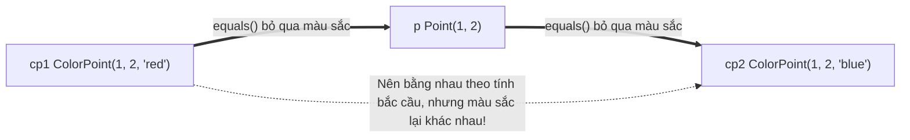
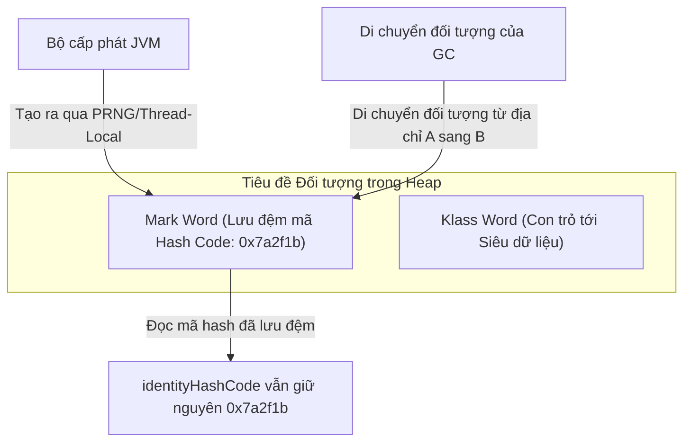
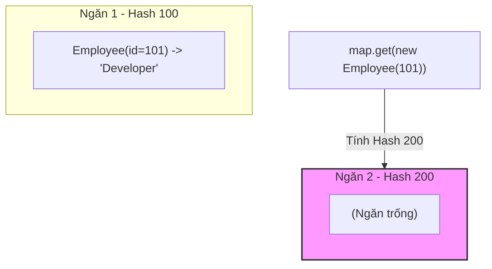

# Lớp Object - Phần 2 (Object class - Part 2)

## Mục Tiêu Học Tập (Learning Goal)

Tài liệu này bao gồm một phần nội dung trọng tâm về **lớp Object**. Hãy nghiên cứu từng khái niệm dưới dạng quy tắc thực tế trong Java, không chỉ đơn thuần là các từ vựng học thuật.

## Đề Cương Nội Dung (Outline Coverage)

| Khái Niệm | Những Điều Cần Biết |
| --- | --- |
| `Quy ước của equals()` | Phương thức `equals()` định nghĩa tính bằng nhau về mặt logic giữa các đối tượng. |
| `Quy ước của hashCode()` | Phương thức `hashCode()` trả về một giá trị băm kiểu số nguyên được sử dụng bởi các bộ sưu tập dựa trên bảng băm. |
| `So sánh đối tượng bằng tham chiếu và bằng giá trị` | So sánh đối tượng bằng tham chiếu và bằng giá trị là một khái niệm cụ thể trong lớp Object; hãy tìm hiểu quy tắc Java của nó, các trường hợp sử dụng hợp lệ và chế độ lỗi thay vì chỉ nhớ mỗi tên gọi. |

## Ghi Chú Chi Tiết (Detailed Notes)

### Quy Ước Của equals() (Contract of equals())

Phương thức `equals(Object)` định nghĩa tính bằng nhau về mặt logic (logical equality). Theo đặc tả Java SE, việc triển khai phương thức `equals()` phải xác định một quan hệ tương đương (equivalence relation) đáp ứng các thuộc tính sau (đối với bất kỳ tham chiếu khác null `x`, `y` và `z` nào):

1. **Tính Phản Xạ (Reflexive)**: Biểu thức `x.equals(x)` phải trả về `true`.
2. **Tính Đối Xứng (Symmetric)**: Biểu thức `x.equals(y)` phải trả về `true` khi và chỉ khi `y.equals(x)` trả về `true`.
3. **Tính Bắc Cầu (Transitive)**: Nếu `x.equals(y)` trả về `true` và `y.equals(z)` trả về `true`, thì `x.equals(z)` bắt buộc phải trả về `true`.
4. **Tính Nhất Quán (Consistent)**: Lời gọi `x.equals(y)` nhiều lần phải luôn trả về cùng một kết quả `true` hoặc luôn trả về `false`, với điều kiện không có thông tin nào dùng trong phép so sánh `equals` trên các đối tượng bị sửa đổi.
5. **Không Chấp Nhận Null (Null-Hostile)**: Biểu thức `x.equals(null)` phải luôn trả về `false`.

#### Vi Phạm Tính Đối Xứng Trong Kế Thừa (Symmetry Violation in Inheritance)
Một vấn đề kinh điển phát sinh khi chúng ta cố gắng mở rộng một lớp và thêm một trường giá trị (value field) mới.
```java
public class Point {
    protected final int x, y;
    public Point(int x, int y) { this.x = x; this.y = y; }
    
    @Override
    public boolean equals(Object o) {
        if (!(o instanceof Point)) return false;
        Point p = (Point) o;
        return p.x == x && p.y == y;
    }
}

public class ColorPoint extends Point {
    private final String color;
    public ColorPoint(int x, int y, String color) {
        super(x, y);
        this.color = color;
    }

    // SAI: Vi phạm tính đối xứng
    @Override
    public boolean equals(Object o) {
        if (!(o instanceof ColorPoint)) return false;
        return super.equals(o) && ((ColorPoint) o).color.equals(color);
    }
}
```
*Vấn đề:*
`Point p = new Point(1, 2);`
`ColorPoint cp = new ColorPoint(1, 2, "red");`
Phép so sánh `p.equals(cp)` trả về `true` (vì `cp` là một thực thể của `Point`).
Tuy nhiên, phép so sánh `cp.equals(p)` lại trả về `false` (vì `p` không phải là một thực thể của `ColorPoint`).
*Giải pháp:* Để hỗ trợ so sánh bằng chính xác tuyệt đối, hãy sử dụng phép so sánh kiểm tra lớp `getClass()` thay vì toán tử `instanceof`, hoặc ưu tiên sử dụng quan hệ bao hàm (composition) thay vì kế thừa.

## Tại Sao Việc Thêm Các Trường Giá Trị Vào Lớp Con Lại Phá Vỡ Tính Bắc Cầu (Why Adding Value Fields to Subclasses Breaks Transitivity)

Trong Java, việc cố gắng kế thừa một lớp có thể khởi tạo (instantiable class) và thêm vào một trường giá trị mới trong khi vẫn muốn duy trì một phương thức `equals` hoàn hảo sẽ gặp phải giới hạn toán học cốt lõi. Nếu chúng ta cho phép lớp cha và lớp con bằng nhau bằng cách bỏ qua trường của lớp con trong phương thức `equals()`, chúng ta thỏa mãn tính đối xứng nhưng lại phá vỡ tính bắc cầu. Ngược lại, nếu chúng ta kiểm tra trường của lớp con trong `equals()`, chúng ta buộc phải từ chối sự bằng nhau khi so sánh một thực thể lớp cha với một thực thể lớp con, điều này vi phạm tính đối xứng vì phương thức `equals()` của lớp cha đánh giá kết quả là `true`. Nếu chúng ta cố gắng khắc phục bằng cách làm cho phép so sánh trở nên bất đối xứng, chúng ta trực tiếp vi phạm tính đối xứng. Do đó, đơn giản là không có cách nào để mở rộng một lớp có thể khởi tạo và thêm một trường giá trị mà vẫn bảo toàn được quy ước của `equals` ngoại trừ việc ưu tiên sử dụng quan hệ bao hàm thay cho kế thừa.



### Ví Dụ Minh Họa Code: Vi Phạm Tính Bắc Cầu (Code Example: Transitivity Violation)

```java
public class Point {
    protected final int x, y;
    public Point(int x, int y) { this.x = x; this.y = y; }
    
    @Override
    public boolean equals(Object o) {
        if (!(o instanceof Point)) return false;
        Point p = (Point) o;
        return p.x == x && p.y == y;
    }
}

public class ColorPoint extends Point {
    private final String color;
    public ColorPoint(int x, int y, String color) {
        super(x, y);
        this.color = color;
    }

    @Override
    public boolean equals(Object o) {
        if (!(o instanceof Point)) return false;
        // Nếu o là một Point thông thường, thực hiện so sánh bỏ qua màu sắc (để thỏa mãn tính đối xứng)
        if (!(o instanceof ColorPoint)) return o.equals(this);
        // Nếu o là một ColorPoint, thực hiện so sánh đầy đủ cả màu sắc
        return super.equals(o) && ((ColorPoint) o).color.equals(color);
    }

    public static void main(String[] args) {
        Point p = new Point(1, 2);
        ColorPoint cp1 = new ColorPoint(1, 2, "red");
        ColorPoint cp2 = new ColorPoint(1, 2, "blue");

        System.out.println("cp1.equals(p): " + cp1.equals(p));   // Kết quả: true
        System.out.println("p.equals(cp2): " + p.equals(cp2));   // Kết quả: true
        System.out.println("cp1.equals(cp2): " + cp1.equals(cp2)); // Kết quả: false (Tính Bắc Cầu Bị Phá Vỡ!)
    }
}
```

### Chuỗi Nguyên Nhân - Kết Quả Của Việc Phá Vỡ Tính Bắc Cầu (Cause-Effect Chain of Transitivity Failure)

```text
ColorPoint so sánh bỏ qua màu sắc với một Point (cp1 == p)
  ↳ Point so sánh bỏ qua màu sắc với một ColorPoint khác (p == cp2)
  ↳ Tính bắc cầu đòi hỏi cp1 == cp2
  ↳ Phép so sánh trực tiếp cp1.equals(cp2) có so sánh màu sắc và trả về false
  ↳ Quan hệ tương đương bị phá vỡ, khiến các bộ sưu tập như HashSet hoạt động sai lệch
```

---

### Quy Ước Của hashCode() (Contract of hashCode())

Phương thức `hashCode()` trả về một giá trị băm kiểu số nguyên. Quy ước này quy định:

1. **Tính Nhất Quán (Consistency)**: Mỗi khi phương thức này được gọi trên cùng một đối tượng nhiều lần trong suốt quá trình chạy của ứng dụng Java, nó phải luôn trả về cùng một số nguyên, với điều kiện các thông tin dùng trong phép so sánh `equals` trên đối tượng đó không bị thay đổi.
2. **Đối Tượng Bằng Nhau &rarr; Mã Băm Giống Nhau**: Nếu hai đối tượng bằng nhau theo kết quả của phương thức `equals(Object)`, thì việc gọi phương thức `hashCode()` trên mỗi đối tượng đó bắt buộc phải tạo ra cùng một kết quả số nguyên.
3. **Đối Tượng Khác Nhau &rarr; Cho Phép Trùng Mã Băm (Collision)**: Nếu hai đối tượng khác nhau theo phương thức `equals(Object)`, chúng **không** bắt buộc phải trả về các số nguyên khác nhau. Tuy nhiên, việc tạo ra các kết quả số nguyên khác nhau cho các đối tượng khác nhau sẽ giúp cải thiện hiệu suất của các bảng băm.

## Tại Sao identityHashCode Không Đại Diện Cho Địa Chỉ Bộ Nhớ Vật Lý Thực Tế (Why identityHashCode Does Not Represent Physical Memory Addresses)

Một hiểu lầm phổ biến là mã băm định danh mặc định (identity hash code) trả về trực tiếp địa chỉ bộ nhớ vật lý của đối tượng. Trong các JVM hiện đại (chẳng hạn như HotSpot), các địa chỉ bộ nhớ vật lý thay đổi liên tục vì GC thực hiện di chuyển các đối tượng trong các chu kỳ dọn dẹp để ngăn chặn sự phân mảnh bộ nhớ. Nếu mã băm định danh là địa chỉ bộ nhớ trực tiếp, mã băm của đối tượng sẽ thay đổi sau mỗi lần GC di chuyển đối tượng, trực tiếp vi phạm quy ước nhất quán của `hashCode`. Để tránh điều này, các JVM hiện đại tạo ra mã băm định danh bằng cách sử dụng các trình tạo số giả ngẫu nhiên (pseudorandom number generator) hoặc trạng thái luồng cục bộ (thread-local state), và lưu đệm giá trị này vào phần tiêu đề Mark Word của đối tượng. Điều này đảm bảo mã băm luôn ổn định và duy nhất trong suốt vòng đời của đối tượng, bất kể nó được di chuyển tới đâu trong bộ nhớ vật lý.



### Ví Dụ Minh Họa Code: Tính Ổn Định của identityHashCode Khi Có GC Chạy (Code Example: Stable identityHashCode Under GC)

```java
public class IdentityHashStability {
    public static void main(String[] args) {
        Object obj = new Object();
        int initialHash = System.identityHashCode(obj);

        // Đề xuất chạy thu gom rác một cách chủ động để di chuyển đối tượng
        System.gc(); 

        int postGcHash = System.identityHashCode(obj);
        System.out.println("Mã băm khớp nhau: " + (initialHash == postGcHash)); 
        // Kết quả: Mã băm khớp nhau: true
    }
}
```

### Chuỗi Nguyên Nhân - Kết Quả Của Tính Ổn Định Mã Băm (Cause-Effect Chain of Hash Stability)

```text
Bộ thu gom rác di chuyển các đối tượng trong bộ nhớ heap
  ↳ Địa chỉ bộ nhớ vật lý của đối tượng thay đổi một cách động
  ↳ JVM đọc mã băm đã được lưu đệm từ tiêu đề Mark Word của đối tượng
  ↳ identityHashCode giữ nguyên nhất quán và không thay đổi
  ↳ Quy ước về tính nhất quán của hashCode được bảo toàn khi đối tượng di chuyển
```

---

### So Sánh Đối Tượng Bằng Tham Chiếu và Bằng Giá Trị (Comparing objects by reference and by value)

- **So Sánh Bằng Tham Chiếu (`==`)**: Kiểm tra xem hai biến tham chiếu có cùng trỏ tới một địa chỉ bộ nhớ giống nhau hay không (so sánh đồng nhất - identity).
- **So Sánh Bằng Logic (`equals()`)**: Kiểm tra xem hai đối tượng có trạng thái tương đương nhau về mặt logic hay không (so sánh giá trị - value).

```java
String s1 = new String("hello");
String s2 = new String("hello");

System.out.println(s1 == s2);      // false (các đối tượng khác nhau trong bộ nhớ)
System.out.println(s1.equals(s2)); // true (nội dung logic giống hệt nhau)
```

---

### Ví Dụ Thực Tế: Làm Hỏng HashMap Khi hashCode Không Nhất Quán Với equals (Case Study: Breaking HashMap when hashCode is inconsistent with equals)

Khi một lớp ghi đè phương thức `equals()` nhưng không ghi đè phương thức `hashCode()`, nó sẽ phá vỡ quy ước hoạt động cốt lõi của các bộ sưu tập dựa trên bảng băm (`HashMap`, `HashSet`, `LinkedHashMap`).

Hãy xem xét lớp bị lỗi dưới đây:
```java
public class Employee {
    private final int id;
    private final String name;

    public Employee(int id, String name) {
        this.id = id;
        this.name = name;
    }

    @Override
    public boolean equals(Object o) {
        if (this == o) return true;
        if (o == null || getClass() != o.getClass()) return false;
        Employee employee = (Employee) o;
        return id == employee.id && Objects.equals(name, employee.name);
    }
    
    // hashCode() KHÔNG được ghi đè! Được kế thừa mặc định từ Object.
}
```

Bây giờ hãy sử dụng nó trong một `HashMap`:
```java
import java.util.HashMap;

public class Main {
    public static void main(String[] args) {
        HashMap<Employee, String> map = new HashMap<>();
        Employee e1 = new Employee(101, "Alice");
        
        map.put(e1, "Developer");
        
        // e2 bằng với e1 về mặt logic theo phương thức equals()
        Employee e2 = new Employee(101, "Alice");
        
        System.out.println("e1.equals(e2): " + e1.equals(e2)); // true
        System.out.println("map.get(e2): " + map.get(e2));     // in ra null!
    }
}
```

#### Tại Sao Điều Này Xảy Ra?
1. Lệnh `map.put(e1, "Developer")` tính toán giá trị `e1.hashCode()`, vốn được tạo ra từ mã băm định danh mặc định của `e1`. Nó đặt cặp khóa-giá trị này vào một ngăn chứa (bucket) cụ thể.
2. Lệnh `map.get(e2)` tính toán giá trị `e2.hashCode()`. Vì `hashCode()` không được ghi đè, `e2.hashCode()` tạo ra một giá trị băm hoàn toàn khác biệt so với `e1.hashCode()`.
3. `HashMap` tìm kiếm `e2` ở một ngăn chứa khác và không thấy gì ở đó, dẫn đến trả về `null`.
4. Ngay cả khi cả hai khóa vô tình rơi vào cùng một ngăn chứa, `HashMap` chỉ kiểm tra tính bằng nhau nếu mã băm khớp trước. Nếu giá trị `hashCode()` không giống nhau, nó mặc định coi các đối tượng là khác nhau mà không thèm gọi phương thức `equals()`.

## Tại Sao Việc Không Ghi Đè hashCode Lại Làm Hỏng Bộ Sưu Tập Bảng Băm (Why Failing to Override hashCode Breaks Hash Collections)

Các bộ sưu tập dựa trên bảng băm như `HashMap` và `HashSet` sử dụng giá trị `hashCode` của đối tượng để xác định ngăn chứa nào sẽ lưu trữ đối tượng đó. Khi tìm kiếm một đối tượng, bộ sưu tập trước tiên tính toán `hashCode` của khóa tìm kiếm để định vị đúng ngăn chứa. Nếu `hashCode` không được ghi đè, triển khai mặc định của JVM sẽ tạo ra mã băm dựa trên định danh đối tượng, nghĩa là hai đối tượng bằng nhau về mặt logic vẫn sẽ băm ra hai ngăn chứa khác nhau. Do đó, ngay cả khi hai đối tượng bằng nhau theo phương thức `equals()`, `HashMap` vẫn tìm kiếm ở một ngăn chứa khác và không thể lấy ra phần tử mong muốn, trả về kết quả `null`. Điều này vi phạm quy ước của API Map và gây ra các lỗi truy xuất dữ liệu âm thầm cực kỳ khó phát hiện.



### Ví Dụ Minh Họa Code: Thất Bại Khi Tìm Kiếm Trong Bộ Sưu Tập (Code Example: Collection Lookup Failure)

```java
import java.util.HashMap;
import java.util.Map;

public class BrokenHashLookup {
    static class Employee {
        private final int id;
        public Employee(int id) { this.id = id; }
        
        @Override
        public boolean equals(Object o) {
            if (this == o) return true;
            if (o == null || getClass() != o.getClass()) return false;
            Employee employee = (Employee) o;
            return id == employee.id;
        }
        // hashCode() KHÔNG được ghi đè
    }

    public static void main(String[] args) {
        Map<Employee, String> map = new HashMap<>();
        map.put(new Employee(101), "Developer");
        
        // Tìm kiếm với một thực thể khác bằng nhau về mặt logic
        System.out.println("Retrieved: " + map.get(new Employee(101)));
        // Kết quả: Retrieved: null
    }
}
```

### Chuỗi Nguyên Nhân - Kết Quả Của Việc Vi Phạm Quy Ước Bảng Băm (Cause-Effect Chain of Broken Hash Contract)

```text
Không ghi đè đồng thời hashCode() khi ghi đè equals()
  ↳ Các đối tượng bằng nhau về mặt logic trả về các mã băm định danh khác nhau
  ↳ HashMap định tuyến tìm kiếm tới một chỉ số ngăn chứa khác
  ↳ Không tìm thấy phần tử khớp nào trong ngăn chứa đích
  ↳ Map trả về null dù phép so sánh equals() trả về kết quả true
```

---

## Các Lỗi Thường Gặp (Common Mistakes)

### 1. Vi Phạm Tính Bắc Cầu Trong Kế Thừa (Transitivity Violation with inheritance)
Việc cố gắng làm cho lớp `Point` và `ColorPoint` có thể so sánh được bằng cách viết một phương thức `equals()` tùy chỉnh bỏ qua màu sắc khi so sánh với một đối tượng `Point` thông thường sẽ vi phạm quy tắc **tính bắc cầu** của `equals()`.
```java
// Nếu p.equals(cp1) trả về true (bỏ qua màu sắc)
// và p.equals(cp2) trả về true (bỏ qua màu sắc)
// thì theo tính bắc cầu cp1.equals(cp2) phải trả về true, nhưng thực tế nó lại trả về false nếu chúng khác màu sắc.
```

### 2. Lầm Tưởng Rằng `hashCode()` Trả Về Trực Tiếp Địa Chỉ Bộ Nhớ (Assuming hashCode() returns the memory address directly)
Trong các JVM hiện đại, mã băm định danh mặc định không phải là một địa chỉ bộ nhớ trực tiếp; nó được tạo ra bằng các trình tạo số giả ngẫu nhiên hoặc các thanh ghi trạng thái luồng nội bộ để tránh các sự cố hiệu suất khi GC di chuyển các đối tượng. Tuyệt đối không viết code logic dựa trên giả định rằng `hashCode()` có liên quan đến địa chỉ bộ nhớ vật lý.

### 3. Ném Ra Lỗi `NullPointerException` Trong Phương Thức `equals()` (Throwing NullPointerException in equals())
Khi so sánh các trường kiểu chuỗi ký tự, hãy sử dụng phương thức `Objects.equals(a, b)` thay vì gọi trực tiếp `a.equals(b)` để tránh lỗi NPE khi biến `a` có giá trị null.
```java
// SAI
return name.equals(other.name); 

// ĐÚNG
return Objects.equals(name, other.name);
```

## Liên Kết Tham Khảo (Reference Links)

- https://docs.oracle.com/en/java/javase/21/docs/api/java.base/java/lang/Object.html#equals(java.lang.Object) (Quy ước Object.equals trong Java SE 21)
- https://docs.oracle.com/en/java/javase/21/docs/api/java.base/java/lang/Object.html#hashCode() (Quy ước Object.hashCode trong Java SE 21)
- https://docs.oracle.com/en/java/javase/21/docs/api/java.base/java/lang/System.html#identityHashCode(java.lang.Object) (Phương thức System.identityHashCode trong Java SE 21)

## Các Câu Hỏi Ôn Tập Thường Gặp (Common Review Prompts)

- Khái niệm nào ở đây thuộc về quy tắc thời điểm biên dịch (compile-time)?
- Khái niệm nào ở đây ảnh hưởng đến hành vi lúc runtime?
- Khái niệm nào ở đây dễ là cạm bẫy trong các buổi phỏng vấn?
