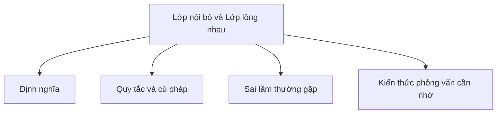

# 15 - Lớp Nội Bộ (Inner Class) và Lớp Lồng Nhau (Nested Class)

Chủ đề này bám sát đề cương chính trong [outline.md](../outline.md). Mục tiêu là hiểu sâu sắc từng khái niệm để có thể giải thích, nhận biết trong mã nguồn và trả lời các câu hỏi phỏng vấn.

## Thứ Tự Học Tập

- [Khái niệm Lớp Lồng Nhau](theory/01-nested-class-concepts.md)
- [Thuật Ngữ Khóa](terms/01-key-terms.md)

## Danh Sách Nội Dung

- Lớp lồng nhau (Nested class)
- Lớp lồng tĩnh (Static nested class)
- Lớp nội bộ (Inner class)
- Lớp nội bộ cục bộ (Local inner class)
- Lớp nội bộ vô danh (Anonymous inner class)
- Truy cập biến bên ngoài lớp
- Trường hợp sử dụng của lớp nội bộ
- Lớp vô danh trong trình xử lý sự kiện (event handler), luồng (thread), bộ so sánh (comparator)

## Tự Kiểm Tra

- **Question 1**: Tại sao một lớp nội bộ phi tĩnh (non-static inner class) lại giữ một tham chiếu ngầm định đến thể hiện lớp cha (outer class) của nó, và điều này có thể dẫn đến rò rỉ bộ nhớ (memory leak) như thế nào (cũng như việc sử dụng lớp lồng tĩnh (static nested class) có thể ngăn chặn điều này ra sao)?
  - *Gợi ý*: Xem [Why Non-Static Inner Classes Can Cause Memory Leaks](theory/01-nested-class-concepts.md#why-non-static-inner-classes-can-cause-memory-leaks).
- **Question 2**: Các lớp lồng tĩnh và lớp nội bộ phi tĩnh khác nhau như thế nào về cách khởi tạo, cú pháp khởi tạo và dung lượng bộ nhớ chiếm dụng (memory footprint)?
  - *Gợi ý*: Xem [Why Static Nested and Non-Static Inner Classes Differ in Initialization and Memory](theory/01-nested-class-concepts.md#why-static-nested-and-non-static-inner-classes-differ-in-initialization-and-memory).
- **Question 3**: Tại sao các lớp nội bộ cục bộ và vô danh chỉ có thể truy cập các biến cục bộ là final hoặc hiệu dụng final (effectively final), và trình biên dịch thực thi điều này dưới nền tảng (under the hood) thông qua việc sao chụp biến theo dạng truyền tham trị (copy-by-value variable capture) như thế nào?
  - *Gợi ý*: Xem [Why Local and Anonymous Inner Classes Only Access Final or Effectively Final Variables](theory/01-nested-class-concepts.md#why-local-and-anonymous-inner-classes-only-access-final-or-effectively-final-variables).
- **Question 4**: Tại sao JVM lại tạo các phương thức truy cập tổng hợp (synthetic accessor method - ví dụ `access$000`) để truy cập thành viên private của lớp cha/lớp nội bộ, và các ảnh hưởng về mặt hiệu năng cũng như bảo mật là gì?
  - *Gợi ý*: Xem [Why JVM Generates Synthetic Accessors for Private Nested Access](theory/01-nested-class-concepts.md#why-jvm-generates-synthetic-accessors-for-private-nested-access).
- **Question 5**: Trình biên dịch Java biên dịch các lớp nội bộ vô danh thành các tệp mã byte (bytecode) `.class` riêng biệt (ví dụ: `Outer$1.class`) như thế nào, và điều này tương phản ra sao với cách biên dịch biểu thức lambda (lambda expression)?
  - *Gợi ý*: Xem [Why Anonymous Classes Compile to Separate Class Files vs Lambdas](theory/01-nested-class-concepts.md#why-anonymous-classes-compile-to-separate-class-files-vs-lambdas).

## Thẻ Anki

- [Basic](anki/basic.tsv)
- [Basic Extra](anki/basic-extra.tsv)
- [Cloze](anki/cloze.tsv)
- [Code Question](anki/code-question.tsv)

## Sơ Đồ Mermaid Tổng Quan

## Liên Kết Tham Khảo

- https://docs.oracle.com/javase/tutorial/java/javaOO/nested.html
