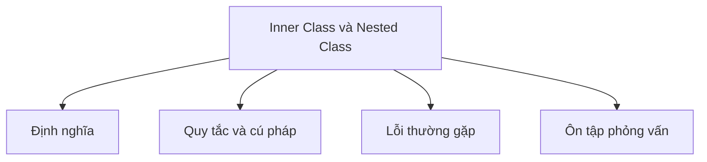

# 15 - Lớp nội (Inner Class) và lớp lồng nhau (Nested Class)

Chủ đề này tuân theo đề cương chính tại [outline.md](../../outline.md). Mục tiêu là hiểu từng khái niệm đủ sâu để giải thích, nhận diện trong code và trả lời các câu hỏi phỏng vấn.

## Thứ tự học

- [Khái niệm Nested Class](theory/01-nested-class-concepts.md)
- [Thuật ngữ chính](terms/01-key-terms.md)

## Danh mục đề cương

- Lớp lồng nhau (Nested class)
- Lớp lồng nhau tĩnh (Static nested class)
- Lớp nội (Inner class)
- Lớp nội cục bộ (Local inner class)
- Lớp nội ẩn danh (Anonymous inner class)
- Truy cập biến bên ngoài lớp
- Trường hợp sử dụng của inner class
- Anonymous class trong event handler, thread, comparator

## Tự kiểm tra (Self-Check)

- **Câu hỏi 1**: Tại sao một inner class không tĩnh (non-static) giữ một tham chiếu ẩn đến instance của outer class, và điều này có thể dẫn đến memory leak như thế nào (và làm thế nào để dùng static nested class ngăn chặn điều này)?
  - *Gợi ý*: Xem [Why Non-Static Inner Classes Can Cause Memory Leaks](theory/01-nested-class-concepts.md#why-non-static-inner-classes-can-cause-memory-leaks).
- **Câu hỏi 2**: Static nested class và non-static inner class khác nhau như thế nào về khởi tạo, cú pháp instantiating và footprint bộ nhớ?
  - *Gợi ý*: Xem [Why Static Nested and Non-Static Inner Classes Differ in Initialization and Memory](theory/01-nested-class-concepts.md#why-static-nested-and-non-static-inner-classes-differ-in-initialization-and-memory).
- **Câu hỏi 3**: Tại sao các local và anonymous inner class chỉ có thể truy cập các biến cục bộ là `final` hoặc effectively final, và trình biên dịch triển khai điều này qua cơ chế copy-by-value variable capture như thế nào?
  - *Gợi ý*: Xem [Why Local and Anonymous Inner Classes Only Access Final or Effectively Final Variables](theory/01-nested-class-concepts.md#why-local-and-anonymous-inner-classes-only-access-final-or-effectively-final-variables).
- **Câu hỏi 4**: Tại sao JVM tạo các phương thức accessor tổng hợp (synthetic accessor method) như `access$000` cho việc truy cập thành viên private giữa outer/inner class, và những hệ quả về hiệu suất và bảo mật là gì?
  - *Gợi ý*: Xem [Why JVM Generates Synthetic Accessors for Private Nested Access](theory/01-nested-class-concepts.md#why-jvm-generates-synthetic-accessors-for-private-nested-access).
- **Câu hỏi 5**: Trình biên dịch Java biên dịch anonymous inner class thành các file bytecode `.class` riêng biệt như thế nào (ví dụ `Outer$1.class`), và điều này khác với cách lambda expression được biên dịch như thế nào?
  - *Gợi ý*: Xem [Why Anonymous Classes Compile to Separate Class Files vs Lambdas](theory/01-nested-class-concepts.md#why-anonymous-classes-compile-to-separate-class-files-vs-lambdas).

## Thẻ Anki

- [Basic](anki/basic.tsv)
- [Basic Extra](anki/basic-extra.tsv)
- [Cloze](anki/cloze.tsv)
- [Code Question](anki/code-question.tsv)

## Sơ đồ tổng quan (Mermaid Overview)

## Reference Links

- https://docs.oracle.com/javase/tutorial/java/javaOO/nested.html
