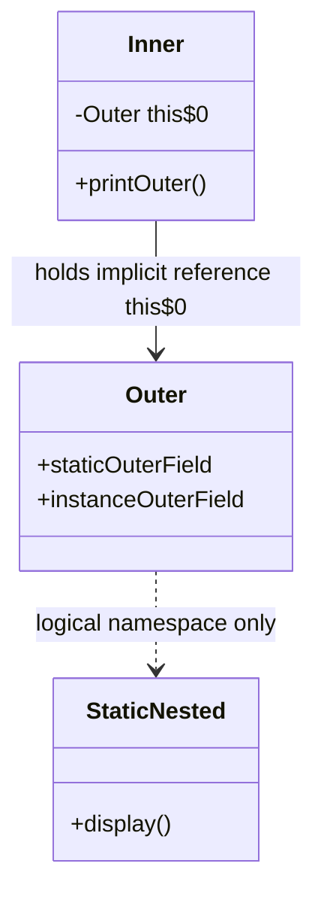
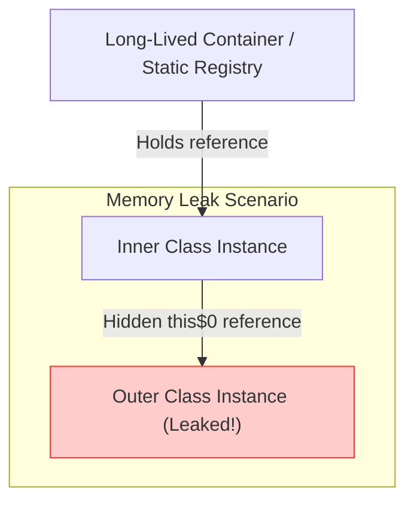
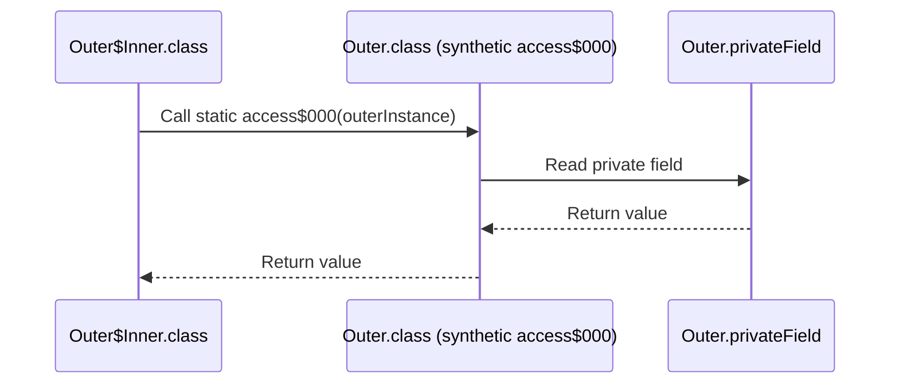

# Lớp nội bộ và Lớp lồng (Inner Class and Nested Class) - Phần 1

## Mục tiêu học tập (Learning Goal)

Tập tin này bao gồm một phần trọng tâm về **Lớp nội bộ và Lớp lồng (Inner Class and Nested Class)**. Hãy nghiên cứu từng khái niệm như một quy tắc Java thực tế, không phải là từ vựng riêng lẻ.

## Khái quát nội dung (Outline Coverage)

| Khái niệm (Concept) | Điều cần biết (What to know) |
| --- | --- |
| `Nested class` | Một lớp được định nghĩa bên trong một lớp khác. Được chia thành các lớp lồng tĩnh (static nested class) và các lớp lồng phi tĩnh (non-static nested class, còn gọi là lớp nội bộ - inner class). |
| `Static nested class` | Một lớp lồng được khai báo static; nó hoạt động giống như bất kỳ lớp cấp cao nào khác về mặt gói (package) nhưng được lồng để phục vụ nhóm dữ liệu, và không yêu cầu một thực thể lớp bên ngoài. |
| `Inner class` | Một lớp lồng phi tĩnh được liên kết với một thực thể cụ thể của lớp bên ngoài. |
| `Local inner class` | Một lớp được định nghĩa bên trong một khối phương thức; nó chỉ có thể truy cập các biến cục bộ final hoặc hiệu dụng final (effectively final). |
| `Anonymous inner class` | Một lớp nội bộ không có tên được khai báo và khởi tạo trong một biểu thức duy nhất để mở rộng một lớp hoặc triển khai một interface. |
| `Access variables outside the class` | Các quy tắc chi phối cách lớp lồng, lớp nội bộ, lớp cục bộ, và lớp ẩn danh truy cập các thành viên thực thể bao quanh hoặc các biến cục bộ của phương thức. |
| `Use case of inner class` | Nhóm logic các lớp trợ giúp, đóng gói (ví dụ: các Iterator), và duy trì các không gian tên cấp cao sạch sẽ. |
| `Anonymous class in event handler, thread, comparator` | Triển khai các hành vi nhanh chóng trước khi có lambda; hiểu lý do tại sao phạm vi this và việc biên dịch khác với lambda. |

---

## Ghi chú chi tiết (Detailed Notes)

### Lớp lồng (Nested class)

Một **lớp lồng (nested class)** là bất kỳ lớp nào được định nghĩa bên trong thân của một lớp bao quanh khác. Trong Java, các lớp lồng được chia thành hai nhóm chính:
1. **Lớp lồng tĩnh (Static nested class)**: Được khai báo với bộ điều chỉnh `static`. Chúng không có quyền truy cập vào thực thể của lớp bao quanh.
2. **Lớp nội bộ (Inner class)** (Lớp lồng phi tĩnh): Được khai báo không có bộ điều chỉnh `static`. Chúng được gắn liền với một thực thể của lớp bên ngoài.

```
                  Nested Class
                      /    \
                     /      \
       Static Nested Class  Inner Class (Non-static)
                             /     \
                            /       \
                  Local Inner Class  Anonymous Inner Class
```

---

### Lớp lồng tĩnh (Static nested class)

Một **lớp lồng tĩnh (static nested class)** hoạt động giống như một lớp cấp cao (top-level class) được lồng vào bên trong một lớp khác để tiện lợi cho việc đóng gói. Nó không có một tham chiếu ngầm định đến một thực thể của lớp bên ngoài.

#### Quy tắc truy cập
- **Có thể truy cập**: Tất cả các thành viên tĩnh (biến và phương thức) của lớp bên ngoài, bao gồm cả các thành viên `private`.
- **Không thể truy cập**: Các thành viên thực thể (trường hoặc phương thức) của lớp bên ngoài một cách trực tiếp. Nó phải tạo ra một thực thể của lớp bên ngoài để truy cập chúng.
- **Thành viên tĩnh**: Các lớp lồng tĩnh có thể định nghĩa cả các biến tĩnh, phương thức tĩnh, cũng như các thành viên phi tĩnh.

#### Cú pháp khởi tạo
Vì nó không yêu cầu một thực thể lớp bên ngoài, bạn có thể khởi tạo nó bằng cách sử dụng tên lớp bên ngoài:
```java
Outer.StaticNested nestedInstance = new Outer.StaticNested();
```

#### Ví dụ mã nguồn
```java
public class Outer {
    private static String staticOuterField = "Private Static Outer Field";
    private String instanceOuterField = "Private Instance Outer Field";

    public static class StaticNested {
        public void display() {
            // Can access static members directly (even private)
            System.out.println("Accessing: " + staticOuterField);

            // Cannot access instanceOuterField directly:
            // System.out.println(instanceOuterField); // Compile error!

            // Must instantiate Outer to access instance members
            Outer outer = new Outer();
            System.out.println("Accessing via instance: " + outer.instanceOuterField);
        }
    }
}
```

---

### Lớp nội bộ (Inner class - Lớp lồng phi tĩnh)

Một **lớp nội bộ (inner class)** là một lớp lồng phi tĩnh. Mỗi thực thể của lớp nội bộ đều được liên kết ngầm định với một thực thể cụ thể của lớp bên ngoài.

#### Quy tắc truy cập
- **Có thể truy cập**: Tất cả các thành viên của lớp bên ngoài (thực thể và tĩnh), bao gồm cả các thành viên `private`.
- **Không thể định nghĩa**: Trước Java 16, các lớp nội bộ không thể định nghĩa các thành viên tĩnh (ngoại trừ các hằng số static final). Từ Java 16 trở đi, các lớp nội bộ đã có thể khai báo các thành viên tĩnh.
- **Tham chiếu ngầm định**: Giữ một tham chiếu ẩn đến thực thể lớp bên ngoài (`Outer.this`), điều này ngăn thực thể lớp bên ngoài bị thu gom rác chừng nào thực thể lớp nội bộ còn tồn tại.

#### Cú pháp khởi tạo
Bạn phải có một thực thể của lớp bên ngoài để khởi tạo một lớp nội bộ:
```java
Outer outer = new Outer();
Outer.Inner inner = outer.new Inner();
```

#### Ví dụ mã nguồn
```java
public class Outer {
    private String outerField = "Outer Instance Field";

    public class Inner {
        public void printOuter() {
            // Direct access to the enclosing instance's field
            System.out.println("Enclosing field: " + outerField);
            // Explicit reference syntax:
            System.out.println("Enclosing field (explicit): " + Outer.this.outerField);
        }
    }
}
```

## Tại sao Lớp lồng tĩnh và Lớp nội bộ phi tĩnh khác nhau về Khởi tạo và Bộ nhớ (Why Static Nested and Non-Static Inner Classes Differ in Initialization and Memory)

Các lớp lồng tĩnh độc lập với bất kỳ thực thể bên ngoài nào, hoạt động giống như một thành viên tĩnh của lớp bên ngoài. Khi JVM tải lớp bên ngoài, nó có thể tải lớp lồng tĩnh một cách độc lập, và việc khởi tạo nó không yêu cầu một thực thể của lớp bên ngoài. Ngược lại, một lớp nội bộ phi tĩnh được gắn trực tiếp với trạng thái thực thể của lớp bao quanh bên ngoài. Do sự liên kết này, mỗi thực thể của lớp nội bộ chứa một trường ẩn ngầm định lưu trữ tham chiếu đến thực thể bên ngoài bao quanh nó, làm tăng dung lượng bộ nhớ của mỗi thực thể lớp nội bộ bằng kích thước của một con trỏ tham chiếu (thường là 4 hoặc 8 byte). Vì thế, chúng bắt buộc phải được khởi tạo thông qua một thực thể bên ngoài đang hoạt động, thiết lập mối quan hệ đối tượng cha-con trong bộ nhớ.

### Sơ đồ bố trí bộ nhớ và mô hình khởi tạo (Memory Layout and Instantiation Model)


### So sánh khởi tạo và dung lượng bộ nhớ (Instantiation and Memory Comparison)
```java
public class MemoryFootprintDemo {
    static class StaticHelper {
        int value;
    }
    class InnerHelper {
        int value;
    }
    public static void main(String[] args) {
        // Static nested class is instantiated independently
        MemoryFootprintDemo.StaticHelper sh = new MemoryFootprintDemo.StaticHelper();
        
        // Non-static inner class requires an enclosing instance
        MemoryFootprintDemo outer = new MemoryFootprintDemo();
        MemoryFootprintDemo.InnerHelper ih = outer.new InnerHelper();
        
        System.out.println("Initialized sh and ih successfully."); // Output: Initialized sh and ih successfully.
    }
}
```

### Chuỗi nguyên nhân - kết quả

```text
Không có bộ điều chỉnh `static` trong khai báo lớp nội bộ
  → trình biên dịch tạo trường final ẩn `this$0` tham chiếu đến thực thể lớp bao quanh
  → thực thể lớp nội bộ không thể tồn tại mà không có thực thể lớp bên ngoài
  → cú pháp khởi tạo yêu cầu `outerInstance.new Inner()`
  → các thực thể lớp nội bộ chiếm nhiều bộ nhớ hơn do chi phí của con trỏ tham chiếu.
```


---

## Tại sao Lớp nội bộ phi tĩnh có thể gây ra rò rỉ bộ nhớ (Why Non-Static Inner Classes Can Cause Memory Leaks)

Bởi vì các thực thể lớp nội bộ phi tĩnh duy trì một tham chiếu ẩn (trường `this$0` do trình biên dịch tạo ra) đến thực thể lớp bên ngoài bao quanh chúng, vòng đời của đối tượng bên ngoài bị ràng buộc với đối tượng bên trong. Nếu một đối tượng tồn tại lâu dài (như một luồng nền background thread, một bộ sưu tập static, hoặc một bộ lắng nghe giao diện đồ họa UI listener) giữ một tham chiếu đến một thực thể lớp nội bộ, thực thể lớp bên ngoài bao quanh nó sẽ không thể bị thu gom rác. Điều này xảy ra ngay cả khi thực thể lớp bên ngoài không còn được tham chiếu ở bất kỳ nơi nào khác trong mã nguồn ứng dụng. Mối liên kết ẩn này là nguyên nhân phổ biến gây rò rỉ bộ nhớ (memory leak) trong Android (ví dụ: các handler giữ các Activity) và phát triển giao diện đồ họa desktop UI. Việc chuyển đổi lớp nội bộ thành lớp lồng tĩnh sẽ phá vỡ chuỗi tham chiếu ngầm định này, cho phép thực thể bên ngoài được bộ thu gom rác thu hồi khi các tham chiếu trực tiếp của nó được xóa bỏ.

### Chuỗi tham chiếu gây rò rỉ bộ nhớ (Memory Leak Reference Chain)


### Ví dụ mã nguồn: Rò rỉ qua Registry tồn tại lâu dài (Long-Lived Registry Leak)
```java
import java.util.ArrayList;
import java.util.List;

public class LeakDemo {
    // Long-lived registry that persists throughout the application lifecycle
    public static final List<Object> registry = new ArrayList<>();

    public void doWork() {
        // An instance of LeakDemo is created, and it spawns an inner class instance
        registry.add(new LeakyInner()); 
    }

    public class LeakyInner {
        public void execute() {
            System.out.println("Executing task.");
        }
    }

    public static void main(String[] args) {
        LeakDemo demo = new LeakDemo();
        demo.doWork();
        // The demo object reference is cleared in main:
        demo = null; 
        // However, the LeakDemo instance remains in heap because:
        // registry -> LeakyInner -> LeakDemo (via implicit reference)
        System.out.println("LeakDemo instance is leaked in memory!"); // Output: LeakDemo instance is leaked in memory!
    }
}
```

### Chuỗi nguyên nhân - kết quả

```text
Tham chiếu tồn tại lâu dài giữ thực thể lớp nội bộ
  → thực thể lớp nội bộ giữ tham chiếu ẩn `this$0`
  → thực thể bên ngoài bao quanh vẫn ở trạng thái có thể tiếp cận được trong đồ thị GC root
  → bộ thu gom rác không thể thu hồi bộ nhớ của thực thể bên ngoài
  → xảy ra rò rỉ bộ nhớ / OutOfMemoryError.
```


---

### Lớp nội bộ cục bộ (Local inner class)

Một **lớp nội bộ cục bộ (local inner class)** được định nghĩa bên trong một khối mã, thường là bên trong thân phương thức. Phạm vi của nó bị giới hạn hoàn toàn trong khối mã đó.

#### Quy tắc truy cập
- **Phạm vi**: Cục bộ đối với khối mã. Không được khai báo với các bộ điều chỉnh truy cập (`public`, `protected`, `private`) hoặc `static`.
- **Có thể truy cập**: Các thành viên của lớp bên ngoài, cùng với các biến cục bộ của khối bao quanh **chỉ khi** chúng là `final` hoặc **hiệu dụng final (effectively final)** (các biến có giá trị không bao giờ thay đổi sau khi khởi tạo).
- **Sửa đổi**: Không thể sửa đổi các biến cục bộ của phương thức bên ngoài từ bên trong lớp cục bộ.

#### Cú pháp khởi tạo
Bạn chỉ có thể khởi tạo một lớp cục bộ bên trong phương thức bao quanh nó, sau khi lớp đó đã được định nghĩa.

#### Ví dụ mã nguồn
```java
public class Outer {
    private String outerField = "Outer Field";

    public void processData(final String inputParam) {
        String localVal = "Local Temp Value"; // Effectively final
        String nonFinalVal = "Initial Value";
        nonFinalVal = "Changed Value"; // Not effectively final anymore

        class LocalInner {
            public void run() {
                System.out.println(outerField);  // Accesses outer instance field
                System.out.println(inputParam);  // Accesses final parameter
                System.out.println(localVal);    // Accesses effectively final local variable
                // System.out.println(nonFinalVal); // Compile error! Not effectively final
            }
        }

        LocalInner inner = new LocalInner();
        inner.run();
    }
}
```

## Tại sa Lớp nội bộ cục bộ và ẩn danh chỉ truy cập các biến final hoặc hiệu dụng final (Why Local and Anonymous Inner Classes Only Access Final or Effectively Final Variables)

Các lớp cục bộ và ẩn danh được khai báo bên trong một phương thức có thể truy cập các biến cục bộ của phương thức đó, nhưng các biến này phải là `final` hoặc hiệu dụng final. Lý do nằm ở sự không khớp về vòng đời giữa các biến cục bộ của phương thức và các thực thể của lớp. Các biến cục bộ sống trên Stack và bị hủy ngay sau khi phương thức bao quanh kết thúc thực thi, trong khi các thực thể lớp cục bộ/ẩn danh được phân bổ trên Heap và có thể tồn tại lâu hơn rất nhiều sau khi phương thức đã trả về (ví dụ: làm callback hoặc chạy trong một luồng khác). Để giải quyết sự không tương thích này, trình biên dịch sao chép các giá trị của các biến cục bộ được truy cập và lưu trữ chúng dưới dạng các trường thực thể ẩn bên trong thực thể lớp nội bộ. Nếu phương thức bên ngoài hoặc lớp nội bộ có thể sửa đổi các biến này, trường được sao chép và biến cục bộ ban đầu sẽ không còn đồng bộ, dẫn đến hành vi không thể đoán trước; việc bắt buộc các biến phải là final đảm bảo tính nhất quán về mặt ngữ nghĩa.

### Vòng đời Stack/Heap và việc Chụp biến (Stack/Heap Lifecycle and Variable Capture)
```
Thực thi phương thức (Stack frame)           Bộ nhớ Heap
┌─────────────────────────────┐             ┌──────────────────────────────────────────────┐
│ void process() {            │             │ AnonymousClass$1 instance                    │
│   int x = 10;               │             ├──────────────────────────────────────────────┤
│   Runnable r = new R() {    │────────────>│ - final int val$x = 10                       │
│     // accesses x           │             │   (Bản sao ẩn của biến x cục bộ)              │
│   };                        │             └──────────────────────────────────────────────┘
│ }                           │
└─────────────────────────────┘
[Stack Frame bị xóa (x bị hủy)] ──────────> (AnonymousClass$1 vẫn hoạt động trên heap, dùng val$x)
```

### Ví dụ mã nguồn: Chụp biến và sự không khớp vòng đời (Variable Capture and Mismatch)
```java
public class VariableCaptureDemo {
    public Runnable createCallback() {
        int count = 42; // Effectively final local variable
        
        Runnable r = new Runnable() {
            @Override
            public void run() {
                // accesses copy of count
                System.out.println("Captured count value: " + count); 
            }
        };
        
        // If we did 'count = 99;' here, it would trigger a compile error.
        return r;
    }

    public static void main(String[] args) {
        VariableCaptureDemo demo = new VariableCaptureDemo();
        Runnable callback = demo.createCallback();
        callback.run(); // Output: Captured count value: 42
    }
}
```

### Chuỗi nguyên nhân - kết quả

```text
Thực thi phương thức hoàn thành
  → khung ngăn xếp của các biến cục bộ bị xóa và các biến bị hủy
  → đối tượng lớp nội bộ tiếp tục tồn tại trên heap
  → lớp nội bộ dựa vào các trường bản sao do trình biên dịch tạo ra (`val$varName`)
  → biến bắt buộc phải là final hoặc hiệu dụng final để đảm bảo tính nhất quán của bản sao giữa stack và heap.
```


---

### Lớp nội bộ ẩn danh (Anonymous inner class)

Một **lớp nội bộ ẩn danh (anonymous inner class)** là một lớp cục bộ không có tên. Nó được khai báo và khởi tạo đồng thời bằng cách sử dụng toán tử `new`. Nó bắt buộc phải mở rộng một lớp hiện có hoặc triển khai một interface.

#### Quy tắc truy cập
- **Cấu trúc**: Không thể định nghĩa các hàm dựng constructor (vì không có tên), nhưng có thể sử dụng các khối khởi tạo thực thể `{ ... }`.
- **Biến**: Áp dụng các quy tắc final/effectively final tương tự như các lớp cục bộ đối với các biến cục bộ được truy cập.
- **Cách dùng**: Được sử dụng để ghi đè nhanh các hành vi của lớp hoặc triển khai interface phục vụ cho một lần sử dụng duy nhất.

#### Cú pháp khởi tạo
```java
InterfaceName obj = new InterfaceName() {
    @Override
    public void method() {
        // Implementation
    }
};
```

#### Ví dụ mã nguồn
```java
public class Button {
    interface ClickListener {
        void onClick();
    }

    public void setListener(ClickListener listener) {
        listener.onClick();
    }
}

class Test {
    public void setup() {
        Button btn = new Button();
        
        // Implementing ClickListener using Anonymous Inner Class
        btn.setListener(new Button.ClickListener() {
            private int clickCount = 0; // Can define instance fields

            @Override
            public void onClick() {
                clickCount++;
                System.out.println("Clicked! Count: " + clickCount);
            }
        });
    }
}
```

---

### Bảng Tóm tắt các Quy tắc Truy cập (Summary Access Rules Table)

| Loại lớp (Class Type) | Lớp lồng/nội bộ | Truy cập thực thể bên ngoài? | Truy cập biến cục bộ? | Cú pháp khởi tạo | Định nghĩa thành viên tĩnh? |
| --- | --- | --- | --- | --- | --- |
| **Static Nested** | Lớp lồng | Không | Không | `new Outer.StaticNested()` | Có |
| **Inner Class** | Lớp nội bộ | Có | Không | `outerInstance.new Inner()` | Có (Java 16+), Không (Trước Java 16 trừ các hằng số) |
| **Local Class** | Lớp nội bộ | Có | Có (nếu final/effectively final) | Chỉ bên trong thân phương thức | Có (Java 16+), Không (Trước Java 16 trừ các hằng số) |
| **Anonymous Class**| Lớp nội bộ | Có | Có (nếu final/effectively final) | Khai báo và tạo trực tiếp inline | Có (Java 16+), Không (Trước Java 16 trừ các hằng số) |

---

## Tại sao JVM tạo ra các Trình truy cập tổng hợp cho việc truy cập lồng nhau private (Why JVM Generates Synthetic Accessors for Private Nested Access)

Mặc dù trình biên dịch Java cho phép các lớp lồng nhau và lớp bên ngoài của chúng truy cập các trường và phương thức `private` của nhau, Máy ảo Java (JVM) không natively hỗ trợ các lớp lồng nhau. Ở cấp độ bytecode, các lớp lồng và lớp bên ngoài được biên dịch thành các tệp class hoàn toàn riêng biệt (ví dụ: `Outer.class` và `Outer$Inner.class`). Vì JVM thực thi nghiêm ngặt các quy tắc kiểm soát truy cập dựa trên ranh giới lớp, nó sẽ từ chối truy cập trực tiếp vào các thành viên private của lớp khác. Để thu hẹp khoảng cách này, trình biên dịch Java tự động tạo ra các phương thức trợ giúp static có phạm vi package-private được gọi là **các phương thức truy cập tổng hợp (synthetic accessor method)** (được đặt tên như `access$000`, `access$100`) bên trong lớp chứa thành viên private mục tiêu. Các phương thức truy cập này hoạt động như các phương thức cầu nối (bridge method) đọc hoặc ghi trường private thay cho lớp lồng, giới thiệu một chi phí gọi phương thức nhỏ và mở rộng quyền truy cập lên cấp độ package-private, điều mà các công cụ như reflection (phản chiếu) có thể khai thác.

### Quy trình gọi trình truy cập tổng hợp (Synthetic Accessor Sequence Flow)


### Ví dụ mã nguồn: Cầu nối do trình biên dịch tạo ra (Compiler-Generated Bridging)
```java
public class OuterClass {
    private String secret = "Top Secret Info";

    public class InnerClass {
        public void revealSecret() {
            // Compiler rewrites this to: System.out.println(OuterClass.access$000(OuterClass.this));
            System.out.println(secret); 
        }
    }

    // Automatically generated by the compiler under the hood:
    /*
    static String access$000(OuterClass outer) {
        return outer.secret;
    }
    */

    public static void main(String[] args) {
        OuterClass outer = new OuterClass();
        OuterClass.InnerClass inner = outer.new InnerClass();
        inner.revealSecret(); // Output: Top Secret Info
    }
}
```

### Chuỗi nguyên nhân - kết quả

```text
Lớp lồng truy cập thành viên private bao quanh
  → JVM thực thi nghiêm ngặt ranh giới private ở cấp độ tệp class
  → trình biên dịch tạo phương thức truy cập tổng hợp static package-private `access$000` trong lớp mục tiêu
  → lớp lồng gọi phương thức tổng hợp này để đọc/ghi giá trị
  → khả năng hiển thị private bị yếu đi thành package-private ở cấp độ bytecode.
```


---

### Các trường hợp sử dụng lớp nội bộ (Use cases of inner classes)

1. **Gom nhóm logic (Logical Grouping)**: Nếu lớp B chỉ hữu ích đối với lớp A, B có thể được lồng vào trong A để giữ các gói (package) sạch sẽ.
2. **Tăng cường đóng gói (Enhanced Encapsulation)**: Các lớp nội bộ có thể truy cập các thành viên private của lớp bên ngoài. Nếu B cần thao tác với các trường private của A mà không muốn để lộ chúng ra bên ngoài (ví dụ: `java.util.HashMap.KeyIterator`), B nên là một lớp nội bộ của A.
3. **Quản lý không gian tên (Namespace Management)**: Ngăn ngừa làm lộn xộn không gian tên cấp cao bằng các lớp nhỏ, chuyên biệt vốn chỉ được sử dụng ở một nơi duy nhất.

---

## Các lỗi thường gặp (Common Mistakes)

### 1. Khởi tạo trực tiếp Lớp nội bộ mà không có Thực thể bên ngoài (Direct Instantiation of Inner Class without Enclosing Instance)
Một sai lầm phổ biến là cố gắng khởi tạo một lớp nội bộ phi tĩnh như thể nó là một lớp lồng tĩnh.
```java
// WRONG:
Outer.Inner inner = new Outer.Inner(); // Compile error!

// CORRECT:
Outer outer = new Outer();
Outer.Inner inner = outer.new Inner();
```

### 2. Truy cập các Thành viên thực thể từ Lớp lồng tĩnh (Accessing Instance Members from Static Nested Class)
Các lớp lồng tĩnh không thể truy cập trực tiếp các trường phi tĩnh của lớp bên ngoài vì chúng không có tham chiếu đến đối tượng bên ngoài.
```java
public class Outer {
    int x = 10;
    static class StaticNested {
        void run() {
            // System.out.println(x); // Compile error!
            System.out.println(new Outer().x); // Correct
        }
    }
}
```

### 3. Sửa đổi các Biến cục bộ của phương thức (Vi phạm luật Effectively Final) (Modifying Method-Local Variables (Effectively Final Violation))
Cố gắng sửa đổi một biến cục bộ bên trong một lớp cục bộ hoặc lớp ẩn danh, hoặc sửa đổi nó sau đó trong phương thức bao quanh, sẽ kích hoạt lỗi trình biên dịch.
```java
public void doSomething() {
    int counter = 0;
    Runnable r = new Runnable() {
        @Override
        public void run() {
            // counter++; // Compile error: local variables referenced from an inner class must be final or effectively final
        }
    };
}
```

### 4. Che bóng biến và Cạm bẫy tham chiếu `this` (Shadowing and the this Reference Trap)
Bên trong một lớp nội bộ hoặc ẩn danh, từ khóa `this` tham chiếu đến chính thực thể lớp nội bộ đó, chứ không phải lớp bên ngoài. Để tham chiếu đến thực thể lớp bên ngoài, hãy sử dụng `Outer.this`.
```java
public class Outer {
    String name = "Outer";

    public class Inner {
        String name = "Inner";
        
        public void print() {
            System.out.println(this.name);       // Prints "Inner"
            System.out.println(Outer.this.name); // Prints "Outer"
        }
    }
}
```

---

## Case Study: Lớp ẩn danh so với Lambda cho Runnable/Comparator (Case Study: Anonymous Class vs Lambda for Runnable/Comparator)

Java 8 đã giới thiệu các biểu thức lambda như một giải pháp thay thế gọn gàng hơn cho các lớp ẩn danh. Tuy nhiên, chúng không hoàn toàn giống hệt nhau.

### 1. Functional Interface so với các Lớp/Nhiều phương thức (Functional Interfaces vs Classes/Multiple Methods)
- **Lambda** *chỉ* có thể được sử dụng cho các Functional Interface (giao diện chỉ chứa một phương thức trừu tượng duy nhất, SAM).
- **Lớp ẩn danh** có thể triển khai các interface có nhiều phương thức, triển khai các interface không có phương thức nào (interface đánh dấu), hoặc mở rộng các lớp cụ thể/trừu tượng.

```java
// Anonymous Class extending an abstract class
abstract class Worker { abstract void work(); }
Worker w = new Worker() {
    void work() { System.out.println("Working..."); }
}; // Cannot use lambda here because Worker is a class, not an interface!
```

### 2. Phạm vi của `this` và Che bóng biến (Scope of this and Variable Shadowing)
- **Lớp ẩn danh**: Giới thiệu một phạm vi (scope) mới. `this` tham chiếu đến chính thực thể lớp ẩn danh. Nó cũng có thể khai báo các trường cục bộ che bóng (shadow) các trường của lớp bên ngoài.
- **Lambda**: Sử dụng phạm vi từ vựng (lexical scope). `this` tham chiếu đến thực thể lớp bên ngoài bao quanh nơi lambda được định nghĩa. Nó không giới thiệu một cấp phạm vi mới; việc khai báo một biến trùng tên với một biến cục bộ trong phương thức bao quanh sẽ gây ra lỗi biên dịch.

```java
public class ScopeTest {
    private String name = "Outer";

    public void runTest() {
        // 1. Anonymous Class
        Runnable r1 = new Runnable() {
            private String name = "Anonymous";
            @Override
            public void run() {
                System.out.println(this.name); // Prints "Anonymous"
            }
        };

        // 2. Lambda
        Runnable r2 = () -> {
            // String name = "Lambda"; // Compile Error: Variable 'name' is already defined in scope
            System.out.println(this.name); // Prints "Outer" (lexical 'this')
        };
        
        r1.run();
        r2.run();
    }
}
```

### 3. Biên dịch và Hiệu năng (Khác biệt bytecode) (Compilation and Performance (Bytecode Differences))
- **Lớp ẩn danh**: Biên dịch thành một tệp `.class` vật lý riêng biệt (ví dụ: `Outer$1.class`). Điều này yêu cầu JVM phải tải một lớp riêng biệt ở thời gian chạy, làm tăng chi phí khởi động và dung lượng bộ nhớ.
- **Lambda**: Sử dụng mã lệnh `invokedynamic` (indy) được giới thiệu từ Java 7. Thay vì tạo ra một tệp class khi biên dịch, trình biên dịch tạo ra một phương thức bootstrap. JVM thời gian chạy sử dụng `LambdaMetafactory` để tạo ra điểm gọi (call site) một cách động, tránh chi phí nạp lớp và cho phép các tối ưu hóa inlining ở cấp độ JVM.

---

## Tại sao Lớp ẩn danh biên dịch thành các tệp Class riêng biệt so với Lambda (Why Anonymous Classes Compile to Separate Class Files vs Lambdas)

Mỗi khai báo lớp nội bộ ẩn danh sẽ biên dịch thành tệp `.class` vật lý riêng trên đĩa, được đặt tên theo lớp bao quanh theo sau bởi ký tự `$` và một số nguyên tự động tăng (ví dụ: `Outer$1.class`). Điều này là do các lớp ẩn danh là các lớp Java hoàn chỉnh có thể định nghĩa các trường thực thể tùy chỉnh, ghi đè nhiều phương thức và lưu giữ trạng thái. Việc nạp các tệp class bổ sung này ở thời gian chạy gây ra I/O đĩa, tiêu thụ bộ nhớ metaspace và làm chậm quá trình khởi động JVM do quá trình xác thực lớp và nạp lớp. Ngược lại, lambdas (được giới thiệu từ Java 8) không tạo ra các tệp `.class` riêng biệt tại thời điểm biên dịch. Thay vào đó, trình biên dịch Java phát ra mã lệnh `invokedynamic` (indy), hướng dẫn JVM tạo ra một điểm gọi động trên lần thực thi đầu tiên bằng cách sử dụng `LambdaMetafactory`, giúp giảm đáng kể chi phí khởi động và cho phép thực hiện các tối ưu hóa thời gian chạy như inlining.

### Mô hình tạo tác biên dịch (Compilation Artifact Models)
```
Biên dịch lớp ẩn danh:
[Outer.java] ---> Biên dịch ---> [Outer.class], [Outer$1.class] (Tốn I/O đĩa, Metaspace)

Biên dịch Lambda:
[Outer.java] ---> Biên dịch ---> [Outer.class] (chứa hướng dẫn invokedynamic)
                                      |
                                      v (Thời gian chạy)
                                [LambdaMetafactory] ---> Điểm gọi động được tạo trong bộ nhớ
```

### Ví dụ mã nguồn: So sánh trong ngữ cảnh Bytecode (Code Example: Bytecode Comparison Context)
```java
public class LambdaVSAnonymous {
    public static void main(String[] args) {
        // Anonymous Inner Class: generates LambdaVSAnonymous$1.class
        Runnable r1 = new Runnable() {
            @Override
            public void run() {
                System.out.println("Running anonymous class.");
            }
        };

        // Lambda: compiled into invokedynamic call site (no new class file generated)
        Runnable r2 = () -> System.out.println("Running lambda.");

        r1.run(); // Output: Running anonymous class.
        r2.run(); // Output: Running lambda.
    }
}
```

### Chuỗi nguyên nhân - kết quả

```text
Lớp nội bộ ẩn danh được biên dịch
  → trình biên dịch ghi tệp vật lý `Outer$1.class` riêng biệt
  → trình nạp lớp của JVM thực hiện nạp lớp, xác thực và phân bổ Metaspace cho mỗi tệp
  → mức sử dụng bộ nhớ và độ trễ khởi động cao hơn so với việc tạo lambda bằng `invokedynamic`.
```


## Liên kết tham khảo (Reference Links)
- [Oracle Java Tutorials: Nested Classes](https://docs.oracle.com/javase/tutorial/java/javaOO/nested.html)
- [Oracle Java Tutorials: Inner Class Classes](https://docs.oracle.com/javase/tutorial/java/javaOO/innerclasses.html)
- [Oracle Java Tutorials: Local Classes](https://docs.oracle.com/javase/tutorial/java/javaOO/localclasses.html)
- [Oracle Java Tutorials: Anonymous Classes](https://docs.oracle.com/javase/tutorial/java/javaOO/anonymousclasses.html)
- [JLS §8.1.3: Inner Classes and Enclosing Instances](https://docs.oracle.com/javase/specs/jls/se21/html/jls-8.html#jls-8.1.3)
- [JLS §15.9.5.1: Anonymous Constructors](https://docs.oracle.com/javase/specs/jls/se21/html/jls-15.html#jls-15.9.5.1)
- [JVMS §4.7.6: The InnerClasses Attribute](https://docs.oracle.com/javase/specs/jvms/se21/html/jvms-4.html#jvms-4.7.6)
- [JVMS §6.5.invokedynamic: Instruction Reference](https://docs.oracle.com/javase/specs/jvms/se21/html/jvms-6.html#jvms-6.5.invokedynamic)
