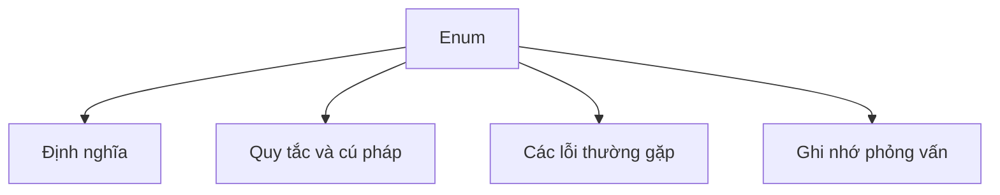

# 16 - Enum (Kiểu Liệt Kê)

Chủ đề này bám sát đề cương chính trong [outline.md](../outline.md). Mục tiêu là hiểu sâu từng khái niệm để có thể giải thích, nhận diện trong mã nguồn và trả lời các câu hỏi phỏng vấn.

## Thứ Tự Học Tập (Study Order)

- [Khái Niệm Enum Là Gì](theory/01-what-is-an-enum-concepts.md)
- [Khái Niệm Enum Triển Khai Interface](theory/02-enum-implements-interface-concepts.md)
- [Thuật Ngữ Chính](terms/01-key-terms.md)

## Checklist Đề Cương (Outline Checklist)

- Enum là gì?
- Khai báo enum
- Hàm khởi tạo enum
- Trường (field) của enum
- Phương thức của enum
- values()
- valueOf()
- ordinal()
- name()
- Enum trong switch
- Enum triển khai interface
- Mẫu thiết kế Singleton bằng Enum

## Tự Kiểm Tra (Self-Check)

Hãy cố gắng trả lời những câu hỏi này sau khi nghiên cứu chủ đề. Bạn nên giải thích được các cơ chế nền tảng bên dưới mà không cần tài liệu bên ngoài:

1. **Tại sao trình biên dịch Java biên dịch các enum thành các lớp `final` kế thừa từ `java.lang.Enum`?**
   - *Cơ chế chính*: Ràng buộc đơn kế thừa của Java, an toàn kiểu dữ liệu tại thời điểm biên dịch (compile-time type safety), và việc cấm tạo lớp con từ các kiểu enum.
2. **Tại sao các hàm khởi tạo enum phải là `private` một cách ngầm định hoặc tường minh, và điều gì xảy ra nếu bạn cố gắng khởi tạo một enum bằng từ khóa `new` hoặc qua reflection (phản xạ)?**
   - *Cơ chế chính*: Kiểm soát thực thể (instance control) nghiêm ngặt để ngăn chặn việc khởi tạo từ bên ngoài; trình biên dịch chặn sử dụng `new` tại thời điểm biên dịch và runtime chặn các hành vi khởi tạo qua phản xạ (reflection).
3. **Làm thế nào mà mẫu thiết kế Singleton bằng Enum một phần tử (single-element Enum Singleton) đảm bảo an toàn đa luồng (thread safety) và bảo vệ chống lại các cuộc tấn công qua reflection cũng như tuần tự hóa (serialization)?**
   - *Cơ chế chính*: JVM tải lớp (class loading) đảm bảo an toàn đa luồng, việc chặn reflection tại thời điểm chạy sẽ ném ra `IllegalArgumentException`, và quá trình tuần tự hóa khôi phục các thực thể chỉ bằng cách sử dụng tên của chúng.
4. **Các phương thức `values()` và `valueOf(String)` do trình biên dịch tự động tạo hoạt động như thế nào bên dưới, và tại sao việc gọi `values()` trong một vòng lặp có tần suất cao (hot loop) lại được coi là một phản mẫu thiết kế (anti-pattern) về hiệu năng?**
   - *Cơ chế chính*: Mảng tĩnh ẩn `$VALUES` lưu trữ các hằng số, việc sao chép mảng (array cloning) trên mỗi lần gọi để ngăn chặn sửa đổi, và chi phí thu gom rác (garbage collection overhead).
5. **Tại sao các enum lại an toàn khi so sánh bằng toán tử `==` thay vì `.equals()`, và điều này liên quan thế nào đến việc kiểm soát thực thể của JVM?**
   - *Cơ chế chính*: Bản chất Singleton của mỗi hằng số enum, so sánh danh tính tham chiếu (reference identity), và kiểm tra an toàn kiểu tại thời điểm biên dịch.
6. **Làm thế nào các hằng số enum có thể triển khai các interface và định nghĩa các thân lớp riêng cho hằng số (constant-specific class body) để đạt được tính đa hình về hành vi?**
   - *Cơ chế chính*: Các lớp con nội danh (anonymous inner subclass) do trình biên dịch tạo ra cho các hằng số định nghĩa thân lớp, ghi đè các phương thức của interface hoặc phương thức cơ sở.

## Thẻ Anki (Anki Cards)

- [Cơ Bản (Basic)](anki/basic.tsv)
- [Cơ Bản Mở Rộng (Basic Extra)](anki/basic-extra.tsv)
- [Điền Khuyết (Cloze)](anki/cloze.tsv)
- [Câu Hỏi Code (Code Question)](anki/code-question.tsv)

## Tổng Quan Sơ Đồ Mermaid (Mermaid Overview)

## Liên Kết Tham Khảo (Reference Links)

- https://docs.oracle.com/javase/tutorial/java/javaOO/enum.html
- https://docs.oracle.com/en/java/javase/21/docs/api/java.base/java/lang/Enum.html
