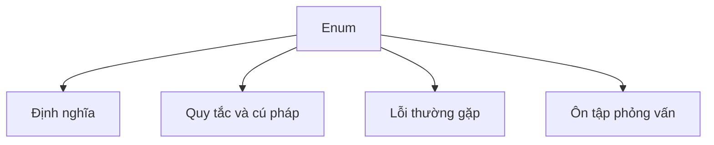

# 16 - Enum

Chủ đề này tuân theo đề cương chính tại [outline.md](../../outline.md). Mục tiêu là hiểu từng khái niệm đủ sâu để giải thích, nhận diện trong code và trả lời các câu hỏi phỏng vấn.

## Thứ tự học

- [Enum là gì](theory/01-what-is-an-enum-concepts.md)
- [Enum triển khai interface](theory/02-enum-implements-interface-concepts.md)
- [Thuật ngữ chính](terms/01-key-terms.md)

## Danh mục đề cương

- Enum là gì?
- Khai báo enum
- Constructor của enum
- Field của enum
- Method của enum
- `values()`
- `valueOf()`
- `ordinal()`
- `name()`
- Enum trong switch
- Enum triển khai interface
- Mẫu thiết kế Singleton với Enum

## Tự kiểm tra (Self-Check)

Hãy cố gắng trả lời các câu hỏi này sau khi học xong chủ đề. Bạn phải có khả năng giải thích cơ chế bên dưới mà không cần tra cứu:

1. **Tại sao trình biên dịch Java biên dịch enum thành class `final` kế thừa (Inheritance) `java.lang.Enum`?**
   - *Cơ chế chính*: Ràng buộc single inheritance của Java, type safety tại compile-time, và ngăn chặn subclassing các enum type.
2. **Tại sao constructor của enum phải là `private` ngầm định hoặc tường minh, và điều gì xảy ra nếu bạn cố dùng `new` hoặc reflection để khởi tạo enum?**
   - *Cơ chế chính*: Kiểm soát instance nghiêm ngặt ngăn khởi tạo từ bên ngoài; chặn tại compile-time với `new` và chặn tại runtime với reflection.
3. **Mẫu Enum Singleton một phần tử đảm bảo thread-safety và bảo vệ khỏi tấn công qua reflection và serialization như thế nào?**
   - *Cơ chế chính*: JVM class loading đảm bảo thread safety, reflection API ném `IllegalArgumentException`, và serialization khôi phục instance bằng tên.
4. **Các method `values()` và `valueOf(String)` do trình biên dịch tạo ra hoạt động bên dưới như thế nào, và tại sao gọi `values()` trong vòng lặp hot được coi là anti-pattern về hiệu suất?**
   - *Cơ chế chính*: Mảng tĩnh ẩn `$VALUES` lưu các hằng, clone mảng mỗi lần gọi để ngăn sửa đổi, và overhead GC.
5. **Tại sao enum an toàn để so sánh bằng toán tử `==` thay vì `.equals()`, và điều này liên quan đến instance control của JVM như thế nào?**
   - *Cơ chế chính*: Tính singleton của mỗi hằng enum, identity reference, và kiểm tra type-safety tại compile-time.
6. **Hằng enum có thể triển khai interface và định nghĩa constant-specific class body để đạt được đa hình (Polymorphism) hành vi như thế nào?**
   - *Cơ chế chính*: Trình biên dịch tạo anonymous inner subclass cho các hằng có class body, ghi đè interface hoặc base method.

## Thẻ Anki

- [Basic](anki/basic.tsv)
- [Basic Extra](anki/basic-extra.tsv)
- [Cloze](anki/cloze.tsv)
- [Code Question](anki/code-question.tsv)

## Sơ đồ tổng quan (Mermaid Overview)

## Reference Links

- https://docs.oracle.com/javase/tutorial/java/javaOO/enum.html
- https://docs.oracle.com/en/java/javase/21/docs/api/java.base/java/lang/Enum.html
