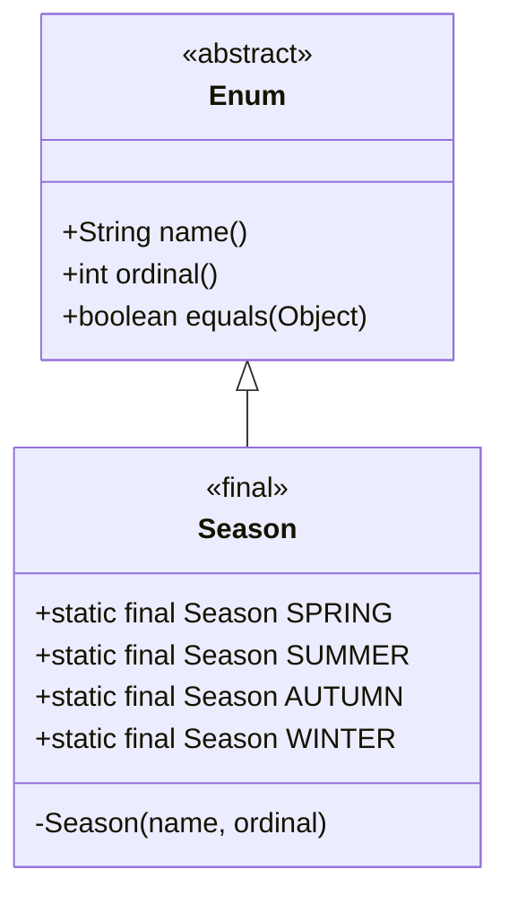

# Enum - Phần 1 (Enum - Part 1)

## Mục tiêu học tập (Learning Goal)

Tài liệu này bao gồm một phần nội dung trọng tâm về **Enum**. Hãy nghiên cứu từng khái niệm dưới dạng quy tắc thực tế trong Java, chứ không chỉ là từ vựng rời rạc.

## Các khái niệm bao phủ (Outline Coverage)

| Khái niệm | Những điều cần biết |
| --- | --- |
| `What is an enum?` | Định nghĩa một tập hợp cố định các hằng số được đặt tên dưới dạng một lớp an toàn kiểu dữ liệu kế thừa `java.lang.Enum`. |
| `Declare enum` | Được khai báo bằng từ khóa `enum`; có thể ở cấp cao nhất hoặc được lồng bên trong (ngầm định là static). |
| `Enum constructor` | Được thực thi khi tải lớp (class loading), bắt buộc phải là private, không thể khởi tạo bằng từ khóa `new`. |
| `Enum field` | Các biến thể hiện (instance variables) hoặc biến tĩnh (static variables) được định nghĩa bên trong một enum, thường là final để đảm bảo tính bất biến. |
| `Enum method` | Có thể định nghĩa các phương thức tĩnh, phương thức thể hiện hoặc phương thức trừu tượng được ghi đè bởi mỗi hằng số. |
| `values()` | Phương thức tĩnh trả về một bản sao mảng của tất cả các hằng số theo thứ tự khai báo. |
| `valueOf()` | Phương thức tĩnh trả về hằng số khớp chính xác với chuỗi ký tự truyền vào (phân biệt hoa thường) hoặc ném ra `IllegalArgumentException`. |
| `ordinal()` | Trả về chỉ mục khai báo bắt đầu từ 0; nguy hiểm nếu sử dụng cho cơ sở dữ liệu hoặc logic nghiệp vụ. |
| `name()` | Phương thức final trả về chính xác chuỗi hằng số được khai báo; không thể bị ghi đè. |
| `Enum in switch` | Được sử dụng làm biểu thức lựa chọn; các nhãn case phải sử dụng tên hằng số ngắn gọn (không kèm tên enum). Ném ra NPE nếu tham chiếu enum là null. |
| `EnumSet` | Triển khai `Set` tối ưu hóa cao bằng vector bit dành riêng cho enum. |
| `EnumMap` | Triển khai `Map` siêu nhanh được hỗ trợ bởi mảng, sử dụng các enum làm khóa. |

---

## Ghi chú chi tiết (Detailed Notes)

### Enum là gì? (What is an enum?)

Một enum (enumeration - kiểu liệt kê) định nghĩa một tập hợp cố định các hằng số được đặt tên dưới dạng một cấu trúc giống như một lớp an toàn kiểu dữ liệu (type-safe). Về bản chất, mọi enum đều là lớp con của `java.lang.Enum`. Các enum không thể được khởi tạo bằng cách sử dụng `new` và không thể kế thừa các lớp khác, nhưng chúng cung cấp tính an toàn kiểu dữ liệu mạnh mẽ tại thời điểm biên dịch.

```java
public enum Season {
    SPRING, SUMMER, AUTUMN, WINTER
}
```

- **An toàn kiểu dữ liệu (Type Safety)**: Không giống như các hằng số số nguyên, bạn không thể truyền một số nguyên tùy ý hoặc một kiểu enum khác vào nơi đang yêu cầu một `Season`.
- **Hạn chế kế thừa (Inheritance Limitation)**: Các enum không thể kế thừa bất kỳ lớp nào khác vì chúng đã kế thừa ngầm định lớp `java.lang.Enum`.

### Tại sao Enum được biên dịch thành các Lớp Final kế thừa java.lang.Enum (Why Enums Are Compiled to Final Classes Extending java.lang.Enum)

Các enum trong Java được biên dịch thành các lớp `final` kế thừa `java.lang.Enum` để thực thi tính an toàn kiểu dữ liệu tại thời điểm biên dịch và các giới hạn kế thừa nghiêm ngặt. Vì Java chỉ hỗ trợ đơn kế thừa lớp, việc chiếm dụng vị trí lớp cha bởi `java.lang.Enum` ngăn cản enum kế thừa bất kỳ lớp nào khác. Việc đánh dấu lớp là `final` đảm bảo rằng không lớp nào khác có thể kế thừa enum đó, giữ cho tập hợp các thực thể luôn được đóng kín một cách nghiêm ngặt. Tính an toàn kiểu dữ liệu này được thực thi bởi cả trình biên dịch và JVM, vốn nhận diện bổ nghĩa lớp `ENUM` và ngăn chặn mọi hành vi kế thừa hoặc khởi tạo từ bên ngoài, đảm bảo rằng chỉ có các hằng số được định nghĩa trước mới có thể tồn tại khi chạy.

#### Mô hình tư duy: Hệ thống phân cấp Enum và Ranh giới kiểu (Mental Model: Enum Hierarchy and Type Boundaries)
Sơ đồ sau minh họa cách cấu trúc lớp được biên dịch ngăn cản việc kế thừa trong khi vẫn thừa hưởng các tính năng cốt lõi từ `java.lang.Enum`:



#### Minh họa bằng Code: Hạn chế về mặt kế thừa (Code Demonstration: Inheritance Limitations)

```java
// Cấu trúc được biên dịch bên dưới:
// public final class Season extends java.lang.Enum<Season> { ... }

// Cố gắng tạo lớp con của enum sẽ gây ra lỗi biên dịch:
// class CustomSeason extends Season {} 
// Error: Cannot inherit from final 'Season'
```

#### Chuỗi Nguyên nhân - Kết quả: Thực thi An toàn kiểu dữ liệu (Cause-Effect Chain: Enforcing Type Safety)
$$\text{Khai báo một enum} \rightarrow \text{Trình biên dịch tạo ra một lớp final kế thừa java.lang.Enum} \rightarrow \text{Slot của lớp cha bị chiếm dụng + bổ nghĩa final được áp dụng} \rightarrow \text{Không cho phép tạo lớp con + Không cho phép khởi tạo từ bên ngoài} \rightarrow \text{Thực thi nghiêm ngặt an toàn kiểu dữ liệu và tập hợp thực thể được đóng kín}$$

### Khai báo enum (Declare enum)

Các enum được khai báo bằng từ khóa `enum`. Chúng có thể được khai báo dưới dạng các lớp cấp cao nhất hoặc được lồng bên trong các lớp hoặc giao diện khác. Các enum lồng nhau ngầm định là `static`. Các enum không thể được khai báo bên trong một phương thức (các enum cục bộ được cho phép kể từ Java 16, nhưng các enum bên trong luôn là static).

```java
public class Order {
    public enum Status {
        PENDING, SHIPPED, DELIVERED, CANCELLED
    }
    
    private Status currentStatus = Status.PENDING;
    
    public void setStatus(Status status) {
        this.currentStatus = status;
    }
}
```

### Hàm khởi dựng enum (Enum constructor)

Các enum có thể định nghĩa hàm khởi dựng để khởi tạo các trường thể hiện.
- **Mức độ hiển thị (Visibility)**: Các hàm khởi dựng enum ngầm định là `private`. Việc chỉ định `public` hoặc `protected` sẽ dẫn đến lỗi biên dịch.
- **Thực thi**: Chúng được thực thi khi lớp được tải (class loading) cho mỗi hằng số, theo thứ tự khai báo hằng số.
- **Quy tắc**: Bạn không thể gọi hàm khởi dựng enum bằng từ khóa `new`.

```java
public enum Coin {
    PENNY(1), NICKEL(5), DIME(10), QUARTER(25);

    private final int valueInCents;

    // Explicitly private (or default/package-private, but implicitly private)
    private Coin(int valueInCents) {
        this.valueInCents = valueInCents;
    }

    public int getValueInCents() {
        return valueInCents;
    }
}
```

### Tại sao các Hàm khởi dựng Enum bắt buộc phải là Private (Why Enum Constructors Must Be Private)

Các hàm khởi dựng enum bắt buộc phải là private để đảm bảo kiểm soát thực thể một cách nghiêm ngặt, đảm bảo rằng chỉ các hằng số enum được khai báo trước bên trong thân enum mới có thể được tạo ra. Nếu một hàm khởi dựng enum là public hoặc protected, mã bên ngoài có thể tạo ra các thực thể mới thông qua từ khóa `new`, điều này sẽ vi phạm hợp đồng cơ bản của enum là một tập hợp cố định các hằng số. Trình biên dịch Java thực thi quy tắc này tại thời điểm biên dịch bằng cách từ chối mọi trình sửa đổi truy cập non-private trên các hàm khởi dựng. Hơn nữa, Máy ảo Java (JVM) ngăn chặn việc khởi tạo thông qua cơ chế phản chiếu (reflection), đưa ra lỗi nếu một cuộc gọi phản chiếu cố gắng khởi tạo một hàm khởi dựng của lớp enum.

#### Mô hình tư duy: Cô lập Hàm khởi dựng (Mental Model: Constructor Isolation)
Chỉ trình tải lớp (class loader) khởi tạo các hằng số tĩnh mới có thể kích hoạt hàm khởi dựng private:

```text
[ Mã bên ngoài ] ──── ( cố gắng gọi "new Coin(5)" ) ────> [ Trình quản lý của Trình biên dịch / JVM ] (BỊ CHẶN)
                                                                            │
                                                              [ Lớp Enum được tải (Coin) ]
                                                               ├── PENNY   (Thực thể 0, 1c)
                                                               ├── NICKEL  (Thực thể 1, 5c)
                                                               ├── DIME    (Thực thể 2, 10c)
                                                               └── QUARTER (Thực thể 3, 25c)
                                                              (Không cho phép thực thể nào khác!)
```

#### Minh họa bằng Code: Các kiểm tra vi phạm Hàm khởi dựng (Code Demonstration: Constructor Violation Checks)

```java
public enum Status {
    ACTIVE, INACTIVE;
    
    // Việc khai báo tường minh hàm khởi dựng public hoặc protected gây lỗi biên dịch:
    // public Status() {} // Error: Modifier 'public' not allowed here
}

// Cố gắng khởi tạo thông qua new:
// Status s = new Status(); // Error: Status() has private access in Status
```

#### Chuỗi Nguyên nhân - Kết quả: Duy trì tính Toàn vẹn của thực thể (Cause-Effect Chain: Maintaining Instance Integrity)
$$\text{Hàm khởi dựng enum là private} \rightarrow \text{Hàm khởi dựng không thể bị gọi từ bên ngoài} \rightarrow \text{Khởi tạo bằng new thất bại lúc biên dịch} \rightarrow \text{Khởi tạo bằng reflection thất bại lúc chạy} \rightarrow \text{Duy trì kiểm soát thực thể một cách hoàn chỉnh}$$

### Trường dữ liệu enum (Enum field)

Các enum có thể định nghĩa các trường thể hiện (instance fields) và các trường tĩnh (static fields).
- Các trường thể hiện nên được đánh dấu là `final` để duy trì tính bất biến của các hằng số enum.
- Các hằng số phải được khai báo đầu tiên trong thân lớp enum, được kết thúc bằng dấu chấm phẩy nếu có các trường dữ liệu, hàm khởi dựng hoặc phương thức theo sau.

```java
public enum Plan {
    BASIC(9.99), PREMIUM(19.99);

    // Instance field
    private final double monthlyRate;
    
    // Static field
    public static final String CURRENCY = "USD";

    private Plan(double rate) {
        this.monthlyRate = rate;
    }
}
```

### Phương thức enum (Enum method)

Các enum có thể định nghĩa các phương thức tĩnh, phương thức thể hiện và phương thức trừu tượng. Nếu một enum định nghĩa một phương thức trừu tượng, mỗi hằng số riêng lẻ phải ghi đè nó bằng cách sử dụng thân lớp riêng của hằng số đó.

```java
public enum UserRole {
    ADMIN {
        @Override
        public boolean canAccessAdminPanel() { return true; }
    },
    USER {
        @Override
        public boolean canAccessAdminPanel() { return false; }
    };

    // Abstract method overridden by each constant
    public abstract boolean canAccessAdminPanel();
}
```

### values()

Trình biên dịch tự động tạo ra một phương thức tĩnh `values()` cho mọi enum.
- **Hành vi**: Nó trả về một mảng chứa tất cả các hằng số của kiểu enum theo đúng thứ tự khai báo của chúng.
- **Bẫy thường gặp (Gotcha)**: Để ngăn chặn việc sửa đổi mảng nội bộ, `values()` trả về một bản sao mảng mới được nhân bản (cloned) ở mỗi lần gọi. Việc gọi nó lặp đi lặp lại trong một vòng lặp tần suất cao có thể tạo ra chi phí rác không cần thiết cho bộ thu dọn rác (garbage collector).

```java
for (Season s : Season.values()) {
    System.out.println(s);
}
```

### Tại sao values() có thể trở thành Nút thắt cổ chai về Hiệu năng (Why values() Can Be a Performance Bottleneck)

Phương thức `values()` do trình biên dịch tự động tạo ra sẽ trả về một mảng chứa tất cả các hằng số enum bằng cách nhân bản một mảng tĩnh nội bộ ẩn tên là `$VALUES`. Việc nhân bản này là cần thiết để ngăn mã khách hàng sửa đổi các phần tử mảng gốc, điều này sẽ làm tổn hại đến tính toàn vẹn của các hằng số enum. Tuy nhiên, vì một đối tượng mảng mới được cấp phát trên heap mỗi khi `values()` được gọi, việc gọi nó bên trong các vòng lặp thực thi tần suất cao có thể tạo ra một lượng lớn rác ngắn hạn, dẫn đến việc bộ thu dọn rác (Garbage Collector) phải dừng hệ thống thường xuyên để dọn dẹp. Để tránh nút thắt cổ chai hiệu năng này, lập trình viên nên lưu kết quả của `values()` vào một mảng hoặc danh sách `static final` nếu nó được truy vấn lặp đi lặp lại trong một đường dẫn thực thi quan trọng (hot path).

#### Mô hình tư duy: Quá trình sao chép mảng (Mental Model: Array Cloning Process)

```text
Cơ chế bên dưới:
[ Mảng nội bộ private: $VALUES ] = [SPRING, SUMMER, AUTUMN, WINTER]

Khách hàng gọi Season.values():
1. Cấp phát vùng nhớ mảng mới trên heap: [ _ , _ , _ , _ ]
2. Nhân bản các tham chiếu từ $VALUES sang mảng mới
3. Trả về tham chiếu mảng mới cho khách hàng
(Gọi thường xuyên trong các vòng lặp hot loop = quá tải GC!)
```

#### Minh họa bằng Code: Lưu bộ nhớ đệm tham chiếu mảng (Code Demonstration: Caching Array References)

```java
public enum GameState {
    START, PLAYING, END;
    
    // Optimization: Cache values to prevent cloning overhead
    private static final GameState[] CACHED_VALUES = GameState.values();
    
    public static GameState[] cachedValues() {
        return CACHED_VALUES;
    }
}
```

#### Chuỗi Nguyên nhân - Kết quả: Áp lực cấp phát bộ nhớ lên GC (Cause-Effect Chain: GC Allocation Pressure)
$$\text{Khách hàng gọi values()} \rightarrow \text{JVM nhân bản mảng nội bộ $VALUES để bảo vệ các phần tử} \rightarrow \text{Mảng mới được cấp phát trên Heap} \rightarrow \text{Các cuộc gọi lặp đi lặp lại trong hot loop cấp phát nhiều mảng} \rightarrow \text{Chi phí thu dọn rác (GC) tăng lên}$$

### valueOf()

Trình biên dịch tự động tạo ra một phương thức tĩnh `valueOf(String)` cho mọi enum.
- **Hành vi**: Nó trả về hằng số enum khớp chính xác với tên được chỉ định.
- **Bẫy thường gặp (Gotchas)**:
  - Việc tìm kiếm phân biệt chữ hoa chữ thường. Truyền `"spring"` thay vì `"SPRING"` sẽ ném ra một `IllegalArgumentException`.
  - Truyền vào `null` sẽ ném ra một `NullPointerException`.

```java
Season s = Season.valueOf("SPRING"); // Returns Season.SPRING
try {
    Season invalid = Season.valueOf("WINTER_BREAK");
} catch (IllegalArgumentException e) {
    System.out.println("No matching constant found.");
}
```

### ordinal()

Trả về giá trị ordinal (chỉ mục vị trí) của hằng số enum, bắt đầu từ 0 dựa trên thứ tự khai báo của nó.
- **Bẫy thường gặp (Gotcha)**: **Không** sử dụng `ordinal()` để lưu trữ các giá trị enum trong cơ sở dữ liệu hoặc sử dụng nó trong logic nghiệp vụ. Việc sắp xếp lại hoặc chèn thêm các hằng số vào enum sẽ thay đổi giá trị ordinal của chúng, gây ra sai lệch dữ liệu hoặc lỗi phần mềm.

```java
int index = Season.SUMMER.ordinal(); // Returns 1
```

### name()

Trả về tên chính xác của hằng số enum dưới dạng chuỗi ký tự, chính xác như khi được khai báo.
- **Đối chiếu với `toString()`**:
  - `name()` là `final` và không thể bị ghi đè.
  - `toString()` có thể bị ghi đè để cung cấp một biểu diễn thân thiện hơn với người dùng.

```java
public enum Color {
    RED {
        @Override
        public String toString() { return "Bright Red"; }
    };
}
// Color.RED.name() -> "RED"
// Color.RED.toString() -> "Bright Red"
```

### Tại sao so sánh Enum an toàn khi sử dụng Toán tử == (Why Enums Are Safe to Compare Using the == Operator)

So sánh các enum bằng toán tử so sánh đồng nhất (`==`) là an toàn và được khuyến khích hơn so với `.equals()` vì mỗi hằng số enum là một thực thể đơn nhất (singleton) thực sự. Vì chỉ có duy nhất một thực thể của mỗi hằng số enum trong bộ nhớ, việc so sánh bằng tham chiếu (`==`) tương đương với so sánh bằng về mặt logic. Sử dụng `==` mang lại sự an toàn lúc biên dịch vì trình biên dịch sẽ báo lỗi nếu bạn cố so sánh hai kiểu không tương thích, trong khi `.equals()` chấp nhận bất kỳ đối tượng nào và chỉ trả về `false` lúc chạy. Ngoài ra, `==` miễn nhiễm với `NullPointerException` vì việc so sánh một tham chiếu null với một hằng số enum bằng `==` sẽ trả về `false` một cách an toàn mà không ném ra ngoại lệ.

#### Mô hình tư duy: Đồng nhất tham chiếu so với Bằng nhau về mặt Logic (Mental Model: Reference Identity vs Logical Equality)

```text
Stack                      Heap
[ season1 (ref: 0x111) ] ──┐
                           ├─> [ Season.SUMMER (Đối tượng tại 0x111) ]
[ season2 (ref: 0x111) ] ──┘

season1 == season2  => True (cả hai cùng trỏ tới địa chỉ bộ nhớ 0x111)
```

#### Minh họa bằng Code: An toàn Null và Tính tương thích kiểu dữ liệu (Code Demonstration: Null Safety and Type Compatibility)

```java
Season s1 = Season.SUMMER;
Season s2 = null;

// 1. So sánh an toàn với Null (không ném NullPointerException)
System.out.println(s2 == s1); // false

// 2. Kiểm tra kiểu lúc biên dịch:
// System.out.println(s1 == Color.RED); // Error: Incompatible operand types Season and Color

// 3. Sử dụng equals() có thể ném NPE nếu đối tượng gọi là null:
// s2.equals(s1); // Throws NullPointerException!
```

#### Chuỗi Nguyên nhân - Kết quả: Các ưu điểm của việc so sánh Tham chiếu (Cause-Effect Chain: Reference Comparison Advantages)
$$\text{Kiểm soát thực thể nghiêm ngặt} \rightarrow \text{Chỉ có duy nhất một thực thể cho mỗi hằng số trong bộ nhớ} \rightarrow \text{Đồng nhất tham chiếu (==) tương đương bằng nhau về mặt logic} \rightarrow \text{Kiểm tra kiểu lúc biên dịch + Đạt được an toàn Null} \rightarrow \text{So sánh an toàn và nhanh hơn}$$

### Enum trong switch (Enum in switch)

Các enum được hỗ trợ đầy đủ trong câu lệnh switch và biểu thức switch.
- **Cú pháp**: Các nhãn case phải sử dụng tên ngắn gọn của hằng số enum (ví dụ: `case SPRING:`), chứ không phải tên đầy đủ (`case Season.SPRING:` là một lỗi biên dịch).
- **Trường hợp lỗi**: Nếu biểu thức lựa chọn trả về giá trị `null`, một `NullPointerException` sẽ được ném ra lúc chạy trước khi bất kỳ case nào được đánh giá.

```java
Season season = Season.SUMMER;
switch (season) {
    case SPRING: System.out.println("Springtime!"); break;
    case SUMMER: System.out.println("Summertime!"); break;
    default: System.out.println("Other season"); break;
}
```

### EnumSet

`java.util.EnumSet` là một triển khai `Set` chuyên biệt được thiết kế riêng cho enum.
- **Triển khai**: Bên dưới mui xe, nó được biểu diễn dưới dạng một vector bit (thường là một biến `long` duy nhất nếu enum có từ 64 hằng số trở xuống).
- **Hiệu năng**: Hiệu năng cực cao và dung lượng bộ nhớ cực kỳ nhỏ. Tất cả các hoạt động cơ bản (như `add`, `contains`) chạy trong thời gian hằng số $O(1)$ và diễn ra cực kỳ nhanh.

```java
import java.util.EnumSet;

EnumSet<Season> warmSeasons = EnumSet.of(Season.SPRING, Season.SUMMER);
EnumSet<Season> allSeasons = EnumSet.allOf(Season.class);
```

### EnumMap

`java.util.EnumMap` là một triển khai `Map` chuyên biệt trong đó các khóa bắt buộc phải là enum thuộc cùng một kiểu enum.
- **Triển khai**: Được biểu diễn nội bộ dưới dạng một mảng phẳng chứa các giá trị, được lập chỉ mục bởi số ordinal của enum đó.
- **Hiệu năng**: Nhanh hơn và tiết kiệm bộ nhớ hơn nhiều so với `HashMap` khi sử dụng khóa là enum.
- **Quy tắc**: Không cho phép các khóa là null (ném ra `NullPointerException`). Các giá trị null được phép sử dụng.

```java
import java.util.EnumMap;

EnumMap<Season, String> weather = new EnumMap<>(Season.class);
weather.put(Season.SUMMER, "Hot");
weather.put(Season.WINTER, "Cold");
```

---

## Case Study: Bên dưới mui xe của Java Enums (Case Study: Under the Hood of Java Enums)

### Tại sao các Enum lại an toàn kiểu dữ liệu (Why Enums are Type-Safe)
Trước Java 5, các lập trình viên thường sử dụng "Int Enum Pattern" hoặc "String Enum Pattern" để định nghĩa các tập hợp hằng số:
```java
public static final int SEASON_SPRING = 0;
public static final int SEASON_SUMMER = 1;
```
Cách tiếp cận này gặp phải các vấn đề nghiêm trọng:
1. **Không có an toàn kiểu dữ liệu (No Type Safety)**: Bất kỳ số nguyên nào (như `99`) cũng có thể được truyền vào một phương thức đang yêu cầu một season.
2. **Kém linh hoạt**: Thay đổi các giá trị số nguyên làm hỏng các khách hàng đã biên dịch trước đó.
3. **Không có không gian tên (No Namespace)**: Các hằng số phải được thêm tiền tố (ví dụ: `SEASON_`) để tránh xung đột tên.

Các enum trong Java giải quyết điều này bằng cách định nghĩa một kiểu lớp được trình biên dịch thực thi kế thừa từ `java.lang.Enum`. Bạn không thể truyền một số nguyên tùy ý hoặc một kiểu enum khác vào nơi đang yêu cầu một enum cụ thể.

### Các Enum được triển khai như thế nào (Dịch ngược code) (How Enums are Implemented (Decompilation))
Bên dưới mui xe, khi bạn khai báo:
```java
public enum Size {
    SMALL, MEDIUM, LARGE
}
```
Trình biên dịch Java dịch đoạn mã này thành một lớp kế thừa từ `java.lang.Enum<Size>`:
```java
public final class Size extends java.lang.Enum<Size> {
    public static final Size SMALL = new Size("SMALL", 0);
    public static final Size MEDIUM = new Size("MEDIUM", 1);
    public static final Size LARGE = new Size("LARGE", 2);

    private static final Size[] $VALUES = new Size[]{SMALL, MEDIUM, LARGE};

    public static Size[] values() {
        return (Size[])$VALUES.clone(); // Returns a clone to prevent mutation
    }

    public static Size valueOf(String name) {
        return (Size)Enum.valueOf(Size.class, name);
    }

    private Size(String name, int ordinal) {
        super(name, ordinal);
    }
}
```

#### Các biến đổi quan trọng của trình biên dịch (Key Compiler Transformations)
1. **`final class`**: Các enum được đánh dấu là `final` (trừ khi chúng có các hằng số đi kèm thân lớp riêng biệt, trong trường hợp đó lớp enum cơ sở là `abstract` và mỗi hằng số có một lớp vô danh được tạo ra kế thừa lớp cơ sở đó). Bạn không thể kế thừa một enum.
2. **Kế thừa `java.lang.Enum`**: Vì Java không hỗ trợ đa kế thừa lớp, các enum không thể kế thừa bất kỳ lớp nào khác.
3. **Hàm khởi dựng Private**: Trình biên dịch chèn một hàm khởi dựng private nhận tham số `String name` và `int ordinal` và gọi `super(name, ordinal)`.
4. **Nhân bản `$VALUES`**: Phương thức `values()` được tạo ra sẽ trả về một bản sao của mảng private nội bộ `$VALUES`. Đây là lý do tại sao gọi `values()` liên tục trong các vòng lặp quan trọng về hiệu năng có thể tạo ra áp lực thu dọn rác.
5. **Hạn chế khởi tạo**: Bạn không thể khởi tạo một enum bằng `new` vì hàm khởi dựng là private và trình biên dịch cấm rõ ràng việc khởi tạo các kiểu enum.

---

## Các lỗi thường gặp (Common Mistakes)

### 1. Sử dụng ordinal() để lưu trữ lâu dài (Using ordinal() for persistence)
**Lỗi**: Lưu trữ các giá trị `ordinal()` vào cơ sở dữ liệu.
```java
// Nếu bạn chèn thêm một trạng thái mới vào đầu:
public enum Status {
    ARCHIVED, // Giờ là ordinal 0
    PENDING,  // Ordinal trở thành 1 (trước đây là 0)
    ACTIVE    // Ordinal trở thành 2 (trước đây là 1)
}
```
*Hệ quả*: Các ID được lưu trữ trong cơ sở dữ liệu không còn khớp với các trạng thái enum chính xác. Hãy luôn lưu trữ các enum dưới dạng chuỗi ký tự (sử dụng `name()`) hoặc ánh xạ chúng tới các ID cơ sở dữ liệu rõ ràng, cố định.

### 2. Truyền một tham chiếu Enum null vào câu lệnh switch (Passing a null Enum reference to a switch statement)
**Lỗi**:
```java
Season season = null;
switch (season) { // Ném ra NullPointerException!
    case SPRING: ...
}
```
*Hệ quả*: Java ném ra một `NullPointerException` khi cố gắng giải tham chiếu biểu thức switch. Luôn xác minh rằng tham chiếu enum không phải là null trước khi thực hiện câu lệnh switch.

### 3. Khai báo hàm khởi dựng public trong Enum (Declaring public constructors in Enums)
**Lỗi**:
```java
public enum Role {
    USER;
    public Role() {} // Compile error!
}
```
*Hệ quả*: Các enum chỉ có thể được khởi tạo bởi trình biên dịch khi tải lớp. Phạm vi hiển thị của hàm khởi dựng bắt buộc phải là private.

### 4. Chi phí khi gọi values() bên trong các vòng lặp tần suất cao (Overhead of calling values() inside hot loops)
**Lỗi**:
```java
// Thói quen xấu: nhân bản mảng ở mỗi vòng lặp
for (int i = 0; i < 1000000; i++) {
    for (Season s : Season.values()) { 
        // ...
    }
}
```
*Hệ quả*: Tạo ra các mảng tạm thời ở mọi vòng lặp, tạo áp lực lớn lên Bộ thu dọn rác. Hãy lưu bộ nhớ đệm `Season.values()` vào một mảng `static final` nếu nó được gọi trong các đường dẫn tần suất cao.

### Liên kết tham khảo (Reference Links)

- [Official Oracle Java Tutorials - Enum Types](https://docs.oracle.com/javase/tutorial/java/javaOO/enum.html)
- [Java Platform, Standard Edition API Specification - Enum Class](https://docs.oracle.com/en/java/javase/17/docs/api/java.base/java/lang/Enum.html)
