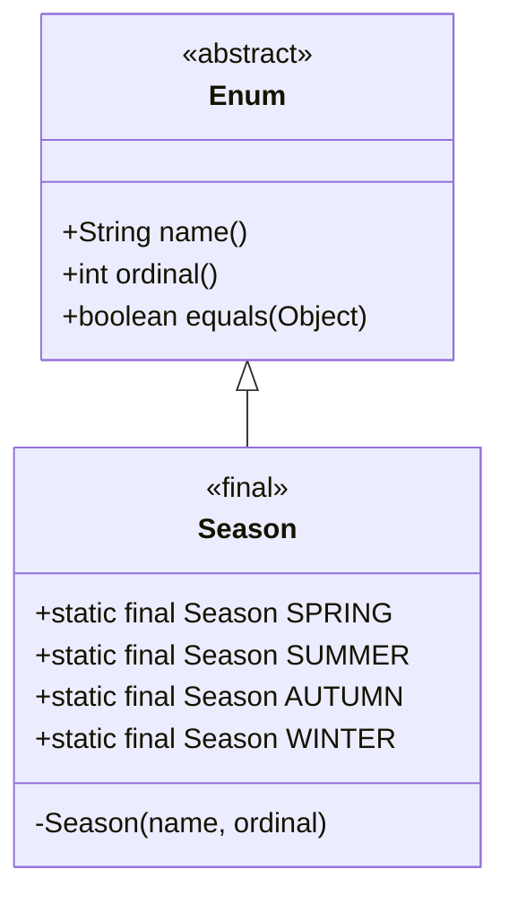

# Enum (Kiểu liệt kê) - Phần 1 (Enum - Part 1)

## Mục Tiêu Học Tập (Learning Goal)

Tài liệu này trình bày một phần trọng tâm về **Enum (Kiểu liệt kê)** trong Java. Hãy học từng khái niệm như một quy tắc Java thực tế, tránh việc ghi nhớ từ vựng một cách máy móc.

## Khung Nội Dung (Outline Coverage)

| Khái niệm (Concept) | Nội dung cần biết (What to know) |
| --- | --- |
| `What is an enum?` | Định nghĩa một tập hợp cố định các hằng số được đặt tên như một lớp an toàn kiểu kế thừa từ `java.lang.Enum`. |
| `Declare enum` | Được khai báo bằng từ khóa `enum`; có thể ở cấp cao nhất (top-level) hoặc lồng nhau (ngầm định là static). |
| `Enum constructor` | Được thực thi khi nạp lớp, bắt buộc phải là private, không thể khởi tạo bằng từ khóa `new`. |
| `Enum field` | Các biến thực thể hoặc biến tĩnh được định nghĩa bên trong enum, thường được khai báo `final` để đảm bảo tính bất biến. |
| `Enum method` | Có thể định nghĩa các phương thức tĩnh, phương thức thực thể, hoặc các phương thức trừu tượng được ghi đè bởi từng hằng số. |
| `values()` | Phương thức tĩnh trả về một bản sao mảng chứa toàn bộ các hằng số theo đúng thứ tự khai báo. |
| `valueOf()` | Phương thức tĩnh trả về hằng số enum khớp chính xác với chuỗi tên truyền vào (phân biệt chữ hoa/thường), hoặc ném ra `IllegalArgumentException`. |
| `ordinal()` | Trả về chỉ số vị trí khai báo (bắt đầu từ 0); cực kỳ nguy hiểm nếu sử dụng cho việc lưu trữ cơ sở dữ liệu hoặc logic nghiệp vụ. |
| `name()` | Phương thức final trả về chính xác chuỗi ký tự khai báo hằng số; không thể bị ghi đè. |
| `Enum in switch` | Được sử dụng làm biểu thức lựa chọn; các nhãn case bắt buộc phải sử dụng tên hằng số ngắn gọn. Ném ra NPE nếu biến tham chiếu enum là null. |
| `EnumSet` | Triển khai giao diện `Set` được tối ưu hóa cực mạnh bằng vectơ bit (bit-vector) dành riêng cho kiểu enum. |
| `EnumMap` | Triển khai giao diện `Map` tốc độ siêu nhanh dựa trên cấu trúc mảng phẳng, sử dụng các hằng số enum làm khóa (key). |

---

## Ghi Chú Chi Tiết (Detailed Notes)

### Enum là gì? (What is an enum?)

Enum (kiểu liệt kê) định nghĩa một tập hợp cố định các hằng số được đặt tên dưới dạng một cấu trúc tương tự lớp học an toàn kiểu. Bên dưới lớp vỏ, mọi enum đều là lớp con của lớp trừu tượng `java.lang.Enum`. Enum không thể được khởi tạo bằng từ khóa `new` và không thể kế thừa lớp khác, nhưng chúng cung cấp tính năng an toàn kiểu (type safety) rất mạnh mẽ tại thời điểm biên dịch.

```java
public enum Season {
    SPRING, SUMMER, AUTUMN, WINTER
}
```

- **Tính An Toàn Kiểu**: Khác với hằng số số nguyên thông thường, bạn không thể truyền một số nguyên bất kỳ hoặc một kiểu enum khác vào phương thức yêu cầu tham số kiểu `Season`.
- **Hạn Chế Kế Thừa**: Enum không thể kế thừa bất kỳ lớp nào khác vì chúng đã ngầm định kế thừa lớp cha `java.lang.Enum`.

### Tại Sao Enum Được Biên Dịch Thành Các Lớp Final Kế Thừa java.lang.Enum

Các enum trong Java được biên dịch thành các lớp `final` kế thừa từ `java.lang.Enum` để thực thi tính an toàn kiểu tại thời điểm biên dịch và các giới hạn kế thừa nghiêm ngặt. Vì Java chỉ hỗ trợ đơn kế thừa lớp, việc lớp `java.lang.Enum` đã chiếm giữ vị trí lớp cha ngăn cản enum kế thừa thêm bất kỳ lớp nào khác. Việc đánh dấu lớp là `final` đảm bảo rằng không lớp nào khác có thể kế thừa enum đó, giữ cho tập hợp các thực thể hằng số luôn được đóng kín tuyệt đối. Tính an toàn kiểu được thực thi bởi cả trình biên dịch và JVM, chúng nhận diện bổ từ lớp `ENUM` để ngăn chặn mọi hành vi tạo lớp con hoặc khởi tạo bên ngoài, đảm bảo rằng chỉ các hằng số được định nghĩa trước mới có thể tồn tại khi chạy chương trình.

#### Mô hình Tư duy: Phân cấp Enum và Ranh giới Kiểu
Sơ đồ dưới đây minh họa cấu trúc lớp sau khi biên dịch giúp ngăn chặn kế thừa trong khi vẫn thừa hưởng các tính năng cốt lõi từ `java.lang.Enum`:



#### Minh Họa Mã Nguồn: Hạn chế kế thừa

```java
// Cấu trúc biên dịch bên dưới lớp vỏ:
// public final class Season extends java.lang.Enum<Season> { ... }

// Việc cố tình tạo lớp con kế thừa từ enum sẽ gây lỗi biên dịch:
// class CustomSeason extends Season {} 
// Lỗi: Cannot inherit from final 'Season'
```

#### Chuỗi Nguyên Nhân - Kết Quả (Cause-Effect Chain):
Khai báo một enum $\rightarrow$ Trình biên dịch tạo ra một lớp final kế thừa java.lang.Enum $\rightarrow$ Vị trí lớp cha bị chiếm giữ (không thể đa kế thừa lớp) + bổ từ final được áp dụng $\rightarrow$ Không cho phép tạo lớp con + Không thể khởi tạo đối tượng từ bên ngoài $\rightarrow$ Đạt được tính an toàn kiểu nghiêm ngặt và tập hợp thực thể khép kín.

---

### Khai báo enum (Declare enum)

Enum được khai báo bằng từ khóa `enum`. Chúng có thể được khai báo dưới dạng lớp độc lập (top-level) hoặc lồng bên trong các lớp hoặc giao diện khác. Các enum lồng nhau ngầm định là tĩnh (`static`). Enum không thể được khai báo bên trong một phương thức (các enum cục bộ được cho phép kể từ Java 16, nhưng chúng vẫn luôn là tĩnh).

```java
public class Order {
    public enum Status {
        PENDING, SHIPPED, DELIVERED, CANCELLED
    }
    
    private Status currentStatus = Status.PENDING;
    
    public void setStatus(Status status) {
        this.currentStatus = status;
    }
}
```

---

### Hàm khởi tạo enum (Enum constructor)

Enum có thể định nghĩa các hàm khởi tạo để khởi tạo giá trị cho các trường thực thể.
- **Tầm nhìn (Visibility)**: Các hàm khởi tạo của enum ngầm định là riêng tư `private`. Việc cố tình chỉ định bổ từ `public` hoặc `protected` sẽ gây ra lỗi biên dịch.
- **Thực thi**: Chúng được thực thi khi lớp enum được nạp vào bộ nhớ cho từng hằng số, theo đúng thứ tự khai báo của các hằng số đó.
- **Quy tắc**: Bạn không bao giờ được phép gọi hàm khởi tạo của enum bằng từ khóa `new`.

```java
public enum Coin {
    PENNY(1), NICKEL(5), DIME(10), QUARTER(25);

    private final int valueInCents;

    // Khai báo private rõ ràng (nếu không viết, nó vẫn ngầm định là private)
    private Coin(int valueInCents) {
        this.valueInCents = valueInCents;
    }

    public int getValueInCents() {
        return valueInCents;
    }
}
```

---

### Tại Sao Hàm Khởi Tạo Của Enum Bắt Buộc Phải Là Private

Các hàm khởi tạo của enum bắt buộc phải là private để đảm bảo kiểm soát thực thể nghiêm ngặt, đảm bảo rằng chỉ các hằng số enum được định nghĩa trước bên trong thân enum mới có thể được tạo ra. Nếu hàm khởi tạo của enum là public hoặc protected, mã nguồn bên ngoài có thể khởi tạo các thực thể mới thông qua từ khóa `new`, vi phạm giao kèo cơ bản của enum là một tập hợp cố định các hằng số. Trình biên dịch Java thực thi quy tắc này tại thời điểm biên dịch bằng cách từ chối mọi bổ từ truy cập không phải private trên hàm khởi tạo. Hơn thế nữa, Máy ảo Java (JVM) ngăn chặn việc khởi tạo thông qua Cơ chế Phản Chiếu (Reflection), ném ra lỗi nếu một lời gọi phản chiếu cố gắng khởi tạo hàm dựng của một lớp enum.

#### Mô hình Tư duy: Cô lập Hàm Khởi tạo
Chỉ có bộ nạp lớp (class loader) khi khởi tạo các hằng số tĩnh mới có quyền kích hoạt hàm khởi tạo private:

```text
[ Mã Nguồn Bên Ngoài ] ──── ( cố gắng gọi "new Coin(5)" ) ────> [ Cổng Kiểm Soát Trình Biên Dịch / JVM ] (BỊ CHẶN)
                                                                                  │
                                                                   [ Lớp Enum Đã Nạp (Coin) ]
                                                                    ├── PENNY   (Thực thể 0, 1c)
                                                                    ├── NICKEL  (Thực thể 1, 5c)
                                                                    ├── DIME    (Thực thể 2, 10c)
                                                                    └── QUARTER (Thực thể 3, 25c)
                                                                   (Không cho phép thực thể nào khác!)
```

#### Minh Họa Mã Nguồn: Kiểm tra vi phạm hàm khởi tạo

```java
public enum Status {
    ACTIVE, INACTIVE;
    
    // Khai báo hàm dựng public hoặc protected sẽ gây lỗi biên dịch:
    // public Status() {} // Lỗi: Modifier 'public' not allowed here
}

// Cố gắng khởi tạo bằng từ khóa new:
// Status s = new Status(); // Lỗi: Status() has private access in Status
```

#### Chuỗi Nguyên Nhân - Kết Quả (Cause-Effect Chain):
Hàm khởi tạo enum là private $\rightarrow$ Không thể gọi hàm dựng từ bên ngoài $\rightarrow$ Việc khởi tạo bằng new thất bại ở lúc biên dịch $\rightarrow$ Việc khởi tạo bằng reflection thất bại ở lúc chạy $\rightarrow$ Toàn vẹn thực thể được bảo vệ tuyệt đối.

---

### Trường thuộc tính enum (Enum field)

Enum có thể định nghĩa các trường thực thể (instance fields) và các trường tĩnh (static fields).
- Các trường thực thể nên được đánh dấu là `final` để duy trì tính bất biến (immutability) của các hằng số enum.
- Các hằng số bắt buộc phải được khai báo đầu tiên trong thân lớp enum, và kết thúc bằng dấu chấm phẩy `;` nếu phía sau có khai báo các trường thuộc tính, hàm khởi tạo hoặc phương thức.

```java
public enum Plan {
    BASIC(9.99), PREMIUM(19.99);

    // Trường thực thể
    private final double monthlyRate;
    
    // Trường tĩnh
    public static final String CURRENCY = "USD";

    private Plan(double rate) {
        this.monthlyRate = rate;
    }
}
```

---

### Phương thức enum (Enum method)

Enum có thể định nghĩa các phương thức tĩnh, phương thức thực thể và phương thức trừu tượng. Nếu một enum định nghĩa phương thức trừu tượng, mỗi hằng số cụ thể bắt buộc phải ghi đè phương thức đó bằng một thân lớp riêng của hằng số đó.

```java
public enum UserRole {
    ADMIN {
        @Override
        public boolean canAccessAdminPanel() { return true; }
    },
    USER {
        @Override
        public boolean canAccessAdminPanel() { return false; }
    };

    // Phương thức trừu tượng được ghi đè bởi từng hằng số
    public abstract boolean canAccessAdminPanel();
}
```

---

### values()

Trình biên dịch tự động tạo ra một phương thức tĩnh `values()` cho mọi kiểu enum.
- **Hành vi**: Nó trả về một mảng chứa toàn bộ các hằng số của kiểu enum theo đúng thứ tự mà chúng được khai báo.
- **Cạm bẫy**: Để ngăn chặn mã nguồn bên ngoài sửa đổi các phần tử mảng nội bộ, `values()` sẽ tạo và trả về một bản sao mảng (cloned array) mới trên heap ở mỗi lần gọi. Gọi liên tục phương thức này trong các vòng lặp tần suất cao sẽ tạo ra lượng lớn đối tượng rác tạm thời làm tăng chi phí dọn rác của Garbage Collector.

```java
for (Season s : Season.values()) {
    System.out.println(s);
}
```

---

### Tại Sao values() Có Thể Trở Thành Điểm Nghẽn Hiệu Năng

Phương thức `values()` do trình biên dịch tự động sinh ra trả về một mảng chứa tất cả hằng số enum bằng cách nhân bản một mảng tĩnh nội bộ ẩn tên là `$VALUES`. Việc nhân bản này là bắt buộc để ngăn chặn mã nguồn của khách hàng sửa đổi các phần tử mảng gốc, điều này có thể làm hỏng tính toàn vẹn của các hằng số enum. Tuy nhiên, vì một đối tượng mảng mới được cấp phát trên heap mỗi khi `values()` được gọi, việc gọi nó bên trong các vòng lặp thực thi tần suất cao có thể tạo ra một lượng khổng lồ các đối tượng rác ngắn hạn, dẫn đến việc JVM phải tạm dừng thường xuyên để Thu Gom Rác (Garbage Collection). Để tránh điểm nghẽn hiệu năng này, lập trình viên nên lưu trữ tạm thời (cache) kết quả của `values()` vào một mảng tĩnh final hoặc một danh sách nếu nó được truy vấn liên tục trên các đường dẫn thực thi quan trọng.

#### Mô hình Tư duy: Quy trình Nhân bản Mảng

```text
Bên dưới lớp vỏ:
[ Mảng Nội Bộ Riêng Tư: $VALUES ] = [SPRING, SUMMER, AUTUMN, WINTER]

Bên gọi gọi Season.values():
1. Cấp phát vùng nhớ mảng mới trên heap: [ _ , _ , _ , _ ]
2. Sao chép các tham chiếu từ $VALUES sang mảng mới
3. Trả về tham chiếu mảng mới cho bên gọi
(Gọi liên tục trong vòng lặp tần suất cao = Tăng chi phí GC!)
```

#### Minh Họa Mã Nguồn: Lưu trữ đệm tham chiếu mảng (Caching)

```java
public enum GameState {
    START, PLAYING, END;
    
    // Tối ưu hóa: Lưu trữ đệm các giá trị để tránh chi phí nhân bản mảng
    private static final GameState[] CACHED_VALUES = GameState.values();
    
    public static GameState[] cachedValues() {
        return CACHED_VALUES;
    }
}
```

#### Chuỗi Nguyên Nhân - Kết Quả (Cause-Effect Chain):
Bên gọi gọi values() $\rightarrow$ JVM nhân bản mảng nội bộ $VALUES để bảo vệ các phần tử $\rightarrow$ Một mảng mới được cấp phát trên Heap $\rightarrow$ Lời gọi lặp lại trong vòng lặp nóng tạo ra nhiều mảng $\rightarrow$ Áp lực thu gom rác Garbage Collection gia tăng.

---

### valueOf()

Trình biên dịch tự động tạo ra một phương thức tĩnh `valueOf(String)` cho mọi kiểu enum.
- **Hành vi**: Nó trả về hằng số enum có tên khớp chính xác với chuỗi tham số truyền vào.
- **Cạm bẫy**:
  - Quá trình tra cứu phân biệt chữ hoa và chữ thường. Truyền vào `"spring"` thay vì `"SPRING"` sẽ ném ra ngoại lệ `IllegalArgumentException`.
  - Truyền vào giá trị `null` sẽ ném ra `NullPointerException`.

```java
Season s = Season.valueOf("SPRING"); // Trả về Season.SPRING
try {
    Season invalid = Season.valueOf("WINTER_BREAK");
} catch (IllegalArgumentException e) {
    System.out.println("No matching constant found.");
}
```

---

### ordinal()

Trả về giá trị ordinal (chỉ số vị trí sắp xếp) của hằng số enum, bắt đầu từ 0 dựa trên thứ tự khai báo của chúng trong mã nguồn.
- **Cạm bẫy**: Tuyệt đối **không** được dùng `ordinal()` để lưu trữ các giá trị enum vào cơ sở dữ liệu hoặc sử dụng nó trong các logic nghiệp vụ quan trọng. Việc thay đổi thứ tự khai báo hoặc chèn thêm hằng số mới vào giữa enum sẽ làm thay đổi toàn bộ giá trị ordinal của các hằng số phía sau, gây sai lệch dữ liệu và lỗi logic nghiêm trọng.

```java
int index = Season.SUMMER.ordinal(); // Trả về 1
```

---

### name()

Trả về chính xác tên của hằng số enum dưới dạng chuỗi `String`, đúng như những gì được khai báo.
- **So sánh với `toString()`**:
  - `name()` là phương thức `final` và không thể bị ghi đè ở các lớp con.
  - `toString()` có thể được ghi đè tự do để trả về một chuỗi biểu diễn thân thiện hơn với người dùng.

```java
public enum Color {
    RED {
        @Override
        public String toString() { return "Bright Red"; }
    };
}
// Color.RED.name() -> trả về "RED"
// Color.RED.toString() -> trả về "Bright Red"
```

---

### Tại Sao So Sánh Enum Bằng Toán Tử == Lại An Toàn và Được Khuyến Khích

Các enum an toàn và được khuyến khích so sánh bằng toán tử so sánh đồng nhất (`==`) thay vì phương thức `.equals()` bởi vì mỗi hằng số enum là một thực thể độc bản (singleton) thực sự. Vì chỉ tồn tại duy nhất một thực thể của mỗi hằng số enum trong bộ nhớ, việc so sánh tham chiếu (`==`) cũng tương đương với so sánh ngữ nghĩa. Sử dụng `==` mang lại sự an toàn lúc biên dịch vì trình biên dịch sẽ báo lỗi nếu bạn cố tình so sánh hai kiểu dữ liệu không tương thích, trong khi phương thức `.equals()` chấp nhận mọi kiểu đối tượng truyền vào và chỉ trả về `false` lúc chạy chương trình. Thêm vào đó, `==` hoàn toàn an toàn trước ngoại lệ `NullPointerException` vì việc so sánh một tham chiếu null với một hằng số enum bằng `==` sẽ trả về `false` một cách an toàn mà không ném ra ngoại lệ.

#### Mô hình Tư duy: Đồng nhất Tham chiếu vs. Bằng nhau Logic

```text
Ngăn xếp (Stack)                  Vùng nhớ Heap
[ season1 (tham chiếu: 0x111) ] ──┐
                                  ├─> [ Season.SUMMER (Đối tượng tại địa chỉ 0x111) ]
[ season2 (tham chiếu: 0x111) ] ──┘

season1 == season2  => True (cả hai cùng trỏ tới cùng một địa chỉ bộ nhớ 0x111)
```

#### Minh Họa Mã Nguồn: An toàn Null và Tính tương thích kiểu

```java
Season s1 = Season.SUMMER;
Season s2 = null;

// 1. So sánh an toàn null (không ném ra NullPointerException)
System.out.println(s2 == s1); // In ra: false

// 2. Kiểm tra kiểu lúc biên dịch:
// System.out.println(s1 == Color.RED); // Lỗi: Incompatible operand types Season and Color

// 3. Sử dụng equals() có thể ném ra NPE nếu đối tượng gọi là null:
// s2.equals(s1); // Ném ra NullPointerException!
```

#### Chuỗi Nguyên Nhân - Kết Quả (Cause-Effect Chain):
Kiểm soát thực thể nghiêm ngặt $\rightarrow$ Chỉ tồn tại duy nhất một thực thể cho mỗi hằng số trong bộ nhớ $\rightarrow$ Đồng nhất tham chiếu (==) tương đương bằng nhau logic $\rightarrow$ Trình biên dịch kiểm tra kiểu biên dịch + Đạt được an toàn null $\rightarrow$ So sánh nhanh hơn và an toàn hơn.

---

### Enum trong câu lệnh switch

Enum được hỗ trợ đầy đủ trong các câu lệnh điều khiển `switch` (cả switch statement và switch expression).
- **Cú pháp**: Các nhãn case bắt buộc phải sử dụng tên ngắn gọn của hằng số enum (ví dụ: `case SPRING:`), không được phép viết tên đầy đủ kèm tên lớp (`case Season.SPRING:` là lỗi biên dịch).
- **Trường hợp thất bại**: Nếu biểu thức kiểm tra trả về giá trị `null`, máy ảo sẽ ném ra ngoại lệ `NullPointerException` ngay lúc chạy trước khi đánh giá bất kỳ nhánh case nào.

```java
Season season = Season.SUMMER;
switch (season) {
    case SPRING: System.out.println("Springtime!"); break;
    case SUMMER: System.out.println("Summertime!"); break;
    default: System.out.println("Other season"); break;
}
```

---

### EnumSet

Lớp `java.util.EnumSet` là một triển khai cấu trúc `Set` chuyên biệt được thiết kế tối ưu riêng cho kiểu enum.
- **Triển khai**: Bên dưới lớp vỏ, nó được biểu diễn dưới dạng một vectơ bit (thường chỉ là một biến kiểu số nguyên `long` duy nhất nếu enum có từ 64 hằng số trở xuống).
- **Hiệu năng**: Hiệu năng xử lý cực cao và tiêu tốn cực ít bộ nhớ. Mọi thao tác cơ bản (như `add`, `contains`) đều chạy trong thời gian hằng số $O(1)$ nhờ các phép toán thao tác trên bit cực nhanh.

```java
import java.util.EnumSet;

EnumSet<Season> warmSeasons = EnumSet.of(Season.SPRING, Season.SUMMER);
EnumSet<Season> allSeasons = EnumSet.allOf(Season.class);
```

---

### EnumMap

Lớp `java.util.EnumMap` là một triển khai cấu trúc `Map` chuyên biệt, trong đó các khóa bắt buộc phải là các hằng số của cùng một kiểu enum.

> Xem thêm: Chi tiết về các cấu trúc dữ liệu Map trong Java, được trình bày chi tiết trong [Ch.19 - Collections Framework](../../19-collections-framework/README.md).
- **Triển khai**: Bên dưới lớp vỏ, nó được biểu diễn dưới dạng một mảng phẳng các giá trị, được lập chỉ mục trực tiếp bằng giá trị ordinal của các hằng số enum.
- **Hiệu năng**: Tốc độ xử lý nhanh hơn nhiều và tiết kiệm bộ nhớ hơn nhiều so với cấu trúc `HashMap` khi sử dụng khóa là kiểu enum.
- **Quy tắc**: Không cho phép sử dụng khóa là `null` (sẽ ném ra `NullPointerException`). Giá trị value thì được phép nhận `null`.

```java
import java.util.EnumMap;

EnumMap<Season, String> weather = new EnumMap<>(Season.class);
weather.put(Season.SUMMER, "Hot");
weather.put(Season.WINTER, "Cold");
```

---

## Ví Dụ Thực Tế: Bản chất hoạt động bên dưới của Enum trong Java

### Tại sao Enum lại an toàn kiểu
Trước khi phiên bản Java 5 ra đời, các lập trình viên thường sử dụng "Mẫu liệt kê số nguyên" (Int Enum Pattern) hoặc "Mẫu liệt kê chuỗi" (String Enum Pattern) để định nghĩa các tập hợp hằng số:
```java
public static final int SEASON_SPRING = 0;
public static final int SEASON_SUMMER = 1;
```
Cách tiếp cận này bộc lộ nhiều điểm yếu nghiêm trọng:
1. **Không có an toàn kiểu**: Bất kỳ số nguyên nào (như `99`) cũng có thể được truyền vào phương thức yêu cầu một mùa.
2. **Dễ gãy**: Thay đổi giá trị số nguyên sẽ làm hỏng mã nguồn của các ứng dụng tiêu thụ đã biên dịch trước đó.
3. **Không có không gian tên**: Phải thêm các tiền tố (như `SEASON_`) để tránh xung đột tên hằng số.

Enum trong Java giải quyết triệt để vấn đề này bằng cách định nghĩa một lớp được trình biên dịch bắt buộc kế thừa từ `java.lang.Enum`. Bạn không thể truyền một số nguyên bất kỳ hoặc một kiểu enum khác vào nơi yêu cầu một kiểu enum cụ thể.

### Cách Enum được triển khai (Dịch ngược mã nguồn)
Bên dưới lớp vỏ, khi bạn khai báo:
```java
public enum Size {
    SMALL, MEDIUM, LARGE
}
```
Trình biên dịch Java tự động dịch mã này thành một lớp kế thừa từ `java.lang.Enum<Size>`:
```java
public final class Size extends java.lang.Enum<Size> {
    public static final Size SMALL = new Size("SMALL", 0);
    public static final Size MEDIUM = new Size("MEDIUM", 1);
    public static final Size LARGE = new Size("LARGE", 2);

    private static final Size[] $VALUES = new Size[]{SMALL, MEDIUM, LARGE};

    public static Size[] values() {
        return (Size[])$VALUES.clone(); // Trả về bản sao để tránh chỉnh sửa mảng gốc
    }

    public static Size valueOf(String name) {
        return (Size)Enum.valueOf(Size.class, name);
    }

    private Size(String name, int ordinal) {
        super(name, ordinal);
    }
}
```

#### Các chuyển đổi chính của trình biên dịch:
1. **`final class`**: Lớp enum được đánh dấu là `final` (trừ khi chúng chứa các hằng số có định nghĩa thân lớp riêng, lúc này lớp enum gốc sẽ là `abstract` và từng hằng số sẽ được biên dịch thành một lớp vô danh kế thừa từ lớp enum gốc). Bạn không bao giờ được phép kế thừa một lớp enum.
2. **Kế thừa `java.lang.Enum`**: Vì Java không hỗ trợ đa kế thừa lớp, các lớp enum không thể kế thừa thêm lớp nào khác.
3. **Hàm khởi tạo private**: Trình biên dịch chèn một hàm dựng private nhận tham số `String name` và `int ordinal` để gọi hàm dựng `super(name, ordinal)` của lớp cha.
4. **Nhân bản `$VALUES`**: Phương thức sinh ra `values()` trả về bản sao nhân bản của mảng nội bộ ẩn `$VALUES`. Đây là lý do tại sao việc gọi liên tục `values()` trong các vòng lặp nóng nhạy cảm về mặt hiệu năng sẽ tạo ra áp lực dọn rác cho Garbage Collector.
5. **Giới hạn khởi tạo**: Bạn không bao giờ có thể khởi tạo một lớp enum bằng từ khóa `new` vì hàm khởi tạo là private và trình biên dịch từ chối mọi câu lệnh khởi tạo trực tiếp kiểu enum.

---

## Các Sai Lầm Thường Gặp (Common Mistakes)

### 1. Sử dụng `ordinal()` cho việc lưu trữ dữ liệu lâu dài (persistence)
**Sai lầm**: Lưu trữ trực tiếp giá trị `ordinal()` vào cơ sở dữ liệu.
```java
// Nếu bạn chèn thêm một trạng thái mới vào đầu danh sách khai báo:
public enum Status {
    ARCHIVED, // Bây giờ là ordinal 0
    PENDING,  // Ordinal trở thành 1 (trước đây là 0)
    ACTIVE    // Ordinal trở thành 2 (trước đây là 1)
}
```
*Hậu quả*: Các chỉ số ID đã lưu trong cơ sở dữ liệu sẽ không còn khớp đúng với các trạng thái enum trong mã nguồn nữa. Hãy luôn lưu trữ enum dưới dạng chuỗi văn bản (sử dụng phương thức `name()`) hoặc ánh xạ chúng sang các mã số ID nghiệp vụ cố định và ổn định.

### 2. Truyền tham chiếu Enum là `null` vào câu lệnh switch
**Sai lầm**:
```java
Season season = null;
switch (season) { // Ném ra NullPointerException!
    case SPRING: ...
}
```
*Hậu quả*: Java ném ra ngoại lệ `NullPointerException` khi cố gắng giải phóng tham chiếu của biểu thức switch. Hãy luôn đảm bảo rằng tham chiếu enum truyền vào không phải là null trước khi thực hiện lệnh switch.

### 3. Khai báo hàm khởi tạo là public trong Enum
**Sai lầm**:
```java
public enum Role {
    USER;
    public Role() {} // Lỗi biên dịch!
}
```
*Hậu quả*: Các thực thể enum chỉ được phép khởi tạo bởi trình biên dịch khi nạp lớp vào bộ nhớ. Tầm nhìn của hàm dựng bắt buộc phải là private.

### 4. Chi phí gọi `values()` bên trong các vòng lặp tần suất cao
**Sai lầm**:
```java
// Thói quen xấu: mảng bị nhân bản ở mỗi vòng lặp
for (int i = 0; i < 1000000; i++) {
    for (Season s : Season.values()) { 
        // ...
    }
}
```
*Hậu quả*: Tạo ra hàng triệu mảng tạm thời không cần thiết trên heap, làm tăng áp lực dọn rác cho Garbage Collector. Hãy lưu trữ mảng `Season.values()` vào một mảng tĩnh final để tái sử dụng nếu cần gọi trong các đường dẫn xử lý nóng có lượng tải cao.

---

## Liên Kết Tham Khảo (Reference Links)

- [Hướng dẫn chính thức từ Oracle - Các kiểu Enum (Enum Types)](https://docs.oracle.com/javase/tutorial/java/javaOO/enum.html)
- [Đặc tả API Java Platform - Lớp Enum](https://docs.oracle.com/en/java/javase/17/docs/api/java.base/java/lang/Enum.html)
