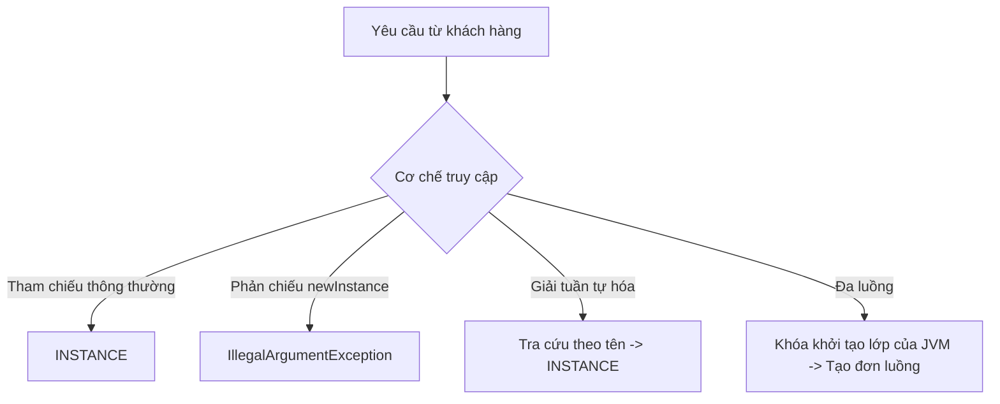

# Enum - Phần 2 (Enum - Part 2)

## Mục tiêu học tập (Learning Goal)

Tài liệu này bao gồm một phần nội dung trọng tâm về **Enum**. Hãy nghiên cứu từng khái niệm dưới dạng quy tắc thực tế trong Java, chứ không chỉ là từ vựng rời rạc.

## Các khái niệm bao phủ (Outline Coverage)

| Khái niệm | Những điều cần biết |
| --- | --- |
| `Enum implements interface` | Các enum không thể kế thừa lớp, nhưng chúng có thể triển khai các giao diện (interface) để hỗ trợ tính đa hình (Polymorphism). |
| `Enum Singleton pattern` | Việc triển khai Singleton dưới dạng một enum có duy nhất một phần tử cung cấp khả năng bảo mật tích hợp sẵn chống lại các cuộc tấn công qua phản chiếu (reflection) và tuần tự hóa (serialization). |

---

## Ghi chú chi tiết (Detailed Notes)

### Enum triển khai giao diện (Enum implements interface)

Mặc dù các enum không thể kế thừa từ một lớp khác (vì chúng kế thừa ngầm định từ `java.lang.Enum`), chúng hoàn toàn được phép triển khai một hoặc nhiều giao diện.
- **Triển khai đặc thù của hằng số (Constant-Specific Implementations)**: Các hằng số enum riêng lẻ có thể ghi đè phương thức giao diện bên trong thân lớp của riêng chúng.
- **Trường hợp sử dụng**: Cho phép áp dụng tính đa hình trên các hằng số enum.

```java
public interface Command {
    void execute();
}

public enum SystemAction implements Command {
    START {
        @Override
        public void execute() {
            System.out.println("Starting system...");
        }
    },
    STOP {
        @Override
        public void execute() {
            System.out.println("Stopping system...");
        }
    };
}
```

### Bên dưới mui xe: Thân lớp đặc thù của hằng số và Lớp con vô danh (Under the Hood: Constant-Specific Class Bodies and Anonymous Subclasses)

Khi một hằng số enum định nghĩa một thân lớp đặc thù của hằng số, trình biên dịch sẽ tạo ra một lớp con vô danh (anonymous subclass) riêng biệt cho hằng số cụ thể đó. Lớp enum cơ sở được biên dịch dưới dạng một lớp trừu tượng (mặc dù bạn không thể khai báo nó như vậy một cách thủ công), và các lớp con vô danh sẽ triển khai các phương thức trừu tượng hoặc phương thức giao diện. Điều này cho phép các enum triển khai hành vi đa hình trực tiếp trên các hằng số riêng lẻ mà không cần sử dụng các câu lệnh `if-else` hoặc `switch`. Khi tải lớp, JVM sẽ khởi tạo các lớp con vô danh này, liên kết tên hằng số với một thực thể cụ thể của lớp con, giúp duy trì tính an toàn kiểu dữ liệu chuẩn của enum trong khi cung cấp các hành vi tùy chỉnh.

#### Mô hình tư duy: Hệ phân cấp lớp con của các hằng số Enum (Mental Model: Subclass Hierarchy of Enum Constants)
JVM coi mỗi hằng số đi kèm thân lớp là một kiểu lớp vô danh riêng biệt kế thừa lớp enum cơ sở:

```mermaid
classDiagram
    class SystemAction {
        <<abstract>>
        +execute() void
    }
    class SystemAction$1 {
        +execute() void (thực thi logic START)
    }
    class SystemAction$2 {
        +execute() void (thực thi logic STOP)
    }
    SystemAction <|-- SystemAction$1
    SystemAction <|-- SystemAction$2
```

#### Minh họa bằng Code: Kiểm tra các lớp thời điểm chạy (Code Demonstration: Inspecting Runtime Classes)

```java
SystemAction action = SystemAction.START;
// Lớp runtime của START là một lớp con vô danh, chứ không phải bản thân SystemAction
System.out.println(action.getClass().getName()); // Output: SystemAction$1

SystemAction action2 = SystemAction.STOP;
System.out.println(action2.getClass().getName()); // Output: SystemAction$2
```

#### Chuỗi Nguyên nhân - Kết quả: Hành vi đặc thù của hằng số (Cause-Effect Chain: constant-Specific Behavior)
$$\text{Hằng số khai báo thân lớp \{ ... \}} \rightarrow \text{Trình biên dịch biên dịch lớp enum thành abstract và hằng số thành lớp con vô danh} \rightarrow \text{Lớp con ghi đè phương thức cơ sở/giao diện} \rightarrow \text{Tham chiếu hằng số trỏ tới thực thể lớp con lúc chạy} \rightarrow \text{Thực thi đa hình kích hoạt hành vi đặc thù của hằng số}$$

### Mẫu Enum Singleton (Enum Singleton pattern)

Joshua Bloch đã viết nổi tiếng trong cuốn sách *Effective Java* rằng một enum có một phần tử duy nhất là cách tốt nhất để triển khai một Singleton.
- **An toàn luồng tích hợp (Built-in Thread-Safety)**: JVM đảm bảo rằng các thực thể enum được tạo ra một cách an toàn luồng khi lớp được tải.
- **Bảo vệ chống phản chiếu (Reflection Protection)**: API phản chiếu của Java ngăn cấm một cách rõ ràng việc khởi tạo các enum (ném ra `IllegalArgumentException` trong `Constructor.newInstance()`), chặn đứng các cuộc tấn công qua phản chiếu.
- **An toàn tuần tự hóa (Serialization Safety)**: Cơ chế tuần tự hóa của Java đảm bảo rằng không có thực thể trùng lặp nào được tạo ra khi giải tuần tự hóa (deserialization).

```java
public enum CacheManager {
    INSTANCE;

    private final Map<String, Object> cache = new ConcurrentHashMap<>();

    public void put(String key, Object value) {
        cache.put(key, value);
    }

    public Object get(String key) {
        return cache.get(key);
    }
}
```

### Cách hoạt động của Enum Singleton: An toàn Luồng, Phản chiếu và Tuần tự hóa (How Enum Singleton Works: Thread, Reflection, and Serialization Safety)

Enum một phần tử được công nhận rộng rãi là cách mạnh mẽ nhất để triển khai một Singleton trong Java nhờ ba đảm bảo an toàn về mặt kiến trúc cốt lõi. Đầu tiên, an toàn luồng được đảm bảo bởi cơ chế tải lớp của JVM: các khối khởi tạo tĩnh (static initializers) được thực thi khi lớp được khởi tạo, điều này ngầm định là an toàn luồng và được bảo vệ bởi các khóa nội bộ của JVM. Thứ hai, an toàn phản chiếu được thực thi bởi môi trường chạy Java; `Constructor.newInstance()` kiểm tra rõ ràng bổ nghĩa `ENUM` và ném ra một `IllegalArgumentException` nếu phản chiếu cố gắng khởi tạo một enum, giúp ngăn chặn các cuộc tấn công phản chiếu. Thứ ba, an toàn tuần tự hóa được tích hợp sẵn vào giao thức tuần tự hóa của Java: các enum được tuần tự hóa duy nhất bằng tên của chúng, và trong quá trình giải tuần tự hóa, JVM sử dụng tên đó để tra cứu thực thể singleton hiện có thay vì khởi tạo một đối tượng mới, ngăn ngừa việc xuất hiện các thực thể trùng lặp trong bộ nhớ.

#### Mô hình tư duy: Ranh giới bảo vệ của Enum Singleton (Mental Model: Protection Boundaries of Enum Singleton)



#### Minh họa bằng Code: Phòng thủ trước các cuộc tấn công (Code Demonstration: Defending Against Attacks)

```java
// 1. Phòng thủ chống lại các cuộc tấn công phản chiếu (Reflection Attacks):
try {
    Constructor<CacheManager> constructor = CacheManager.class.getDeclaredConstructor(String.class, int.class);
    constructor.setAccessible(true);
    CacheManager badInstance = constructor.newInstance("MOCK", 0);
} catch (Exception e) {
    // Under the hood, Constructor.newInstance() contains:
    // if ((clazz.getModifiers() & Modifier.ENUM) != 0)
    //     throw new IllegalArgumentException("Cannot reflectively create enum objects");
    System.out.println(e.getCause()); // Prints IllegalArgumentException
}

// 2. Phòng thủ chống lại các cuộc tấn công tuần tự hóa (Serialization Attacks):
// Cơ chế tuần tự hóa Java chỉ ghi tên ("INSTANCE") vào dòng byte.
// Trong quá trình giải tuần tự hóa, nó chạy: Enum.valueOf(CacheManager.class, "INSTANCE")
// Lệnh này trả về chính xác cùng một đối tượng. Không đối tượng mới nào được cấp phát.
```

#### Chuỗi Nguyên nhân - Kết quả: Hợp đồng Singleton không thể phá vỡ (Cause-Effect Chain: Unbreakable Singleton Contract)
$$\text{Khai báo một enum có một phần tử} \rightarrow \text{Trình tải lớp JVM khởi tạo INSTANCE dưới các khóa nội bộ} \rightarrow \text{Đảm bảo an toàn luồng + API phản chiếu chặn khởi tạo + Giải tuần tự hóa phân giải về thực thể có tên hiện tại} \rightarrow \text{Hợp đồng Singleton được giữ vững không thể phá vỡ}$$

---

## Các lỗi thường gặp (Common Mistakes)

### 1. Khai báo thủ công một lớp enum là abstract hoặc final (Declaring an enum class as abstract or final manually)
**Lỗi**: Thêm các trình sửa đổi `abstract` hoặc `final` vào khai báo enum.
```java
public final enum Color { RED, GREEN } // Compile error!
```
*Hệ quả*: Trình biên dịch tự động thêm các trình sửa đổi chính xác tùy thuộc vào việc các hằng số enum có thân lớp hay không. Việc khai báo thủ công các từ khóa này là bị cấm.

### 2. Cố gắng bỏ qua mẫu Singleton thông qua phản chiếu (Attempting to bypass the Singleton pattern via reflection)
**Lỗi**: Cố gắng sử dụng phản chiếu để tạo ra một thực thể mới của một Enum Singleton.
```java
Constructor<CacheManager> constructor = CacheManager.class.getDeclaredConstructor(String.class, int.class);
constructor.setAccessible(true);
CacheManager newInstance = constructor.newInstance("MOCK", 1); // Throws IllegalArgumentException!
```
*Hệ quả*: Java runtime từ chối rõ ràng việc khởi tạo enum thông qua phản chiếu để giữ gìn tính toàn vẹn của hợp đồng Singleton.

## Reference Links

- [Official Oracle Java Tutorials - Enum Types](https://docs.oracle.com/javase/tutorial/java/javaOO/enum.html)
- [Java Platform, Standard Edition API Specification - Enum Class](https://docs.oracle.com/en/java/javase/17/docs/api/java.base/java/lang/Enum.html)
