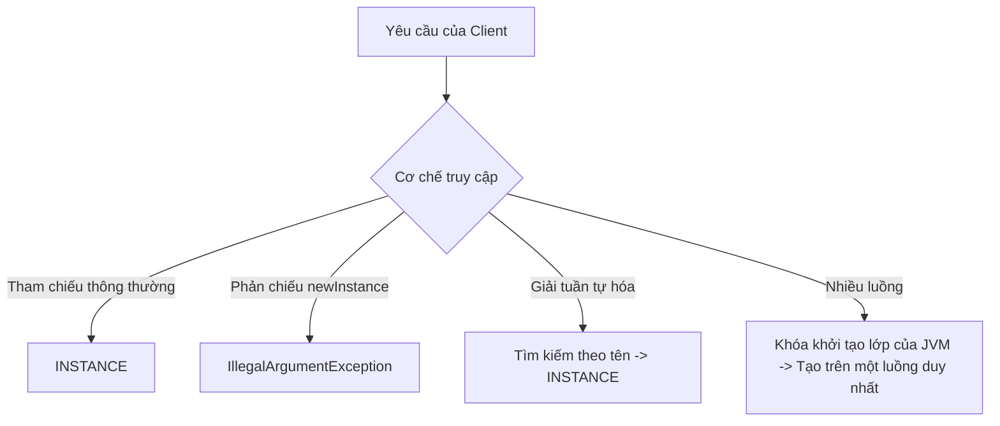

# Enum - Phần 2

## Mục Tiêu Học Tập

Tài liệu này trình bày một phần trọng tâm của **Enum**. Hãy nghiên cứu từng khái niệm dưới dạng một quy tắc Java thực tế, thay vì chỉ học từ vựng riêng lẻ.

## Nội Dung Tổng Quan

- **`Enum implements interface`** — Enum không thể kế thừa lớp khác, nhưng chúng có thể triển khai các giao diện (interface) để hỗ trợ tính đa hình.
- **`Enum Singleton pattern`** — Triển khai một Singleton dưới dạng một enum có duy nhất một phần tử cung cấp khả năng bảo mật tích hợp sẵn chống lại các cuộc tấn công thông qua phản chiếu (reflection) và tuần tự hóa (serialization).

## Ghi Chú Chi Tiết

### Enum triển khai giao diện (Enum implements interface)

Mặc dù enum không thể kế thừa từ một lớp khác (vì chúng kế thừa ngầm định từ `java.lang.Enum`), chúng hoàn toàn được phép triển khai một hoặc nhiều giao diện.
- **Các triển khai đặc thù của hằng số (Constant-Specific Implementations)**: Các hằng số enum riêng lẻ có thể ghi đè (override) các phương thức giao diện bên trong thân lớp của riêng chúng.
- **Trường hợp sử dụng**: Cho phép áp dụng tính đa hình trên các hằng số enum.

```java
public interface Command {
    void execute();
}

public enum SystemAction implements Command {
    START {
        @Override
        public void execute() {
            System.out.println("Starting system...");
        }
    },
    STOP {
        @Override
        public void execute() {
            System.out.println("Stopping system...");
        }
    };
}
```

### Dưới Nền Tảng: Thân Lớp Đặc Thù Của Hằng Số Và Các Lớp Con Vô Danh (Anonymous Subclasses)

Khi một hằng số enum định nghĩa một thân lớp đặc thù của riêng nó, trình biên dịch sẽ tạo ra một lớp con vô danh (anonymous subclass) riêng biệt cho hằng số cụ thể đó. Lớp enum cơ sở được biên dịch thành một lớp trừu tượng (abstract class) (mặc dù bạn không thể khai báo thủ công như vậy), và các lớp con vô danh sẽ triển khai các phương thức trừu tượng hoặc phương thức giao diện. Điều này cho phép các enum thực hiện hành vi đa hình trực tiếp trên từng hằng số riêng lẻ mà không cần sử dụng các câu lệnh `if-else` hoặc `switch`. Khi tải lớp (class loading), JVM sẽ khởi tạo các lớp con vô danh này, liên kết tên hằng số với một thể hiện cụ thể của lớp con đó, giúp duy trì tính an toàn kiểu dữ liệu (type safety) tiêu chuẩn của enum trong khi vẫn cung cấp các hành vi tùy chỉnh.

#### Mô Hình Tư Duy: Hệ Thống Phân Cấp Lớp Con Của Các Hằng Số Enum
JVM xem mỗi hằng số có thân lớp như một kiểu lớp vô danh riêng biệt kế thừa lớp enum cơ sở:

```mermaid
classDiagram
    class SystemAction {
        <<abstract>>
        +execute() void
    }
    class SystemAction$1 {
        +execute() void (thực thi logic START)
    }
    class SystemAction$2 {
        +execute() void (thực thi logic STOP)
    }
    SystemAction <|-- SystemAction$1
    SystemAction <|-- SystemAction$2
```

#### Minh Họa Mã Nguồn: Kiểm Tra Các Lớp Tại Thời Điểm Chạy

```java
SystemAction action = SystemAction.START;
// The runtime class of START is an anonymous subclass, not SystemAction itself
System.out.println(action.getClass().getName()); // Output: SystemAction$1

SystemAction action2 = SystemAction.STOP;
System.out.println(action2.getClass().getName()); // Output: SystemAction$2
```

#### Chuỗi Nguyên Nhân - Kết Quả: Hành Vi Đặc Thù Của Hằng Số
$$\text{Hằng số khai báo thân lớp \{ ... \}} \rightarrow \text{Trình biên dịch biên dịch lớp enum thành abstract và hằng số thành lớp con vô danh} \rightarrow \text{Lớp con ghi đè phương thức cơ sở/giao diện} \rightarrow \text{Tham chiếu hằng số trỏ đến thể hiện lớp con tại thời điểm chạy} \rightarrow \text{Thực thi đa hình kích hoạt hành vi đặc thù của hằng số}$$

### Mẫu thiết kế Enum Singleton (Enum Singleton pattern)

Joshua Bloch đã viết nổi tiếng trong cuốn sách *Effective Java* rằng một enum có duy nhất một phần tử là cách tốt nhất để triển khai mẫu Singleton.
- **An toàn luồng tích hợp (Built-in Thread-Safety)**: JVM đảm bảo rằng các thể hiện enum được tạo ra một cách an toàn luồng khi lớp được tải.
- **Bảo vệ chống phản chiếu (Reflection Protection)**: API phản chiếu của Java ngăn chặn rõ ràng việc khởi tạo enum (ném ra `IllegalArgumentException` trong `Constructor.newInstance()`), từ đó chặn các cuộc tấn công thông qua phản chiếu.
- **An toàn tuần tự hóa (Serialization Safety)**: Cơ chế tuần tự hóa của Java đảm bảo rằng không có thể hiện trùng lặp nào được tạo ra khi giải tuần tự hóa (deserialization).

```java
public enum CacheManager {
    INSTANCE;

    private final Map<String, Object> cache = new ConcurrentHashMap<>();

    public void put(String key, Object value) {
        cache.put(key, value);
    }

    public Object get(String key) {
        return cache.get(key);
    }
}
```

### Cách Thức Hoạt Động Của Enum Singleton: An Toàn Luồng, Phản Chiếu Và Tuần Tự Hóa

Enum có duy nhất một phần tử được công nhận rộng rãi là cách triển khai Singleton mạnh mẽ nhất trong Java nhờ vào ba lớp bảo vệ an toàn kiến trúc cốt lõi. Thứ nhất, an toàn luồng (thread safety) được đảm bảo bởi cơ chế tải lớp (classloading) của JVM: các khối khởi tạo tĩnh (static initializer) được thực thi khi lớp được khởi tạo, quá trình này ngầm định là an toàn luồng và được bảo vệ bằng các khóa nội bộ của JVM. Thứ hai, an toàn phản chiếu (reflection safety) được thực thi bởi môi trường chạy Java; phương thức `Constructor.newInstance()` kiểm tra rõ ràng bổ từ `ENUM` và ném ra một ngoại lệ `IllegalArgumentException` nếu phản chiếu cố gắng khởi tạo một enum, từ đó ngăn chặn các cuộc tấn công phản chiếu. Thứ ba, an toàn tuần tự hóa (serialization safety) được tích hợp sẵn trong giao thức tuần tự hóa của Java: các enum chỉ được tuần tự hóa bằng tên của chúng, và trong quá trình giải tuần tự hóa, JVM sử dụng tên đó để tìm kiếm thể hiện singleton hiện có thay vì khởi tạo một đối tượng mới, tránh tạo ra các thể hiện trùng lặp trong bộ nhớ.

#### Mô Hình Tư Duy: Ranh Giới Bảo Vệ Của Enum Singleton



#### Minh Họa Mã Nguồn: Phòng Thủ Chống Lại Các Cuộc Tấn Công

```java
// 1. Defending against Reflection Attacks:
try {
    Constructor<CacheManager> constructor = CacheManager.class.getDeclaredConstructor(String.class, int.class);
    constructor.setAccessible(true);
    CacheManager badInstance = constructor.newInstance("MOCK", 0);
} catch (Exception e) {
    // Under the hood, Constructor.newInstance() contains:
    // if ((clazz.getModifiers() & Modifier.ENUM) != 0)
    //     throw new IllegalArgumentException("Cannot reflectively create enum objects");
    System.out.println(e.getCause()); // Prints IllegalArgumentException
}

// 2. Defending against Serialization Attacks:
// Java Serialization writes only the name ("INSTANCE") to the stream.
// During deserialization, it runs: Enum.valueOf(CacheManager.class, "INSTANCE")
// This returns the exact same object. No new object is allocated.
```

#### Chuỗi Nguyên Nhân - Kết Quả: Hợp Đồng Singleton Không Thể Bị Phá Vỡ
$$\text{Khai báo enum có một phần tử duy nhất} \rightarrow \text{Bộ tải lớp JVM khởi tạo INSTANCE dưới các khóa nội bộ} \rightarrow \text{An toàn luồng được đảm bảo + API phản chiếu chặn khởi tạo + Giải tuần tự hóa phân giải về thể hiện có tên đã tồn tại} \rightarrow \text{Hợp đồng Singleton tiếp tục không thể bị phá vỡ}$$

---

## Sai Lầm Thường Gặp

### 1. Khai báo thủ công một lớp enum là abstract hoặc final
**Sai lầm**: Thêm bổ từ `abstract` hoặc `final` vào khai báo enum.
```java
public final enum Color { RED, GREEN } // Compile error!
```
*Hệ quả*: Trình biên dịch sẽ tự động thêm các bổ từ chính xác tùy thuộc vào việc các hằng số enum có thân lớp hay không. Việc khai báo thủ công các bổ từ này là không được phép.

### 2. Cố gắng bỏ qua mẫu Singleton thông qua phản chiếu
**Sai lầm**: Cố gắng sử dụng phản chiếu để tạo ra một thể hiện mới của một Enum Singleton.
```java
Constructor<CacheManager> constructor = CacheManager.class.getDeclaredConstructor(String.class, int.class);
constructor.setAccessible(true);
CacheManager newInstance = constructor.newInstance("MOCK", 1); // Throws IllegalArgumentException!
```
*Hệ quả*: Môi trường chạy Java ngăn chặn rõ ràng việc khởi tạo enum thông qua phản chiếu để bảo toàn hợp đồng Singleton.

## Liên Kết Tham Khảo

- [Official Oracle Java Tutorials - Enum Types](https://docs.oracle.com/javase/tutorial/java/javaOO/enum.html)
- [Java Platform, Standard Edition API Specification - Enum Class](https://docs.oracle.com/en/java/javase/17/docs/api/java.base/java/lang/Enum.html)
