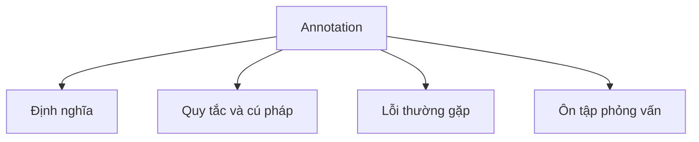

# 17 - Annotation (Chú thích)

Chủ đề này tuân theo đề cương chính tại [outline.md](../../outline.md). Mục tiêu là hiểu từng khái niệm đủ sâu để giải thích, nhận diện trong code và trả lời các câu hỏi phỏng vấn.

## Thứ tự học

- [Annotation là gì](theory/01-what-is-an-annotation-concepts.md)
- [Khái niệm @Documented](theory/02-documented-concepts.md)
- [Thuật ngữ chính](terms/01-key-terms.md)

## Danh mục đề cương

- Annotation là gì?
- Annotation có sẵn (Built-in annotations):
  - `@Override`
  - `@Deprecated`
  - `@SuppressWarnings`
  - `@FunctionalInterface`
  - `@SafeVarargs`
- Meta-annotation (chú thích về chú thích):
  - `@Target`
  - `@Retention`
  - `@Documented`
  - `@Inherited`
  - `@Repeatable`
- Custom annotation (annotation tùy chỉnh)
- Runtime annotation (annotation tại thời điểm chạy)
- Xử lý annotation cơ bản (Basic annotation processing)

## Tự kiểm tra (Self-Check)

Trước khi chuyển sang chủ đề tiếp theo, hãy xác minh rằng bạn có thể trả lời các câu hỏi khái niệm sau mà không cần tra cứu:
1. Tại sao chúng ta cần meta-annotation như `@Retention` và `@Target`?
2. Sự khác biệt giữa chính sách lưu giữ `SOURCE`, `CLASS` và `RUNTIME` ở cả cấp độ trình biên dịch và JVM là gì?
3. JVM xử lý annotation tại runtime bằng cách sử dụng reflection như thế nào bên dưới (ví dụ: dynamic proxy class)?
4. Tại sao `@Override` được xử lý tại compile-time thay vì runtime, và tại sao thiết kế này ngăn các lỗi âm thầm khi refactoring?
5. Tại sao annotation chỉ có thể có các phần tử thuộc kiểu cụ thể (primitive, String, Class, enum, annotation, hoặc mảng 1 chiều của các kiểu này) nhưng không có object tùy ý hoặc generic?
6. Tại sao `@Inherited` chỉ áp dụng cho khai báo class chứ không phải interface hay method, và các hệ quả của ràng buộc thiết kế này là gì?

## Thẻ Anki

- [Basic](anki/basic.tsv)
- [Basic Extra](anki/basic-extra.tsv)
- [Cloze](anki/cloze.tsv)
- [Code Question](anki/code-question.tsv)

## Sơ đồ tổng quan (Mermaid Overview)

## Reference Links

- https://docs.oracle.com/javase/tutorial/java/annotations/
