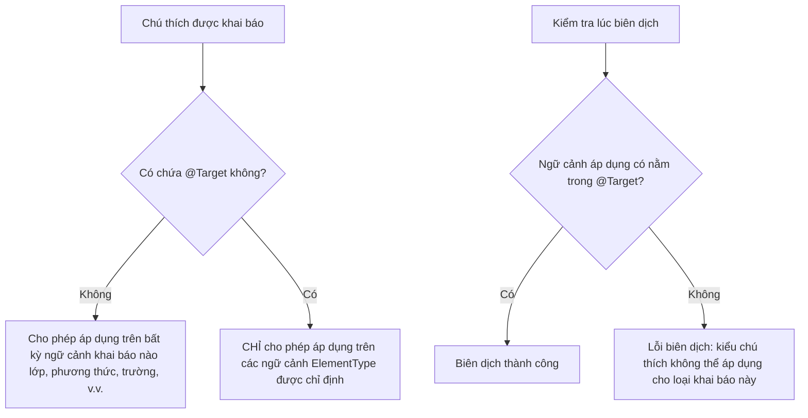

# Chú Thích - Phần 1 (Annotation - Part 1)

## Mục Tiêu Học Tập (Learning Goal)

Tài liệu này trình bày một phần trọng tâm về **Chú Thích (Annotation)** trong Java. Hãy nghiên cứu từng khái niệm như một quy tắc Java thực tế, tránh việc ghi nhớ từ vựng một cách máy móc.

## Khung Nội Dung (Outline Coverage)

| Khái niệm (Concept) | Nội dung cần biết (What to know) |
| --- | --- |
| `What is an annotation?` | Chú thích đính kèm siêu dữ liệu (metadata) vào các phần tử của chương trình như lớp, phương thức hoặc các trường. |
| `Built-in annotations:` | Java cung cấp sẵn một tập hợp các chú thích tiêu chuẩn dùng để hướng dẫn cho trình biên dịch hoặc bộ xử lý. |
| `@Override` | Yêu cầu trình biên dịch xác minh xem phương thức được chú thích có thực sự ghi đè phương thức của lớp cha hay không. |
| `@Deprecated` | Đánh dấu một phần tử chương trình là lỗi thời và không khuyến khích tiếp tục sử dụng. |
| `@SuppressWarnings` | Yêu cầu trình biên dịch bỏ qua các cảnh báo cụ thể trong phạm vi được chú thích. |
| `@FunctionalInterface` | Chỉ định rằng một giao diện được thiết kế để làm giao diện chức năng (chỉ chứa duy nhất một phương thức trừu tượng). |
| `@SafeVarargs` | Đảm bảo với trình biên dịch rằng thân phương thức sử dụng tham số varargs generic một cách an toàn, tránh ô nhiễm heap. |
| `Meta-annotations:` | Các chú thích siêu dữ liệu dùng để cấu hình hành vi cho các chú thích tự định nghĩa khác. |
| `@Target` | Xác định các phần tử chương trình nào (lớp, phương thức, trường) mà chú thích có thể được áp dụng lên. |
| `@Retention` | Xác định khoảng thời gian mà chú thích được lưu trữ (chỉ trong mã nguồn, trong tệp class, hay cả khi chạy runtime). |

---

## Ghi Chú Chi Tiết (Detailed Notes)

### Chú thích (Annotation) là gì?

Chú thích (Annotation) đính kèm siêu dữ liệu (metadata) vào các phần tử của chương trình như lớp, phương thức hoặc các trường.

#### Giải thích cụ thể & Quy tắc Java
Chú thích là một dạng siêu dữ liệu cú pháp có thể được thêm vào mã nguồn Java. Chúng được khai báo bằng từ khóa `@interface` và bản thân chúng không trực tiếp làm thay đổi logic thực thi của chương trình. Tuy nhiên, chúng có thể được xử lý:
1. Tại **thời điểm biên dịch (compile time)** bởi các trình cắm biên dịch (Bộ xử lý chú thích - Annotation Processors) để tự động tạo mã nguồn, các tệp cấu hình XML, hoặc thực hiện kiểm tra kiểm lỗi bổ sung.
2. Tại **thời điểm nạp lớp / thời điểm chạy (runtime)** thông qua Cơ chế Phản Chiếu (Java Reflection) để cấu hình động hành vi của ứng dụng (ví dụ: các framework Spring, Hibernate).

> Xem thêm: Chi tiết về Cơ chế Phản Chiếu (Java Reflection API) dùng để truy vấn Annotation ở thời điểm chạy, được trình bày chi tiết trong [Ch.31 - Reflection](../../31-reflection/README.md).

```java
// Khai báo một chú thích tùy chỉnh đơn giản
@interface MyMetadata {
    String value() default "No Description";
}

// Áp dụng chú thích lên lớp, trường và phương thức
@MyMetadata("Applied at class level")
public class AnnotationDemo {
    
    @MyMetadata("Applied at field level")
    private String name;

    @MyMetadata("Applied at method level")
    public void performAction() {}
}
```

---

### Chú thích xây dựng sẵn (Built-in annotations)

Java cung cấp sẵn các chú thích tiêu chuẩn. Những chú thích định nghĩa trong gói `java.lang` (như `@Override`, `@Deprecated`, `@SuppressWarnings`, `@SafeVarargs`, `@FunctionalInterface`) được sử dụng chủ yếu bởi trình biên dịch. Những chú thích định nghĩa trong gói `java.lang.annotation` (như `@Target`, `@Retention`, `@Documented`, `@Inherited`, `@Repeatable`) là các siêu chú thích (meta-annotations) áp dụng lên các chú thích tự định nghĩa để cấu hình hành vi cho chúng.

```java
public class BuiltInDemo {
    @Override
    public String toString() {
        return "Built-in demo class";
    }
}
```

---

### @Override (Ghi đè)

Chú thích `@Override` hướng dẫn trình biên dịch xác minh rằng phương thức được chú thích thực sự ghi đè hoặc triển khai một phương thức được khai báo ở lớp cha hoặc giao diện cha. Nếu chữ ký phương thức không khớp hoàn toàn (do viết sai tên, khác biệt kiểu tham số, hoặc sai kiểu trả về), trình biên dịch sẽ báo lỗi biên dịch ngay lập tức.

```java
class Base {
    public void execute(String value) {}
}

class Sub extends Base {
    // Sử dụng đúng
    @Override
    public void execute(String value) {
        System.out.println("Sub executed: " + value);
    }

    // Lỗi biên dịch: Lớp cha không có phương thức "execut"
    // @Override
    // public void execut(String value) {}

    // Lỗi biên dịch: Không khớp kiểu tham số (int so với String)
    // @Override
    // public void execute(int value) {}
}
```

**Cạm bẫy lỗi:**
Các phương thức `private` không thể bị ghi đè. Nếu một lớp con khai báo một phương thức có cùng tên và danh sách tham số với một phương thức private ở lớp cha và gắn thẻ `@Override`, trình biên dịch sẽ báo lỗi biên dịch.

---

### @Deprecated (Không khuyến khích sử dụng)

`@Deprecated` đánh dấu một phần tử chương trình (lớp, phương thức, trường, hàm khởi tạo) là đã lỗi thời. Nếu mã nguồn khác cố tình sử dụng phần tử bị áp dụng chú thích này, trình biên dịch sẽ đưa ra cảnh báo. Kể từ Java 9, chú thích này bổ sung thêm các thuộc tính:
- `since`: Một chuỗi `String` chỉ ra phiên bản bắt đầu phản đối phần tử đó.
- `forRemoval`: Một giá trị `boolean` chỉ ra xem phần tử có bị xóa bỏ hoàn toàn trong phiên bản tương lai hay không. Nếu đặt là `true`, việc biên dịch sử dụng phương thức này sẽ kích hoạt cảnh báo phản đối nghiêm trọng (terminal deprecation).

```java
public class DeprecatedExample {
    @Deprecated(since = "2.0", forRemoval = true)
    public void oldAPIMethod() {
        System.out.println("This method is obsolete and will be removed.");
    }
}
```

---

### @SuppressWarnings (Bỏ qua cảnh báo)

`@SuppressWarnings` yêu cầu trình biên dịch tắt các cảnh báo cụ thể trong phạm vi phần tử được chú thích và các phần tử con bên trong nó. Nó nhận một mảng kiểu `String[]` chứa tên các cảnh báo cần tắt (ví dụ: `"unchecked"`, `"deprecation"`, `"rawtypes"`, hoặc `"all"`).

```java
import java.util.ArrayList;
import java.util.List;

public class SuppressExample {
    
    @SuppressWarnings({"unchecked", "rawtypes"})
    public void processLegacyData() {
        List rawList = new ArrayList(); // Tắt cảnh báo rawtypes
        rawList.add("Hello");           // Tắt cảnh báo unchecked
    }
}
```

---

### @FunctionalInterface (Giao diện chức năng)

`@FunctionalInterface` là một chú thích mang tính thông tin dùng để khai báo rằng một giao diện được thiết kế để làm giao diện chức năng (chỉ chứa duy nhất một phương thức trừu tượng - SAM). Nếu giao diện không chứa phương thức trừu tượng nào hoặc chứa nhiều hơn một phương thức trừu tượng, trình biên dịch sẽ báo lỗi. Lưu ý rằng các phương thức mặc định (default), các phương thức tĩnh (static) và các phương thức ghi đè từ lớp `java.lang.Object` sẽ không được tính vào giới hạn một phương thức này.

```java
@FunctionalInterface
public interface MathOperation {
    int operate(int a, int b); // Phương thức trừu tượng duy nhất
    
    // Hợp lệ: Phương thức mặc định (default)
    default void printName() {
        System.out.println("Operation");
    }

    // Hợp lệ: Phương thức tĩnh (static)
    static void log() {
        System.out.println("Logging...");
    }

    // Hợp lệ: Phương thức ghi đè từ lớp Object
    @Override
    boolean equals(Object obj);
}
```

---

### @SafeVarargs (Varargs an toàn)

`@SafeVarargs` tắt các cảnh báo của trình biên dịch về nguy cơ "ô nhiễm vùng nhớ heap" (potential heap pollution) khi sử dụng các tham số varargs generic. Tham số varargs trong Java được triển khai bằng cấu trúc mảng, mảng này không lưu trữ thông tin kiểu generic tại thời điểm chạy (thiếu tính cụ thể hóa kiểu - reification). 

Do đó, việc viết khai báo dạng `T...` có thể khiến phương thức dễ gặp ngoại lệ ép kiểu (`ClassCastException`) nếu bên gọi truyền vào một kiểu mảng không tương thích lúc chạy. 

`@SafeVarargs` đại diện cho một lời hứa của lập trình viên rằng thân phương thức chỉ thực hiện đọc dữ liệu từ mảng varargs đó và không thực hiện ghi các đối tượng thuộc kiểu không tương thích vào mảng (nguồn gốc gây ra ô nhiễm heap).

**Các giới hạn bắt buộc:**
Chỉ có thể áp dụng cho:
1. Các phương thức tĩnh (`static`)
2. Các phương thức thực thể `final`
3. Các phương thức thực thể `private` (từ Java 9 trở đi)

Nó **không thể** áp dụng cho các phương thức thực thể thông thường (không final, không private) vì lớp con khi ghi đè phương thức có thể đưa vào các thao tác ghi mảng không an toàn.

```java
public class SafeVarargsDemo {
    @SafeVarargs
    public static <T> java.util.List<T> safeList(T... elements) {
        // An toàn: chúng ta chỉ thực hiện đọc các phần tử, không sửa đổi mảng
        java.util.List<T> list = new java.util.ArrayList<>();
        for (T element : elements) {
            list.add(element);
        }
        return list;
    }
}
```

---

### Siêu chú thích (Meta-annotations)

Siêu chú thích là các chú thích được áp dụng lên các khai báo chú thích khác để định nghĩa cách hoạt động của chú thích tự định nghĩa đó (ví dụ: nơi áp dụng, thời gian lưu giữ, hay có được kế thừa không, v.v.).

---

### @Target (Đích áp dụng)

`@Target` xác định các ngữ cảnh (phần tử chương trình) nơi chú thích được phép áp dụng. Nó nhận một mảng các giá trị thuộc enum `ElementType`, bao gồm:
- `TYPE`: Lớp, giao diện (bao gồm cả giao diện chú thích), record, hoặc enum.
- `FIELD`: Các trường thuộc tính (bao gồm cả hằng số enum).
- `METHOD`: Các phương thức.
- `PARAMETER`: Các tham số chính thức của phương thức.
- `CONSTRUCTOR`: Các hàm khởi tạo.
- `LOCAL_VARIABLE`: Các biến cục bộ.
- `ANNOTATION_TYPE`: Các loại chú thích khác.
- `TYPE_USE`: Bất kỳ ngữ cảnh sử dụng kiểu dữ liệu nào (từ Java 8 trở đi).

Nếu thiếu chú thích `@Target`, chú thích đó có thể được áp dụng lên bất kỳ ngữ cảnh khai báo nào (nhưng không áp dụng được cho ngữ cảnh sử dụng kiểu dữ liệu).

```java
import java.lang.annotation.ElementType;
import java.lang.annotation.Target;

// Chú thích tùy chỉnh này CHỈ có thể áp dụng lên phương thức và trường thuộc tính.
@Target({ElementType.METHOD, ElementType.FIELD})
public @interface MethodAndFieldOnly {
    String value() default "";
}
```

#### Tại Sao `@Target` Tồn Tại: Giới Hạn Phạm Vi và Ngăn Ngừa Lạm Dụng

Các chú thích đính kèm siêu dữ liệu vào mã nguồn. Nếu không cấu hình `@Target`, một chú thích có thể đặt ở bất kỳ ngữ cảnh khai báo nào, gây ra tình trạng lộn xộn về cấu trúc và mơ hồ về mặt ngữ nghĩa cho các thư viện xử lý mã. Bằng cách định nghĩa `@Target`, lập trình viên có thể giới hạn khả năng áp dụng của chú thích vào đúng những nơi có ý nghĩa logic. Ví dụ, một chú thích kiểm tra tính hợp lệ như `@NonNull` chỉ có ý nghĩa trên các trường, tham số phương thức hoặc giá trị trả về, trong khi chú thích định tuyến như `@RequestMapping` chỉ có ý nghĩa trên phương thức hoặc lớp. Việc giới hạn phạm vi giúp tránh việc sử dụng chú thích sai ngữ cảnh mà logic xử lý không hỗ trợ, ngăn ngừa các lỗi thời gian chạy hoặc lỗi logic ứng dụng.

**Mô hình Tư duy:**
*Hình ảnh ẩn dụ:* Một tấm biển báo "Xin đừng làm phiền" được thiết kế cho các cánh cửa. Việc treo nó lên bàn phím, cốc cà phê hay trên đầu một ai đó sẽ không có ý nghĩa và gây bối rối. `@Target` đóng vai trò là bảng hướng dẫn chỉ rõ nơi tấm biển được phép treo lên.



**Ví Dụ Mã Nguồn Với Kết Quả Biên Dịch:**
```java
import java.lang.annotation.ElementType;
import java.lang.annotation.Target;

@Target(ElementType.METHOD)
@interface MethodOnly {}

public class TargetDemo {
    // LỖI BIÊN DỊCH: kiểu chú thích không thể áp dụng cho loại khai báo này
    // @MethodOnly
    private String field;

    @MethodOnly
    public void execute() {
        // HỢP LỆ: áp dụng lên phương thức
    }
}
```

**Chuỗi Nguyên Nhân - Kết Quả (Cause-Effect Chain):**
Định nghĩa `@Target(ElementType.METHOD)` trên `@MethodOnly` $\rightarrow$ Lập trình viên cố tình viết `@MethodOnly` trên khai báo trường thuộc tính $\rightarrow$ Trình biên dịch Java kiểm tra định nghĩa của `@MethodOnly` $\rightarrow$ Phát hiện thấy `ElementType.FIELD` không có trong danh sách đích được phép $\rightarrow$ Trình biên dịch dừng quá trình xây dựng dự án và báo lỗi "annotation type not applicable to this kind of declaration".

---

### @Retention (Chính sách lưu trữ)

`@Retention` xác định thời gian tồn tại của chú thích. Nó nhận một giá trị thuộc enum `RetentionPolicy`:
1. `RetentionPolicy.SOURCE`: Chỉ tồn tại trong tệp mã nguồn gốc. Bị trình biên dịch bỏ qua và không xuất hiện trong tệp biên dịch `.class`. (Dùng cho các công cụ phân tích mã nguồn hoặc sinh mã tự động như Lombok, `@Override`).
2. `RetentionPolicy.CLASS`: Được ghi lại trong tệp `.class` sau khi biên dịch, nhưng KHÔNG được bộ nạp lớp của JVM nạp vào bộ nhớ khi chạy. **Đây là chính sách lưu trữ mặc định nếu bạn không chỉ định.**
3. `RetentionPolicy.RUNTIME`: Được ghi lại trong tệp `.class` và được JVM nạp vào bộ nhớ. Các chú thích này hiển thị với Cơ chế Phản Chiếu (Java Reflection API) khi chạy chương trình.

```java
import java.lang.annotation.Retention;
import java.lang.annotation.RetentionPolicy;

@Retention(RetentionPolicy.RUNTIME)
public @interface VisibleAtRuntime {
    String message();
}
```

#### Tại Sao `@Retention` Tồn Tại và Các Chính Sách Lưu Trữ Khác Nhau Thế Nào

Các chú thích tồn tại trong các giai đoạn khác nhau của vòng đời chương trình: mã nguồn, tệp class và bộ nhớ thực thi. Nếu không khai báo `@Retention`, Java mặc định sử dụng `RetentionPolicy.CLASS`, cơ chế này sẽ loại bỏ các siêu dữ liệu chú thích khi bộ nạp lớp nạp tệp class vào heap của JVM. Việc khai báo một chính sách lưu trữ rõ ràng giúp nhà phát triển cân bằng giữa tính khả dụng của thông tin với chi phí hiệu năng và bộ nhớ.

*   `RetentionPolicy.SOURCE` lý tưởng cho việc kiểm tra lúc biên dịch của các công cụ (như `@Override`) hoặc các bộ sinh mã thời điểm biên dịch (như Project Lombok), giúp ngăn chặn siêu dữ liệu chỉ dùng khi biên dịch làm tăng kích thước tệp `.class`.
*   `RetentionPolicy.CLASS` hữu ích cho các công cụ phân tích mã bytecode tĩnh hoặc các trình biên dịch xử lý lớp mà không cần nạp chúng vào heap của JVM.
*   `RetentionPolicy.RUNTIME` giữ nguyên vẹn siêu dữ liệu bên trong heap của JVM, cho phép các framework dựa trên reflection (như Spring, Hibernate, hoặc Jackson) có thể truy vấn chú thích và thay đổi động hành vi ứng dụng trong quá trình chạy.

**Mô hình Tư duy:**
*Hình ảnh ẩn dụ:*
- `SOURCE`: Bản vẽ giàn giáo tạm thời dùng để xây dựng tòa nhà nhưng bị dỡ bỏ hoàn toàn sau khi tòa nhà hoàn thành.
- `CLASS`: Sách hướng dẫn xây dựng đi kèm với vật liệu nhưng được xếp xó một khi người dân đã vào sinh sống trong tòa nhà.
- `RUNTIME`: Nhãn dán vật lý trên hộp kỹ thuật của tòa nhà giúp các đội bảo trì có thể đọc thông tin bất cứ lúc nào trong suốt vòng đời của tòa nhà.

```
+------------------+                   +--------------------+                   +-------------------+
|   Mã Nguồn       | --[ Biên dịch ]-> |    Tệp .class      | --[ Nạp lớp ]----> |     Heap JVM      |
|  (MyClass.java)  |                   |   (MyClass.class)  |                   | (Bộ nhớ runtime)  |
+------------------+                   +--------------------+                   +-------------------+
      |                                          |                                        |
      | Chú thích SOURCE                         | Chú thích CLASS                        | Chú thích RUNTIME
      v (bị loại bỏ bởi trình biên dịch)         v (bị loại bỏ bởi bộ nạp lớp)            v (truy cập qua reflection)
  [Kiểm tra lúc biên dịch]                   [Công cụ mã byte tĩnh]                   [Framework động]
```

**Ví Dụ Mã Nguồn Với Kết Quả Chạy Thực Tế:**
```java
import java.lang.annotation.Retention;
import java.lang.annotation.RetentionPolicy;

@Retention(RetentionPolicy.SOURCE)
@interface SourceAnno {}

@Retention(RetentionPolicy.CLASS)
@interface ClassAnno {}

@Retention(RetentionPolicy.RUNTIME)
@interface RuntimeAnno {}

@SourceAnno
@ClassAnno
@RuntimeAnno
class RetentionTest {}

public class RetentionDemo {
    public static void main(String[] args) {
        Class<?> clazz = RetentionTest.class;
        System.out.println(clazz.isAnnotationPresent(SourceAnno.class));  // In ra: false
        System.out.println(clazz.isAnnotationPresent(ClassAnno.class));   // In ra: false
        System.out.println(clazz.isAnnotationPresent(RuntimeAnno.class)); // In ra: true
    }
}
```

**Chuỗi Nguyên Nhân - Kết Quả (Cause-Effect Chain):**
Khai báo `@Retention(RetentionPolicy.SOURCE)` $\rightarrow$ Trình biên dịch xử lý mã nguồn Java $\rightarrow$ Loại bỏ các chú thích có chính sách SOURCE $\rightarrow$ Bytecode tạo ra không chứa chú thích này $\rightarrow$ Bộ nạp lớp của JVM phân tích tệp `.class` $\rightarrow$ Lời gọi reflection `clazz.isAnnotationPresent()` trả về kết quả `false`.

---

## Các Sai Lầm Thường Gặp (Common Mistakes)

### 1. Quên khai báo `@Retention(RetentionPolicy.RUNTIME)`
Theo mặc định, các chú thích tùy chỉnh sẽ sử dụng `RetentionPolicy.CLASS`. Các lập trình viên khi tự viết các framework xử lý bằng reflection thường quên viết bổ sung `@Retention(RetentionPolicy.RUNTIME)`. Kết quả là, khi chạy ứng dụng, phương thức `element.isAnnotationPresent(MyAnnotation.class)` sẽ trả về `false`, dẫn đến các lỗi cấu hình ngầm rất khó phát hiện.

### 2. Ghi đè phương thức private đi kèm `@Override`
Nhà phát triển đôi khi khai báo một phương thức ở lớp con trùng chữ ký với một phương thức private ở lớp cha và gắn thẻ `@Override`. Các phương thức private không hiển thị với lớp con, do đó đây không phải là hành vi ghi đè thực tế mà chỉ là định nghĩa phương thức mới, áp dụng `@Override` sẽ gây lỗi biên dịch.

### 3. Áp dụng sai `@SafeVarargs`
Đặt `@SafeVarargs` trên một phương thức thực hiện sửa đổi mảng varargs (ví dụ: ghi đè giá trị phần tử mới vào mảng) là một lỗi nghiêm trọng. Chú thích này chỉ tắt các cảnh báo của trình biên dịch chứ không thể ngăn ngừa lỗi ép kiểu `ClassCastException` tại thời điểm chạy do ô nhiễm heap gây ra nếu bên gọi truyền vào một kiểu mảng khác.

---

## Các Câu Hỏi Ôn Tập Thường Gặp (Common Review Prompts)

- Khái niệm nào ở đây là quy tắc tại thời điểm biên dịch? (Kiểm tra xem giao diện có tuân thủ cấu trúc SAM hay không qua `@FunctionalInterface`; kiểm tra xem phương thức có khớp chữ ký ghi đè hay không qua `@Override`; kiểm tra ngữ cảnh áp dụng chú thích qua `@Target`).
- Tại sao chú thích tự định nghĩa mặc định không thể đọc được bằng Reflection khi chạy chương trình? (Vì chính sách lưu trữ mặc định của chú thích là `RetentionPolicy.CLASS`, nó bị loại bỏ khi nạp lớp vào JVM. Cần cấu hình cụ thể thành `RetentionPolicy.RUNTIME`).
