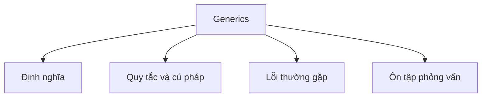

# 18 - Generics (Kiểu Dữ Liệu Tổng Quát)

Chủ đề này tuân theo đề cương chính trong [outline.md](../outline.md). Mục tiêu là hiểu sâu từng khái niệm để có thể giải thích, nhận ra trong code, và trả lời câu hỏi phỏng vấn.

## Thứ Tự Học

- [Các Khái Niệm về Generic Class](theory/01-generic-class-concepts.md)
- [Các Khái Niệm về Chủ Đề](theory/02-topic-concepts.md)
- [Các Khái Niệm về Raw Type](theory/03-raw-type-concepts.md)
- [Thuật Ngữ Chính](terms/01-key-terms.md)

## Danh Sách Kiểm Tra Đề Cương

- Lớp generic (Generic class)
- Phương thức generic (Generic method)
- Giao diện generic (Generic interface)
- Tham số kiểu (Type parameter)
- Nhiều tham số kiểu (Multiple type parameters)
- Tham số kiểu có giới hạn (Bounded type parameter):
  - `<T extends Number>`
- Wildcard (Ký tự đại diện):
  - `<?>`
  - `<? extends T>`
  - `<? super T>`
- PECS:
  - Producer Extends (Nhà sản xuất dùng Extends)
  - Consumer Super (Người tiêu thụ dùng Super)
- Generic với Collection
- Xóa kiểu (Type erasure)
- Raw type (Kiểu thô)
- Giới hạn của Generics (Generic limitations)

## Thẻ Anki

- [Basic](anki/basic.tsv)
- [Basic Extra](anki/basic-extra.tsv)
- [Cloze](anki/cloze.tsv)
- [Code Question](anki/code-question.tsv)

## Tự Kiểm Tra

Trước khi chuyển sang chủ đề tiếp theo, hãy xác nhận rằng bạn có thể trả lời những câu hỏi sau:
1. Tại sao Java sử dụng Type Erasure (Xóa Kiểu) cho generics, và JVM duy trì tính tương thích ngược với bytecode trước generics như thế nào?
   &rarr; Xem [Tại sao Java dùng Type Erasure](theory/02-topic-concepts.md#why-java-uses-type-erasure)
2. Tại sao kiểu generic là bất biến (invariant), và covariance (`? extends T`) cùng contravariance (`? super T`) mở rộng tính linh hoạt của API dưới quy tắc PECS như thế nào?
   &rarr; Xem [Tại sao Generics là Bất biến và PECS giải quyết vấn đề đó](theory/02-topic-concepts.md#why-generics-are-invariant-and-how-pecs-solves-it)
3. Tại sao raw type được cho phép trong Java, và những nguy hiểm runtime hay rủi ro an toàn kiểu nào xảy ra khi dùng raw type?
   &rarr; Xem [Tại sao Raw Type tồn tại và Nguy hiểm của chúng](theory/03-raw-type-concepts.md#why-raw-types-exist-and-their-dangers)
4. Tại sao Java generics không thể khởi tạo với kiểu nguyên thủy (như `List<int>`), và việc xóa kiểu tại compile-time quy định giới hạn này như thế nào?
   &rarr; Xem [Tại sao Generics không hỗ trợ Primitives](theory/03-raw-type-concepts.md#why-generics-do-not-support-primitives)
5. Tại sao không thể tạo mảng generic và kiểm tra kiểu tại runtime (như `instanceof List<String>`) trong Java?
   &rarr; Xem [Tại sao không thể tạo Mảng Generic và Kiểm tra Kiểu tại Runtime](theory/03-raw-type-concepts.md#why-generic-array-creation-and-runtime-type-checks-are-forbidden)

## Tổng Quan Mermaid

## Liên Kết Tham Khảo

- https://docs.oracle.com/javase/tutorial/java/generics/
