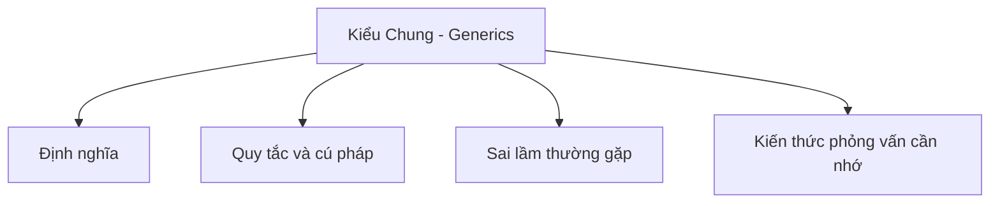

# 18 - Kiểu Chung (Generics)

Chủ đề này bám sát đề cương chính trong [outline.md](../outline.md). Mục tiêu là hiểu sâu sắc từng khái niệm để có thể giải thích, nhận biết trong mã nguồn và trả lời các câu hỏi phỏng vấn.

## Thứ Tự Học Tập

- [Khái niệm Lớp Generic](theory/01-generic-class-concepts.md)
- [Khái niệm Chủ đề](theory/02-topic-concepts.md)
- [Khái niệm Kiểu Thô (Raw Type)](theory/03-raw-type-concepts.md)
- [Thuật Ngữ Khóa](terms/01-key-terms.md)

## Danh Sách Nội Dung

- Lớp generic (Generic class)
- Phương thức generic (Generic method)
- Giao diện generic (Generic interface)
- Tham số kiểu dữ liệu (Type parameter)
- Nhiều tham số kiểu dữ liệu (Multiple type parameters)
- Tham số kiểu bị giới hạn (Bounded type parameter):
- <T extends Number>
- Ký tự đại diện (Wildcard):
- <?>
- <? extends T>
- <? super T>
- Quy tắc PECS:
- Nhà sản xuất mở rộng (Producer Extends)
- Người tiêu thụ siêu lớp (Consumer Super)
- Generic với Collection
- Xóa kiểu dữ liệu (Type erasure)
- Kiểu thô (Raw type)
- Các hạn chế của Generic

## Thẻ Anki

- [Basic](anki/basic.tsv)
- [Basic Extra](anki/basic-extra.tsv)
- [Cloze](anki/cloze.tsv)
- [Code Question](anki/code-question.tsv)

## Tự Kiểm Tra

Trước khi chuyển sang chủ đề tiếp theo, hãy xác nhận rằng bạn có thể trả lời các câu hỏi sau:
1. Tại sao Java lại sử dụng Cơ chế xóa kiểu (Type Erasure) cho generic, và JVM duy trì tính tương thích ngược với mã byte (bytecode) trước thời kỳ generic như thế nào?
   &rarr; Xem [Why Java Uses Type Erasure](theory/02-topic-concepts.md#why-java-uses-type-erasure)
2. Tại sao một kiểu generic lại là bất biến (invariant), và tính hiệp biến (covariance - `? extends T`) cùng tính nghịch biến (contravariance - `? super T`) mở rộng tính linh hoạt của API theo quy tắc PECS như thế nào?
   &rarr; Xem [Why Generics Are Invariant and How PECS Solves It](theory/02-topic-concepts.md#why-generics-are-invariant-and-how-pecs-solves-it)
3. Tại sao các kiểu thô (raw type) lại được cho phép trong Java, và những nguy hiểm khi chạy chương trình (runtime) hoặc sự đánh đổi về tính an toàn kiểu dữ liệu nào xảy ra khi sử dụng các kiểu thô?
   &rarr; Xem [Why Raw Types Exist and Their Dangers](theory/03-raw-type-concepts.md#why-raw-types-exist-and-their-dangers)
4. Tại sao các kiểu generic trong Java không thể được khởi tạo với các kiểu dữ liệu nguyên thủy (primitive type - như `List<int>`), và cơ chế xóa kiểu trong thời gian biên dịch ảnh hưởng thế nào đến giới hạn này?
   &rarr; Xem [Why Generics Do Not Support Primitives](theory/03-raw-type-concepts.md#why-generics-do-not-support-primitives)
5. Tại sao việc tạo mảng generic và kiểm tra kiểu tại thời điểm chạy (như `instanceof List<String>`) lại bị cấm trong Java?
   &rarr; Xem [Why Generic Array Creation and Runtime Type Checks Are Forbidden](theory/03-raw-type-concepts.md#why-generic-array-creation-and-runtime-type-checks-are-forbidden)

## Sơ Đồ Mermaid Tổng Quan

## Liên Kết Tham Khảo

- https://docs.oracle.com/javase/tutorial/java/generics/
